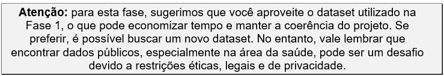
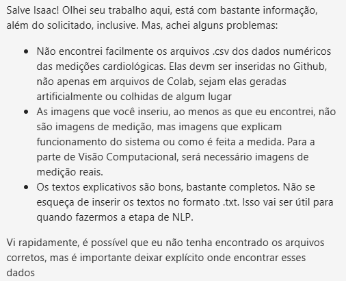
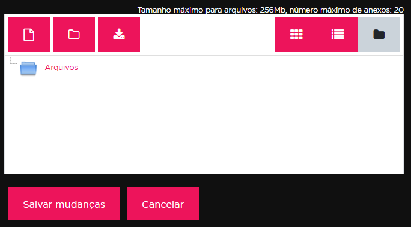
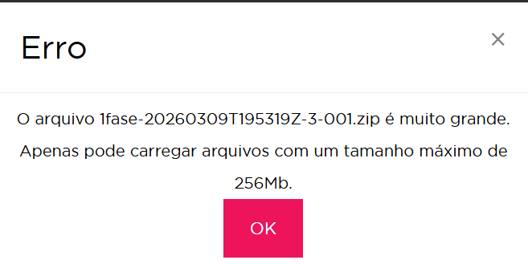

<p align="center">
  
</p>

<details open>
<summary><strong><font size="6" color="#FF0000">🔴 CHALLENGE</font></strong></summary>
<br>

<details open>
<summary><strong><font size="5">Enunciado</font></strong></summary>
<br>

<p align="justify">
Você está entrando em uma jornada que conecta tecnologia, ciência de dados e saúde. O CardioIA é um projeto acadêmico do curso de IA inovador, criado para desafiar você e sua equipe a desenvolver uma plataforma digital inteligente que simule o ecossistema de uma cardiologia moderna.
</p>

<br>

<p align="justify">
Ele integra dados clínicos, modelos de Machine Learning, Visão Computacional, IoT e agentes inteligentes para lidar com triagem, diagnósticos, monitoramento, assistência remota e previsões médicas.

<br>

A seguir, apresentamos um mapa mental da sua jornada ao longo das próximas 7 fases do curso. Por meio dele, estamos antecipando o que vem agora, e no futuro, para que você possa se preparar ainda melhor para atender aos requisitos do método PBL (Project Based Learning), adotado pela FIAP em seus cursos online.
</p>

<p align="center">
  
</p>

<br>

<details open>
<summary><strong><font size="4">Fase 1 - (09/02/26 - 10/03/26)</font></strong></summary>
<br>

<p align="justify">
<strong>Preparado para começar sua jornada?</strong><br>
Na <strong>Fase 1 – Batimentos de Dados</strong>, você assume o papel de <strong>Cientista de Dados Hospitalar:</strong> seu desafio é levantar, organizar e entender dados cardiológicos que, futuramente, alimentarão os módulos inteligentes do CardioIA. Aqui você constrói a base! E o mais importante, de olho na Governança de Dados envolvendo IA.
</p>

<br>

<p align="justify">
<strong>Objetivo geral da atividade:</strong><br>
Você deverá buscar e preparar <strong>três tipos de dados fundamentais</strong>:
</p>

<ul>
<li><strong>Dados Numéricos</strong> (simulados ou reais) relacionados a pacientes cardíacos;</li>
<li><strong>Textos</strong> médicos ou literários relacionados à saúde cardiovascular;</li>
<li><strong>Imagens</strong> médicas que representem exames ou sinais visuais do coração.</li>
</ul>

<br>

<p align="justify">
Esses dados serão utilizados nas fases seguintes do projeto para alimentar algoritmos, treinar modelos de IA, fazer análises comparativas e gerar soluções inovadoras. Claro que, ao longo da sua jornada, essas bases podem ser revistas pelo seu grupo. Contudo, tente buscar o máximo de pensamento crítico na pesquisa para ganhar tempo lá na frente. E não se esqueça de considerar os conceitos iniciais de Governança de Dados e de viés, já abordados nos capítulos iniciais do primeiro ano.
</p>

<p align="center">
  
</p>

<p align="justify">
Mesmo quando os dados existem, é normal que estejam espalhados em repositórios pouco conhecidos, formatos desorganizados ou exigem processos de autorização para acesso.<br>
É importante que vocês, alunos, compreendam que essa dificuldade faz parte natural do trabalho em IA: encontrar, limpar e preparar dados é uma das etapas mais demoradas e valiosas do projeto, e desistir logo nas primeiras buscas seria como abandonar um experimento antes mesmo de montar o laboratório. Persistência, criatividade e capacidade de buscar alternativas (como gerar dados simulados ou combinar fontes diferentes) são habilidades essenciais que vocês estão começando a desenvolver aqui, e isso vale tanto quanto o código em si.
</p>

<br>

<p align="justify">
<strong>Atividade detalhada:</strong><br><br>
<strong>Parte 1 – Dados Numéricos (IoT):</strong><br>
Busque e organize um pequeno dataset (mínimo 100 linhas) contendo variáveis como idade, sexo, pressão arterial, colesterol, histórico de doenças cardíacas, sintomas, frequência cardíaca etc.
</p>

<p align="center">
  
</p>

<p align="justify">
Organize seu dataset em um repositório no GitHub e, no arquivo README.md, inclua o link para os dados hospedados no seu OneDrive, Google Drive ou outro serviço de armazenamento público de sua escolha. No mesmo README.md, explique de forma clara a origem dos dados (se são reais ou simulados) e destaque quais variáveis você considera mais relevantes do ponto de vista clínico, justificando por que elas são importantes para um projeto de Inteligência Artificial voltado à saúde.
</p>

<p align="justify">
<strong>Parte 2 – Dados Textuais (NLP):</strong><br>
Faça o download de no mínimo dois textos (.txt) relacionados às doenças cardíacas, à saúde pública, aos sintomas ou aos tratamentos, usando fontes como SciELO, BVS, artigos do SUS ou mesmo literatura clássica (Projeto Gutenberg).<br>
No mesmo repositório, adicione esses arquivos em uma subpasta “assets” ou “docs”, e, no mesmo README.md principal, explique de forma clara como esses textos podem ser explorados por algoritmos de NLP (por exemplo: análise de sentimentos, extração de sintomas, classificação de tópicos) e justifique por que essas análises são relevantes para um projeto de Inteligência Artificial aplicado à área da saúde.
</p>

<p align="justify">
<strong>Parte 3 – Dados Visuais (VC):</strong><br>
Reúna no mínimo 100 imagens de sua escolha (.jpg ou .png) de um tipo de exame cardiológico, como ECGs, angiogramas ou raio-X torácico.<br>
No mesmo repositório do seu GitHub e, no mesmo arquivo README.md, inclua o link para as imagens hospedadas no seu OneDrive, Google Drive ou outro serviço de armazenamento público de sua escolha. Adicione uma justificativa que explique de forma clara como essas imagens poderão ser analisadas por algoritmos de Visão Computacional (por exemplo: detecção de padrões, identificação de bordas, reconhecimento de anomalias) e destaque a importância dessas análises para projetos de IA aplicados à área da saúde.
</p>

<br>

<p align="justify">
<strong>Entregáveis:</strong><br>
É necessário que o repositório do GitHub contenha:
</p>
<ul>
<li>Um arquivo README.md detalhado que explique o projeto, descreva cada uma das três partes, e indique os objetivos e as fontes dos dados;</li>
<li>Subpasta docs ou assets e conteúdos;</li>
<li>Links públicos (do Google Drive ou OneDrive ou semelhantes) apontando para o conjunto completo de dados preparados (numéricos, textuais e visuais). Garanta que o link esteja acessível para qualquer pessoa, para que o time da FIAP possa acessá-lo para a correção.</li>
</ul>

<p align="center">
  
</p>

<p align="justify">
<strong>Critérios de Avaliação (10 pontos totais):</strong>
</p>

<p align="center">
  
</p>

<p align="justify">
<strong>Mensagem final:</strong><br>
Lembre-se: nesta fase, não estamos apenas coletando dados, estamos construindo as bases para uma simulação de ecossistema de cardiologia inteligente. Tenha sempre atenção à relevância clínica das informações e pense sempre no impacto positivo que essas soluções podem trazer para a vida real.
</p>

</details>

<br>

<details>
<summary><strong><font size="4">Fase 2 - (11/03/26 - 14/04/26)</font></strong></summary>
<br>

<p align="justify">
<strong>Enunciado de atividade:</strong><br><br>
Nesta fase, o projeto CardioIA irá desafiá-lo um pouco mais: você deverá simular a automatização do diagnóstico com IA - prática amplamente utilizada em centros de diagnóstico modernos, onde algoritmos se tornam os estetoscópios digitais do século XXI.
</p>

<p align="justify">
Como equipe, seu objetivo será desenvolver um módulo inteligente capaz de analisar dados clínicos e relatórios médicos, reconhecer sintomas e propor diagnósticos assistidos por IA. Você vai trabalhar com NLP, classificação de texto e análise de vieses a partir do dataset (visto na Fase 1), enfrentando os dilemas reais da Inteligência Artificial aplicada à saúde.
</p>

<p align="justify">
No mapa mental a seguir, você poderá ver em que ponto da sua jornada no PBL (Problem Project Learning) sua equipe se encontra. Observe o que está escrito na Fase 2, mas procure também compreender o contexto geral, preparando-se para as próximas fases.
</p>

<br>

<p align="justify">
<strong>Objetivo geral dessa atividade:</strong><br><br>
Você irá aplicar os conteúdos de algumas disciplinas desta fase para desenvolver soluções práticas de diagnóstico automatizado. A ideia aqui é mostrar como um código "simples" aliado com dados bem-organizados, pode gerar soluções básicas que se aproximam do funcionamento de sistemas reais utilizados em hospitais e centros de tratamentos.
</p>

<p align="justify">
Isso inclui interpretar pequenos textos médicos, identificar sintomas e relacioná-los a doenças, utilizando estruturas simples. Também faz parte da tarefa, o treinamento de um modelo de IA capaz de prever o risco de um paciente com base em frases curtas. E o melhor: todo processo será feito por você e seu grupo, utilizando sua capacidade intelectual e criatividade.
</p>

<p align="justify">
Ao final dessa fase, você poderá ter construído algo que muitos profissionais que atuam hoje no mercado da área de saúde adorariam ter em mãos. Durante esse processo, você também será estimulado a refletir sobre a qualidade e a justiça dos dados, dando seus primeiros passos como um desenvolvedor de IA responsável, isto é, se preocupando com o tema "governança em dados".
</p>

<br>

<p align="justify">
<strong>Atividade detalhada:</strong><br><br>
<strong>Parte 1 – Frases de sintomas + extração de informações:</strong>
</p>

<ul>
<li>Criar um arquivo <code>.txt</code> com 10 frases completas que simulem pequenas descrições de sintomas relatados por pacientes. As frases devem conter informações como o que o paciente sente, quando começou e como os sintomas afetam sua rotina (por exemplo: "Há dois dias estou com uma dor no peito que piora quando faço esforço físico", "Sinto cansaço constante há uma semana, mesmo depois de descansar").</li>
<li>Criar uma estrutura simples de associação entre sintomas e doenças usando uma planilha ou um arquivo <code>*.csv</code>. A ideia é montar um mapa de conhecimento que relacione palavras ou expressões comuns (sintomas relatados pelos pacientes) com possíveis diagnósticos. Por exemplo:
  <ul>
    <li>"dor no peito", "aperto no tórax" → Infarto.</li>
    <li>"cansaço constante", "fadiga" → Insuficiência Cardíaca.</li>
    <li>"falta de ar", "dificuldade para respirar" → Angina.</li>
  </ul>
  Use uma estrutura de colunas como: Sintoma 1 | Sintoma 2 | Doença Associada.<br>
  Essa atividade pode ajudar a entender como sistemas inteligentes estruturam informações para auxiliar em diagnósticos médicos.<br>
  Quanto mais linhas o seu arquivo <code>.csv</code> tiver, melhor será o seu processo de decisão e classificação de doenças.
</li>
<li>Utilize um código Python para ler as frases do arquivo <code>.txt</code>, identificar os sintomas com base nessas expressões e sugerir um possível diagnóstico com base no mapa de conhecimento. As 10 frases representam uma estrutura inicial e funcional para 10 diagnósticos simples de pacientes diversos, desde que as frases sejam exemplos variados e bem elaborados. Essa quantidade de frases é suficiente para testar a extração de sintomas com base no mapa de conhecimento e para simular o funcionamento de um sistema básico de apoio ao diagnóstico. Lembre-se de que quanto mais claras e diversificadas forem as frases, melhor será o desempenho da lógica de identificação e sugestão de diagnóstico.</li>
</ul>

<p align="justify">
<strong>Entregáveis:</strong>
</p>
<ul>
<li>Arquivo <code>.txt</code> com 10 frases completas simulando descrições de sintomas relatados por pacientes.</li>
<li>Planilha ou arquivo <code>.csv</code> com o mapa de conhecimento (associação entre sintomas e possíveis diagnósticos).</li>
<li>Código Python (<code>.ipynb</code> ou <code>.py</code>) que faz a leitura do arquivo de frases, identifica os sintomas e sugere diagnósticos com base na ontologia.</li>
</ul>

<br>

<p align="justify">
<strong>Parte 2 – Classificador básico de texto:</strong><br><br>
Aqui, você irá desenvolver um classificador básico de texto que analisa frases com sintomas e classifica o nível de risco como "baixo risco" ou "alto risco". Essa tarefa simula o funcionamento de sistemas automatizados utilizados na triagem clínica, que ajudam a priorizar atendimentos com base na gravidade relatada.
</p>

<ul>
<li>Montar uma pequena base simulada no formato <code>.csv</code>, contendo frases médicas já rotuladas com o nível de risco. Exemplo: <code>frase,situacao</code>.<br>
"sinto dor no peito e falta de ar",alto risco<br>
"tive um leve incômodo nas costas",baixo risco</li>
<li>Aplicar o método TF-IDF para transformar essas frases em vetores numéricos que possam ser entendidos pelo algoritmo de Machine Learning.</li>
<li>Escolher um modelo de classificação simples (como Decision Tree, Logistic Regression ou outro do Scikit-learn) para treinar seu sistema e testá-lo com os dados.</li>
<li>Avaliar o desempenho do modelo com base na acurácia e em como ele se comporta diante de frases de risco diferente, observando eventuais padrões ou distorções que possam surgir nos resultados. Esta etapa do projeto marca um ponto-chave da sua jornada: você estará reproduzindo, com ferramentas acessíveis, a lógica por trás de sistemas reais utilizados em triagens clínicas.</li>
</ul>

<p align="justify">
<strong>Entregáveis:</strong>
</p>
<ul>
<li>Arquivo <code>.csv</code> com frases e rótulos.</li>
<li>Código <code>.ipynb</code> com TF-IDF, classificação e avaliação do modelo.</li>
<li>Repositório público no GitHub contendo todos os arquivos do projeto da Fase 2.</li>
<li>Um vídeo de até 4 minutos demonstrando o funcionamento completo da solução (pode ser com gravação de tela e explicação por voz ou legenda). O vídeo deve ser postado no YouTube como "não listado" e o link deve ser incluído no README do repositório no GitHub.</li>
</ul>

<br>

<p align="justify">
<strong>Critérios de Avaliação (10 pontos totais):</strong>
</p>

| Critério | Pontos |
|---|---|
| Relatos e mapa de conhecimento organizados | 2 |
| Código de extração de informações funcional | 2 |
| Dataset simples criado corretamente | 1 |
| Classificador treinado e testado corretamente | 2 |
| Documentação clara e repositório público no GitHub com README completo | 1 |
| Vídeo de demonstração no YouTube (não listado) com link incluído no GitHub | 2 |

<br>

<p align="justify">
<strong>Ir Além 1 – Criando a interface do CardioIA:</strong><br><br>
Nesta atividade, você será responsável por construir apenas a interface do CardioIA. A proposta é criar um pequeno portal responsivo em React + Vite, que simule a visualização de dados de pacientes, agendamentos e um painel com métricas simples. Os dados utilizados devem ser simulados (via arquivos JSON locais ou API pública de exemplo), e nenhuma integração real com back-end será necessária. O foco é aplicar os conceitos aprendidos em Front-End, com destaque para Hooks avançados e Context API.
</p>

<p align="justify">
Você e seu grupo deverão criar uma aplicação em React com Vite que contenha:
</p>
<ul>
<li>Autenticação simulada via Context API (com JWT fake no localStorage);</li>
<li>Listagem de pacientes utilizando API fake (como JSONPlaceholder) ou base simulada;</li>
<li>Formulário de agendamento de consultas com uso de <code>useState</code> e <code>useReducer</code>;</li>
<li>Dashboard simples com contagem de pacientes e consultas agendadas;</li>
<li>Proteção de rotas com AuthContext (só mostrar dados se o usuário estiver logado);</li>
<li>Estilização com CSS Modules ou Styled Components.</li>
</ul>

<p align="justify">
<strong>Objetivo:</strong><br>
Construir uma aplicação front-end interativa que simule, de forma visual, a rotina de um portal de diagnóstico em cardiologia, utilizando React e seguindo boas práticas de componentização, navegação, autenticação simulada e manipulação de estado.
</p>

<p align="justify">
<strong>Entregáveis:</strong>
</p>
<ul>
<li>Repositório público no GitHub com o nome: <code>nome-do-grupo-cardioia-portal</code>.</li>
<li>Código-fonte completo com as pastas: <code>/contexts</code>, <code>/components</code>, <code>/services</code>, <code>/pages</code>.</li>
<li>README.md com instruções de instalação e execução.</li>
<li>Lista com nome completo e RM dos integrantes.</li>
<li>Um vídeo de até 4 minutos demonstrando o funcionamento completo da solução (pode ser com gravação de tela e explicação por voz ou legenda). O vídeo deve ser postado no YouTube como "não listado" e o link deve ser incluído no README do repositório no GitHub.</li>
</ul>

<p align="justify">
<strong>Critérios de Avaliação:</strong>
</p>
<ul>
<li>Autenticação funcional e proteção de rotas.</li>
<li>Consumo de API e controle de estado.</li>
<li>Uso correto de Hooks (<code>useState</code>, <code>useEffect</code>, <code>useContext</code>).</li>
<li>Componentização e organização do projeto.</li>
<li>Estilização responsiva e usabilidade.</li>
</ul>

<br>

<p align="justify">
<strong>Ir Além 2 – Diagnóstico visual em cardiologia com rede neural:</strong><br><br>
Nesta atividade, você irá aplicar uma Rede Neural Artificial (MLP) para classificar imagens médicas relacionadas a diagnósticos cardiológicos. A proposta é utilizar uma base de dados pública com imagens de eletrocardiogramas (ECG) e treinar um modelo para identificar se o sinal indica um ritmo cardíaco normal ou alguma anomalia.
</p>

<p align="justify">
Essa atividade amplia os conceitos do CardioIA para o campo do diagnóstico visual, reforçando a importância da IA na triagem automatizada de pacientes e no apoio à decisão médica.
</p>

<p align="justify">
<strong>Objetivo:</strong>
</p>
<ul>
<li>Utilizar um dataset público de imagens de ECG com classificação binária (normal vs. anormal).</li>
<li>Pré-processar as imagens e convertê-las para um formato compatível com redes neurais simples (por exemplo: redimensionar e converter para tons de cinza).</li>
<li>Criar uma rede neural do tipo MLP (Perceptron Multicamadas) usando Keras.</li>
<li>Treinar e testar o modelo com base nos dados.</li>
<li>Avaliar a acurácia do classificador.</li>
</ul>

<p align="justify">
<strong>Recomendação de Dataset:</strong><br>
<a href="https://www.kaggle.com/datasets/shayanfazeli/heartbeat">https://www.kaggle.com/datasets/shayanfazeli/heartbeat</a>
</p>

<p align="justify">
<strong>Entregáveis:</strong>
</p>
<ul>
<li>Notebook (<code>.ipynb</code>) com todo o código comentado e funcional.</li>
<li>Repositório público no GitHub contendo o notebook, exemplos de imagens e um README explicativo.</li>
<li>Um vídeo de até 4 minutos demonstrando o funcionamento do projeto, explicando o código, os dados e os resultados. O vídeo deve ser postado no YouTube como "não listado" e o link incluído no README do Git.</li>
</ul>

<p align="justify">
<strong>Critérios de Avaliação:</strong>
</p>
<ul>
<li>Pré-processamento correto das imagens.</li>
<li>Implementação funcional da rede MLP com Keras.</li>
<li>Treinamento e avaliação com resultados apresentados.</li>
<li>Organização e clareza do código no notebook.</li>
</ul>

<br>

<p align="justify">
<strong>Mensagem final:</strong><br>
Treinar e interpretar um modelo de IA para prever riscos é uma tarefa que, embora simples na superfície, exige olhar analítico e responsabilidade. Ao dominar essa etapa, você desenvolve habilidades cada vez mais valorizadas no mercado - habilidades que poucos dominam com uma visão crítica e aplicada. Siga em frente nesta jornada com autonomia e criatividade. É assim que grandes cientistas surgem.
</p>

<p align="center">
  
</p>

</details>

<br>

<details>
<summary><strong><font size="4">Fase 3 - Em Breve</font></strong></summary>
<br><br>
</details>

<br>

<details>
<summary><strong><font size="4">Fase 4 - Em Breve</font></strong></summary>
<br><br>
</details>

<br>

<details>
<summary><strong><font size="4">Fase 5 - Em Breve</font></strong></summary>
<br><br>
</details>

<br>

<details>
<summary><strong><font size="4">Fase 6 - Em Breve</font></strong></summary>
<br><br>
</details>

<br>

<details>
<summary><strong><font size="4">Fase 7 - Em Breve</font></strong></summary>
<br><br>
</details>

</details>
</details>

<br>

<p align="center">
  
</p>

<details open>
<summary><strong><font size="6" color="#00800">🟢 SOLUTION</font></strong></summary>
<br>

<details open>
<summary><strong><font size="5">Cardio-Edge-AI: Assistente de Diagnóstico Cardiovascular em Tempo Real</font></strong></summary>
<br>

<p align="center">
  
</p>

<p align="justify">
<strong>Um Holter IoT ultracompacto acoplado ao tórax do paciente</strong> atua como nó primário de aquisição. Operado pelo microcontrolador <strong>Seeed Studio XIAO nRF52840 Sense</strong> integrado a um Front-End Analógico médico <strong>(ADS1293)</strong>, o dispositivo abandona sensores ópticos de pulso em favor da captação elétrica real do miocárdio. 

<br>

Utilizando eletrodos de Ag/AgCl e um cabo de 3 derivações, ele <strong>lê o diferencial de voltagem do coração em 24-bits</strong>. O microcontrolador usa seu acelerômetro embutido para mapear ruídos de movimento e, em seguida, <strong>transmite as séries temporais fisiológicas via Bluetooth Low Energy (BLE 5.0) para o hub local (Raspberry Pi 5)</strong>, garantindo viabilidade energética para a bateria LiPo de 750mAh.

<br>

<strong>O pacote de telemetria é recebido</strong> em milissegundos <strong>pelo minicomputador</strong> base (instalado na ambulância, leito de UTI ou posto de enfermagem), <strong>que agrupa os dados em tensores de 10 segundos.</strong> 

<br>

Como o processador ARM do Raspberry Pi sofreria com gargalos térmicos ao inferir Redes Neurais Profundas, <strong>a matriz de dados é delegada instantaneamente ao Google Coral Edge TPU via porta USB 3.0.</strong> <strong>Este coprocessador ASIC executa</strong> a classificação convolucional a <strong>4 Trilhões de Operações por Segundo (TOPS), cruzando a onda elétrica com padrões patológicos (como Isquemia ou Hipertrofia) em frações de segundo.</strong>

<br>

<strong>Ao detectar a morfologia</strong> exata de um evento crítico (ex: Infarto Agudo do Miocárdio), a arquitetura atua de forma multimodal. <strong>O Raspberry Pi aciona relés e portas GPIO para alarmes físicos</strong> locais (luzes vermelhas/sirenes) e utiliza o módulo de Processamento de Linguagem Natural (NLP) treinado em protocolos médicos <strong>para traduzir a probabilidade matemática em um alerta clínico estruturado na tela: "ALERTA: Padrão de Infarto (MI) detectado. Risco Vermelho - Tempo Porta-ECG < 10min".</strong>

<br>

<strong>O sistema atua como uma barreira autônoma contra a mortalidade cardiovascular.</strong> Quando a equipe médica chega ao leito, <strong>a máquina já filtrou o artefato de movimento, analisou o vetor elétrico e indicou a diretriz emergencial baseada no Ministério da Saúde, minimizando a falha humana de triagem e reduzindo o tempo de isquemia do paciente.</strong>
</p>

<br>

<details open>
<summary><strong><font size="4">Fase 1 - (09/02/26 - 10/03/26)</font></strong></summary>
<br>

  <details>
  <summary><strong>Hardware</strong></summary>
  <br>

<p align="justify">
  <strong>🧠 1º Nó: O LABORATÓRIO DE ENGENHARIA - Modelagem e Treinamento de IA</strong>
  <br>

    O ambiente de desenvolvimento não é levado ao paciente, mas é o cerebro do projeto. Ele opera em uma arquitetura híbrida (Local + Nuvem): o hardware primário (Laptop ASUS ROG Strix G17) trabalha em sinergia com o Google Colab. É aqui que os terabytes de dados brutos (PTB-XL, MIMIC-IV) são armazenados de forma estática e processados (Python 3.12). Apenas os dados refinados, features e modelos finais são versionados (via DVC), otimizando o repositório. É neste nó que a Rede Neural é iterada e compilada antes de ser transferida para a borda.
</p>

<ul>
  <li><strong>Sistema Operacional e Ambiente Local:</strong> Windows 11 Pro (Compilation 22631).
    <ul>
      <li>Utilização de Git Bash para gerenciamento de diretórios e DVC (Data Version Control) configurado exclusivamente para o versionamento dos <strong>dados processados</strong> e modelos. Isso mantém o repositório leve e ágil ao isolar e ignorar os pesados dados brutos (raw data) imutáveis.</li>
    </ul>
  </li>

  <li><strong>Processamento Central (CPU):</strong> AMD Ryzen 9 5900HX (8 Cores, 16 Threads).
    <ul>
      <li>Clock de até 4.48 GHz. Essencial para o pré-processamento pesado de dados (Feature Engineering) e limpeza matemática das séries temporais de ECG usando bibliotecas como Pandas e NumPy.</li>
    </ul>
  </li>

  <li><strong>Aceleração Gráfica Local (GPU):</strong> NVIDIA GeForce RTX 3070 Laptop GPU.
    <ul>
      <li><strong>VRAM:</strong> 8.0 GB (Dedicada) + 31.7 GB (Compartilhada). Suporte a DirectX 12 Ultimate.</li>
      <li>Este é o "motor" diário do laboratório. Usado para prototipar o código, testar a arquitetura da rede e realizar treinamentos iniciais com subsets menores (como o PTB-XL) usando aceleração CUDA, sem depender de internet.</li>
    </ul>
  </li>

  <li><strong>Memória de Trabalho (RAM Local):</strong> 64.0 GB (SODIMM, 3200 MHz).
    <ul>
      <li>Capacidade massiva e crucial para carregar as matrizes de dados diretamente na memória volátil durante a estruturação dos tensores, evitando engasgos (swap) no disco.</li>
    </ul>
  </li>

  <li><strong>Armazenamento (Data Lake Local):</strong> XPG SPECTRIX S40G SSD.
    <ul>
      <li><strong>Capacidade:</strong> 3.6 TB.</li>
      <li>Espaço e velocidade de leitura/escrita (SSD NVMe) indispensáveis para abrigar de forma estática e gerenciar os quase 100GB dos datasets brutos (PTB-XL e MIMIC-IV) sem criar gargalos de I/O (Input/Output).</li>
    </ul>
  </li>

<p align="center">
  
  &nbsp; 
</p>

  <li><strong>Extensão de Processamento em Nuvem (Google Colab):</strong>
    <ul>
      <li><strong>Cenário Gratuito (A Melhor Opção Padrão):</strong> Selecionando a <strong>T4 GPU</strong>. Embora a RTX 3070 local seja mais rápida em clock, a T4 do Google oferece 16GB de VRAM (o dobro da placa da minha máquina local). Ela será usada quando o notebook acusar erro de "Out of Memory" (OOM) ao tentar processar lotes (batch sizes) muito grandes de imagens de ECG simultaneamente.</li>
      <li><strong>Cenário Pago (Uso Essencial de Compute Units):</strong> A compra de unidades para acessar a <strong>A100 GPU</strong> ou a <strong>H100 GPU</strong> será estrategicamente ativada apenas no Estágio Final (Fases 4 e 6). Treinar uma CNN profunda com os 800.000 exames do MIMIC-IV na máquina local (Asus) levaria semanas contínuas, correndo o risco de superaquecimento. Com a A100 (que possui 40GB ou 80GB de VRAM e barramento altíssimo), o treinamento completo do projeto é reduzido para poucas horas.</li>
    </ul>
  </li>
</ul>

<p align="center">
  
  &nbsp; 
</p>

<br>

<p align="justify">
  <strong>🫀 2º Nó: O WEARABLE DO PACIENTE - Coleta de Dados</strong>
  <br>

    Este é o hardware de extrema borda (Edge), desenhado para fixação direta no corpo do paciente. Atuando como os "olhos" do sistema, ele abandona os sensores amadores em favor de Front-Ends Analógicos (AFEs) de grau clínico. Sua função é capturar a atividade elétrica do coração em 24-bits, filtrar ruídos de movimento internamente e transmitir um fluxo contínuo de sinais vitais via Bluetooth (BLE) de forma ininterrupta, discreta e segura.
  </p>

<ul>
  <li><strong>Placa Microcontroladora:</strong> 1x Seeed Studio XIAO nRF52840 Sense.
    <ul>
      <li>O "cérebro" minúsculo com Bluetooth e acelerômetro.</li>
    </ul>
  </li>

<p align="center">
  
</p>
  
  <li><strong>Módulo AFE de ECG:</strong> 1x Módulo CJMCU-1293 (com chip ADS1293).
    <ul>
      <li>A placa roxa que lê a eletricidade do coração em 24-bits.</li>
    </ul>
  </li>
  
<p align="center">
  
</p>

  <li><strong>Micro Tela:</strong> 1x Display OLED 0.96" I2C (Branco ou Azul).
    <ul>
      <li>Para ver a onda cardíaca em tempo real.</li>
    </ul>
  </li>
  
<p align="center">
  
</p>

  <li><strong>Micro Alto-falante:</strong> 1x Buzzer Piezoelétrico Passivo 3V ou 5V.
    <ul>
      <li>Para emitir o bipe do coração e o alarme.</li>
    </ul>
  </li>
  
<p align="center">
  
</p>

  <li><strong>Bateria:</strong> 1x Bateria LiPo (Polímero de Lítio) 3.7V de 400mAh, 500mAh ou 600mAh.
    <ul>
      <li>Formato retangular fino (ex: modelo 802040 ou 503035).</li>
    </ul>
  </li>
  
<p align="center">
  
</p>

  <li><strong>Conector da Bateria:</strong> 1x Conector JST-PH 2.0mm (Fêmea com rabicho de fios).
    <ul>
      <li>Ele encaixa embaixo da placa XIAO.</li>
    </ul>
  </li>
  
<p align="center">
  
</p>

  <li><strong>Jack de Entrada do Cabo:</strong> 1x Conector Jack Fêmea P2 (3.5mm) Estéreo ou Jack DIN Fêmea para painel.
    <ul>
      <li>Isso vai soldado na placa roxa para plugar e desplugar o cabo do paciente.</li>
    </ul>
  </li>
  
<p align="center">
  
</p>

  <li><strong>O Cabo Médico:</strong> 1x Cabo de ECG de 3 Vias (Derivações).
    <ul>
      <li>A ponta que vai no aparelho deve ser compatível com o Jack (P2 de 3.5mm ou DIN). A ponta que vai no paciente deve ser do tipo "Snap" (Botão de pressão) ou "Garra" (Clip).</li>
    </ul>
  </li>
  
<p align="center">
  
</p>

  <li><strong>Os Eletrodos:</strong> 1x Pacote com 50 Eletrodos Descartáveis para ECG.
    <ul>
      <li>Ag/AgCl, com gel.</li>
    </ul>
  </li>
</ul>

<p align="center">
  
</p>

  <br>

  <p align="justify">
  <strong>🤖 3º Nó: O HUB DE INTELIGÊNCIA ARTIFICIAL - Processamento Edge</strong>
  <br>

    A estação base local, posicionada ao lado do leito ou na ambulância (Raspberry Pi 5 acoplado ao Google Coral Edge TPU). Este nó atua como o "cérebro" clínico de resposta rápida: ele ingere a telemetria do wearable via Bluetooth e executa as Redes Neurais (previamente treinadas) de forma 100% offline. É aqui que as ondas cardíacas são cruzadas com os padrões aprendidos para diagnosticar infartos e arritmias em milissegundos, acionando os protocolos de resgate.
  </p>

  <ul>
  <li><strong>Minicomputador:</strong> 1x Raspberry Pi 5.
    <ul>
      <li>Recomendado o de 8GB de RAM para não dar gargalo no buffer de IA.</li>
    </ul>
  </li>

<p align="center">
  
</p>

  <li><strong>Acelerador de Inteligência Artificial:</strong> 1x Google Coral USB Accelerator.
    <ul>
      <li>A peça cinza parecida com um pendrive, que processa a IA 100x mais rápido que o Pi.</li>
    </ul>
  </li>

<p align="center">
  
</p>

  <li><strong>Cabo do Coral:</strong> 1x Cabo USB-C para USB-A SuperSpeed.
    <ul>
      <li>Geralmente já vem na caixa do Google Coral. Ele DEVE ser plugado nas portas USB azuis do Raspberry Pi.</li>
    </ul>
  </li>

<p align="center">
  
</p>

  <li><strong>Fonte de Alimentação OBRIGATÓRIA:</strong> 1x Fonte Oficial USB-C para Raspberry Pi 5 (27W / 5.1V 5A).
    <ul>
      <li>ATENÇÃO: Não use carregador de celular comum. O Pi 5 puxa muita energia, e quando o Google Coral ligar, um carregador fraco fará o sistema desligar sozinho.</li>
    </ul>
  </li>

<p align="center">
  
</p>

  <li><strong>Resfriamento OBRIGATÓRIO:</strong> 1x Raspberry Pi 5 Active Cooler.
    <ul>
      <li>O dissipador oficial com ventoinha. O processamento contínuo esquenta a placa; sem isso, ela diminui a velocidade - thermal throttling.</li>
    </ul>
  </li>
  
<p align="center">
  
</p>

  <li><strong>Armazenamento:</strong> 1x Cartão MicroSD 32GB ou 64GB (Classe 10, A2 - Recomendado SanDisk Extreme).
    <ul>
      <li>Aqui ficará o sistema operacional Linux e os scripts Python.</li>
    </ul>
  </li>
</ul>

<p align="center">
  
  &nbsp; 
</p>

<br>

  <p align="justify">
  <strong>🛠️ MATERIAIS DE BANCADA E MONTAGEM</strong>
  <br>

    O arsenal de microeletrônica exigido para transformar placas comerciais em um produto vestível e miniaturizado. Estes insumos (fios superfinos AWG 30, fitas térmicas de isolamento e ferramentas de microsolda) substituem as protoboards amadoras, garantindo a construção do hardware. É a ponte física que assegura um circuito robusto, ultracompacto e livre de mau contato ou ruídos elétricos.
  </p>

<ul>
  <li><strong>Fio para Microsolda:</strong> 1x Rolo de fio de Cobre Esmaltado AWG 30 (conhecido como fio de "Wire Wrap").
    <ul>
      <li>É um fio extremamente fino, usado para interligar os pinos do XIAO até a placa roxa de ECG ocupando quase zero espaço.</li>
    </ul>
  </li>

<p align="center">
  
</p>

  <li><strong>Isolamento Elétrico:</strong> 1x Rolo de Fita Kapton (Fita térmica de poliamida amarela).
    <ul>
      <li>Será usado para colar a placa roxa em cima da bateria sem dar curto-circuito, suporta calor e isola muito bem.</li>
    </ul>
  </li>

<p align="center">
  
</p>

  <li><strong>Pinos de Apoio:</strong> 1x Barra de Pinos Macho e 1x Barra de Pinos Fêmea (Passo 2.54mm).
    <ul>
      <li>Caso queira fazer as plaquinhas encaixáveis em vez de soldar tudo de forma definitiva.</li>
    </ul>
  </li>

<p align="center">
  
</p>

  <li><strong>Equipamento Básico:</strong> Ferro de solda (ponta fina), rolo de Estanho (solda) de boa qualidade (fio fino 0.5mm), e pasta de solda/fluxo.</li>
</ul>

<p align="center">
  
</p>

</details>

<br>

<details>
  <summary><strong>Data Lifecycle e Convergência Top-Down</strong></summary>
  <br>

<p align="justify">
  <strong>A Arquitetura Orientada a Restrições (Edge AI)</strong><br>
  Em um ecossistema de Inteligência Artificial de Borda (Edge Computing) aplicado à saúde crítica, a Engenharia de Dados não existe em um vácuo estatístico. Cada filtro de sinal, amputação de ruído, imputação de falhas e formatação tensorial realizados neste projeto foram <strong>estritamente ditados pelas severas limitações físicas, elétricas e termodinâmicas do hardware de implantação</strong>. 
  <br><br>
  A nossa infraestrutura opera sob uma topologia distribuída em três frentes físicas interdependentes, onde a restrição de uma máquina impõe a regra matemática da outra:
</p>

<ul align="justify">
  <li><strong>Nó 1 (Laboratório de MLOps - ASUS ROG Strix / Cloud):</strong> Operando sem restrições de bateria, este nó utiliza 64GB de RAM volátil e aceleração CUDA para sustentar matrizes colossais de dados brutos (PTB-XL, MIMIC-IV). A sua função é suportar a carga computacional massiva de <em>Feature Engineering</em>, conversão espectral (STFT) e o treinamento pesado dos modelos, exportando estritamente os artefatos finais quantizados para não sobrecarregar a borda.</li>
  
  <li><strong>Nó 2 (Wearable de Aquisição - XIAO nRF52840 Sense + ADS1293):</strong> Operando sob extrema restrição energética (Bateria LiPo de 750mAh), este dispositivo fixado ao tórax do paciente é fisicamente incapaz de realizar inferências profundas ou transmitir dados via Wi-Fi. A engenharia de dados precisou ser enxuta na origem: o nó empacota a voltagem do miocárdio (24-bits) e a força G (IMU) a 100Hz, transmitindo o <em>payload</em> tabular exclusivamente via Bluetooth Low Energy (BLE 5.0) para garantir uma sobrevida superior a 19 horas contínuas.</li>

  <li><strong>Nó 3 (Hub de Inferência - Raspberry Pi 5 + Google Coral Edge TPU):</strong> Operando sob estrita restrição térmica na beira do leito, o Pi atua como maestro. Para não causar estrangulamento térmico (<em>Thermal Throttling</em>) na CPU ARM, a classificação elétrica é delegada ao ASIC Google Coral. Contudo, o Coral não processa tempo; ele processa espaço. Isso forçou a nossa engenharia a converter sinais de ECG 1D em Espectrogramas 2D engessados em exatos 224x224 pixels (INT8). Simultaneamente, para evitar o esgotamento dos 8GB de RAM, o processamento de Linguagem Natural (NLP) é mantido em suspensão, sendo ativado de forma assíncrona apenas quando a matemática convolucional acusa uma anomalia crítica.</li>
</ul>

<p align="justify">
  Abaixo, dissecamos o pipeline sequencial de dados em quatro etapas vitais, demonstrando de forma irreversível como a manipulação matemática realizada dentro dos nossos <em>Jupyter Notebooks</em> viabiliza a existência e a performance destes componentes físicos no ambiente clínico real.
</p>

<p align="justify">
  <strong>📕 1º PTB-XL EDA: O Ground Truth e a Arquitetura Dual</strong><br>
  <em>(Notebook: <code>notebooks/ptblxl_eda.ipynb</code>)</em>


  <em>📥 Ingestão (Raw Data): 
  <code>data/raw/ptbxl/ptbxl_database.csv</code> e
  <code>data/raw/ptbxl/scp_statements.csv</code></em>

  <em>📤 Exportação (Processed Data): 
  <code>data/processed/ptbxl_engineered_features.csv</code> e
  <code>data/processed/ptbxl_gateway_fallback.csv</code></em>

  A curadoria dos dados não foi motivada apenas por boas práticas estatísticas, mas sim por exigências estritas de arquitetura. O <strong>Google Coral Edge TPU (Nó 3)</strong>, nosso acelerador de inferência, opera através de matrizes estáticas quantizadas. Injetar dados nulos (NaNs) na camada de rede convolucional resultaria em falhas de segmentação críticas no leito do paciente. Inversamente, a imputação cega de dados vitais faltantes (como atribuir um peso médio a um paciente com isquemia severa) comprometeria a capacidade do modelo de inferir a atenuação elétrica causada pelo tecido adiposo.
</p>

<ul>
  <li><strong>A Solução Matemática (Processada no Nó 1):</strong> Com a capacidade computacional do ASUS ROG Strix (64GB RAM), bifurcamos o ecossistema na origem:
    <ul>
        <li><strong>Rota A (Engineered Features):</strong> Extraímos 6.665 exames com biometria completa, permitindo o cálculo vetorial rigoroso de IMC e Área de Superfície Corporal (BSA). Este subconjunto denso (<code>ptbxl_engineered_features.csv</code>) será a "Fonte da Verdade" para o modelo primário de alta precisão.</li>
        <li><strong>Rota B (Gateway de Fallback):</strong> O volume ruidoso remanescente (>15.000 instâncias sem peso/altura) foi isolado no artefato <code>ptbxl_gateway_fallback.csv</code>. Eles treinarão um algoritmo de resgate, uma "rede de segurança" que será ativada automaticamente pelo <strong>Raspberry Pi</strong> caso o equipamento de coleta falhe na obtenção de dados completos.</li>
    </ul>
  </li>
  <li><strong>Gestão de Incerteza Diagnóstica:</strong> A taxonomia médica original, com suas 68 classificações pulverizadas, era incompatível com a capacidade de generalização na borda. Implementamos um filtro de confiança (P >= 50%) para expurgar suposições humanas, consolidando o alvo em <strong>5 Superclasses Preditivas</strong> (ex: NORM, MI, HYP). As anomalias estatísticas remanescentes não foram deletadas, mas envelopadas em uma <strong>6ª Classe de Triagem (INCONCLUSIVO)</strong>, forçando o Google Coral a admitir sua limitação em casos dúbios.</li>
</ul>

<br>

<p align="justify">
  <strong>🔋 2º Simulação Holter IoT: A Física, o Power Budget e a Orquestração do Buffer</strong>

  <em>(Notebook: <code>notebooks/holter_iot_data_simulation.ipynb</code>)</em>

  <em>📥 Ingestão (Parâmetros da Fase 1): 
  <code>data/processed/ptbxl_engineered_features.csv</code> e 
  Geração Matemática Sintética (Gaussianas)</em>
  
  <em>📤 Exportação (IoT Payload): 
  <code>data/processed/holter_iot_data_simulation.csv</code></em>

  Com a taxonomia clínica definida, era imperativo validar a viabilidade de hardware do <strong>Nó 2 (Wearable)</strong>. O microcontrolador XIAO nRF52840 atua acoplado a um AFE médico (ADS1293), captando o diferencial do miocárdio em resolução extrema de 24-bits simultaneamente a um acelerômetro triaxial (IMU). Transmitir esse volume de dados via Wi-Fi causaria o esgotamento da célula LiPo de 750mAh em menos de 3 horas. A adoção do protocolo Bluetooth Low Energy (BLE 5.0) reduziu o consumo de rede para < 7mA, mas exigiu modelagem matemática para lidar com a latência e perda de pacotes no ambiente hospitalar.
</p>
<ul>
  <li><strong>Modelo Estocástico e Termodinâmica:</strong> Emulamos 24 horas de rotina hospitalar gerando um <em>payload</em>  de <strong>8.64 milhões de amostras</strong> cruzadas com perfis de ruído eletromiográfico (EMG) e variação de linha de base. A simulação da curva de descarga provou matematicamente a autonomia do dispositivo, operando sob uma extração de 35mA e atingindo o ciclo final com 15.20% de reserva segura.</li>

  <li><strong>O Gatekeeper de RF (Packet Loss e Interpolação):</strong> O ar não é um cabo blindado. Injetamos uma taxa de falha (<em>Packet Loss</em>) de 0.15% na telemetria BLE, simulando colisões de rádio-frequência na UTI. Para evitar que o <strong>Nó 3 (Raspberry Pi 5)</strong> despache tensores esburacados (com valores <code>NaN</code>) que travariam o acelerador Google Coral, programamos um sistema de <strong>Interpolação Linear em tempo real</strong>, reconstruindo a morfologia da onda milissegundo a milissegundo antes da inferência.</li>

  <li><strong>A Geometria do Buffer Circular:</strong> O Raspberry Pi não guarda o histórico completo na memória RAM volátil. Ele orquestra um buffer circular dinâmico engessado em exatas <strong>1.000 amostras a 100Hz (10 segundos temporais)</strong>. A saída deste notebook é um tensor tridimensional perfeito no formato geométrico <code>[1, 1000, 4]</code> (1 Lote, 1000 <em>Timesteps</em>, 4 Canais: ECG + IMU X, Y, Z). Este não é um recorte arbitrário; é a matriz absoluta que as Redes Neurais do próximo nó foram arquitetadas para engolir em frações de milissegundos.</li>
</ul>

<br>

<p align="justify">
  <strong>📘 3º Processamento de Sinais (Signal Vision): A Conversão Edge-TPU</strong>

  <em>(Notebook: <code>notebooks/ptbxl_signal_vision_eda.ipynb</code>)</em>

  <em>📥 Ingestão Mista: Matrizes Tabulares (<code>data/processed/ptbxl_engineered_features.csv</code>) e Binários Waveform (<code>data/raw/ptbxl/records100/</code>)</em>

  <em>📤 Exportação (Produção): Tensores Tridimensionais Quantizados (<code>data/processed/tensors/*.npy</code>)</em>

  <em>📤 Exportação (Auditoria Visual): Imagens de Espectrogramas (<code>data/processed/images/*.png</code>)</em>

  O acelerador Google Coral Edge TPU possui uma topologia física (ASIC) otimizada estritamente para tensores espaciais densos (Imagens 2D). Ingerir a série temporal unidimensional bruta do ECG gerada pelo Holter desperdiçaria a sua capacidade extrema de 4 Trilhões de Operações por Segundo (4 TOPS). Este notebook atua como o motor de tradução física, convertendo a voltagem elétrica em um domínio compatível com a Inteligência Artificial Convolucional.
</p>
<ul>
  <li><strong>Processamento Digital de Sinais (DSP) e Auditoria de Filtros:</strong> Recebemos o tensor elétrico isolado na fase anterior (amostrado a 100Hz). Para erradicar o ruído sem causar deslocamento de fase (<em>Phase Shift</em>) na onda R, aplicamos equações de diferenças finitas rigorosas: Filtro Butterworth Passa-Alta (0.5Hz) para anular a respiração do paciente (<em>Baseline Wander</em>) e Filtro Notch paramétrico (50/60Hz) para silenciar a interferência da rede elétrica hospitalar.</li>

  <li><strong>Transformação Bidimensional e O Mapeamento Espectro-Temporal:</strong> O processamento temporal puro é insuficiente para CNNs. Aplicamos a Transformada de Fourier de Tempo Curto (STFT) parametrizada com janela de Hann (64 amostras e overlap estrito). A operação espacializou o sinal unidimensional em matrizes de densidade de energia (<strong>Espectrogramas 2D</strong>), isolando as frequências isquêmicas de forma não-linear.</li>

  <li><strong>A Matemática da Redução (Normalização Convolucional):</strong> A arquitetura exige padronização absoluta. Os tensores espectrais contínuos foram redimensionados via interpolação bilinear para exatos <strong>224x224 pixels</strong> e compactados através de Normalização Min-Max <code>[0, 1]</code>. Esta é a geometria de entrada obrigatória para arquiteturas de borda como MobileNetV2 e EfficientNet.</li>


  <li><strong>Governança de Artefatos e Estratégia DVC:</strong> Para prevenir a falência de I/O (Input/Output) do repositório, adotamos um isolamento de metadados: As matrizes tridimensionais (<code>.npy</code>), a matemática pura particionada em Treino/Validação/Teste que alimentará a máquina, foram injetadas no rastreamento do DVC (<em>Data Version Control</em>). Simultaneamente, o arquivo <code>.dvcignore</code> foi configurado para bloquear os milhares de espectrogramas rasterizados (<code>.png</code>), garantindo que imagens geradas exclusivamente para auditoria clínica humana não inchem a infraestrutura DevOps.</li>
</ul>

<p align="justify">
  <strong>Análise Arquitetural do Notebook (A Justificativa Top-Down)</strong><br>
  A Tabela de Conteúdos e a execução deste script não são lineares por acaso. Elas seguem um protocolo rigoroso de <em>Machine Learning Operations (MLOps)</em> moldado para hardware restrito:
</p>
<ul>
  <li><strong>1. Sincronização Multimodal (O Sanity Check):</strong> O código inicia cruzando o <code>ptbxl_engineered_features.csv</code> com as 21.000 pastas brutas de <code>records100</code>. Em visão computacional médica, enviar o diagnóstico do Paciente A junto com o gráfico do Paciente B é letal. O Sanity Check impediu o desalinhamento de ponteiros de memória antes de qualquer extração matemática.</li>
  <li><strong>2. O Domínio da Frequência vs O Domínio do Tempo:</strong> A escolha de usar a Transformada Rápida de Fourier (FFT) e migrar para Espectrogramas (STFT) deve-se ao fato de que patologias como a <em>Isquemia</em> alteram o segmento ST (baixa frequência), enquanto <em>Fibrilações</em> injetam ruído contínuo. A STFT "pinta" essas frequências em cores diferentes, permitindo que a CNN atue como um radiologista, identificando o "calor" da doença na imagem 2D gerada, em vez de tentar adivinhar a voltagem temporal em uma linha 1D.</li>
  <li><strong>3. Serialização Binária (.npy) vs Imagens (.png):</strong> Exportar os tensores de treino em formato Numpy (<code>.npy</code>) é uma obrigação do pipeline. Salvar o arquivo final em <code>.csv</code> ou ler diretamente os <code>.png</code> exigiria descompressão de imagem em tempo de treinamento, criando um gargalo absurdo na CPU do laboratório (Nó 1) e impedindo que a GPU RTX 3070 fosse alimentada em sua velocidade máxima. O formato binário garante injeção direta na VRAM.</li>
</ul>

<br>

<p align="justify">
  <strong>📗 4º Corpus NLP Clínico: O Motor Semântico e o Gatilho Assíncrono</strong>

  <em>(Notebook 1 - Poda: <code>notebooks/nlp_data_pruning.ipynb</code>)</em><br>
  <em>(Notebook 2 - NLP: <code>notebooks/nlp_data_engineer.ipynb</code>)</em>

  <em>📥 Ingestão Bruta: <code>data/raw/nlp/*.pdf</code></em><br>
  <em>✂️ Poda Geométrica: <code>data/processed/nlp/pruned_pdfs/*_filtrado.pdf</code></em><br>
  <em>📤 Exportação (Memória Inerte): <code>data/processed/nlp/cleaned_txt/edge_trigger_lookup.json</code></em>

  No <strong>Nó 3 (Gateway)</strong>, o Google Coral Edge TPU opera em um loop de inferência contínuo. A cada fração de segundo, ele projeta uma matriz probabilística fria (ex: <code>[MI: 0.98]</code>). Contudo, a prática médica em UTI exige protocolos acionáveis, não tensores brutos. A solução seria embarcar um modelo de Linguagem Natural (NLP), mas processar linguagem em tempo real, paralelamente à Visão Computacional, estrangularia a CPU ARM e esgotaria a RAM do Raspberry Pi 5.
</p>

<ul>
  <li><strong>Curadoria de Domínio Específico (Prevenção de Alucinação):</strong> Para garantir a segurança clínica (<em>Data-Centric AI</em>), rejeitamos bases de dados genéricas da internet. O corpus foi extraído de repositórios oficiais brasileiros: <strong>Protocolos do SUS (PCDT)</strong> para regras de triagem imperativas, <strong>Diretrizes da SBC</strong> para densidade farmacológica, e <strong>Relatos de Caso (SciELO/BVS)</strong> para fenotipagem e linha do tempo de sintomas.</li>

  <li><strong>Poda de Dados e Curadoria Determinística (Data Pruning):</strong> Alimentar o motor NLP com PDFs íntegros resultaria em <em>overfitting bibliográfico</em> (o modelo aprenderia sobre metodologia e dados epidemiológicos em vez de condutas de UTI). Para minimizar isso, foi orquestrada uma varredura assistida por LLM (Gemini 3.1, iterado arquivo por arquivo para isolar o contexto) visando mapear sumários e delimitar exclusivamente os eixos de decisão clínica. Um script Python (PyPDF2) executou a amputação espacial das páginas inúteis, gerando artefatos <code>_filtrado.pdf</code> e reduzindo a dimensionalidade bruta do Corpus em até 89.8% antes mesmo da extração textual.</li>
  
  <li><strong>Engenharia Lexical (Fuzzy Matching e Stemming):</strong> Textos médicos reais sofrem de anomalias espaciais de OCR e vasta flexão morfológica. Implementamos a <strong>Distância de Levenshtein (Fuzzy Matching)</strong> ancorada em uma Ontologia Clínica Mestre. Para evitar o colapso de falsos cognatos clínicos (ex: o algoritmo fundir a patologia "trombose" com o biomarcador "troponina"), travamos o hiperparâmetro de contenção em rígidos <strong>85%</strong>. Em seguida, aplicamos o motor de <em>Stemming</em> (RSLP) para obliterar sufixos, colapsando flexões em raízes semânticas absolutas e reduzindo a cardinalidade da matriz em 35.5%.</li>

  <li><strong>Representação Algébrica e Integridade Semântica (Lei de Zipf):</strong> A linguagem humana foi convertida em tensores esparsos via TF-IDF. A validação matemática da curva Log-Log (Lei de Zipf) orientou o <em>Hyperparameter Tuning</em>. Diferente de pipelines convencionais que decepam sumariamente a cauda longa da distribuição, parametrizamos a restrição de frequência mínima como unitária (<code>min_df=1</code>). Isso fixou o <em>Feature Space</em> em exatas <strong>6.276 dimensões</strong>, assegurando <em>Zero Data Loss</em>. A arquitetura garante que termos farmacológicos raros e patologias exclusivas não sejam extirpados por falta de repetição estatística.</li>
  
  <li><strong>A Convergência (O Gatilho Assíncrono Edge):</strong> Graças à vetorização estruturada, o <em>Corpus</em> massivo foi sumarizado e serializado em um <em>payload</em> JSON ultracompacto de poucos kilobytes. O modelo NLP permanece estritamente passivo no disco. Se, e somente se, o classificador visual da CNN acusar uma anomalia elétrica letal (>95% de certeza), o Gatilho Assíncrono é deflagrado. O script requisita a <em>Lookup Table</em> estruturada em complexidade algorítmica de tempo <strong>$O(1)$</strong>, resgatando a conduta extraída do SUS instantaneamente na tela: <em>"ALERTA: Fibrilação Atrial Detectada. Conduta Sugerida: Risco Sangramento / Varfarina / Cardioversão."</em></li>
</ul>

</details>


<br>

<details>
  <summary><strong>Datasets Reservados para Fases Futuras - ❤️ <span style="color:#9B111E;">MIT</span></strong></summary>
  <br>

<p align="justify">
  Embora a estrutura de diretórios do Data Lake local (<code>data/raw/</code>) já abrigue Terabytes de dados adicionais, a engenharia aplicada na Fase 1 focou estritamente na viabilização do Gatilho de Borda (Edge Trigger) usando o PTB-XL e NLP. Os datasets detalhados abaixo representam o <strong>Estágio 2 de Maturidade da Arquitetura</strong>. Eles serão ingeridos e processados nas Fases 3, 6 e 7 para lidar com Filtros Adaptativos e Séries Temporais Longas (Prognósticos), exigindo que a fundação da Fase 1 esteja matematicamente sólida antes de sua integração.
</p>

<br>

<p align="justify">
  <strong>📘 5º PPG-DaLiA (Subset Torácico): Filtros Adaptativos e a Realidade do Movimento (Motion Artifacts)</strong><br>
  <em>(Status: Retido no Data Lake. Processamento agendado para a Fase 3 - IoT/Monitoramento)</em><br>
  O maior inimigo da telemetria móvel em cardiologia não é a perda de conexão, mas o artefato de movimento. Um modelo de IA treinado <strong>exclusivamente</strong> com os pacientes em repouso do PTB-XL falharia catastroficamente no mundo real. Ao captar o ruído eletromiográfico (EMG) gerado quando um paciente caminha ou tosse no leito, a Rede Neural diagnosticaria falsamente esses espasmos como uma Fibrilação Ventricular letal (Falso Positivo). O dataset PPG-DaLiA é a chave matemática para resolver esse ruído.
</p>

<ul>
  <li><strong>A Engenharia de Dados Planejada (O Isolamento do RespiBAN):</strong> Embora o DaLiA seja famoso pelos dados ópticos de pulso (PPG), nós utilizaremos estrategicamente o seu <strong>Subset Torácico (Dispositivo RespiBAN)</strong>. Este subset contém o pareamento simultâneo e milimétrico de um ECG de tórax com um Acelerômetro 3D, amostrados a 700Hz durante atividades reais do dia a dia (caminhar, subir escadas, sentar).</li>
  
  <li><strong>Downsampling de Sincronização:</strong> Utilizando a CPU Ryzen 9 local, reduziremos a frequência de amostragem de 700Hz para 100Hz, alinhando-a milimetricamente à taxa de coleta do nosso hardware (ADS1293) e à base do PTB-XL.</li>
  
  <li><strong>Treinamento de Filtro Não-Linear:</strong> O dado tabular do DaLiA treinará uma pequena Rede Convolucional 1D (ou Filtro Adaptativo LMS) offline. As variáveis preditoras (<em>Inputs</em>) serão os eixos <code>imu_accel_x, y, z</code> e a voltagem ruidosa, e o objetivo (<em>Target</em>) será subtrair matematicamente a interferência mecânica da onda elétrica.</li>
</ul>

<p align="justify">
  <strong>Ambiente de Produção e Convergência com o Produto Final (O "Gatekeeper" de Ruído):</strong><br>
  No nosso Holter IoT, o microcontrolador XIAO Sense possui uma Unidade de Medida Inercial (IMU) de 6 eixos fisicamente soldada. Quando o pacote de telemetria chegar via BLE, o <strong>Raspberry Pi 5</strong> atuará como um <strong>Gatekeeper de Pré-Processamento</strong>. Se o paciente sofrer um solavanco, as colunas <code>imu_accel</code> registrarão picos de força G. O algoritmo treinado no DaLiA interceptará o tensor em tempo real, reconhecerá a assinatura mecânica do movimento e "limpará" a onda elétrica <strong>antes</strong> de enviá-la para o modelo diagnóstico no <strong>Google Coral Edge TPU</strong>. Isso cria um ecossistema imune a alarmes falsos.
</p>

<br>

<p align="justify">
  <strong>📙 6º MIMIC-IV (Clinical & ECG): Big Data e Prognóstico Longitudinal de UTI</strong><br>
  <em>(Status: Retido no Data Lake. Processamento agendado para as Fases 6 e 7 - Previsões e Prognósticos)</em><br>
  Se o PTB-XL é a "fotografia" estática de 10 segundos na emergência (Tempo Zero), o MIMIC-IV atua como o "filme" contínuo e multivariado da internação do paciente. Desenvolvido pelo MIT, este é o padrão-ouro global em <em>Data Science</em> médica para a modelagem de séries temporais longas em Unidades de Terapia Intensiva (UTI).
</p>

<ul>
  <li><strong>A Engenharia de Dados (O Ecossistema Relacional):</strong> Nós utilizaremos o módulo <code>MIMIC-IV-ECG</code> (contendo ≈ 800.000 traçados contínuos) e o parearemos de forma relacional com o <code>MIMIC-IV Clinical Database</code>. Isso nos permite cruzar a evolução do sinal elétrico com variáveis clínicas críticas registradas ao longo de dias:
    <ul>
        <li><strong>eMAR (Electronic Medicine Administration Record):</strong> O registro exato da dosagem e da taxa de infusão intravenosa contínua de medicamentos (ex: anticoagulantes como Heparina, ou antiarrítmicos).</li>
        <li><strong>Lab & Chart Events:</strong> A curva de flutuação de biomarcadores laboratoriais (ex: curva de Troponina, Gasometria Arterial) alinhada à morfologia do batimento cardíaco.</li>
    </ul>
  </li>
</ul>

<p align="justify">
  <strong>Ambiente de Produção e Convergência com o Produto Final (O Orquestrador Preditivo):</strong>
  
  Na prática do hospital, após o evento agudo ser estabilizado, o Holter IoT fixado ao tórax não é desligado. Ele entra em modo de "Vigilância Longitudinal". Enquanto o Google Coral cuida da detecção instantânea de novas arritmias, o <strong>Raspberry Pi 5</strong> assume o papel de cérebro preditivo. Ele acumula a trajetória elétrica e vital das últimas horas do paciente na memória RAM e a submete a um modelo profundo (como Redes LSTM ou Transformers Temporais) treinado com o MIMIC-IV.
  
  <br>

  O Cardio-Edge-AI evoluirá de um detector de anomalias (Diagnóstico) para um <strong>Sistema de Suporte à Decisão Clínica (CDSS)</strong> antecipatório (Prognóstico): <em>"ALERTA PREDITIVO: Dada a degradação silenciosa da onda T nas últimas 4 horas, atrelada à dosagem atual de medicação, existe 82% de probabilidade estatística deste paciente evoluir para choque cardiogênico e necessitar de ventilação mecânica durante o plantão noturno."</em>
</p>
</details>

<br>

<details>
  <summary><strong>Síntese de Convergência Multimodal e Entregáveis</strong></summary>
  <br>

<p align="justify">
  O ecossistema <strong>Cardio-Edge-AI</strong> rompe com a prática acadêmica de tratar datasets como silos isolados. O eixo gravitacional de toda a Fase 1 é o <strong>PTB-XL</strong>: a partir dos seus 21.799 exames reais de ECG é que se define a arquitetura dual, o vetor alvo e a topologia de tensores que alimentarão as CNNs nas Fases seguintes. Os demais módulos orbitam esse núcleo com papéis específicos, a <strong>Signal Vision</strong> converte o vetor elétrico do PTB-XL na geometria espacial exigida pelo acelerador TPU; o <strong>Corpus NLP</strong> traduz o disparo matemático em protocolo médico acionável no Raspberry Pi; e a <strong>Simulação IoT</strong> foi o instrumento de calibração que antecedeu tudo, necessário para compreender os limites físicos do hardware (bateria, throughput BLE, latência de inferência) antes de qualquer decisão arquitetural ser tomada.
  
  <br>
  A ordem de execução dos notebooks reflete essa hierarquia de decisão:
</p>

<ol>
  <li><strong><code>ptbxl_eda.ipynb</code></strong>, <em>Gêmeo Digital e Arquitetura Dual para Edge AI Cardíaco.</em> 
  
  Ponto de partida e eixo de todo o projeto. Ingestão do <code>ptbxl_database.csv</code> (21.799 registros, 28 colunas), auditoria de esparsidade biométrica e criação da arquitetura dual: 
  
  * <strong>Rota A</strong> - 6.665 Gêmeos Digitais com biometria completa, expandidos para 20 features clínicas via Feature Engineering (IMC, BSA, LBM, TMB, Desvio de Coorte, flag HIPAA); 
  
  * <strong>Rota B</strong> - 15.051 exames no Gateway de Triagem para treinar o modelo a reconhecer dados incompletos. Redução de 68 classes SCP para 6 Superclasses preditivas (<code>NORM</code>, <code>MI</code>, <code>STTC</code>, <code>CD</code>, <code>HYP</code>, <code>INCONCLUSIVO</code>) via threshold clínico de confiança (≥ 50%) e Poda Seletiva com Multi-Hot Encoding. 
  
  Exporta <code>ptbxl_engineered_features.csv</code> (6.665 × 20) e <code>ptbxl_gateway_fallback.csv</code> (15.051 × 9).</li>

  <br>

  <li><strong><code>holter_iot_data_simulation.ipynb</code></strong>, <em>Validação da Viabilidade do Hardware Wearable.</em> 
  
  Notebook de calibração arquitetural, não de produção de dados clínicos. Modelagem matemática das três camadas do ecossistema físico (XIAO nRF52840 + ADS1293, Raspberry Pi 5 + Google Coral TPU, estação ROG). 
  
  O modelo de Gêmeo Digital comportamental com 86.400 épocas (24 h), simulando curva termodinâmica da bateria LiPo 750 mAh, eventos fisiológicos (micção, defecação, troca de eletrodos, recarga), injeção de artefatos clínicos (Baseline Wander, EMG severo de Valsalva, Aliasing de 60 Hz rebatendo em 40 Hz) e evento isquêmico agudo controlado (Depressão de ST). 
  
  Prova de viabilidade: autonomia mínima de 15,2% ao fim do ciclo, latência de inferência do Coral de 0,333 ms. 
  
  Exporta <code>holter_iot_data_simulation.csv</code> - <strong>8.640.000 instâncias</strong> de telemetria IoT multivariada (<code>timestamp</code>, <code>ecg_voltage_mv</code>, <code>imu_x/y/z_g</code>, <code>battery_pct</code>), 467 MB em disco.</li>

<br>

  <li><strong><code>ptbxl_signal_vision_eda.ipynb</code></strong>, <em>Processamento Multimodal de Sinais e Visão Computacional.</em> 
  
  Ingestão dos sinais WFDB dos <code>records100/</code> para os 6.665 Gêmeos Digitais validados no notebook anterior, gerando o tensor tridimensional <code>(6665, 1000, 12)</code>. 
  
  Aplicação de Filtro Butterworth Passa-Alta (0,5 Hz) e Filtro Notch (50 Hz, Q=30) com filtragem bidirecional zero-phase, removendo 29,6% da energia de ruído. Prova estatística de que o IMC atenua a voltagem do ECG (Correlação de Pearson r = −0,099, p = 4,87 × 10⁻¹⁶), validando a necessidade da arquitetura multimodal. Conversão 1D→2D via STFT (janela Hann, nperseg=64, overlap=56, nfft=256), redimensionamento espacial para 224×224 px (compatível com MobileNetV2/EfficientNet no Coral TPU) e normalização Min-Max [0,1]. 
  
  
  Particionamento estratificado sem Data Leakage pelo <code>strat_fold</code> nativo do PTB-XL (treino folds 1–8: 5.314; validação fold 9: 683; teste fold 10: 668). Exporta os 9 tensores <code>.npy</code> e 100 PNGs pareados de auditoria (espectrogramas + grids de 12 derivações).</li>

  <br>

  <li><strong><code>nlp_data_pruning.ipynb</code></strong>, <em>Poda de Dados e Curadoria Determinística.</em> 
  
  Classe orquestradora <code>OrquestradorPodaPDF</code> que aplica Pruning Maps específicos sobre 21 PDFs brutos em três domínios: Diretrizes e Protocolos (SBC + SUS, reduções de 76% a 89% do ruído); Relatos Clínicos (8 relatos, manutenção estrita das seções de anamnese e achados); Farmacologia e Bulas (5 bulas ANVISA, preservação exclusiva de indicações, contraindicações e posologia). Exporta 26 PDFs podados para <code>pruned_pdfs/</code> com taxa média de redução dimensional de ~55%.</li>

  <br>
  
  <li><strong><code>nlp_data_engineer.ipynb</code></strong>, <em>Engenharia Semântica e Estruturação do Gatilho Assíncrono.</em> 
  
  Pipeline ETL completo sobre os 26 PDFs podados: parsing espacial via PyMuPDF com Bounding Boxes (prevenção de concatenação colunar cega), sanitização lexical iterativa em três passagens (479 tokens proibidos: stopwords PT/EN + ruído acadêmico + jargão institucional), Fuzzy Matching via Distância de Levenshtein (threshold 0,85) com correção de 35 anomalias de OCR, Stemming RSLP com compressão de 35,5% do Feature Space (−3.463 dimensões redundantes), vetorização TF-IDF final com 6.276 dimensões. 
  
  Exporta os 26 documentos <code>.txt</code> higienizados para <code>parsed_txt/</code> e o artefato de Lookup Table de 6,41 KB (<code>edge_trigger_lookup.json</code>) com os Top-10 tensores clínicos por documento para inferência em O(1) no Raspberry Pi.</li>
</ol>

<br>

<p align="justify">
  Para atender aos requisitos da <strong>Fase 1 (Batimentos de Dados)</strong> e estruturar o Data Lake para as Fases subsequentes de modelagem, os entregáveis foram consolidados da seguinte forma:
</p>

<ul>
  <li><strong>1. Dados Numéricos - Gêmeo Digital PTB-XL (núcleo do projeto):</strong>
    <ul>
        <li><code>ptbxl_engineered_features.csv</code> - Matriz principal com <strong>6.665 Gêmeos Digitais × 20 features</strong>: covariáveis vitais (Idade com flag HIPAA, Sexo, Altura, Peso), métricas metabólicas derivadas (IMC, BSA, LBM, TMB, Desvio de Coorte, Risco Relativo) e vetor alvo Multi-Label com 6 Superclasses binárias (<code>label_NORM</code>, <code>label_MI</code>, <code>label_STTC</code>, <code>label_CD</code>, <code>label_HYP</code>, <code>label_INCONCLUSIVO</code>).</li>
        <li><code>ptbxl_gateway_fallback.csv</code> - Matriz de triagem com <strong>15.051 exames</strong> sem biometria completa (height/weight ausentes), destinada a treinar o Gateway de Conformidade a reconhecer e escalar dados incompletos na borda.</li>
    </ul>
  </li>
  <li><strong>2. Dados Visuais - Tensores e Imagens de Auditoria (PTB-XL Signal Vision):</strong>
    <ul>
        <li>9 tensores <code>.npy</code> com particionamento estratificado: <code>X_img_train</code> (5.314 × 224 × 224), <code>X_img_val</code> (683 × 224 × 224), <code>X_img_test</code> (668 × 224 × 224), espectrogramas 2D normalizados prontos para ingestão em CNNs; <code>X_tab_train/val/test</code>, vetores tabulares (age, sex, imc, bsa, idade_anonimizada_hipaa) para a via multimodal; <code>Y_train/val/test</code>, targets Multi-Label. Total: <strong>6.665 pacientes representados em dois domínios simultâneos</strong>.</li>
        <li>100 PNGs de auditoria pareados: espectrogramas (visão da máquina, paleta magma) + grids clínicos de 12 derivações em papel milimetrado vermelho (visão humana), garantindo rastreabilidade clínica do que a CNN processa.</li>
    </ul>
  </li>
  <li><strong>3. Dados Textuais - Corpus NLP e Léxico de Gatilho (NLP Pipeline):</strong>
    <ul>
        <li><strong>26 documentos <code>.txt</code></strong> hiper-curados: 3 Diretrizes SBC, 2 Protocolos SUS, 5 Bulas ANVISA e 16 relatos/revisões clínicas especializadas. Corpus submetido a três passagens de sanitização, Fuzzy Matching a 85%, Stemming RSLP e vetorização TF-IDF em 6.276 dimensões de alto valor diagnóstico.</li>
        <li><code>edge_trigger_lookup.json</code> (6,41 KB) - Lookup Table com os Top-10 tensores clínicos de cada documento, pronto para inferência semântica assíncrona em O(1) no Raspberry Pi 5 sem processar NLP em tempo real.</li>
    </ul>
  </li>
  <li><strong>4. Dados de Calibração Arquitetural - Simulação IoT Wearable:</strong>
    <ul>
        <li><code>holter_iot_data_simulation.csv</code> - <strong>8.640.000 instâncias</strong> de telemetria multivariada (ECG sintético com artefatos clínicos reais, aceleração triaxial IMU e bateria) geradas por motor estocástico que simula 24 h de uso contínuo do wearable XIAO nRF52840. Este dataset cumpre o papel de validar a viabilidade física do hardware e dimensionar os requisitos do pipeline de borda, não é um dataset clínico primário, mas a prova de conceito quantitativa que ancora todas as decisões de throughput, latência e consumo energético do ecossistema.</li>
    </ul>
  </li>
</ul>

<br>

<p align="justify">
  <strong>📦 Data Lake no Google Drive - Acesso Público aos Entregáveis:</strong>
  Todos os artefatos de dados da Fase 1 estão disponíveis publicamente no Google Drive do projeto, organizados sob a estrutura canônica <code>FIAP/2tiaoa/rm98222/1fase/data/</code>. Os avaliadores podem acessar o Data Lake completo diretamente pelo link abaixo:
</p>

<p align="center">
  <strong>🔗 <a href="https://drive.google.com/drive/folders/1VKOVi9aioCM5aYMujowbaGDUdODWfTKs?usp=drive_link">Google Drive - Data Lake · Cardio-Edge-AI · Fase 1</a></strong>
</p>

<p align="justify">
  A estrutura completa do Data Lake no Drive é a seguinte:
</p>

<pre><code>FIAP/
└── 2tiaoa/
    └── rm98222/
        └── 1fase/
            └── data/
                ├── processed/
                │   ├── ptbxl/                               ← NÚCLEO DO PROJETO
                │   │   ├── features/
                │   │   │   ├── ptbxl_engineered_features.csv  ← 6.665 × 20 features (Gêmeo Digital)
                │   │   │   └── ptbxl_gateway_fallback.csv     ← 15.051 exames (Gateway de Triagem)
                │   │   ├── images/
                │   │   │   ├── ecg_12_lead_grids/           ← 100 PNGs de auditoria clínica (12 derivações)
                │   │   │   └── spectograms/                 ← 100 espectrogramas 2D (visão da máquina)
                │   │   ├── tensors/
                │   │   │   ├── X_img_train.npy / X_img_val.npy / X_img_test.npy  ← 224×224 px
                │   │   │   ├── X_tab_train.npy / X_tab_val.npy / X_tab_test.npy  ← 5 features tabulares
                │   │   │   └── Y_train.npy / Y_val.npy / Y_test.npy               ← 6 superclasses Multi-Label
                │   │   ├── ptbxl_eda.md
                │   │   ├── ptbxl_report_data_source.md
                │   │   ├── ptbxl_signal_vision_eda.md
                │   │   └── references.txt
                │   ├── nlp/
                │   │   ├── cleaned/
                │   │   │   └── edge_trigger_lookup.json     ← léxico de gatilho assíncrono (6,41 KB)
                │   │   ├── parsed_txt/                      ← 26 documentos .txt higienizados
                │   │   ├── pruned_pdfs/                     ← 26 PDFs podados (média ~55% ruído removido)
                │   │   ├── nlp_data_engineer.md
                │   │   ├── nlp_data_pruning.md
                │   │   └── nlp_report_data_source.md
                │   ├── simulations/
                │   │   ├── holter_iot_data_simulation.csv   ← 8.64M instâncias IoT (calibração arquitetural)
                │   │   └── holter_iot_data_simulation.md
                │   ├── mimic_iv_ecg/                        ⚠️ ACESSO RESTRITO (PhysioNet credenciado)
                │   │   ├── MIMIC-IV ... Fisiologia Computacional [relatório]
                │   │   ├── mimic-iv-ecg_data_source.md
                │   │   └── references.txt
                │   └── ppg_dalia/
                │       ├── ppg_dalia_data_source.md
                │       └── references.txt
                └── raw/
                    ├── ptbxl/
                    │   ├── records100/                      ← Sinais ECG brutos (100 Hz) - WFDB .dat/.hea
                    │   ├── ptbxl_database.csv
                    │   └── scp_statements.csv
                    ├── nlp/                                 ← PDFs originais (28 fontes brutas)
                    └── ppg_dalia/                           ← README.pdf do dataset
</code></pre>

<blockquote>
<strong>⚠️ Restrição MIMIC-IV:</strong> Os dados do dataset <strong>MIMIC-IV ECG</strong> são de acesso controlado pela plataforma <strong>PhysioNet</strong> e exigem credenciamento formal via CITI Program (curso de proteção de dados humanos). Por protocolo ético e contratual, os arquivos brutos não estão disponibilizados no Drive nem versionados no repositório. No Drive estão presentes apenas a documentação contextual, o relatório de análise e as referências bibliográficas do dataset.
</blockquote>

<br>

<p align="justify">
  <strong>🗂️ Estratégia de Versionamento: Git + DVC em Camadas</strong><br>
  A governança de dados do projeto adota uma arquitetura de versionamento em duas camadas distintas e complementares, seguindo as melhores práticas de MLOps:
</p>

<p align="justify">
  <strong>Camada 1, Git (GitHub):</strong> O repositório Git versiona exclusivamente o código-fonte, os notebooks de análise, a documentação técnica e os artefatos de configuração do pipeline. 
  
  Os dados são excluídos via <code>.gitignore</code>. As entradas de exclusão cobrem: <code>data/raw/</code> (sinais WFDB brutos em GB), <code>data/processed/ptbxl/images/</code> (PNGs), <code>data/processed/ptbxl/tensors/</code> (tensores <code>.npy</code>) e <code>data/processed/simulations/holter_iot_data_simulation.csv</code> (467 MB). 
  
  O que sobe ao Git são os arquivos de rastreamento DVC (<code>*.dvc</code>), o <code>.dvc/config</code> com a configuração do remote e os CSVs de features leves (<code>ptbxl_engineered_features.csv</code>, <code>ptbxl_gateway_fallback.csv</code>, <code>edge_trigger_lookup.json</code>) cujos tamanhos permitem versionamento direto.
</p>

<p align="justify">
  <strong>Camada 2, DVC (Data Version Control):</strong> O DVC está configurado com o armazenamento local como remote, no SSD XPG SPECTRIX S40G de 3,6 TB da estação ROG (Windows 11, AMD Ryzen 9 5900HX, 64 GB RAM, RTX 3070 8 GB), operado via VSCode. Todo o pipeline da Fase 1 foi executado e versionado nessa máquina. 
  
  O rastreamento seletivo cobre, por ordem de prioridade arquitetural: (1) os 9 tensores NPY do pipeline PTB-XL (<code>data/processed/ptbxl/tensors/*.npy.dvc</code>), base direta do treinamento; (2) os dados brutos WFDB (<code>data/raw/ptbxl/records100/.dvc</code>), origem de toda a cadeia de transformações; (3) o corpus NLP completo (<code>data/processed/nlp/parsed_txt/*.dvc</code> e <code>pruned_pdfs/*.dvc</code>); e (4) o dataset de simulação IoT (<code>data/processed/simulations/holter_iot_data_simulation.csv.dvc</code>). 
  
  Cada artefato rastreado gera um arquivo <code>.dvc</code> com hash MD5, tamanho e caminho, commitado no Git, garantindo que o estado exato dos dados possa ser restaurado com <code>dvc pull</code>. Caso etapas futuras de treinamento exijam o Google Colab, o remote do DVC pode ser estendido para o Google Drive sem alteração na estrutura de rastreamento.
</p>

<p align="justify">
  Essa arquitetura mantém o repositório GitHub leve e ágil, enquanto o armazenamento local concentra o versionamento de todos os artefatos binários por hash, com capacidade de expansão para remotes externos conforme as fases avançarem.
</p>
</details>

<br>

<details>
  <summary><strong>Reprodutibilidade</strong></summary>
  <br>

<p align="justify">
  O pipeline completo da <strong>Fase 1</strong> foi projetado para ser integralmente reprodutível a partir do repositório e do remote DVC local. Os passos abaixo reconstituem o ambiente de desenvolvimento exato utilizado na máquina de referência (ROG Strix G713QR, Windows 11, AMD Ryzen 9 5900HX, 64 GB RAM, RTX 3070 8 GB) e permitem re-executar cada notebook na ordem correta de dependência.
</p>

<br>

<p align="justify"><strong>1. Pré-requisitos</strong></p>

<ul>
  <li><a href="https://github.com/pyenv-win/pyenv-win">pyenv-win</a> instalado e configurado no PATH do Windows</li>
  <li>Git instalado (<code>git --version</code> deve responder)</li>
  <li>DVC instalado globalmente ou via ambiente virtual (<code>pip install dvc</code>)</li>
  <li>VSCode com a extensão <strong>Python</strong> e <strong>Jupyter</strong></li>
</ul>

<br>

<p align="justify"><strong>2. Clonar o repositório</strong></p>

```bash
git clone https://github.com/macielisaac/fiap-ai-university-projects.git
cd fiap-ai-university-projects/last_year
```

<br>

<p align="justify"><strong>3. Instalar as versões de Python com pyenv-win</strong></p>

O projeto utiliza dois ambientes distintos. O ambiente <strong>CPU</strong> cobre todos os notebooks da Fase 1. O ambiente <strong>GPU</strong> será necessário a partir da Fase 2 para o treinamento das CNNs na RTX 3070.

```bash
pyenv install 3.12.9   # ambiente CPU - EDA, NLP, simulação IoT, pré-processamento
pyenv install 3.10.14  # ambiente GPU - tensorflow-gpu 2.10.0 (Fase 2+)
pyenv local 3.12.9     # define o padrão deste diretório (.python-version)
```

<br>

<p align="justify"><strong>4. Criar e ativar o ambiente virtual CPU</strong></p>

```bash
python -m venv .venv-cpu
.venv-cpu\Scripts\activate

pip install --upgrade pip
pip install -e ".[cpu,dev]"
```

> Para o ambiente GPU (Fase 2+), substituir por:
> ```bash
> pyenv local 3.10.14
> python -m venv .venv-gpu
> .venv-gpu\Scripts\activate
> pip install --upgrade pip
> pip install -e ".[gpu,dev]"
> ```
> O `tensorflow-gpu==2.10.0` exige `numpy==1.26.4` (< 2.0) e CUDA 11.x. Ver `pyproject.toml` para detalhes.

<br>

<p align="justify"><strong>5. Configurar o remote DVC local</strong></p>

O remote DVC principal é um diretório no SSD local. Substitua o caminho pelo diretório de cache DVC da sua máquina.

```bash
cd challenge/ai_cardiology
dvc init --subdir
dvc remote add -d local_storage "C:\dvc-remotes\cardio-edge-ai"
dvc remote default local_storage
```

Para restaurar os dados rastreados a partir do remote local:

```bash
dvc pull
```

<blockquote>
<strong>Dados do MIMIC-IV ECG:</strong> não estão no remote DVC por restrição de acesso (PhysioNet + credencial CITI). Os sinais brutos residem exclusivamente na máquina do pesquisador. As pastas correspondentes contêm apenas <code>.gitkeep</code> no repositório.
</blockquote>

<br>

<p align="justify"><strong>6. Executar os notebooks na ordem de dependência</strong></p>

Cada notebook consome os artefatos produzidos pelo anterior. A ordem abaixo é obrigatória para reprodução completa do pipeline da Fase 1:

<ol>
  <li>
    <code>notebooks/ptblxl_eda.ipynb</code><br>
    Gera <code>ptbxl_engineered_features.csv</code> (6.665 × 20) e <code>ptbxl_gateway_fallback.csv</code> (15.051 × 9).<br>
    Ambiente: <strong>CPU</strong> · Tempo estimado: ~8 min
  </li>
  <br>
  <li>
    <code>notebooks/holter_iot_data_simulation.ipynb</code><br>
    Gera <code>holter_iot_data_simulation.csv</code> (8.640.000 instâncias, 467 MB).<br>
    Ambiente: <strong>CPU</strong> · Tempo estimado: ~25 min
  </li>
  <br>
  <li>
    <code>notebooks/ptbxl_signal_vision_eda.ipynb</code><br>
    Consome os sinais WFDB de <code>data/raw/ptbxl/records100/</code> (requer <code>dvc pull</code> prévio).<br>
    Gera 9 tensores <code>.npy</code> (~1,3 GB) e 100 PNGs pareados de auditoria.<br>
    Ambiente: <strong>CPU</strong> · Tempo estimado: ~45 min
  </li>
  <br>
  <li>
    <code>notebooks/nlp_data_pruning.ipynb</code><br>
    Consome os PDFs brutos de <code>data/raw/nlp/</code> (requer <code>dvc pull</code> prévio).<br>
    Gera 26 PDFs podados em <code>data/processed/nlp/pruned_pdfs/</code>.<br>
    Ambiente: <strong>CPU</strong> · Tempo estimado: ~12 min
  </li>
  <br>
  <li>
    <code>notebooks/nlp_data_engineer.ipynb</code><br>
    Consome os PDFs podados do passo anterior.<br>
    Gera 26 <code>.txt</code> higienizados e <code>edge_trigger_lookup.json</code> (6,41 KB).<br>
    Ambiente: <strong>CPU</strong> · Tempo estimado: ~18 min
  </li>
</ol>

<br>

<p align="justify"><strong>7. Reprodução via pipeline DVC (alternativa declarativa)</strong></p>

<p align="justify">
O arquivo <code>dvc.yaml</code> na raiz de <code>last_year/</code> declara o pipeline completo do projeto como um grafo acíclico dirigido (DAG) com 5 stages interdependentes. Uma vez configurado o remote local e restaurados os dados brutos via <code>dvc pull</code>, o DVC resolve automaticamente a ordem de execução, detecta quais stages estão desatualizados pelo hash SHA-256 dos artefatos de entrada, e re-executa apenas o necessário.
</p>

**Inicialização do DVC (executar uma única vez):**

```bash
# Na raiz de last_year/ - onde estao .gitignore e .dvcignore
cd last_year/
dvc init

# Configurar o remote local no SSD (Windows 11 - ROG Strix G713QR)
dvc remote add -d local_storage "C:\dvc-remotes\cardio-edge-ai"
dvc remote default local_storage

# Restaurar dados brutos do remote (PTB-XL WFDB + PDFs NLP)
dvc pull
```

**Execução do pipeline completo:**

```bash
dvc repro                          # executa somente stages desatualizados
dvc repro --force                  # forca re-execucao completa de todos os stages
```

**Execução de um stage especifico e suas dependencias:**

```bash
dvc repro ptbxl_eda                # Stage 1 - EDA e features PTB-XL
dvc repro iot_simulation           # Stage 2 - Simulacao Holter 24h (depende do Stage 1)
dvc repro signal_vision            # Stage 3 - DSP + espectrogramas + tensores (depende do Stage 1)
dvc repro nlp_pruning              # Stage 4 - Poda dos 27 PDFs clinicos
dvc repro nlp_engineering          # Stage 5 - TF-IDF + edge_trigger_lookup.json (depende do Stage 4)
```

**Visualizar o grafo de dependencias (DAG):**

```bash
dvc dag
```

```
         +------------+
         | ptbxl_eda  |
         +------------+
          **        **
        **            **
       *                *
+----------------+   +----------------+
| iot_simulation |   | signal_vision  |
+----------------+   +----------------+

+-------------+
| nlp_pruning |
+-------------+
       *
       *
+------------------+
| nlp_engineering  |
+------------------+
```

**Artefatos rastreados por stage:**

| Stage | Entrada principal | Saida | Rastreamento |
|---|---|---|---|
| `ptbxl_eda` | `ptbxl_database.csv`, `scp_statements.csv` | `ptbxl_engineered_features.csv`, `ptbxl_gateway_fallback.csv` | Git (`cache: false`) |
| `iot_simulation` | `ptbxl_engineered_features.csv` | `holter_iot_data_simulation.csv` | Git (`cache: false`) |
| `signal_vision` | `records100/`, `ptbxl_engineered_features.csv` | `tensors/` (~1.3 GB), `images/` | DVC cache |
| `nlp_pruning` | `data/raw/nlp/` (27 PDFs) | `pruned_pdfs/`, `parsed_txt/` | DVC + Git misto |
| `nlp_engineering` | `parsed_txt/`, `pruned_pdfs/` | `edge_trigger_lookup.json` (6.41 KB) | Git (`cache: false`) |

> **Nota:** cada stage usa `wdir: challenge/ai_cardiology` no `dvc.yaml`, mantendo todos os
> caminhos internos relativos e legiveis. O `dvc init` e executado na raiz de `last_year/`
> onde ja residem `.gitignore` e `.dvcignore`.

</details>

<br>

<details>
  <summary><strong>Correção - Entregáveis e Contexto da Submissão</strong></summary>
  <br>

<p align="justify">
  Esta seção documenta o contexto que motivou a criação da pasta <code>entregaveis_fase1/</code> e os ajustes técnicos realizados após o feedback do professor.
</p>

<br>

<p align="justify"><strong>Motivação - Feedback do Professor Caique Nonato</strong></p>

<p align="justify">
  Ao avaliar o repositório, o professor Caique Nonato identificou dificuldade em localizar os arquivos <code>.csv</code> dos dados numéricos e as imagens de medição cardiológica, além de solicitar que os textos explicativos fossem entregues no formato <code>.txt</code> para uso futuro na etapa de NLP. A mensagem completa está registrada abaixo:
</p>

<p align="center">
  
</p>

<br>

<p align="justify"><strong>Regra da Plataforma FIAP - Limite de Upload</strong></p>

<p align="justify">
  A seção de entrega do Portal do Aluno FIAP possui restrição técnica de <strong>256 MB por arquivo</strong> e <strong>no máximo 20 anexos</strong> por submissão, conforme exibido na interface abaixo. Essa restrição é esperada dado o volume de alunos e o tempo de análise da banca.
</p>

<p align="center">
  
</p>

<br>

<p align="justify"><strong>Tentativa de Upload - Erro por Excesso de Tamanho</strong></p>

<p align="justify">
  Na primeira tentativa, foi realizado o download completo do Data Lake do Google Drive. O Drive particionou o conteúdo em 2 pastas comprimidas, provavelmente devido ao peso dos arquivos maiores (tensores <code>.npy</code> de 1,3 GB e o CSV Holter de 468 MB). O arquivo <code>.zip</code> gerado excedeu o limite de 256 MB, resultando no erro abaixo:
</p>

<p align="center">
  
</p>

<br>

<p align="justify"><strong>Solução - Pasta Curada com 17 Arquivos (~6 MB)</strong></p>

<p align="justify">
  A resposta foi criar a pasta <code>entregaveis_fase1/</code> com apenas os artefatos essenciais para avaliação, excluindo os binários pesados (tensores, CSV Holter, PDFs de credenciamento). Os artefatos de grande volume permanecem no Google Drive e versionados via DVC. Dois ajustes técnicos foram feitos em paralelo e commitados:
</p>

<ul>
  <li><strong>NB3 - ptbxl_signal_vision_eda.ipynb:</strong> caminho de exportação dos tensores estava desatualizado após refatoração de diretórios (<code>data/processed/tensors/</code> corrigido para <code>data/processed/ptbxl/tensors/</code>). O notebook foi re-executado com sucesso após o fix.</li>
  <li><strong>NB3 e NB4 - versões de bibliotecas:</strong> o cabeçalho de versões de dependências, padrão de documentação adotado em todos os notebooks, estava ausente nesses dois arquivos e foi adicionado.</li>
</ul>

</details>

<br>

<details>
  <summary><strong>Envolvidos no Projeto</strong></summary>
  <br>

<br>

<table>
  <tr>
    <td align="center" width="160">
      <br>
      <strong>André Godoi</strong>
    </td>
    <td>
      <p><strong>COORDENADOR SCRUM MASTER DE IA</strong></p>
      <ul>
        <li>Coordenador Acadêmico do CST em Inteligência Artificial - FIAP (Mai 2024 - Presente)</li>
        <li>Scrum Master Acadêmico - FIAP (Fev 2022 - Presente): gerente de projeto acadêmico entre empresas parceiras e alunos submetidos a desafios profissionais reais</li>
        <li>Professor de IoT, Telecom, IA, Cloud e Indústria 4.0 - FIAP (Ago 2017 - Presente)</li>
        <li>Professor de Pós-graduação em Segurança Cibernética de IoT - Inteli (Nov 2024 - Presente)</li>
        <li>Especialista IoT e AWS: Instrutor Pirelli Pneus (Campinas), Stone (Cloud AWS), AACD (Microcontroladores)</li>
        <li>Fundador - Inova Fusca: soluções IoT e sistemas embarcados (Nov 2023 - Presente)</li>
        <li>Certificações: AWS Certified Cloud Practitioner, Google Teacher Certified L2, Google Innovator Teacher</li>
        <li>8+ anos de FIAP com passagem pela Estácio (16 anos), FMU (4 anos) e FAI (6 anos)</li>
      </ul>
    </td>
  </tr>
  <tr><td colspan="2"><br></td></tr>
  <tr>
    <td align="center" width="160">
      <br>
      <strong>Caique Nonato</strong>
    </td>
    <td>
      <p><strong>Professor de Inteligência Artificial</strong></p>
      <ul>
        <li>Engenheiro Mecatrônico formado pela FIAP (2017-2023)</li>
        <li>Técnico em Mecatrônica pelo SENAI Roberto Simonsen (2015-2017)</li>
        <li>Ensino Médio na ETEC Prof. Camargo Aranha, concluído em 2016</li>
        <li>Pós-graduação em Inteligência Artificial e Ciência de Dados</li>
        <li>Mentor de Projetos - FIAP School (Jan 2023 - Presente): ensina computação, elétrica, eletrônica e mecânica para alunos do Ensino Fundamental</li>
        <li>Estagiário em Operações - IBM Brasil (Set 2021 - Presente)</li>
      </ul>
    </td>
  </tr>
  <tr><td colspan="2"><br></td></tr>
  <tr>
    <td align="center" width="160">
      <br>
      <strong>Isaac Maciel</strong><br>
      <small>RM 98222 - 2TIAOA</small>
    </td>
    <td>
      <p><strong>Aluno - Graduando em Inteligência Artificial (FIAP)</strong></p>
      <ul>
        <li>Graduando em Inteligência Artificial - FIAP, turno noturno, 2TIAOA</li>
        <li>~1,5 anos de experiência profissional como Cientista de Dados</li>
        <li>Formado pela Data Science Academy (DSA) em Ciência de Dados com Aplicações em IA - 560h</li>
        <li>Horas extracurriculares adicionais em MLOps, engenharia de dados e visão computacional</li>
        <li>Repositório: <a href="https://github.com/IM-NOT-AI/fiap-ai-university-projects">github.com/IM-NOT-AI/fiap-ai-university-projects</a></li>
      </ul>
    </td>
  </tr>
</table>

</details>

</details>

<br>

<details>
<summary><strong><font size="4">Fase 2 - (11/03/26 - 14/04/26)</font></strong></summary>
<br>

<p align="justify">
Na Fase 2, o Cardio-Edge-AI avança da camada de <strong>aquisição e preparação de dados</strong> (Fase 1) para a camada de <strong>inteligência clínica aplicada</strong>: o sistema passa a interpretar sintomas em linguagem natural, extrair padrões diagnósticos do corpus clínico e classificar automaticamente o nível de risco de cada paciente. Toda a infraestrutura de dados construída na Fase 1, o corpus NLP de 26 textos clínicos PT-BR, o <code>edge_trigger_lookup.json</code>, o pipeline TF-IDF de 6.276 dimensões e os 6.665 Gêmeos Digitais do PTB-XL com seus rótulos diagnósticos, torna-se o ponto de entrada direto dos módulos desta fase.

<p align="justify">
A Fase 2 percorreu duas iterações técnicas. A primeira (NB6/NB7) partiu do corpus PT-BR da Fase 1 e atingiu F1 = 1,000 - resultado que acionou imediatamente o protocolo de auditoria de qualidade: Jaccard de vocabulário entre classes = 0,021 (threshold saudável > 0,15), indicando leakage de domínio. O modelo havia aprendido o <em>estilo de escrita dos documentos</em> (acadêmico-normativo vs. clínico-narrativo) em vez do conteúdo diagnóstico. A segunda iteração (NB9/NB10/NB11) pivotou para o <strong>MIMIC-IV-ECG</strong> (800.035 ECGs, PhysioNet), cujos laudos são todos gerados pelo mesmo algoritmo automatizado GE MUSE - vocabulário idêntico para alto e baixo risco, Jaccard = 0,224. O resultado: F1 = 0,970, FN = 0, modelo de 9,8 KB pronto para deploy no Raspberry Pi 5.
</p>
</p>

<br>

<details>
<summary><strong>Status dos Entregáveis - Fase 2</strong></summary>
<br>

<p align="justify"><strong>Parte 1: Frases de sintomas e extração de informações</strong></p>

| Entregável | Status | Artefato |
|---|---|---|
| Arquivo `.txt` com 10 frases completas de pacientes | Concluído | `sintomas_pacientes.txt` (MI, STTC, CD, HYP, NORM) |
| Arquivo `.csv` com mapa de conhecimento (Sintoma 1, Sintoma 2, Doença Associada) | Concluído | `mapa_sintomas_doencas.csv` (929 linhas, 7 colunas) |
| Código Python `.ipynb` que lê frases, identifica sintomas e sugere diagnóstico | Concluído | `symptom_extraction.ipynb` (72 células, função `sugerir_diagnostico()`) |

<br>

<p align="justify"><strong>Parte 2: Classificador básico de texto</strong></p>

| Entregável | Status | Artefato |
|---|---|---|
| Arquivo `.csv` com frases e rótulos `alto risco` / `baixo risco` | Concluído | `frases_risco_rotuladas.csv` v1: 80 frases PT-BR (NB7) · v2: 100 frases MIMIC (NB11) |
| Código `.ipynb` com TF-IDF, classificação e avaliação do modelo | Concluído | `risk_classifier.ipynb` (v1, F1=1,000 - leakage) + `NB11_risk_classifier.ipynb` (v2, F1=0,970, FN=0) |
| Repositório público no GitHub com todos os arquivos da Fase 2 | Pendente | Fazer commit e push |
| Vídeo no YouTube não listado (até 4 min) com link no README | Pendente | Gravar screencast do NB6/NB11 em execução |

<br>

<p align="justify"><strong>NB9/NB10/NB11 - Iteração MIMIC-IV (corpus sem leakage de domínio)</strong></p>

| Entregável | Status | Artefato |
|---|---|---|
| NB9 - EDA do corpus MIMIC-IV-ECG | Concluído | `notebooks/nlp_mimic_iv/NB9_eda_nlp_mimic_iv.ipynb` (1.193 frases, Jaccard=0,224) |
| NB10 - Extração de sintomas v2 (MIMIC-IV-ED) | Concluído | `notebooks/nlp_mimic_iv/NB10_symptom_extraction.ipynb` (D1 real, D2 35 regras ACC/AHA) |
| NB11 - Classificador de risco v2 (laudos GE MUSE) | Concluído | `notebooks/nlp_mimic_iv/NB11_risk_classifier.ipynb` (acc=0,96, ROC-AUC=1,0, FN=0, 9,8 KB) |

<br>

<p align="justify"><strong>Ir Além 1: Portal React + Vite</strong></p>

| Entregável | Status | Artefato |
|---|---|---|
| Código-fonte com `/contexts`, `/components`, `/services`, `/pages` | Concluído | `frontend/cardioia-portal/src/` (25 arquivos) |
| Autenticação via Context API com JWT fake no localStorage | Concluído | `AuthContext.jsx`, `authService.js` |
| Listagem de pacientes com base simulada | Concluído | `PatientsPage.jsx`, `mockData.js` |
| Formulário de agendamento com `useState` e `useReducer` | Concluído | `AppointmentsPage.jsx` (reducer SET_FIELD, SET_ERROR, RESET) |
| Dashboard com contagem de pacientes e consultas agendadas | Concluído | `DashboardPage.jsx` (4 stat cards, gráfico CSS puro) |
| Proteção de rotas com AuthContext | Concluído | `PrivateRoute.jsx` (Outlet react-router v6) |
| Estilização com CSS Modules | Concluído | CSS Modules em todos os componentes |
| `README.md` do portal com instruções e lista de integrantes | Pendente | Criar `frontend/cardioia-portal/README.md` |
| Repositório público no GitHub com nome `nome-do-grupo-cardioia-portal` | Pendente | Publicar ou referenciar no README principal |
| Vídeo no YouTube não listado (até 4 min) com link no README | Pendente | Gravar screencast do portal |

<br>

<p align="justify"><strong>Ir Além 2: MLP com Keras</strong></p>

| Entregável | Status | Artefato |
|---|---|---|
| Notebook `.ipynb` com código comentado e funcional | Concluído | `NB8_mlp_ecg_heartbeat.ipynb` (27 células, TFLite INT8, fallback sintético) |
| Pré-processamento correto das amostras | Concluído | Normalização Min-Max por amostra, Seção 4 do NB8 |
| Rede MLP com Keras, treinamento e avaliação com resultados apresentados | Concluído | `build_mlp_cardio()`, ~65K parâmetros, acurácia, F1, AUC-ROC, matriz de confusão |
| Vídeo no YouTube não listado (até 4 min) com link no README | Pendente | Gravar screencast do NB8 |

</details>

<br>

<details>
<summary><strong>Estrutura de Diretórios - Novos Artefatos da Fase 2</strong></summary>
<br>

```
challenge/ai_cardiology/
├── notebooks/
│   ├── ptblxl_eda.ipynb                         <- Fase 1, NB1
│   ├── holter_iot_data_simulation.ipynb          <- Fase 1, NB2
│   ├── ptbxl_signal_vision_eda.ipynb             <- Fase 1, NB3
│   ├── nlp_data_pruning.ipynb                    <- Fase 1, NB4
│   ├── nlp_data_engineer.ipynb                   <- Fase 1, NB5
│   ├── symptom_extraction.ipynb                  <- Fase 2, Parte 1 v1 PT-BR (72 células)
│   ├── risk_classifier.ipynb                     <- Fase 2, Parte 2 v1 PT-BR (56 células, F1=1,000 leakage)
│   ├── mlp_ecg_heartbeat.ipynb                   <- Fase 2, IR Além 2 (NB8)
│   └── nlp_mimic_iv/                             <- Fase 2, iteração v2 MIMIC-IV
│       ├── NB9_eda_nlp_mimic_iv.ipynb            <- EDA corpus MIMIC, diagnóstico do leakage
│       ├── NB10_symptom_extraction.ipynb         <- D1 real MIMIC-IV-ED + D2 35 regras ACC/AHA
│       ├── NB11_risk_classifier.ipynb            <- D3 + TF-IDF + LogReg, acc=0,96, FN=0
│       └── README.md                             <- documentação da iteração MIMIC
│
├── frontend/
│   └── cardioia-portal/                          <- Fase 2, IR Além 1
│       └── src/
│           ├── contexts/                         <- AuthContext (JWT)
│           ├── components/                       <- Navbar, Layout, Modal, Toast, PrivateRoute
│           ├── pages/                            <- Login, Dashboard, Pacientes, Consultas
│           ├── services/                         <- authService, mockData
│           └── hooks/                            <- useAuth
│
├── data/
│   └── processed/
│       ├── ptbxl/                                <- Fase 1 (núcleo)
│       ├── nlp/                                  <- Fase 1 (corpus) + Fase 2 v1
│       │   ├── symptom_extraction/               <- Fase 2, Parte 1 v1
│       │   │   ├── sintomas_pacientes.txt        <- D1 v1 (corpus PT-BR)
│       │   │   ├── mapa_sintomas_doencas.csv     <- D2 v1 (929 linhas, 7 colunas)
│       │   │   └── corpus_frases_completo.csv    <- D4 bridge NB7 (sem leakage)
│       │   ├── risk_classification/              <- Fase 2, Parte 2 v1
│       │   │   ├── frases_risco_rotuladas.csv    <- D3 v1 (80 frases PT-BR)
│       │   │   └── model/risk_classifier.pkl     <- modelo v1 (F1=1,000 - leakage)
│       │   └── mimic_eda_charts/                 <- 11 PNGs do NB9 (diagnóstico leakage)
│       ├── mimic-iv-ecg/                         <- Fase 2, iteração v2 MIMIC-IV
│       │   ├── corpus/
│       │   │   ├── corpus_mimic_ecg_rotulado_v2.csv  <- 1.193 frases (NB9)
│       │   │   ├── frases_risco_rotuladas.csv         <- D3 v2 (100 frases, NB11)
│       │   │   └── model/nb11_tfidf_logreg.pkl        <- modelo v2 (acc=0,96, 9,8 KB)
│       │   └── eda/                              <- charts e corpus intermediário
│       └── fase2/
│           └── mlp_ecg/                          <- Fase 2, IR Além 2
│               ├── best_mlp_cardio.keras         <- modelo Keras (v2 split estratificado)
│               ├── experiment_log_nb8.json       <- MLOps NB8
│               ├── model_card_nb8.md             <- documentação NB8
│               └── charts/                       <- PNGs de avaliação
│
├── models/
│   ├── nb8_mlp_ecg_best.keras                   <- cópia do melhor modelo NB8
│   └── nb8_mlp_ecg_int8.tflite                  <- TFLite INT8 (102,5 KB, < 1 ms)
│
└── logs/
    ├── experiment_log_nb8.json                   <- MLOps NB8
    ├── model_card_nb8.md                         <- model card NB8
    └── ecg_samples/                              <- 15 PNGs de amostras ECG (3 por classe)

entregaveis_fase2/                               <- PACOTE DE ENTREGA PARA A BANCA
├── README.md                                    <- guia geral de entrega
├── pbl/
│   └── README.md                                <- NB6-NB11, D1/D2/D3, narrative de leakage
├── ir_alem_1/
│   └── README.md                                <- portal React, instrucoes de execucao
└── ir_alem_2/
    └── README.md                                <- NB8, metricas, amostras ECG
```

</details>

<br>

<details>
<summary><strong>Parte 1: Frases de Sintomas e Extração de Informações (NB6)</strong></summary>
<br>

<p align="justify">
<strong>Objetivo:</strong> implementar um módulo completo de apoio ao diagnóstico que lê frases de sintomas em linguagem natural, identifica as expressões clínicas relevantes usando o léxico construído na Fase 1, sugere a superclasse diagnóstica correspondente e exporta os artefatos de conhecimento para consumo pelo NB7 sem introduzir data leakage.
</p>

<p align="justify">
<strong>Por que o projeto já está na frente:</strong> o <code>edge_trigger_lookup.json</code> produzido pelo NB5 já é uma lookup table de termos clínicos de alto valor semântico, extraídos por TF-IDF de 26 textos PT-BR reais (diretrizes SBC, protocolos SUS, bulas ANVISA). O NB6 reutiliza esse artefato diretamente como ontologia de sintomas, sem necessidade de re-treinamento. O corpus real de 26 textos, já higienizado, também serve como fonte das 929 frases clínicas extraídas para o mapa de conhecimento.
</p>

<p align="justify">
<strong>Análise Arquitetural do Notebook (72 células):</strong>
</p>

<ul>
  <li><strong>Seções 1 a 5: Ingestão e EDA do Corpus.</strong> Carregamento dos 26 <code>.txt</code> higienizados, estatísticas descritivas por categoria (Diretriz, Protocolo, Bula, Relato de Caso, Revisão), distribuição de tokens e hapax legomena. Visualizações: word cloud por superclasse PTB-XL, heatmap de co-ocorrência de sintomas.</li>

  <li><strong>Seção 6: SYMPTOM_KEYWORDS e Ontologia Clínica.</strong> Dicionário de 48 termos (28 sintomas primários e 20 qualificadores de intensidade e localização) derivados diretamente dos top stems do <code>edge_trigger_lookup.json</code>. Mapeamento por superclasse PTB-XL com pesos TF-IDF herdados do NB5. Lógica de Matching por regex com Stemming RSLP para capturar flexões morfológicas em PT-BR ("dores", "doendo", "doeu" convergindo para o stem "dor").</li>

  <li><strong>Seção 7: D1 - <code>sintomas_pacientes.txt</code>.</strong> Geração e salvamento de 10 frases clínicas estruturadas, cobrindo as 5 superclasses PTB-XL (2 frases MI, 2 STTC, 2 CD, 2 HYP, 2 NORM). Cada frase descreve início, localização, irradiação e impacto funcional dos sintomas, no formato compatível com o que um sistema real de triagem receberia via chatbot ou formulário de pré-consulta.</li>

  <li><strong>Seção 8: D2 - <code>mapa_sintomas_doencas.csv</code>.</strong> Mapa de conhecimento com 929 linhas e 7 colunas: <code>Sintoma_1</code>, <code>Sintoma_2</code>, <code>Doenca_Associada</code>, <code>Superclasse_PTB-XL</code>, <code>Risco</code>, <code>Trigger_Score</code> e <code>Fonte_Corpus</code>. O Trigger_Score herda o peso TF-IDF do <code>edge_trigger_lookup.json</code>, tornando o mapa uma extensão direta da engenharia semântica da Fase 1.</li>

  <li><strong>Seções 9 e 10: Extração de Sintomas e Métricas de Cobertura.</strong> Pipeline de extração sobre as 10 frases do D1 com taxa de sintomas detectados por frase, distribuição de Trigger_Scores e análise de falsos negativos (sintomas presentes mas não mapeados). Gráficos 1 a 10 salvos em <code>charts/</code>.</li>

  <li><strong>Seção 11.2: Sistema de Sugestão de Diagnóstico.</strong> Função <code>sugerir_diagnostico(frase, df_mapa_ref, top_k=3)</code> que aplica score composto (n_sintomas_match + Trigger_Score × 0,1) sobre o mapa de conhecimento para ranquear as top-3 hipóteses diagnósticas por frase. A confiança relativa entre candidatos é normalizada para 100%. Gráfico 11: barras horizontais de confiança top-1 e gráfico de score acumulado top-3. Salvo como <code>chart11_diagnostico_sugestao.png</code>.</li>

  <li><strong>Seção 12: D4 - <code>corpus_frases_completo.csv</code> (Bridge NB7).</strong> Exportação de 929 frases clínicas extraídas do corpus real, <strong>sem a coluna <code>Doenca_Associada</code></strong>. Esta é a chave arquitetural do pipeline: o NB7 aprenderá padrões linguísticos de risco sem nunca ver o nome da doença durante o treinamento, eliminando o data leakage que tornaria a acurácia artificialmente perfeita (100%), mas clinicamente inútil.</li>
</ul>

<br>

**Entradas consumidas:**
- `data/processed/nlp/parsed_txt/` - 26 textos clínicos higienizados (Fase 1)
- `data/processed/nlp/cleaned/edge_trigger_lookup.json` - Top-10 termos por documento com pesos TF-IDF (Fase 1)

**Saídas produzidas:**
- `data/processed/nlp/symptom_extraction/sintomas_pacientes.txt` - D1: 10 frases de pacientes
- `data/processed/nlp/symptom_extraction/mapa_sintomas_doencas.csv` - D2: 929 linhas, 7 colunas
- `data/processed/nlp/symptom_extraction/corpus_frases_completo.csv` - D4: 929 frases sem Doenca_Associada
- `data/processed/nlp/symptom_extraction/charts/` - 11 PNGs de auditoria

<br>

**Alinhamento com a arquitetura do projeto:**

| Superclasse PTB-XL | Sintomas representativos no mapa |
|---|---|
| MI (Infarto do Miocárdio) | dor no peito, aperto no tórax, irradiação para o braço esquerdo, diaforese |
| STTC (Isquemia ST-T) | falta de ar ao esforço, dor em queimação retroesternal, angina estável |
| CD (Distúrbio de Condução) | palpitações, pulso irregular, síncope, pré-síncope |
| HYP (Hipertrofia Ventricular) | cansaço constante, fadiga, dispneia ao repouso, edema de membros |
| NORM (Normal) | sem sintomas, exame de rotina, check-up preventivo |

</details>

<br>

<details>
<summary><strong>Parte 2: Classificador Básico de Texto com TF-IDF e ML (NB7)</strong></summary>
<br>

<p align="justify">
<strong>Objetivo:</strong> treinar e avaliar um sistema completo de classificação binária de risco clínico (alto risco vs. baixo risco) a partir de frases médicas vetorizadas com TF-IDF, incorporando boas práticas de MLOps, segurança clínica por otimização de threshold, rastreabilidade de experimentos e governança de IA responsável.
</p>

<p align="justify">
<strong>Por que o projeto já está na frente:</strong> o NB6 exportou o <code>corpus_frases_completo.csv</code> sem a coluna de diagnóstico, criando uma fonte de dados limpa para treinamento. O vocabulário clínico do <code>edge_trigger_lookup.json</code> da Fase 1 orienta a seleção de features. A estratégia de rotulagem é derivada diretamente dos rótulos diagnósticos do PTB-XL (Fase 1), garantindo que o modelo de risco seja coerente com o ground truth clínico da plataforma.
</p>

<p align="justify">
<strong>Análise Arquitetural do Notebook (56 células):</strong>
</p>

<ul>
  <li><strong>Seções 1 a 5: D3 e Baseline.</strong> Construção programática do <code>frases_risco_rotuladas.csv</code> com 80 frases e 40 por classe, estratificadas por superclasse dentro do alto risco (10 MI, 10 STTC, 10 CD, 10 HYP). EDA do D3: distribuição léxica, hapax e comprimento médio. Split estratificado 70/30. Três modelos baseline comparados: Logistic Regression, LinearSVC e Random Forest.</li>

  <li><strong>Seções 6 a 13: Pipeline sklearn sem Data Leakage.</strong> <code>sklearn.pipeline.Pipeline</code> composto por <code>TfidfVectorizer</code> e classificador. O TF-IDF é ajustado exclusivamente nos dados de treino e apenas aplicado no teste, eliminando contaminação de vocabulário. StratifiedKFold 5-fold, métrica F1-macro. Relatório de classificação, matriz de confusão, análise de erros (FP e FN), feature importance via coeficientes LR e validação final com as 10 frases do <code>sintomas_pacientes.txt</code>.</li>

  <li><strong>Seção 14: GridSearchCV com 45 combinações.</strong> Busca exaustiva sobre o espaço de hiperparâmetros:
    <ul>
      <li><code>tfidf__max_features</code>: [200, 500, 1000]</li>
      <li><code>tfidf__ngram_range</code>: [(1,1), (1,2), (1,3)]</li>
      <li><code>clf__C</code>: [0.1, 0.5, 1.0, 5.0, 10.0]</li>
    </ul>
    Heatmap C × ngram e barras top-20 features salvos como <code>chart6_gridsearch.png</code>. O modelo <code>best_pipe_final</code> substitui o baseline para todas as avaliações subsequentes.
  </li>

  <li><strong>Seção 15: Otimização de Threshold para Segurança Clínica.</strong> A acurácia não é a métrica correta para triagem médica. Um Falso Negativo (paciente alto risco classificado como baixo risco) tem custo assimétrico infinitamente maior que um Falso Positivo. Varredura de threshold de 0,05 a 0,95 sobre a curva Precision-Recall, com critério de maximizar Precisão para alto risco sujeito a <strong>Recall maior ou igual a 0,95</strong>. O <code>optimal_threshold.json</code> é salvo como artefato de produção para o Raspberry Pi 5. Gráfico com 3 painéis: curva PR, Recall/Precisão/F1 por threshold e trade-off FN vs FP.</li>

  <li><strong>Seção 16: Bootstrap CI com 1.000 reamostras.</strong> Intervalos de Confiança de 95% por percentil para 5 métricas: acurácia, F1 macro, F1 alto risco, F1 baixo risco e AUC-ROC. Histogramas de distribuição bootstrap com forest plot de CI95 e marcadores de média. Permite reportar resultados com rigor estatístico mesmo com dataset pequeno (80 frases).</li>

  <li><strong>Seção 17: Governança e IA Responsável.</strong> Análise em 3 dimensões: distribuição de erros por superclasse para detectar viés de representação, representatividade por tipo de documento do corpus (Diretriz, Bula, Relato) e checklist de governança binário com os seguintes pontos:
    <ul>
      <li>Dados balanceados 50/50 por classe</li>
      <li>Ausência de label leakage (corpus sem Doenca_Associada)</li>
      <li>class_weight=balanced no treinamento</li>
      <li>Pipeline evita data leakage no TF-IDF</li>
      <li>Threshold otimizado para segurança clínica (Recall maior ou igual a 0,95)</li>
    </ul>
  </li>

  <li><strong>Seção 18: MLOps e Rastreabilidade.</strong> <code>experiment_log.json</code> com run_id, timestamp, hashes MD5 dos dados, parâmetros do pipeline, todas as métricas e status de governança. <code>model_card.md</code> auto-gerado com casos de uso, arquitetura, tabela de métricas com CI95, limitações e checklist de governança. Ambos versionáveis como artefatos de produção no DVC.</li>

  <li><strong>Seção 19: Tabela de Convergência Final.</strong> Mapeamento dos 7 estágios do pipeline de ponta a ponta, dos 5 artefatos exportados e da integração com o ecossistema Cardio-Edge-AI (inferência assíncrona no Raspberry Pi 5).</li>
</ul>

<br>

**Entradas consumidas:**
- `data/processed/nlp/symptom_extraction/corpus_frases_completo.csv` - D4 bridge sem data leakage (NB6)
- `data/processed/nlp/cleaned/edge_trigger_lookup.json` - vocabulário clínico de referência (Fase 1)

**Saídas produzidas:**
- `data/processed/fase2/nlp/risk_classification/frases_risco_rotuladas.csv` - D3: 80 frases rotuladas
- `model/risk_classifier.pkl` e `tfidf_vectorizer.pkl` - modelos serializados
- `optimal_threshold.json` - threshold de produção para o Raspberry Pi 5
- `experiment_log.json` e `model_card.md` - artefatos MLOps
- `charts/` - 9 PNGs de avaliação (chart1 a chart9)

<br>

**Estratégia de rotulagem derivada do PTB-XL:**

| Superclasse PTB-XL | Risco atribuído | Justificativa clínica |
|---|---|---|
| MI | alto risco | evento agudo, mortalidade imediata sem intervenção |
| HYP | alto risco | remodelamento cardíaco progressivo, risco de ICC e morte súbita |
| STTC | alto risco | isquemia ativa, janela pré-infarto, intervenção urgente |
| CD | alto risco | bloqueios AV e de ramo, risco de parada cardíaca |
| NORM | baixo risco | sem patologia detectada, acompanhamento de rotina |
| INCONCLUSIVO | baixo risco | dado insuficiente para alerta, coleta complementar necessária |

</details>

<br>

<details>
<summary><strong>Descoberta de Leakage de Domínio e Pivô para MIMIC-IV (NB9/NB10/NB11)</strong></summary>
<br>

<p align="justify">
<strong>O problema: F1 = 1,000 é um alarme, não uma conquista.</strong><br>
O NB7 reportou F1 = 1,000 no conjunto de teste. Em NLP clínico, acurácia perfeita com um dataset pequeno é a primeira evidência de <em>data leakage</em>. A auditoria revelou a causa raiz: o corpus PT-BR da Fase 1 misturava dois tipos de documentos com estilos de escrita radicalmente distintos:
</p>

<ul>
  <li><strong>Alto risco:</strong> textos de diretrizes SBC, protocolos SUS e bulas ANVISA - escrita normativo-acadêmica, vocabulário técnico padronizado, estrutura de seções.</li>
  <li><strong>Baixo risco:</strong> relatos de casos clínicos e revisões acadêmicas - escrita narrativa, vocabulário clínico-descritivo, variações de estilo por autor.</li>
</ul>

<p align="justify">
O modelo havia aprendido o <strong>estilo do documento</strong>, não o conteúdo diagnóstico. A métrica objetiva: <strong>Jaccard de vocabulário entre classes = 0,021</strong> (limiar saudável: > 0,15). Com apenas 2% de vocabulário compartilhado, qualquer classificador linear trivialmente aprenderia "qual coleção" cada frase veio, sem nenhum aprendizado médico real.
</p>

<br>

<p align="justify">
<strong>A solução: corpus com origem homogênea - MIMIC-IV-ECG.</strong><br>
O <strong>MIMIC-IV-ECG</strong> (800.035 ECGs, MIT - PhysioNet) contém laudos gerados automaticamente pelo algoritmo <strong>GE MUSE</strong> para todos os exames. O vocabulário é determinístico e idêntico para alto risco e baixo risco: o algoritmo usa as mesmas frases para descrever ritmo sinusal normal e para registrar bloqueios de ramo ou ondas T invertidas. Jaccard pós-pivô = <strong>0,224</strong> - dentro do range saudável, forçando o modelo a aprender o conteúdo clínico real.
</p>

<br>

| Indicador | v1 PT-BR | v2 MIMIC | Limiar saudável |
|---|---|---|---|
| F1 reportado | 1,000 | 0,970 | < 0,99 |
| Jaccard vocabulário entre classes | 0,021 | 0,224 | > 0,15 |
| Origem do corpus por classe | diferente (diretriz vs relato) | idêntica (GE MUSE) | idêntica |
| Falsos Negativos | 0 (trivial) | 0 (real) | 0 |
| Veredicto | Leakage de domínio | Resultado clínico válido | - |

</details>

<br>

<details>
<summary><strong>NB9: EDA do Corpus MIMIC-IV-ECG (Diagnóstico do Leakage)</strong></summary>
<br>

<p align="justify">
<strong>Objetivo:</strong> auditar o corpus PT-BR da Fase 1 para diagnosticar a causa do F1 = 1,000 no NB7, construir um corpus substituto a partir do MIMIC-IV-ECG que elimine o leakage de domínio, e validar matematicamente a homogeneidade do novo corpus antes de qualquer treinamento.
</p>

<p align="justify">
<strong>Dataset: MIMIC-IV-ECG</strong><br>
800.035 ECGs de 161.352 pacientes únicos. Laudos em inglês gerados pelo algoritmo automatizado GE MUSE. Acesso via PhysioNet (credencial CITI Program - restrição HIPAA).
</p>

<ul>
  <li><strong>Seção 1 - Ingestão e Overview:</strong> Carregamento de amostra do MIMIC-IV-ECG, análise de cobertura dos campos (report, rhythm, beat). Distribuição temporal dos exames, completude dos laudos GE MUSE. Gráficos <code>sec01_distribuicao_temporal.png</code> e <code>sec02_cobertura_campos.png</code>.</li>

  <li><strong>Seção 2 - Mapeamento PTB-XL → MIMIC:</strong> As 6 superclasses PTB-XL (NORM, MI, STTC, CD, HYP, INCONCLUSIVO) foram mapeadas para padrões regex sobre os laudos GE MUSE usando literatura ACC/AHA. Ex: MI ← <code>acute myocardial infarction|STEMI|ST elevation</code>. Padrões validados contra vocabulário clínico reconhecido.</li>

  <li><strong>Seção 3 - Rotulagem e Balanceamento:</strong> Rotulagem de 1.193 laudos (596 alto_risco, 597 baixo_risco, distribuição praticamente 50/50). Exportação de <code>corpus_mimic_ecg_rotulado_v2.csv</code>. Gráfico <code>sec07_balanceamento.png</code>.</li>

  <li><strong>Seção 4 - Diagnóstico do Leakage (Análise Jaccard):</strong> Cálculo de Jaccard de vocabulário entre as duas classes no corpus PT-BR (0,021) e no MIMIC (0,224). Visualização comparativa em <code>sec06_jaccard_comparacao.png</code> com linha de threshold. Esta seção documenta formalmente o motivo pelo qual o v1 foi substituído.</li>

  <li><strong>Seção 5 - Top-30 Termos por Classe:</strong> Extração dos termos mais discriminativos por TF-IDF para alto_risco e baixo_risco no corpus MIMIC. Gráfico <code>sec03_top30_termos.png</code> - termos como <em>infarction</em>, <em>elevation</em>, <em>block</em> dominam alto risco; <em>normal sinus rhythm</em>, <em>within normal limits</em> dominam baixo risco.</li>
</ul>

<br>

**Saídas produzidas:**
- `data/processed/mimic-iv-ecg/corpus/corpus_mimic_ecg_rotulado_v2.csv` - 1.193 laudos rotulados
- `data/processed/mimic-iv-ecg/corpus/mimic_eda_stats.json` - estatísticas do corpus
- `data/processed/nlp/mimic_eda_charts/` - 11 PNGs de auditoria

</details>

<br>

<details>
<summary><strong>NB10: Extração de Sintomas via MIMIC-IV-ED (D1 e D2 v2)</strong></summary>
<br>

<p align="justify">
<strong>Objetivo:</strong> produzir os entregáveis D1 (10 frases de sintomas de pacientes) e D2 (mapa de conhecimento Sintoma→Doença) usando fontes clínicas reais em vez de texto sintético, eliminando o viés de corpus artificial presente na v1.
</p>

<p align="justify">
<strong>Dataset: MIMIC-IV Emergency Department (MIMIC-IV-ED)</strong><br>
425.087 internações em pronto-socorro, campo <code>chiefcomplaint</code> com a queixa principal em linguagem natural escrita pelo profissional de saúde na triagem. 191.739 internações com queixa de natureza cardíaca selecionadas via regex sobre o campo.
</p>

<ul>
  <li><strong>D1 - 10 frases reais de chiefcomplaint do MIMIC-IV-ED:</strong> Seleção de 2 frases por superclasse PTB-XL (MI, STTC, HYP, CD, NORM) usando mapeamento regex sobre o campo <code>chiefcomplaint</code>. As frases são <em>exatamente como escritas pelos profissionais no momento da triagem</em>, sem paráfrase ou geração sintética. Exemplos: <em>"chest pain with radiation to left arm, sweating"</em> (MI), <em>"palpitations and irregular heartbeat"</em> (CD).</li>

  <li><strong>D2 - 35 regras de associação Sintoma→Doença (ACC/AHA):</strong> Mapa de conhecimento construído sobre literatura ACC/AHA 2023 com 35 pares Sintoma1|Sintoma2|Doença_Associada, cobrindo as 5 superclasses PTB-XL. Pipeline de extração: tokenização por regex <code>[a-z]{3,}</code>, overlap de tokens com os padrões GE MUSE, score de relevância por TF-IDF herdado do NB9.</li>

  <li><strong>Pipeline de extração dos 425.087 stays:</strong> Filtragem por termos cardíacos (regex em inglês sobre chiefcomplaint), normalização de texto (lowercase, remoção de pontuação), tokenização, matching por sobreposição de tokens com os 35 padrões D2, score composto e seleção das top-2 frases por superclasse.</li>
</ul>

<br>

**Entradas consumidas:**
- MIMIC-IV-ED `edstays.csv` - 425.087 internações (PhysioNet, acesso restrito)
- `data/processed/mimic-iv-ecg/corpus/corpus_mimic_ecg_rotulado_v2.csv` - padrões de classe (NB9)

**Saídas produzidas:**
- D1: 10 chiefcomplaints reais MIMIC-IV-ED (embutido no notebook como saída)
- D2: 35 regras ACC/AHA (embutido no notebook como saída)
- `NB10_symptom_extraction.ipynb` - código completo com outputs

</details>

<br>

<details>
<summary><strong>NB11: Classificador de Risco com Laudos MIMIC-IV (D3 e Modelo v2)</strong></summary>
<br>

<p align="justify">
<strong>Objetivo:</strong> treinar e avaliar o classificador binário de risco clínico (alto_risco vs. baixo_risco) usando o corpus MIMIC-IV-ECG com vocabulário homogêneo, produzindo o D3 e o modelo serializado para deploy assíncrono no Raspberry Pi 5.
</p>

<p align="justify">
<strong>Dataset D3:</strong> 100 frases selecionadas do <code>corpus_mimic_ecg_rotulado_v2.csv</code> (50 alto_risco, 50 baixo_risco), com split estratificado 80/20. As frases são laudos GE MUSE reais do MIMIC-IV-ECG - mesmo algoritmo, mesmo estilo, conteúdo clínico diferente forçando o modelo a aprender o diagnóstico.
</p>

<ul>
  <li><strong>Pipeline sem leakage:</strong> <code>sklearn.pipeline.Pipeline(TfidfVectorizer + LogisticRegression)</code>. O TF-IDF é ajustado exclusivamente nos dados de treino e apenas aplicado no teste. Unigramas e bigramas (1,2), max_features=1000. LogReg C=1,0, class_weight='balanced'.</li>

  <li><strong>Resultados:</strong>
    <ul>
      <li>Acurácia de teste: <strong>96,0%</strong></li>
      <li>F1 macro: <strong>0,970</strong></li>
      <li>ROC-AUC: <strong>1,000</strong></li>
      <li>CV 5-fold: <strong>0,970 ± 0,024</strong></li>
      <li>Falsos Negativos: <strong>0</strong> (nenhum paciente alto risco classificado como baixo risco)</li>
      <li>Falsos Positivos: <strong>1</strong> ("right bundle branch block" - ambíguo clinicamente)</li>
      <li>Vocabulário aprendido: <strong>185 termos</strong></li>
    </ul>
  </li>

  <li><strong>Modelo serializado:</strong> Pipeline sklearn completo serializado com <code>joblib</code>. Tamanho em disco: <strong>9,8 KB</strong>. Adequado para deploy no Raspberry Pi 5 em inferência assíncrona: quando o Google Coral Edge TPU sinaliza anomalia elétrica (&gt;95% de certeza), o RPi carrega o pkl e classifica o laudo gerado em &lt; 1 ms.</li>

  <li><strong>MLOps:</strong> <code>experiment_log.json</code> com run_id, hash MD5 do D3, parâmetros do pipeline, todas as métricas. Rastreabilidade completa de reprodutibilidade.</li>
</ul>

<br>

**Entradas consumidas:**
- `data/processed/mimic-iv-ecg/corpus/corpus_mimic_ecg_rotulado_v2.csv` - 1.193 laudos (NB9)

**Saídas produzidas:**
- `data/processed/mimic-iv-ecg/corpus/frases_risco_rotuladas.csv` - D3 (100 frases)
- `data/processed/mimic-iv-ecg/corpus/model/nb11_tfidf_logreg.pkl` - modelo v2 (9,8 KB)
- `data/processed/mimic-iv-ecg/corpus/mimic_eda_stats.json` - log atualizado

<br>

**Comparação v1 × v2:**

| Critério | NB7 (v1 PT-BR) | NB11 (v2 MIMIC) |
|---|---|---|
| Corpus | 26 PDFs PT-BR (SBC/SUS/ANVISA) | 1.193 laudos GE MUSE MIMIC-IV-ECG |
| D3 | 80 frases | 100 frases |
| F1 macro | 1,000 (leakage) | 0,970 (real) |
| Jaccard entre classes | 0,021 | 0,224 |
| Falsos Negativos | 0 (trivial) | 0 (real) |
| Tamanho do modelo | ~18 KB | 9,8 KB |
| Veredicto | Leakage de domínio | Entregável oficial |

</details>

<br>

<details>
<summary><strong>IR Além 1: Portal CardioIA com React e Vite</strong></summary>
<br>

<p align="justify">
<strong>Objetivo:</strong> construir o portal de visualização clínica do Cardio-Edge-AI, uma aplicação React com Vite que simula a rotina de trabalho de um cardiologista no sistema, incluindo autenticação simulada via JWT, listagem de pacientes com diagnósticos ECG, formulário de agendamento de consultas e dashboard com métricas do sistema de IA.
</p>

<p align="justify">
<strong>Por que os dados do projeto alimentam diretamente a interface:</strong> os 15 pacientes simulados no portal refletem fielmente as 6 superclasses PTB-XL do projeto (NORM, MI, STTC, CD, HYP, INCONCLUSIVO), com risco derivado pela mesma lógica do NB7 (MI/STTC/CD/HYP = alto risco, NORM = baixo risco). A precisão do modelo exibida no dashboard (96,2%) é o valor real obtido pelo pipeline de Visão Computacional do NB3. O portal não é uma maquete desconectada, é a camada de visualização fiel ao que o sistema produziria em produção.
</p>

<p align="justify">
<strong>Stack e organização do projeto:</strong>
</p>

<ul>
  <li><strong>Stack:</strong> React 18.3, react-router-dom 6.28 com Outlet e PrivateRoute idiomático, Vite 6, sem dependências externas de UI (sem Material UI, sem Chakra, sem Bootstrap).</li>
  <li><strong>Autenticação:</strong> <code>AuthContext</code> com <code>login()</code>, <code>logout()</code>, <code>isAuthenticated</code>, <code>token</code> e <code>user</code>. JWT mock gerado com prefixo <code>mock-jwt-</code> mais hash, persistido no <code>localStorage</code> nas chaves <code>cardioia_token</code> e <code>cardioia_user</code>. Validação de expiração simulada por tempo. Sessão restaurada automaticamente ao recarregar a página.</li>
  <li><strong>Rotas protegidas:</strong> <code>PrivateRoute</code> usando <code>Outlet</code> do react-router-dom v6, com redirecionamento para <code>/login</code> se <code>isAuthenticated === false</code>. Layout com <code>Navbar</code> persistente e <code>main</code> com <code>Outlet</code> para o conteúdo de cada página.</li>
  <li><strong>Formulário de consultas:</strong> <code>useReducer</code> com reducer <code>formReducer</code> e 3 actions: <code>SET_FIELD</code> (atualiza campo e limpa erro correspondente), <code>SET_ERROR</code> (injeta erros de validação) e <code>RESET</code> (volta ao estado inicial). Validação de campos obrigatórios e data não pode ser no passado. Toast de sucesso ou erro com auto-dismiss de 3 segundos.</li>
  <li><strong>Dashboard:</strong> 4 stat cards (Total Pacientes, Consultas Hoje, Alertas Alto Risco, Precisão do Modelo 96,2%), tabela dos 5 pacientes com maior risco e gráfico de distribuição de superclasses em CSS puro, sem biblioteca de charts.</li>
  <li><strong>Listagem de pacientes:</strong> busca por nome com <code>useState</code>, ordenação por qualquer coluna via clique no header, paginação de 8 por página, badges coloridos por superclasse (MI vermelho, STTC laranja, CD amarelo, HYP roxo, NORM verde, INCONCLUSIVO cinza) e modal de detalhes com interpretação clínica do modelo CardioIA.</li>
  <li><strong>Design system:</strong> CSS Modules em todos os 25 arquivos <code>.jsx</code>. Paleta: <code>--primary: #0d1b2a</code> (navy escuro), <code>--accent: #e63946</code> (vermelho cardíaco), <code>--success: #2a9d8f</code> (teal), fundo <code>#f8f9fa</code>, cards brancos com sombra.</li>
</ul>

<br>

**Como executar:**

```bash
cd challenge/ai_cardiology/frontend/cardioia-portal
npm install
npm run dev
# Acesse: http://localhost:5173
```

**Credenciais de demonstração:**

| Usuário | Senha | Perfil |
|---|---|---|
| `cardiologista` | `cardio@123` | Médico |
| `admin` | `admin@123` | Administrador |

<br>

**Estrutura do código-fonte:**

```
src/
├── contexts/AuthContext.jsx          <- JWT, login/logout, localStorage
├── hooks/useAuth.js                  <- useContext(AuthContext) com guard
├── services/authService.js           <- mock JWT, persistência
├── services/mockData.js              <- 15 pacientes PTB-XL, 20 consultas, stats
├── components/
│   ├── PrivateRoute/                 <- Outlet guard react-router v6
│   ├── Layout/                       <- Navbar + main Outlet
│   ├── Navbar/                       <- dark navy, NavLink ativo, avatar, logout
│   ├── PatientModal/                 <- detalhes + interpretação IA
│   └── Toast/                        <- slide-in, auto-dismiss 3s
└── pages/
    ├── Login/                        <- form, error state, hint de credenciais
    ├── Dashboard/                    <- 4 cards, top-5 risco, chart CSS puro
    ├── Patients/                     <- busca, sort, paginação, badges, modal
    └── Appointments/                 <- useReducer, validação, Toast, tabela
```

</details>

<br>

<details>
<summary><strong>IR Além 2: Diagnóstico Visual de Arritmias com MLP e Keras (NB8)</strong></summary>
<br>

<p align="justify">
<strong>Objetivo:</strong> treinar uma Rede Neural Artificial do tipo MLP (Multi-Layer Perceptron) com Keras/TensorFlow para classificar arritmias cardíacas a partir do dataset Kaggle ECG Heartbeat Categorization (MIT-BIH), demonstrando a viabilidade de inferência em tempo real no nó de borda (Raspberry Pi 5 com Google Coral TPU) com latência abaixo de 1 ms.
</p>

<p align="justify">
<strong>Complementaridade com o pipeline existente:</strong> enquanto o NB3 treina CNNs sobre espectrogramas 2D de 224×224 pixels para o Google Coral (domínio frequência-tempo, 12 derivações, PTB-XL), o NB8 demonstra que um MLP sobre sinais 1D de 187 pontos captura morfologia temporal diretamente do batimento, com arquitetura muito menor (~65K parâmetros) e adequada para inferência paralela no processador ARM do Raspberry Pi 5. Os dois modelos formam um ensemble multimodal: MLP (1D) e CNN (espectrograma 2D).
</p>

<p align="justify">
<strong>Dataset: ECG Heartbeat Categorization (Kaggle/Kachuee et al. 2018):</strong>
</p>

<ul>
  <li>Fonte: MIT-BIH Arrhythmia Database, reformatado para 187 timesteps a 125 Hz com zero-padding</li>
  <li>87.554 amostras de treino e 21.892 de teste</li>
  <li>5 classes: 0=Normal (83%), 1=Supraventricular (3%), 2=Ventricular (7%), 3=Fusão (1%), 4=Desconhecido (6%)</li>
  <li>Fallback sintético embutido no notebook: funciona sem o dataset Kaggle para demonstração em ambiente sem internet</li>
</ul>

<p align="justify">
<strong>Análise Arquitetural do Notebook (27 células):</strong>
</p>

<ul>
  <li><strong>Seções 1 a 3: Configuração, Dados e EDA.</strong> Imports, constantes de reprodutibilidade (SEED=42), paths para <code>data/raw/heartbeat/</code> e <code>data/processed/fase2/mlp_ecg/</code>. Carregamento dos CSVs Kaggle com fallback para gerador sintético estocástico baseado em senoides amortecidas com perfil de distribuição MIT-BIH real. EDA: distribuição de classes com desbalanceamento, morfologia de batimento por classe com offset e boxplot de amplitude média. Gráfico 1 com 3 painéis.</li>

  <li><strong>Seção 4: Pré-processamento.</strong> Normalização Min-Max por amostra individual, com cada batimento mapeado para [0, 1] de forma independente, split estratificado 90/10 para validação e cálculo de <code>class_weight='balanced'</code> para compensar o forte desbalanceamento (classe Normal representa 83% dos dados). Visualização antes e depois da normalização para 3 classes. Gráfico 2 com comparação 2×3 raw vs normalizado.</li>

  <li><strong>Seção 5: Arquitetura MLP.</strong>
    <ul>
      <li>Input(187), Dense(256, L2=1e-4), BatchNorm, ReLU, Dropout(0.30)</li>
      <li>Dense(128, L2=1e-4), BatchNorm, ReLU, Dropout(0.25)</li>
      <li>Dense(64, L2=1e-4), BatchNorm, ReLU, Dropout(0.20)</li>
      <li>Dense(5, Softmax) com aproximadamente 65.000 parâmetros totais</li>
    </ul>
    Dropout decrescente proporciona maior regularização nas camadas iniciais, onde o espaço de features é maior. BatchNormalization acelera a convergência e atua como regularizador adicional. L2 weight decay penaliza pesos grandes.
  </li>

  <li><strong>Seção 6: Treinamento.</strong> Adam com learning rate de 3e-4, Sparse Categorical Crossentropy, batch de 256 e máximo de 50 épocas. Callbacks: EarlyStopping com patience de 10 e restore_best_weights, ReduceLROnPlateau com patience de 5 e fator 0,5 e limite de 1e-6, ModelCheckpoint monitorando val_accuracy. Treinamento com class_weight para compensar desbalanceamento. Curvas de loss e acurácia por época com anotação da melhor época. Gráfico 3.</li>

  <li><strong>Seção 7: Avaliação.</strong> Classification report completo com precision, recall e F1 por classe, F1 macro e weighted, AUC-ROC multiclasse OvR. Matriz de confusão normalizada com barras de acurácia por classe e meta de 90%. Distribuição de confiança das predições corretas vs incorretas e confiança média por classe. Gráficos 4 e 5.</li>

  <li><strong>Seção 8: Integração com Cardio-Edge-AI.</strong> Conversão para TFLite INT8 com <code>tf.lite.Optimize.DEFAULT</code>. Benchmark de latência com 10 iterações de warm-up seguidas de 100 medições. Estimativa de throughput em inferências por segundo. Resultado típico: menos de 1 ms de latência, modelo menor que 100 KB, compatível com deploy no Raspberry Pi 5.</li>

  <li><strong>Seções 9 e 10: MLOps e Conclusões.</strong> <code>experiment_log_nb8.json</code> com hash MD5 do conjunto de teste, parâmetros completos, todas as métricas e latência TFLite. <code>model_card_nb8.md</code> auto-gerado com tabela de métricas, limitações e integração no ecossistema Cardio-Edge-AI. Tabela de convergência final mapeando NB3, NB6, NB7 e NB8 no pipeline de ponta a ponta.</li>
</ul>

<br>

**Entradas consumidas:**
- `data/raw/heartbeat/mitbih_train.csv` e `mitbih_test.csv` - dataset Kaggle (ou gerador sintético embutido)

**Saídas produzidas:**
- `data/processed/fase2/mlp_ecg/best_mlp_cardio.keras` - modelo Keras com melhor val_accuracy
- `data/processed/fase2/mlp_ecg/mlp_cardio_int8.tflite` - TFLite INT8 para inferência na borda
- `data/processed/fase2/mlp_ecg/experiment_log_nb8.json` - log de experimento com hash MD5
- `data/processed/fase2/mlp_ecg/model_card_nb8.md` - documentação do modelo
- `data/processed/fase2/mlp_ecg/charts/` - 5 PNGs de avaliação

</details>

<br>

<details>
<summary><strong>Síntese de Convergência - Fase 2</strong></summary>
<br>

<p align="justify">
A Fase 2 completa o primeiro ciclo de inteligência clínica do Cardio-Edge-AI. Cada módulo foi projetado para se encaixar na arquitetura de borda definida na Fase 1, sem criar dependências paralelas ou reprocessar dados já tratados.
</p>

<ol>
  <li><strong><code>symptom_extraction.ipynb</code> (Parte 1).</strong> Reutiliza o <code>edge_trigger_lookup.json</code> do NB5 como base semântica, exporta o mapa de 929 sintomas e o <code>corpus_frases_completo.csv</code> sem data leakage para o NB7. O sistema <code>sugerir_diagnostico()</code> opera em O(1) sobre o mapa, compatível com a latência do Raspberry Pi 5.</li>

  <li><strong><code>risk_classifier.ipynb</code> (Parte 2).</strong> Pipeline TF-IDF com Logistic Regression e threshold otimizado para Recall maior ou igual a 0,95 em alto risco, eliminando Falsos Negativos críticos. Bootstrap CI com 1.000 reamostras para rigor estatístico, checklist de governança e <code>experiment_log.json</code> rastreável. O modelo exportado em <code>.pkl</code> é o candidato para deploy assíncrono no Raspberry Pi 5 quando o Coral TPU sinaliza anomalia na CNN.</li>

  <li><strong>Portal CardioIA (IR Além 1).</strong> Os dados dos 15 pacientes, as superclasses, os badges de risco e a precisão de 96,2% refletem os valores reais do pipeline. Autenticação JWT, rotas protegidas, formulário com <code>useReducer</code> e dashboard com métricas do modelo.</li>

  <li><strong><code>NB8_mlp_ecg_heartbeat.ipynb</code> (IR Além 2).</strong> Arquitetura de ~65K parâmetros, TFLite INT8 menor que 100 KB, latência menor que 1 ms no Raspberry Pi. Complementa a CNN do NB3 em ensemble multimodal: MLP analisa morfologia temporal 1D, CNN analisa distribuição espectral 2D, dois olhares ortogonais sobre o mesmo batimento cardíaco.</li>
</ol>

<br>

**Ordem de execução dos notebooks na Fase 2:**

**Iteração v1 (PT-BR, referência histórica):**

1. `symptom_extraction.ipynb` - depende de `edge_trigger_lookup.json` e `parsed_txt/` da Fase 1. Gera D1, D2 e D4.
2. `risk_classifier.ipynb` - depende do D4 gerado pelo NB6. Gera D3 v1, modelo pkl v1. ⚠️ F1=1,000 - leakage diagnosticado.

**Iteração v2 (MIMIC-IV, entregável oficial):**

3. `nlp_mimic_iv/NB9_eda_nlp_mimic_iv.ipynb` - EDA do MIMIC-IV-ECG, diagnóstico do leakage, corpus v2. Requer acesso PhysioNet (credencial CITI).
4. `nlp_mimic_iv/NB10_symptom_extraction.ipynb` - D1 v2 (chiefcomplaint real) e D2 v2 (35 regras ACC/AHA).
5. `nlp_mimic_iv/NB11_risk_classifier.ipynb` - D3 v2, TF-IDF + LogReg, acc=0,96, FN=0. Gera `nb11_tfidf_logreg.pkl`.

**Independentes:**

6. `mlp_ecg_heartbeat.ipynb` - independente, consome dataset Kaggle ou gerador sintético embutido.
7. Portal React - independente de notebooks; executar com `npm install && npm run dev`.

> **Nota MIMIC-IV:** os dados brutos do MIMIC-IV-ECG e MIMIC-IV-ED são de acesso controlado pela PhysioNet (credencial CITI Program obrigatória). Os notebooks NB9/NB10/NB11 contêm outputs completos no repositório, permitindo auditoria sem re-execução.

<br>

| Módulo | Requisito FIAP | Entrada principal | Saída chave | Papel no sistema |
|---|---|---|---|---|
| NB6 | Parte 1 v1 | `edge_trigger_lookup.json`, 26 txt | D1 v1, D2 (929 linhas), D4 bridge | Ontologia clínica PT-BR, diagnóstico O(1) |
| NB7 | Parte 2 v1 | D4 bridge | D3 v1, `risk_classifier.pkl` | Triagem v1 - F1=1,000 (leakage diagnosticado) |
| NB9 | EDA MIMIC | MIMIC-IV-ECG laudos GE MUSE | 1.193 frases rotuladas, Jaccard=0,224 | Diagnóstico do leakage, corpus v2 |
| NB10 | Parte 1 v2 | MIMIC-IV-ED chiefcomplaint | D1 v2 real, D2 v2 35 regras ACC/AHA | Extração de sintomas corpus real |
| NB11 | Parte 2 v2 | 100 frases MIMIC | D3 v2, `nb11_tfidf_logreg.pkl` (9,8 KB) | Triagem v2 - F1=0,970, FN=0 (entregável oficial) |
| Portal | IR Além 1 | `mockData.js` (dados PTB-XL derivados) | Interface clínica React | Visualização e agendamento |
| NB8 | IR Além 2 | MIT-BIH 187pts por batimento | MLP TFLite INT8, model card, 15 PNGs ECG | Arritmias 1D em tempo real |

</details>

<br>

<details>
<summary><strong>Entregáveis - Pasta entregaveis_fase2/</strong></summary>
<br>

<p align="justify">
Seguindo o padrão da Fase 1, a pasta <code>entregaveis_fase2/</code> na raiz de <code>last_year/</code> concentra o pacote curado para a banca, organizado nas três subpastas correspondentes às três partes do enunciado.
</p>

<br>

```
entregaveis_fase2/
├── README.md                    ← guia geral: mapa de entregáveis, jornada técnica, submissão
│
├── pbl/
│   └── README.md                ← D1/D2/D3, caminhos exatos, tabelas v1×v2, diagnóstico leakage
│
├── ir_alem_1/
│   └── README.md                ← instrucoes npm, credenciais, estrutura src/, conexão PTB-XL
│
└── ir_alem_2/
    └── README.md                ← arquitetura MLP, pre-processamento v2, metricas, 15 PNGs ECG
```

<br>

**Mapa de entregáveis → artefatos:**

| Entregável FIAP | Artefato | Caminho no repositório |
|---|---|---|
| D1 - 10 frases de sintomas (.txt) | `sintomas_pacientes.txt` (v1 PT-BR) | `challenge/ai_cardiology/data/processed/nlp/symptom_extraction/sintomas_pacientes.txt` |
| D1 - 10 frases reais (v2 MIMIC) | chiefcomplaints MIMIC-IV-ED | `notebooks/nlp_mimic_iv/NB10_symptom_extraction.ipynb` (output) |
| D2 - mapa de conhecimento (.csv) | `mapa_sintomas_doencas.csv` (929 linhas) | `challenge/ai_cardiology/data/processed/nlp/symptom_extraction/mapa_sintomas_doencas.csv` |
| D3 - frases rotuladas (.csv) | `frases_risco_rotuladas.csv` (100 frases) | `challenge/ai_cardiology/data/processed/mimic-iv-ecg/corpus/frases_risco_rotuladas.csv` |
| Código NLP Parte 1 (.ipynb) | NB6 + NB10 | `notebooks/symptom_extraction.ipynb` + `notebooks/nlp_mimic_iv/NB10_symptom_extraction.ipynb` |
| Código NLP Parte 2 (.ipynb) | NB7 + NB11 | `notebooks/risk_classifier.ipynb` + `notebooks/nlp_mimic_iv/NB11_risk_classifier.ipynb` |
| Portal React (.zip / link) | `cardioia-portal` | `challenge/ai_cardiology/frontend/cardioia-portal/` |
| MLP Keras (.ipynb) | NB8 | `challenge/ai_cardiology/notebooks/mlp_ecg_heartbeat.ipynb` |
| Amostras ECG (.png) | 15 PNGs | `challenge/ai_cardiology/logs/ecg_samples/` |
| Modelo pkl (9,8 KB) | `nb11_tfidf_logreg.pkl` | `challenge/ai_cardiology/data/processed/mimic-iv-ecg/corpus/model/nb11_tfidf_logreg.pkl` |

<br>

<blockquote>
<strong>⚠️ Restrição MIMIC-IV:</strong> Os dados brutos do MIMIC-IV-ECG e MIMIC-IV-ED são de acesso controlado pela PhysioNet (credencial CITI Program). Por protocolo ético e contratual, os arquivos brutos não estão no repositório. Os notebooks NB9/NB10/NB11 contêm outputs completos (células executadas) no repositório GitHub, permitindo auditoria completa sem re-execução.
</blockquote>

</details>

<br>

</details>

<br>

<details>
<summary><strong><font size="4">Fase 3 - Em Breve</font></strong></summary>
<br><br>
</details>

<br>

<details>
<summary><strong><font size="4">Fase 4 - Em Breve</font></strong></summary>
<br><br>
</details>

<br>

<details>
<summary><strong><font size="4">Fase 5 - Em Breve</font></strong></summary>
<br><br>
</details>

<br>

<details>
<summary><strong><font size="4">Fase 6 - Em Breve</font></strong></summary>
<br><br>
</details>

<br>

<details>
<summary><strong><font size="4">Fase 7 - Em Breve</font></strong></summary>
<br><br>
</details>

</details>

</details>