<p align="center">
  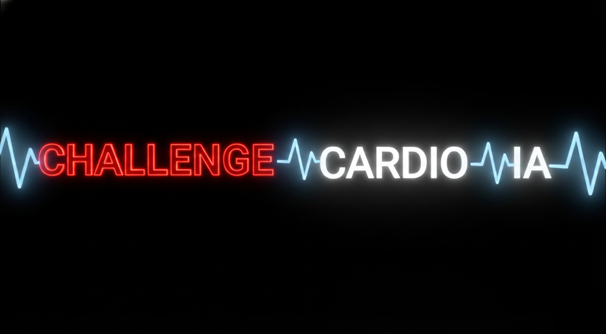
</p>

<details open>
<summary><strong><font size="6" color="#FF0000">🔴 CHALLENGE</font></strong></summary>
<br>

<details open>
<summary><strong><font size="5">Enunciado</font></strong></summary>
<br>

<p align="justify">
Você está entrando em uma jornada que conecta tecnologia, ciência de dados e saúde. O CardioIA é um projeto acadêmico do curso de IA inovador, criado para desafiar você e sua equipe a desenvolver uma plataforma digital inteligente que simule o ecossistema de uma cardiologia moderna.
</p>

<br>

<p align="justify">
Ele integra dados clínicos, modelos de Machine Learning, Visão Computacional, IoT e agentes inteligentes para lidar com triagem, diagnósticos, monitoramento, assistência remota e previsões médicas.

<br>

A seguir, apresentamos um mapa mental da sua jornada ao longo das próximas 7 fases do curso. Por meio dele, estamos antecipando o que vem agora, e no futuro, para que você possa se preparar ainda melhor para atender aos requisitos do método PBL (Project Based Learning), adotado pela FIAP em seus cursos online.
</p>

<p align="center">
  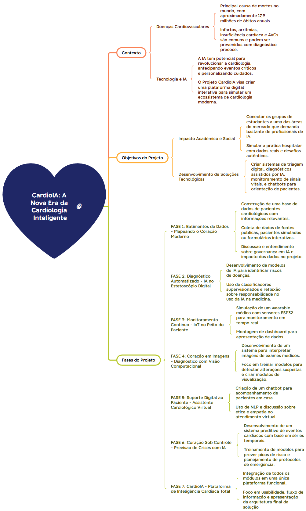
</p>

<br>

<details open>
<summary><strong><font size="4">Fase 1 - (09/02/26 - 10/03/26)</font></strong></summary>
<br>

<p align="justify">
<strong>Preparado para começar sua jornada?</strong><br>
Na <strong>Fase 1 – Batimentos de Dados</strong>, você assume o papel de <strong>Cientista de Dados Hospitalar:</strong> seu desafio é levantar, organizar e entender dados cardiológicos que, futuramente, alimentarão os módulos inteligentes do CardioIA. Aqui você constrói a base! E o mais importante, de olho na Governança de Dados envolvendo IA.
</p>

<br>

<p align="justify">
<strong>Objetivo geral da atividade:</strong><br>
Você deverá buscar e preparar <strong>três tipos de dados fundamentais</strong>:
</p>

<ul>
<li><strong>Dados Numéricos</strong> (simulados ou reais) relacionados a pacientes cardíacos;</li>
<li><strong>Textos</strong> médicos ou literários relacionados à saúde cardiovascular;</li>
<li><strong>Imagens</strong> médicas que representem exames ou sinais visuais do coração.</li>
</ul>

<br>

<p align="justify">
Esses dados serão utilizados nas fases seguintes do projeto para alimentar algoritmos, treinar modelos de IA, fazer análises comparativas e gerar soluções inovadoras. Claro que, ao longo da sua jornada, essas bases podem ser revistas pelo seu grupo. Contudo, tente buscar o máximo de pensamento crítico na pesquisa para ganhar tempo lá na frente. E não se esqueça de considerar os conceitos iniciais de Governança de Dados e de viés, já abordados nos capítulos iniciais do primeiro ano.
</p>

<p align="center">
  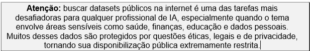
</p>

<p align="justify">
Mesmo quando os dados existem, é normal que estejam espalhados em repositórios pouco conhecidos, formatos desorganizados ou exigem processos de autorização para acesso.<br>
É importante que vocês, alunos, compreendam que essa dificuldade faz parte natural do trabalho em IA: encontrar, limpar e preparar dados é uma das etapas mais demoradas e valiosas do projeto, e desistir logo nas primeiras buscas seria como abandonar um experimento antes mesmo de montar o laboratório. Persistência, criatividade e capacidade de buscar alternativas (como gerar dados simulados ou combinar fontes diferentes) são habilidades essenciais que vocês estão começando a desenvolver aqui, e isso vale tanto quanto o código em si.
</p>

<br>

<p align="justify">
<strong>Atividade detalhada:</strong><br><br>
<strong>Parte 1 – Dados Numéricos (IoT):</strong><br>
Busque e organize um pequeno dataset (mínimo 100 linhas) contendo variáveis como idade, sexo, pressão arterial, colesterol, histórico de doenças cardíacas, sintomas, frequência cardíaca etc.
</p>

<p align="center">
  
</p>

<p align="justify">
Organize seu dataset em um repositório no GitHub e, no arquivo README.md, inclua o link para os dados hospedados no seu OneDrive, Google Drive ou outro serviço de armazenamento público de sua escolha. No mesmo README.md, explique de forma clara a origem dos dados (se são reais ou simulados) e destaque quais variáveis você considera mais relevantes do ponto de vista clínico, justificando por que elas são importantes para um projeto de Inteligência Artificial voltado à saúde.
</p>

<p align="justify">
<strong>Parte 2 – Dados Textuais (NLP):</strong><br>
Faça o download de no mínimo dois textos (.txt) relacionados às doenças cardíacas, à saúde pública, aos sintomas ou aos tratamentos, usando fontes como SciELO, BVS, artigos do SUS ou mesmo literatura clássica (Projeto Gutenberg).<br>
No mesmo repositório, adicione esses arquivos em uma subpasta “assets” ou “docs”, e, no mesmo README.md principal, explique de forma clara como esses textos podem ser explorados por algoritmos de NLP (por exemplo: análise de sentimentos, extração de sintomas, classificação de tópicos) e justifique por que essas análises são relevantes para um projeto de Inteligência Artificial aplicado à área da saúde.
</p>

<p align="justify">
<strong>Parte 3 – Dados Visuais (VC):</strong><br>
Reúna no mínimo 100 imagens de sua escolha (.jpg ou .png) de um tipo de exame cardiológico, como ECGs, angiogramas ou raio-X torácico.<br>
No mesmo repositório do seu GitHub e, no mesmo arquivo README.md, inclua o link para as imagens hospedadas no seu OneDrive, Google Drive ou outro serviço de armazenamento público de sua escolha. Adicione uma justificativa que explique de forma clara como essas imagens poderão ser analisadas por algoritmos de Visão Computacional (por exemplo: detecção de padrões, identificação de bordas, reconhecimento de anomalias) e destaque a importância dessas análises para projetos de IA aplicados à área da saúde.
</p>

<br>

<p align="justify">
<strong>Entregáveis:</strong><br>
É necessário que o repositório do GitHub contenha:
</p>
<ul>
<li>Um arquivo README.md detalhado que explique o projeto, descreva cada uma das três partes, e indique os objetivos e as fontes dos dados;</li>
<li>Subpasta docs ou assets e conteúdos;</li>
<li>Links públicos (do Google Drive ou OneDrive ou semelhantes) apontando para o conjunto completo de dados preparados (numéricos, textuais e visuais). Garanta que o link esteja acessível para qualquer pessoa, para que o time da FIAP possa acessá-lo para a correção.</li>
</ul>

<p align="center">
  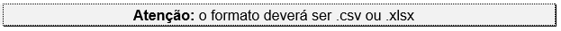
</p>

<p align="justify">
<strong>Critérios de Avaliação (10 pontos totais):</strong>
</p>

<p align="center">
  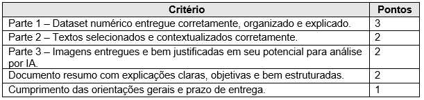
</p>

<p align="justify">
<strong>Mensagem final:</strong><br>
Lembre-se: nesta fase, não estamos apenas coletando dados, estamos construindo as bases para uma simulação de ecossistema de cardiologia inteligente. Tenha sempre atenção à relevância clínica das informações e pense sempre no impacto positivo que essas soluções podem trazer para a vida real.
</p>

</details>

<br>

<details>
<summary><strong><font size="4">Fase 2 - Em Breve</font></strong></summary>
<br><br>
</details>

<br>

<details>
<summary><strong><font size="4">Fase 3 - Em Breve</font></strong></summary>
<br><br>
</details>

<br>

<details>
<summary><strong><font size="4">Fase 4 - Em Breve</font></strong></summary>
<br><br>
</details>

<br>

<details>
<summary><strong><font size="4">Fase 5 - Em Breve</font></strong></summary>
<br><br>
</details>

<br>

<details>
<summary><strong><font size="4">Fase 6 - Em Breve</font></strong></summary>
<br><br>
</details>

<br>

<details>
<summary><strong><font size="4">Fase 7 - Em Breve</font></strong></summary>
<br><br>
</details>

</details>
</details>

<br>

<p align="center">
  
</p>

<details open>
<summary><strong><font size="6" color="#00800">🟢 SOLUTION</font></strong></summary>
<br>

<details open>
<summary><strong><font size="5">Cardio-Edge-AI: Assistente de Diagnóstico Cardiovascular em Tempo Real</font></strong></summary>
<br>

<p align="center">
  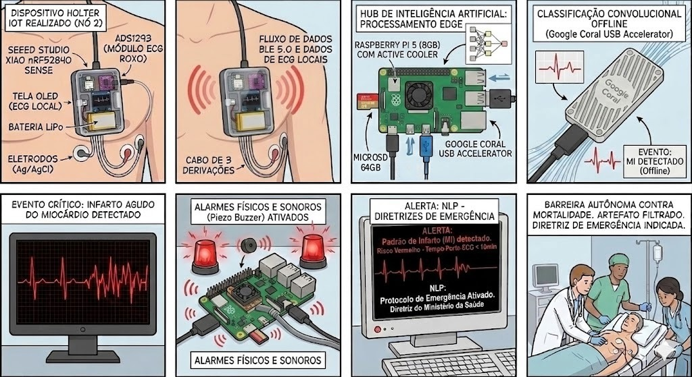
</p>

<p align="justify">
<strong>Um Holter IoT ultracompacto acoplado ao tórax do paciente</strong> atua como nó primário de aquisição. Operado pelo microcontrolador <strong>Seeed Studio XIAO nRF52840 Sense</strong> integrado a um Front-End Analógico médico <strong>(ADS1293)</strong>, o dispositivo abandona sensores ópticos de pulso em favor da captação elétrica real do miocárdio. 

<br>

Utilizando eletrodos de Ag/AgCl e um cabo de 3 derivações, ele <strong>lê o diferencial de voltagem do coração em 24-bits</strong>. O microcontrolador usa seu acelerômetro embutido para mapear ruídos de movimento e, em seguida, <strong>transmite as séries temporais fisiológicas via Bluetooth Low Energy (BLE 5.0) para o hub local (Raspberry Pi 5)</strong>, garantindo viabilidade energética para a bateria LiPo de 750mAh.

<br>

<strong>O pacote de telemetria é recebido</strong> em milissegundos <strong>pelo minicomputador</strong> base (instalado na ambulância, leito de UTI ou posto de enfermagem), <strong>que agrupa os dados em tensores de 10 segundos.</strong> 

<br>

Como o processador ARM do Raspberry Pi sofreria com gargalos térmicos ao inferir Redes Neurais Profundas, <strong>a matriz de dados é delegada instantaneamente ao Google Coral Edge TPU via porta USB 3.0.</strong> <strong>Este coprocessador ASIC executa</strong> a classificação convolucional a <strong>4 Trilhões de Operações por Segundo (TOPS), cruzando a onda elétrica com padrões patológicos (como Isquemia ou Hipertrofia) em frações de segundo.</strong>

<br>

<strong>Ao detectar a morfologia</strong> exata de um evento crítico (ex: Infarto Agudo do Miocárdio), a arquitetura atua de forma multimodal. <strong>O Raspberry Pi aciona relés e portas GPIO para alarmes físicos</strong> locais (luzes vermelhas/sirenes) e utiliza o módulo de Processamento de Linguagem Natural (NLP) treinado em protocolos médicos <strong>para traduzir a probabilidade matemática em um alerta clínico estruturado na tela: "ALERTA: Padrão de Infarto (MI) detectado. Risco Vermelho - Tempo Porta-ECG < 10min".</strong>

<br>

<strong>O sistema atua como uma barreira autônoma contra a mortalidade cardiovascular.</strong> Quando a equipe médica chega ao leito, <strong>a máquina já filtrou o artefato de movimento, analisou o vetor elétrico e indicou a diretriz emergencial baseada no Ministério da Saúde, minimizando a falha humana de triagem e reduzindo o tempo de isquemia do paciente.</strong>
</p>

<br>

<details open>
<summary><strong><font size="4">Fase 1 - (09/02/26 - 10/03/26)</font></strong></summary>
<br>

  <details>
  <summary><strong>Hardware</strong></summary>
  <br>

<p align="justify">
  <strong>🧠 1º Nó: O LABORATÓRIO DE ENGENHARIA - Modelagem e Treinamento de IA</strong>
  <br>

    O ambiente de desenvolvimento não é levado ao paciente, mas é o cerebro do projeto. Ele opera em uma arquitetura híbrida (Local + Nuvem): o hardware primário (Laptop ASUS ROG Strix G17) trabalha em sinergia com o Google Colab. É aqui que os terabytes de dados brutos (PTB-XL, MIMIC-IV) são armazenados de forma estática e processados (Python 3.12). Apenas os dados refinados, features e modelos finais são versionados (via DVC), otimizando o repositório. É neste nó que a Rede Neural é iterada e compilada antes de ser transferida para a borda.
</p>

<ul>
  <li><strong>Sistema Operacional e Ambiente Local:</strong> Windows 11 Pro (Compilation 22631).
    <ul>
      <li>Utilização de Git Bash para gerenciamento de diretórios e DVC (Data Version Control) configurado exclusivamente para o versionamento dos <strong>dados processados</strong> e modelos. Isso mantém o repositório leve e ágil ao isolar e ignorar os pesados dados brutos (raw data) imutáveis.</li>
    </ul>
  </li>

  <li><strong>Processamento Central (CPU):</strong> AMD Ryzen 9 5900HX (8 Cores, 16 Threads).
    <ul>
      <li>Clock de até 4.48 GHz. Essencial para o pré-processamento pesado de dados (Feature Engineering) e limpeza matemática das séries temporais de ECG usando bibliotecas como Pandas e NumPy.</li>
    </ul>
  </li>

  <li><strong>Aceleração Gráfica Local (GPU):</strong> NVIDIA GeForce RTX 3070 Laptop GPU.
    <ul>
      <li><strong>VRAM:</strong> 8.0 GB (Dedicada) + 31.7 GB (Compartilhada). Suporte a DirectX 12 Ultimate.</li>
      <li>Este é o "motor" diário do laboratório. Usado para prototipar o código, testar a arquitetura da rede e realizar treinamentos iniciais com subsets menores (como o PTB-XL) usando aceleração CUDA, sem depender de internet.</li>
    </ul>
  </li>

  <li><strong>Memória de Trabalho (RAM Local):</strong> 64.0 GB (SODIMM, 3200 MHz).
    <ul>
      <li>Capacidade massiva e crucial para carregar as matrizes de dados diretamente na memória volátil durante a estruturação dos tensores, evitando engasgos (swap) no disco.</li>
    </ul>
  </li>

  <li><strong>Armazenamento (Data Lake Local):</strong> XPG SPECTRIX S40G SSD.
    <ul>
      <li><strong>Capacidade:</strong> 3.6 TB.</li>
      <li>Espaço e velocidade de leitura/escrita (SSD NVMe) indispensáveis para abrigar de forma estática e gerenciar os quase 100GB dos datasets brutos (PTB-XL e MIMIC-IV) sem criar gargalos de I/O (Input/Output).</li>
    </ul>
  </li>

<p align="center">
  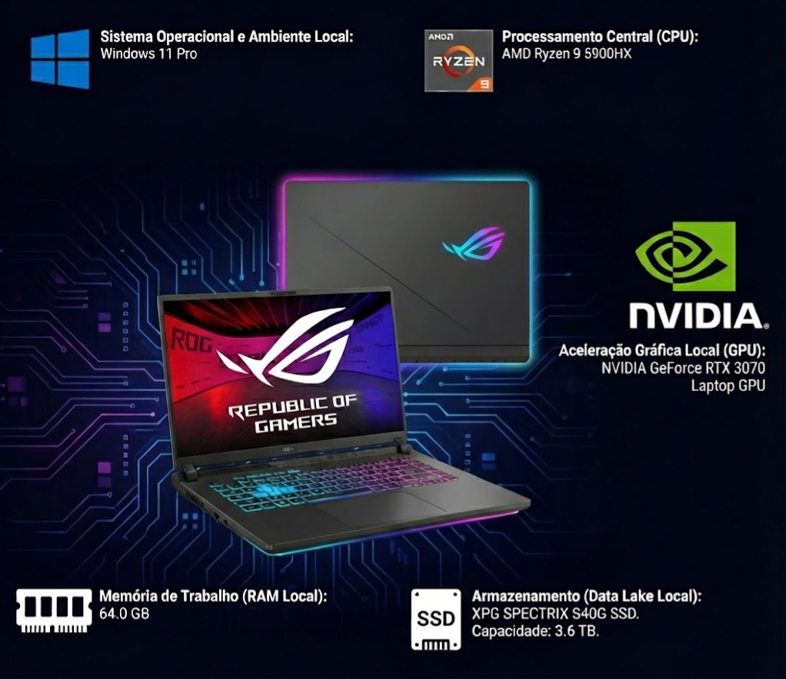
  &nbsp; 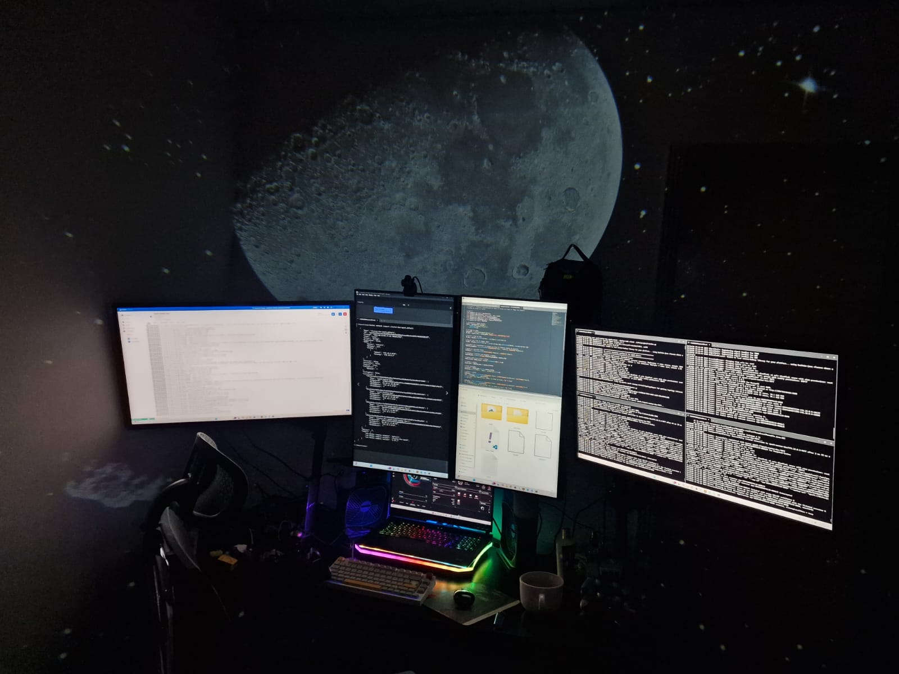
</p>

  <li><strong>Extensão de Processamento em Nuvem (Google Colab):</strong>
    <ul>
      <li><strong>Cenário Gratuito (A Melhor Opção Padrão):</strong> Selecionando a <strong>T4 GPU</strong>. Embora a RTX 3070 local seja mais rápida em clock, a T4 do Google oferece 16GB de VRAM (o dobro da placa da minha máquina local). Ela será usada quando o notebook acusar erro de "Out of Memory" (OOM) ao tentar processar lotes (batch sizes) muito grandes de imagens de ECG simultaneamente.</li>
      <li><strong>Cenário Pago (Uso Essencial de Compute Units):</strong> A compra de unidades para acessar a <strong>A100 GPU</strong> ou a <strong>H100 GPU</strong> será estrategicamente ativada apenas no Estágio Final (Fases 4 e 6). Treinar uma CNN profunda com os 800.000 exames do MIMIC-IV na máquina local (Asus) levaria semanas contínuas, correndo o risco de superaquecimento. Com a A100 (que possui 40GB ou 80GB de VRAM e barramento altíssimo), o treinamento completo do projeto é reduzido para poucas horas.</li>
    </ul>
  </li>
</ul>

<p align="center">
  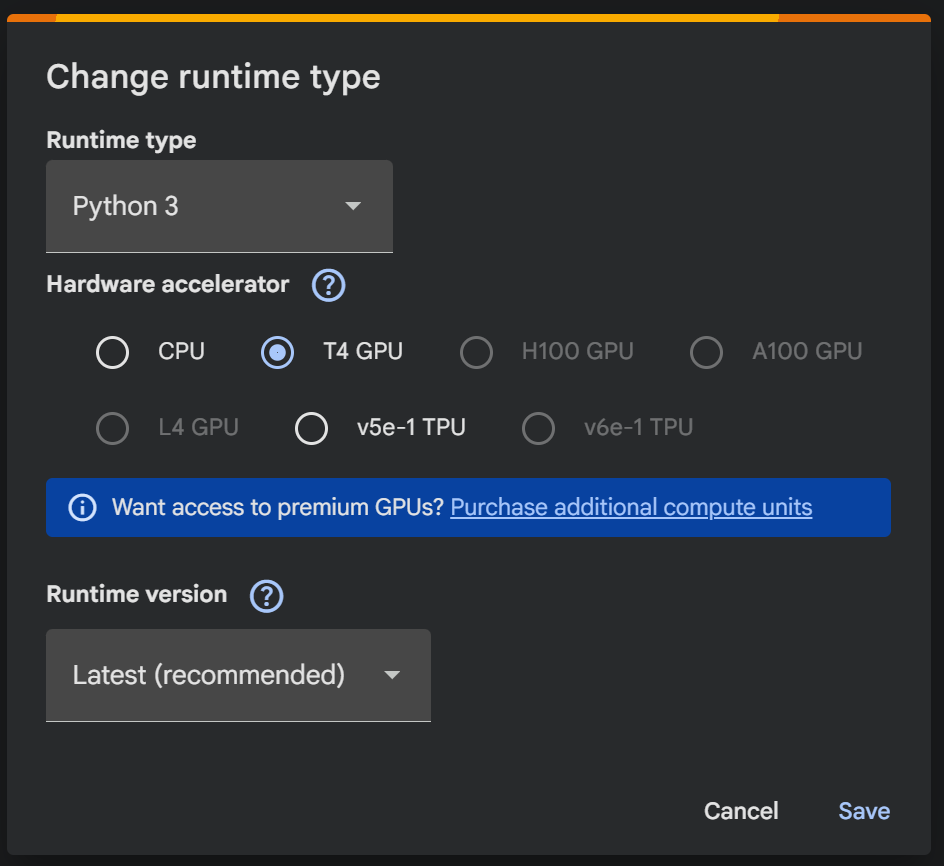
  &nbsp; 
</p>

<br>

<p align="justify">
  <strong>🫀 2º Nó: O WEARABLE DO PACIENTE - Coleta de Dados</strong>
  <br>

    Este é o hardware de extrema borda (Edge), desenhado para fixação direta no corpo do paciente. Atuando como os "olhos" do sistema, ele abandona os sensores amadores em favor de Front-Ends Analógicos (AFEs) de grau clínico. Sua função é capturar a atividade elétrica do coração em 24-bits, filtrar ruídos de movimento internamente e transmitir um fluxo contínuo de sinais vitais via Bluetooth (BLE) de forma ininterrupta, discreta e segura.
  </p>

<ul>
  <li><strong>Placa Microcontroladora:</strong> 1x Seeed Studio XIAO nRF52840 Sense.
    <ul>
      <li>O "cérebro" minúsculo com Bluetooth e acelerômetro.</li>
    </ul>
  </li>

<p align="center">
  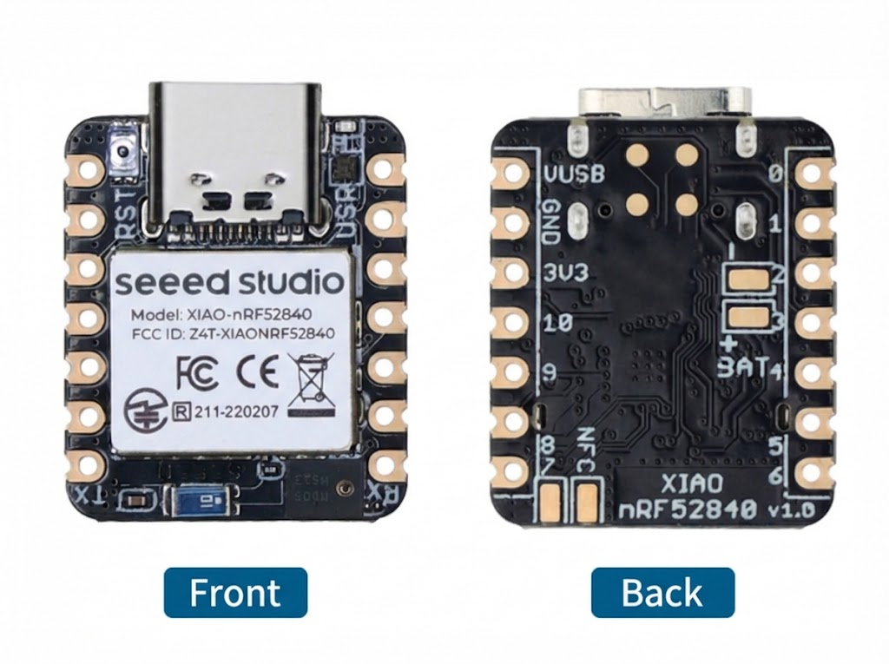
</p>
  
  <li><strong>Módulo AFE de ECG:</strong> 1x Módulo CJMCU-1293 (com chip ADS1293).
    <ul>
      <li>A placa roxa que lê a eletricidade do coração em 24-bits.</li>
    </ul>
  </li>
  
<p align="center">
  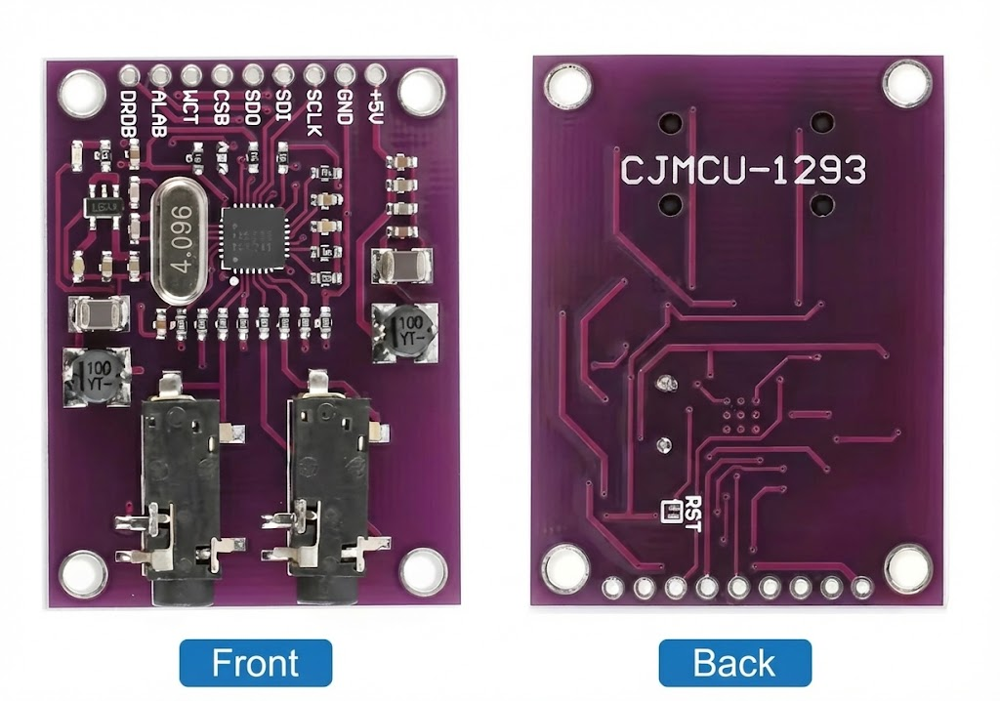
</p>

  <li><strong>Micro Tela:</strong> 1x Display OLED 0.96" I2C (Branco ou Azul).
    <ul>
      <li>Para ver a onda cardíaca em tempo real.</li>
    </ul>
  </li>
  
<p align="center">
  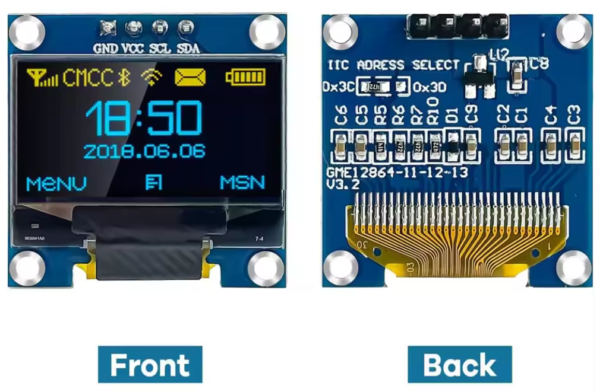
</p>

  <li><strong>Micro Alto-falante:</strong> 1x Buzzer Piezoelétrico Passivo 3V ou 5V.
    <ul>
      <li>Para emitir o bipe do coração e o alarme.</li>
    </ul>
  </li>
  
<p align="center">
  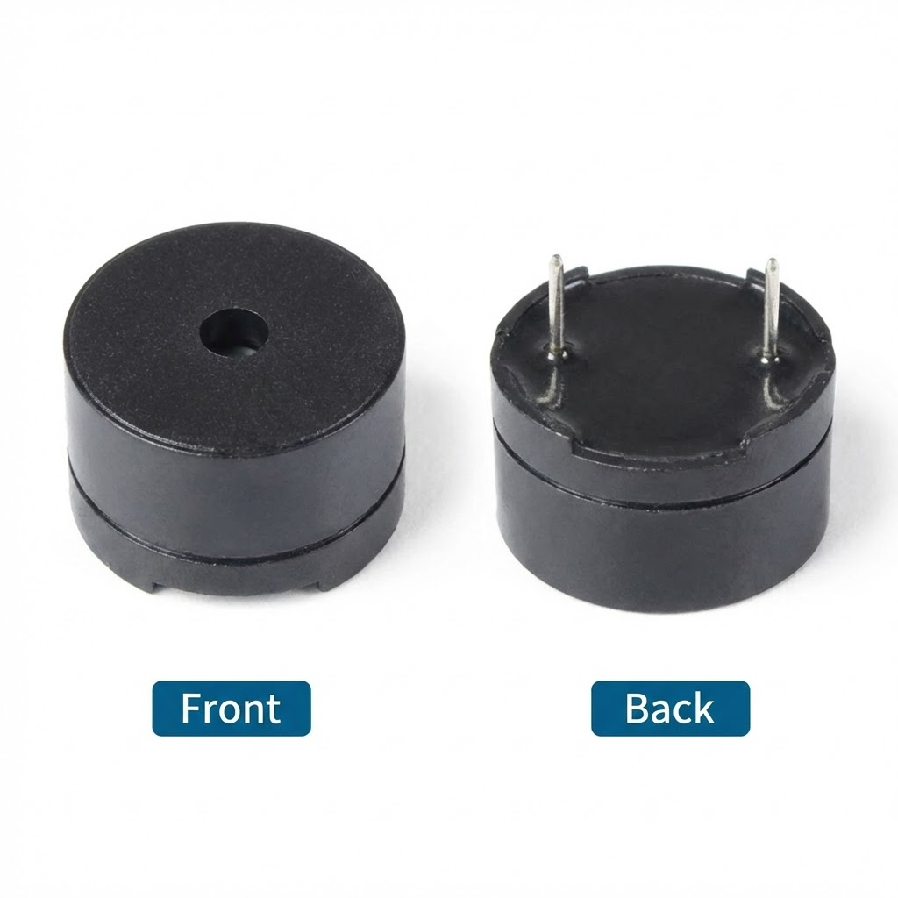
</p>

  <li><strong>Bateria:</strong> 1x Bateria LiPo (Polímero de Lítio) 3.7V de 400mAh, 500mAh ou 600mAh.
    <ul>
      <li>Formato retangular fino (ex: modelo 802040 ou 503035).</li>
    </ul>
  </li>
  
<p align="center">
  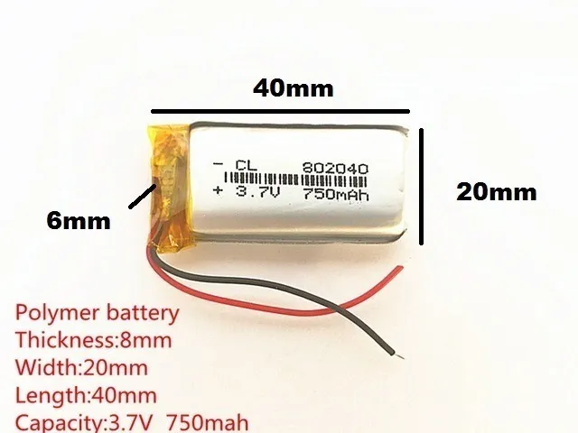
</p>

  <li><strong>Conector da Bateria:</strong> 1x Conector JST-PH 2.0mm (Fêmea com rabicho de fios).
    <ul>
      <li>Ele encaixa embaixo da placa XIAO.</li>
    </ul>
  </li>
  
<p align="center">
  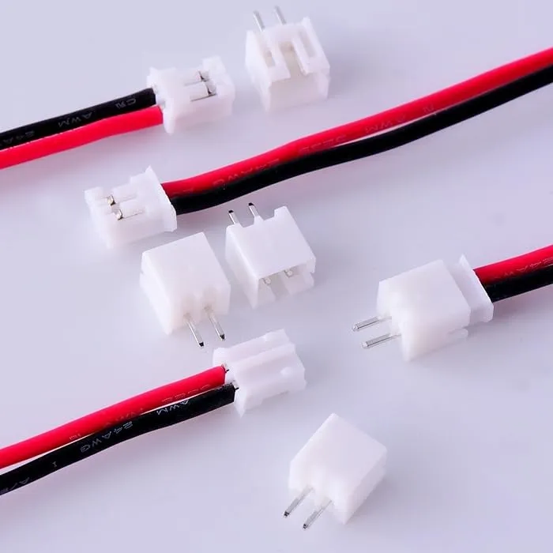
</p>

  <li><strong>Jack de Entrada do Cabo:</strong> 1x Conector Jack Fêmea P2 (3.5mm) Estéreo ou Jack DIN Fêmea para painel.
    <ul>
      <li>Isso vai soldado na placa roxa para plugar e desplugar o cabo do paciente.</li>
    </ul>
  </li>
  
<p align="center">
  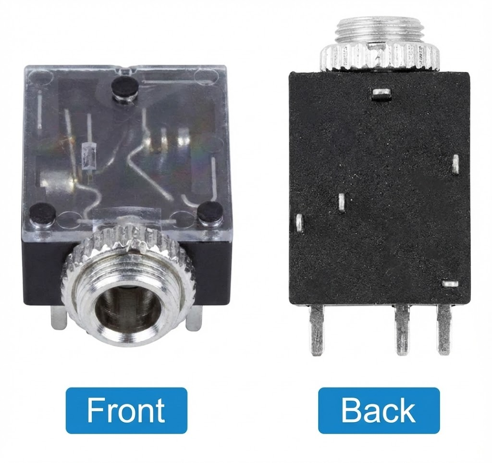
</p>

  <li><strong>O Cabo Médico:</strong> 1x Cabo de ECG de 3 Vias (Derivações).
    <ul>
      <li>A ponta que vai no aparelho deve ser compatível com o Jack (P2 de 3.5mm ou DIN). A ponta que vai no paciente deve ser do tipo "Snap" (Botão de pressão) ou "Garra" (Clip).</li>
    </ul>
  </li>
  
<p align="center">
  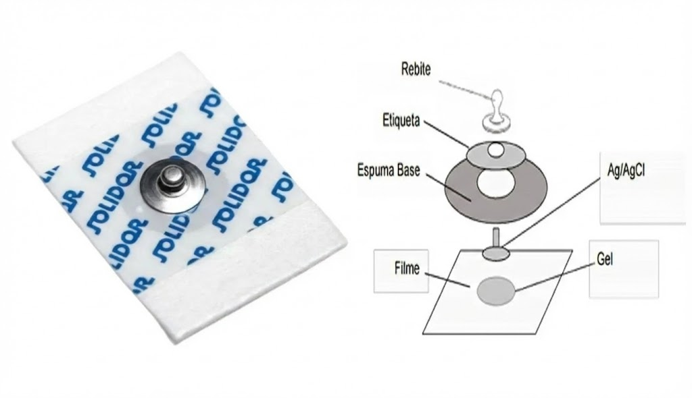
</p>

  <li><strong>Os Eletrodos:</strong> 1x Pacote com 50 Eletrodos Descartáveis para ECG.
    <ul>
      <li>Ag/AgCl, com gel.</li>
    </ul>
  </li>
</ul>

<p align="center">
  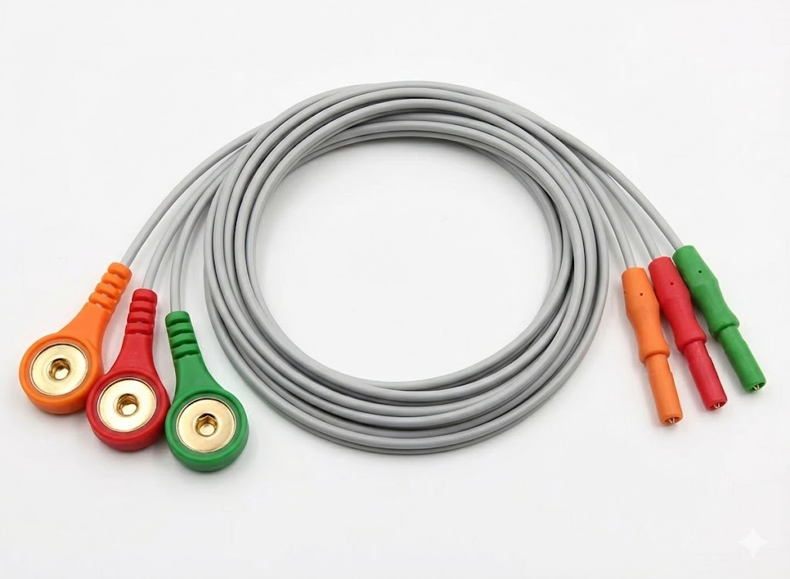
</p>

  <br>

  <p align="justify">
  <strong>🤖 3º Nó: O HUB DE INTELIGÊNCIA ARTIFICIAL - Processamento Edge</strong>
  <br>

    A estação base local, posicionada ao lado do leito ou na ambulância (Raspberry Pi 5 acoplado ao Google Coral Edge TPU). Este nó atua como o "cérebro" clínico de resposta rápida: ele ingere a telemetria do wearable via Bluetooth e executa as Redes Neurais (previamente treinadas) de forma 100% offline. É aqui que as ondas cardíacas são cruzadas com os padrões aprendidos para diagnosticar infartos e arritmias em milissegundos, acionando os protocolos de resgate.
  </p>

  <ul>
  <li><strong>Minicomputador:</strong> 1x Raspberry Pi 5.
    <ul>
      <li>Recomendado o de 8GB de RAM para não dar gargalo no buffer de IA.</li>
    </ul>
  </li>

<p align="center">
  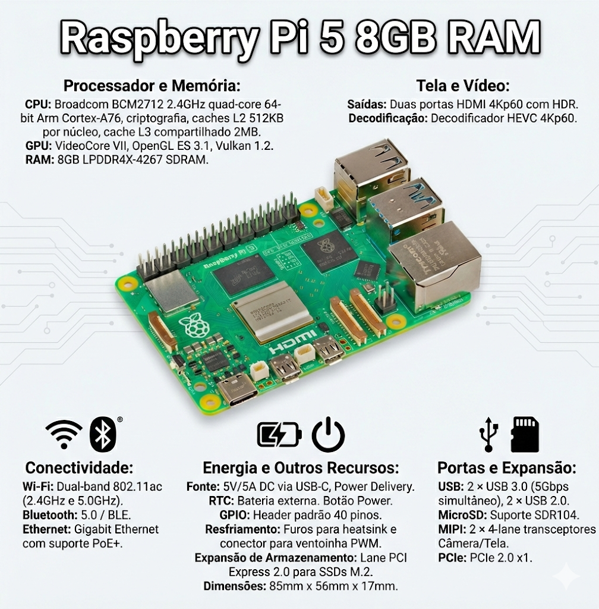
</p>

  <li><strong>Acelerador de Inteligência Artificial:</strong> 1x Google Coral USB Accelerator.
    <ul>
      <li>A peça cinza parecida com um pendrive, que processa a IA 100x mais rápido que o Pi.</li>
    </ul>
  </li>

<p align="center">
  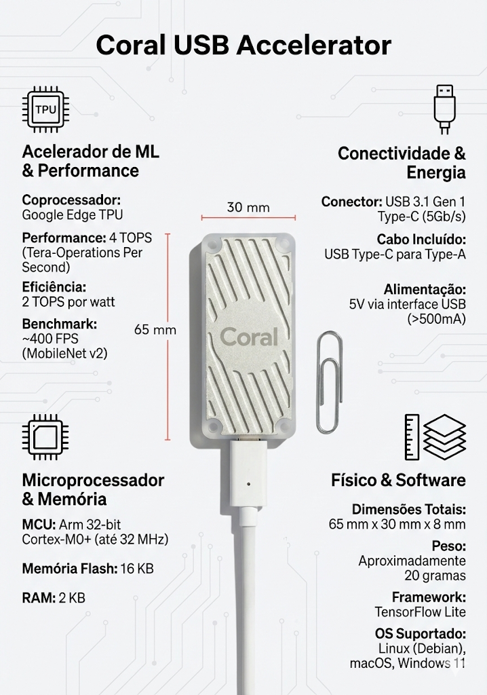
</p>

  <li><strong>Cabo do Coral:</strong> 1x Cabo USB-C para USB-A SuperSpeed.
    <ul>
      <li>Geralmente já vem na caixa do Google Coral. Ele DEVE ser plugado nas portas USB azuis do Raspberry Pi.</li>
    </ul>
  </li>

<p align="center">
  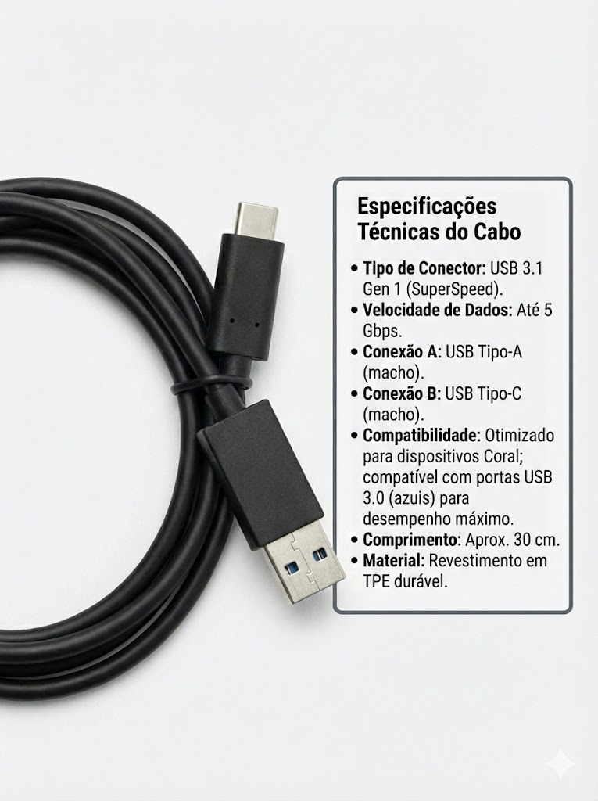
</p>

  <li><strong>Fonte de Alimentação OBRIGATÓRIA:</strong> 1x Fonte Oficial USB-C para Raspberry Pi 5 (27W / 5.1V 5A).
    <ul>
      <li>ATENÇÃO: Não use carregador de celular comum. O Pi 5 puxa muita energia, e quando o Google Coral ligar, um carregador fraco fará o sistema desligar sozinho.</li>
    </ul>
  </li>

<p align="center">
  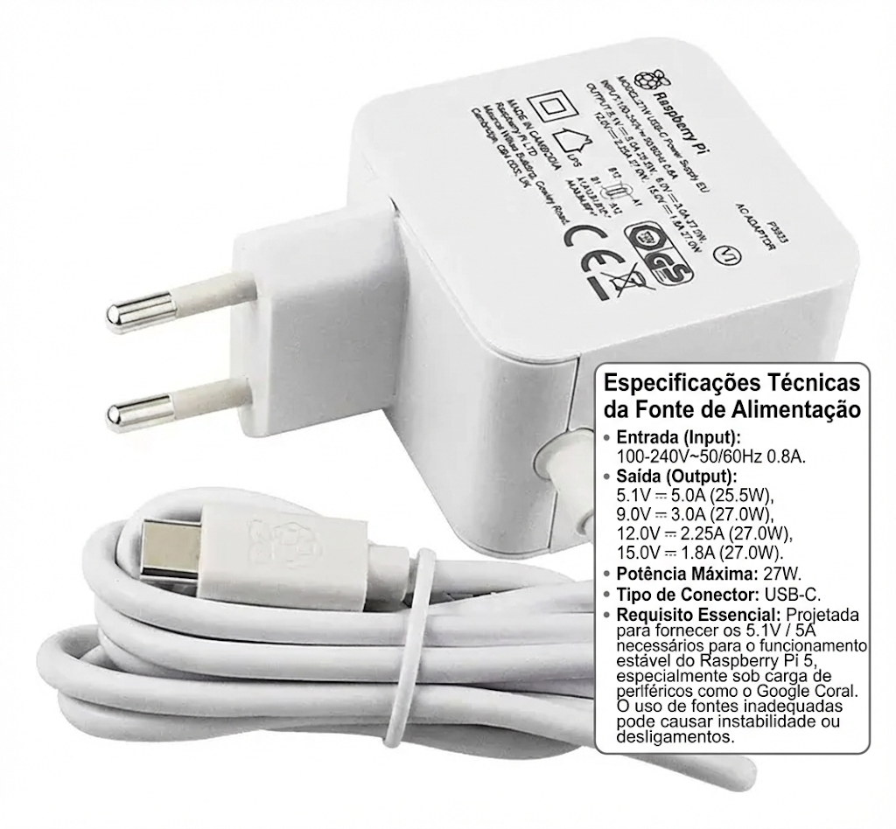
</p>

  <li><strong>Resfriamento OBRIGATÓRIO:</strong> 1x Raspberry Pi 5 Active Cooler.
    <ul>
      <li>O dissipador oficial com ventoinha. O processamento contínuo esquenta a placa; sem isso, ela diminui a velocidade - thermal throttling.</li>
    </ul>
  </li>
  
<p align="center">
  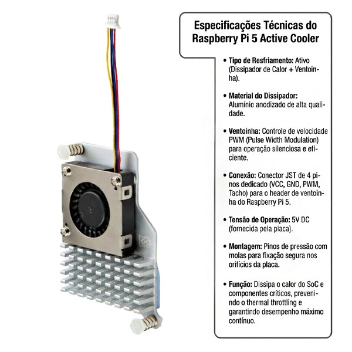
</p>

  <li><strong>Armazenamento:</strong> 1x Cartão MicroSD 32GB ou 64GB (Classe 10, A2 - Recomendado SanDisk Extreme).
    <ul>
      <li>Aqui ficará o sistema operacional Linux e os scripts Python.</li>
    </ul>
  </li>
</ul>

<p align="center">
  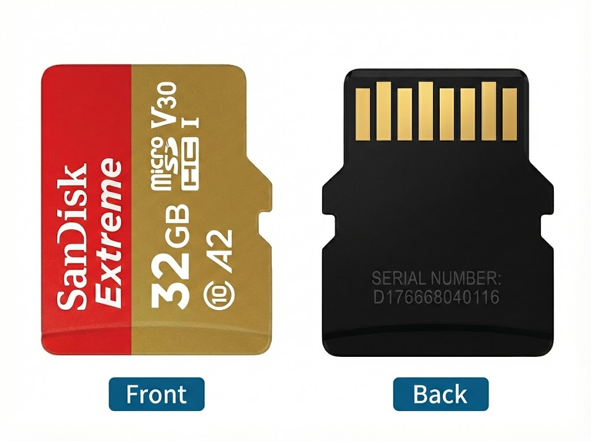
  &nbsp; 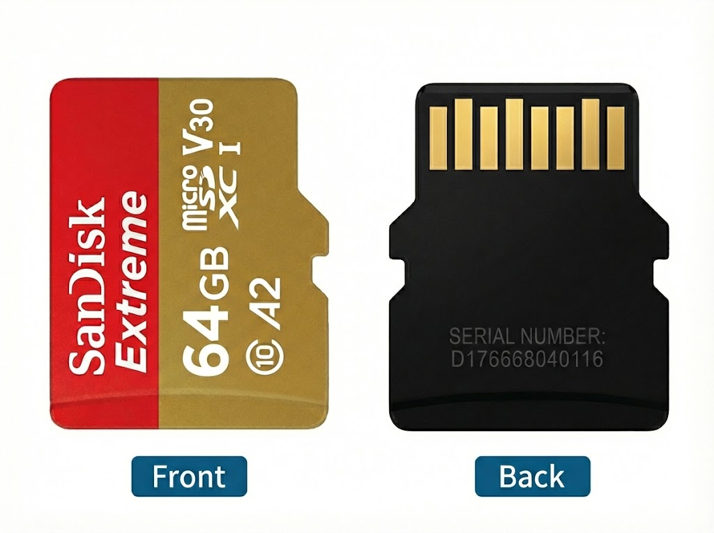
</p>

<br>

  <p align="justify">
  <strong>🛠️ MATERIAIS DE BANCADA E MONTAGEM</strong>
  <br>

    O arsenal de microeletrônica exigido para transformar placas comerciais em um produto vestível e miniaturizado. Estes insumos (fios superfinos AWG 30, fitas térmicas de isolamento e ferramentas de microsolda) substituem as protoboards amadoras, garantindo a construção do hardware. É a ponte física que assegura um circuito robusto, ultracompacto e livre de mau contato ou ruídos elétricos.
  </p>

<ul>
  <li><strong>Fio para Microsolda:</strong> 1x Rolo de fio de Cobre Esmaltado AWG 30 (conhecido como fio de "Wire Wrap").
    <ul>
      <li>É um fio extremamente fino, usado para interligar os pinos do XIAO até a placa roxa de ECG ocupando quase zero espaço.</li>
    </ul>
  </li>

<p align="center">
  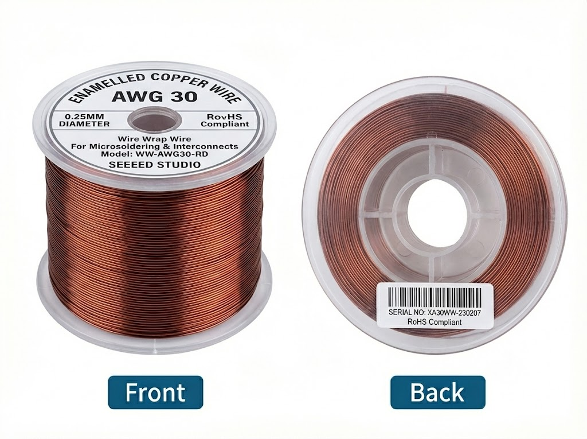
</p>

  <li><strong>Isolamento Elétrico:</strong> 1x Rolo de Fita Kapton (Fita térmica de poliamida amarela).
    <ul>
      <li>Será usado para colar a placa roxa em cima da bateria sem dar curto-circuito, suporta calor e isola muito bem.</li>
    </ul>
  </li>

<p align="center">
  
</p>

  <li><strong>Pinos de Apoio:</strong> 1x Barra de Pinos Macho e 1x Barra de Pinos Fêmea (Passo 2.54mm).
    <ul>
      <li>Caso queira fazer as plaquinhas encaixáveis em vez de soldar tudo de forma definitiva.</li>
    </ul>
  </li>

<p align="center">
  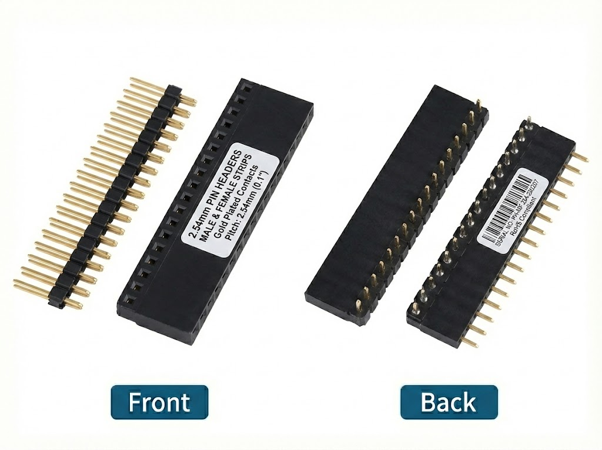
</p>

  <li><strong>Equipamento Básico:</strong> Ferro de solda (ponta fina), rolo de Estanho (solda) de boa qualidade (fio fino 0.5mm), e pasta de solda/fluxo.</li>
</ul>

<p align="center">
  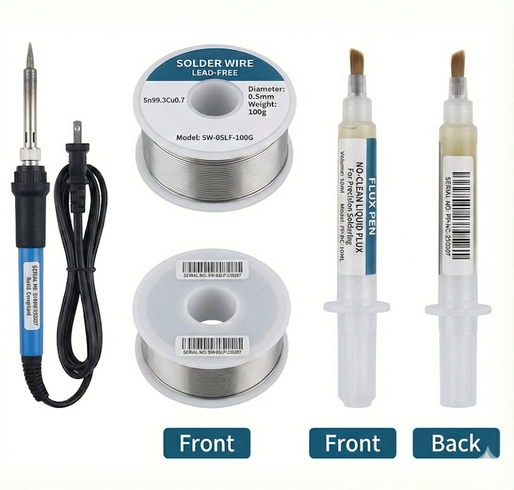
</p>

</details>

<br>

<details>
  <summary><strong>Data Lifecycle e Convergência Top-Down</strong></summary>
  <br>

<p align="justify">
  <strong>A Arquitetura Orientada a Restrições (Edge AI)</strong><br>
  Em um ecossistema de Inteligência Artificial de Borda (Edge Computing) aplicado à saúde crítica, a Engenharia de Dados não existe em um vácuo estatístico. Cada filtro de sinal, amputação de ruído, imputação de falhas e formatação tensorial realizados neste projeto foram <strong>estritamente ditados pelas severas limitações físicas, elétricas e termodinâmicas do hardware de implantação</strong>. 
  <br><br>
  A nossa infraestrutura opera sob uma topologia distribuída em três frentes físicas interdependentes, onde a restrição de uma máquina impõe a regra matemática da outra:
</p>

<ul align="justify">
  <li><strong>Nó 1 (Laboratório de MLOps - ASUS ROG Strix / Cloud):</strong> Operando sem restrições de bateria, este nó utiliza 64GB de RAM volátil e aceleração CUDA para sustentar matrizes colossais de dados brutos (PTB-XL, MIMIC-IV). A sua função é suportar a carga computacional massiva de <em>Feature Engineering</em>, conversão espectral (STFT) e o treinamento pesado dos modelos, exportando estritamente os artefatos finais quantizados para não sobrecarregar a borda.</li>
  
  <li><strong>Nó 2 (Wearable de Aquisição - XIAO nRF52840 Sense + ADS1293):</strong> Operando sob extrema restrição energética (Bateria LiPo de 750mAh), este dispositivo fixado ao tórax do paciente é fisicamente incapaz de realizar inferências profundas ou transmitir dados via Wi-Fi. A engenharia de dados precisou ser enxuta na origem: o nó empacota a voltagem do miocárdio (24-bits) e a força G (IMU) a 100Hz, transmitindo o <em>payload</em> tabular exclusivamente via Bluetooth Low Energy (BLE 5.0) para garantir uma sobrevida superior a 19 horas contínuas.</li>

  <li><strong>Nó 3 (Hub de Inferência - Raspberry Pi 5 + Google Coral Edge TPU):</strong> Operando sob estrita restrição térmica na beira do leito, o Pi atua como maestro. Para não causar estrangulamento térmico (<em>Thermal Throttling</em>) na CPU ARM, a classificação elétrica é delegada ao ASIC Google Coral. Contudo, o Coral não processa tempo; ele processa espaço. Isso forçou a nossa engenharia a converter sinais de ECG 1D em Espectrogramas 2D engessados em exatos 224x224 pixels (INT8). Simultaneamente, para evitar o esgotamento dos 8GB de RAM, o processamento de Linguagem Natural (NLP) é mantido em suspensão, sendo ativado de forma assíncrona apenas quando a matemática convolucional acusa uma anomalia crítica.</li>
</ul>

<p align="justify">
  Abaixo, dissecamos o pipeline sequencial de dados em quatro etapas vitais, demonstrando de forma irreversível como a manipulação matemática realizada dentro dos nossos <em>Jupyter Notebooks</em> viabiliza a existência e a performance destes componentes físicos no ambiente clínico real.
</p>

<p align="justify">
  <strong>📕 1º PTB-XL EDA: O Ground Truth e a Arquitetura Dual</strong><br>
  <em>(Notebook: <code>notebooks/ptblxl_eda.ipynb</code>)</em>


  <em>📥 Ingestão (Raw Data): 
  <code>data/raw/ptbxl/ptbxl_database.csv</code> e
  <code>data/raw/ptbxl/scp_statements.csv</code></em>

  <em>📤 Exportação (Processed Data): 
  <code>data/processed/ptbxl_engineered_features.csv</code> e
  <code>data/processed/ptbxl_gateway_fallback.csv</code></em>

  A curadoria dos dados não foi motivada apenas por boas práticas estatísticas, mas sim por exigências estritas de arquitetura. O <strong>Google Coral Edge TPU (Nó 3)</strong>, nosso acelerador de inferência, opera através de matrizes estáticas quantizadas. Injetar dados nulos (NaNs) na camada de rede convolucional resultaria em falhas de segmentação críticas no leito do paciente. Inversamente, a imputação cega de dados vitais faltantes (como atribuir um peso médio a um paciente com isquemia severa) comprometeria a capacidade do modelo de inferir a atenuação elétrica causada pelo tecido adiposo.
</p>

<ul>
  <li><strong>A Solução Matemática (Processada no Nó 1):</strong> Com a capacidade computacional do ASUS ROG Strix (64GB RAM), bifurcamos o ecossistema na origem:
    <ul>
        <li><strong>Rota A (Engineered Features):</strong> Extraímos 6.665 exames com biometria completa, permitindo o cálculo vetorial rigoroso de IMC e Área de Superfície Corporal (BSA). Este subconjunto denso (<code>ptbxl_engineered_features.csv</code>) será a "Fonte da Verdade" para o modelo primário de alta precisão.</li>
        <li><strong>Rota B (Gateway de Fallback):</strong> O volume ruidoso remanescente (>15.000 instâncias sem peso/altura) foi isolado no artefato <code>ptbxl_gateway_fallback.csv</code>. Eles treinarão um algoritmo de resgate, uma "rede de segurança" que será ativada automaticamente pelo <strong>Raspberry Pi</strong> caso o equipamento de coleta falhe na obtenção de dados completos.</li>
    </ul>
  </li>
  <li><strong>Gestão de Incerteza Diagnóstica:</strong> A taxonomia médica original, com suas 68 classificações pulverizadas, era incompatível com a capacidade de generalização na borda. Implementamos um filtro de confiança (P >= 50%) para expurgar suposições humanas, consolidando o alvo em <strong>5 Superclasses Preditivas</strong> (ex: NORM, MI, HYP). As anomalias estatísticas remanescentes não foram deletadas, mas envelopadas em uma <strong>6ª Classe de Triagem (INCONCLUSIVO)</strong>, forçando o Google Coral a admitir sua limitação em casos dúbios.</li>
</ul>

<br>

<p align="justify">
  <strong>🔋 2º Simulação Holter IoT: A Física, o Power Budget e a Orquestração do Buffer</strong>

  <em>(Notebook: <code>notebooks/holter_iot_data_simulation.ipynb</code>)</em>

  <em>📥 Ingestão (Parâmetros da Fase 1): 
  <code>data/processed/ptbxl_engineered_features.csv</code> e 
  Geração Matemática Sintética (Gaussianas)</em>
  
  <em>📤 Exportação (IoT Payload): 
  <code>data/processed/holter_iot_data_simulation.csv</code></em>

  Com a taxonomia clínica definida, era imperativo validar a viabilidade de hardware do <strong>Nó 2 (Wearable)</strong>. O microcontrolador XIAO nRF52840 atua acoplado a um AFE médico (ADS1293), captando o diferencial do miocárdio em resolução extrema de 24-bits simultaneamente a um acelerômetro triaxial (IMU). Transmitir esse volume de dados via Wi-Fi causaria o esgotamento da célula LiPo de 750mAh em menos de 3 horas. A adoção do protocolo Bluetooth Low Energy (BLE 5.0) reduziu o consumo de rede para < 7mA, mas exigiu modelagem matemática para lidar com a latência e perda de pacotes no ambiente hospitalar.
</p>
<ul>
  <li><strong>Modelo Estocástico e Termodinâmica:</strong> Emulamos 24 horas de rotina hospitalar gerando um <em>payload</em>  de <strong>8.64 milhões de amostras</strong> cruzadas com perfis de ruído eletromiográfico (EMG) e variação de linha de base. A simulação da curva de descarga provou matematicamente a autonomia do dispositivo, operando sob uma extração de 35mA e atingindo o ciclo final com 15.20% de reserva segura.</li>

  <li><strong>O Gatekeeper de RF (Packet Loss e Interpolação):</strong> O ar não é um cabo blindado. Injetamos uma taxa de falha (<em>Packet Loss</em>) de 0.15% na telemetria BLE, simulando colisões de rádio-frequência na UTI. Para evitar que o <strong>Nó 3 (Raspberry Pi 5)</strong> despache tensores esburacados (com valores <code>NaN</code>) que travariam o acelerador Google Coral, programamos um sistema de <strong>Interpolação Linear em tempo real</strong>, reconstruindo a morfologia da onda milissegundo a milissegundo antes da inferência.</li>

  <li><strong>A Geometria do Buffer Circular:</strong> O Raspberry Pi não guarda o histórico completo na memória RAM volátil. Ele orquestra um buffer circular dinâmico engessado em exatas <strong>1.000 amostras a 100Hz (10 segundos temporais)</strong>. A saída deste notebook é um tensor tridimensional perfeito no formato geométrico <code>[1, 1000, 4]</code> (1 Lote, 1000 <em>Timesteps</em>, 4 Canais: ECG + IMU X, Y, Z). Este não é um recorte arbitrário; é a matriz absoluta que as Redes Neurais do próximo nó foram arquitetadas para engolir em frações de milissegundos.</li>
</ul>

<br>

<p align="justify">
  <strong>📘 3º Processamento de Sinais (Signal Vision): A Conversão Edge-TPU</strong>

  <em>(Notebook: <code>notebooks/ptbxl_signal_vision_eda.ipynb</code>)</em>

  <em>📥 Ingestão Mista: Matrizes Tabulares (<code>data/processed/ptbxl_engineered_features.csv</code>) e Binários Waveform (<code>data/raw/ptbxl/records100/</code>)</em>

  <em>📤 Exportação (Produção): Tensores Tridimensionais Quantizados (<code>data/processed/tensors/*.npy</code>)</em>

  <em>📤 Exportação (Auditoria Visual): Imagens de Espectrogramas (<code>data/processed/images/*.png</code>)</em>

  O acelerador Google Coral Edge TPU possui uma topologia física (ASIC) otimizada estritamente para tensores espaciais densos (Imagens 2D). Ingerir a série temporal unidimensional bruta do ECG gerada pelo Holter desperdiçaria a sua capacidade extrema de 4 Trilhões de Operações por Segundo (4 TOPS). Este notebook atua como o motor de tradução física, convertendo a voltagem elétrica em um domínio compatível com a Inteligência Artificial Convolucional.
</p>
<ul>
  <li><strong>Processamento Digital de Sinais (DSP) e Auditoria de Filtros:</strong> Recebemos o tensor elétrico isolado na fase anterior (amostrado a 100Hz). Para erradicar o ruído sem causar deslocamento de fase (<em>Phase Shift</em>) na onda R, aplicamos equações de diferenças finitas rigorosas: Filtro Butterworth Passa-Alta (0.5Hz) para anular a respiração do paciente (<em>Baseline Wander</em>) e Filtro Notch paramétrico (50/60Hz) para silenciar a interferência da rede elétrica hospitalar.</li>

  <li><strong>Transformação Bidimensional e O Mapeamento Espectro-Temporal:</strong> O processamento temporal puro é insuficiente para CNNs. Aplicamos a Transformada de Fourier de Tempo Curto (STFT) parametrizada com janela de Hann (64 amostras e overlap estrito). A operação espacializou o sinal unidimensional em matrizes de densidade de energia (<strong>Espectrogramas 2D</strong>), isolando as frequências isquêmicas de forma não-linear.</li>

  <li><strong>A Matemática da Redução (Normalização Convolucional):</strong> A arquitetura exige padronização absoluta. Os tensores espectrais contínuos foram redimensionados via interpolação bilinear para exatos <strong>224x224 pixels</strong> e compactados através de Normalização Min-Max <code>[0, 1]</code>. Esta é a geometria de entrada obrigatória para arquiteturas de borda como MobileNetV2 e EfficientNet.</li>


  <li><strong>Governança de Artefatos e Estratégia DVC:</strong> Para prevenir a falência de I/O (Input/Output) do repositório, adotamos um isolamento de metadados: As matrizes tridimensionais (<code>.npy</code>), a matemática pura particionada em Treino/Validação/Teste que alimentará a máquina, foram injetadas no rastreamento do DVC (<em>Data Version Control</em>). Simultaneamente, o arquivo <code>.dvcignore</code> foi configurado para bloquear os milhares de espectrogramas rasterizados (<code>.png</code>), garantindo que imagens geradas exclusivamente para auditoria clínica humana não inchem a infraestrutura DevOps.</li>
</ul>

<p align="justify">
  <strong>Análise Arquitetural do Notebook (A Justificativa Top-Down)</strong><br>
  A Tabela de Conteúdos e a execução deste script não são lineares por acaso. Elas seguem um protocolo rigoroso de <em>Machine Learning Operations (MLOps)</em> moldado para hardware restrito:
</p>
<ul>
  <li><strong>1. Sincronização Multimodal (O Sanity Check):</strong> O código inicia cruzando o <code>ptbxl_engineered_features.csv</code> com as 21.000 pastas brutas de <code>records100</code>. Em visão computacional médica, enviar o diagnóstico do Paciente A junto com o gráfico do Paciente B é letal. O Sanity Check impediu o desalinhamento de ponteiros de memória antes de qualquer extração matemática.</li>
  <li><strong>2. O Domínio da Frequência vs O Domínio do Tempo:</strong> A escolha de usar a Transformada Rápida de Fourier (FFT) e migrar para Espectrogramas (STFT) deve-se ao fato de que patologias como a <em>Isquemia</em> alteram o segmento ST (baixa frequência), enquanto <em>Fibrilações</em> injetam ruído contínuo. A STFT "pinta" essas frequências em cores diferentes, permitindo que a CNN atue como um radiologista, identificando o "calor" da doença na imagem 2D gerada, em vez de tentar adivinhar a voltagem temporal em uma linha 1D.</li>
  <li><strong>3. Serialização Binária (.npy) vs Imagens (.png):</strong> Exportar os tensores de treino em formato Numpy (<code>.npy</code>) é uma obrigação do pipeline. Salvar o arquivo final em <code>.csv</code> ou ler diretamente os <code>.png</code> exigiria descompressão de imagem em tempo de treinamento, criando um gargalo absurdo na CPU do laboratório (Nó 1) e impedindo que a GPU RTX 3070 fosse alimentada em sua velocidade máxima. O formato binário garante injeção direta na VRAM.</li>
</ul>

<br>

<p align="justify">
  <strong>📗 4º Corpus NLP Clínico: O Motor Semântico e o Gatilho Assíncrono</strong>

  <em>(Notebook 1 - Poda: <code>notebooks/nlp_data_pruning.ipynb</code>)</em><br>
  <em>(Notebook 2 - NLP: <code>notebooks/nlp_data_engineer.ipynb</code>)</em>

  <em>📥 Ingestão Bruta: <code>data/raw/nlp/*.pdf</code></em><br>
  <em>✂️ Poda Geométrica: <code>data/processed/nlp/pruned_pdfs/*_filtrado.pdf</code></em><br>
  <em>📤 Exportação (Memória Inerte): <code>data/processed/nlp/cleaned_txt/edge_trigger_lookup.json</code></em>

  No <strong>Nó 3 (Gateway)</strong>, o Google Coral Edge TPU opera em um loop de inferência contínuo. A cada fração de segundo, ele projeta uma matriz probabilística fria (ex: <code>[MI: 0.98]</code>). Contudo, a prática médica em UTI exige protocolos acionáveis, não tensores brutos. A solução seria embarcar um modelo de Linguagem Natural (NLP), mas processar linguagem em tempo real, paralelamente à Visão Computacional, estrangularia a CPU ARM e esgotaria a RAM do Raspberry Pi 5.
</p>

<ul>
  <li><strong>Curadoria de Domínio Específico (Prevenção de Alucinação):</strong> Para garantir a segurança clínica (<em>Data-Centric AI</em>), rejeitamos bases de dados genéricas da internet. O corpus foi extraído de repositórios oficiais brasileiros: <strong>Protocolos do SUS (PCDT)</strong> para regras de triagem imperativas, <strong>Diretrizes da SBC</strong> para densidade farmacológica, e <strong>Relatos de Caso (SciELO/BVS)</strong> para fenotipagem e linha do tempo de sintomas.</li>

  <li><strong>Poda de Dados e Curadoria Determinística (Data Pruning):</strong> Alimentar o motor NLP com PDFs íntegros resultaria em <em>overfitting bibliográfico</em> (o modelo aprenderia sobre metodologia e dados epidemiológicos em vez de condutas de UTI). Para minimizar isso, foi orquestrada uma varredura assistida por LLM (Gemini 3.1, iterado arquivo por arquivo para isolar o contexto) visando mapear sumários e delimitar exclusivamente os eixos de decisão clínica. Um script Python (PyPDF2) executou a amputação espacial das páginas inúteis, gerando artefatos <code>_filtrado.pdf</code> e reduzindo a dimensionalidade bruta do Corpus em até 89.8% antes mesmo da extração textual.</li>
  
  <li><strong>Engenharia Lexical (Fuzzy Matching e Stemming):</strong> Textos médicos reais sofrem de anomalias espaciais de OCR e vasta flexão morfológica. Implementamos a <strong>Distância de Levenshtein (Fuzzy Matching)</strong> ancorada em uma Ontologia Clínica Mestre. Para evitar o colapso de falsos cognatos clínicos (ex: o algoritmo fundir a patologia "trombose" com o biomarcador "troponina"), travamos o hiperparâmetro de contenção em rígidos <strong>85%</strong>. Em seguida, aplicamos o motor de <em>Stemming</em> (RSLP) para obliterar sufixos, colapsando flexões em raízes semânticas absolutas e reduzindo a cardinalidade da matriz em 35.5%.</li>

  <li><strong>Representação Algébrica e Integridade Semântica (Lei de Zipf):</strong> A linguagem humana foi convertida em tensores esparsos via TF-IDF. A validação matemática da curva Log-Log (Lei de Zipf) orientou o <em>Hyperparameter Tuning</em>. Diferente de pipelines convencionais que decepam sumariamente a cauda longa da distribuição, parametrizamos a restrição de frequência mínima como unitária (<code>min_df=1</code>). Isso fixou o <em>Feature Space</em> em exatas <strong>6.276 dimensões</strong>, assegurando <em>Zero Data Loss</em>. A arquitetura garante que termos farmacológicos raros e patologias exclusivas não sejam extirpados por falta de repetição estatística.</li>
  
  <li><strong>A Convergência (O Gatilho Assíncrono Edge):</strong> Graças à vetorização estruturada, o <em>Corpus</em> massivo foi sumarizado e serializado em um <em>payload</em> JSON ultracompacto de poucos kilobytes. O modelo NLP permanece estritamente passivo no disco. Se, e somente se, o classificador visual da CNN acusar uma anomalia elétrica letal (>95% de certeza), o Gatilho Assíncrono é deflagrado. O script requisita a <em>Lookup Table</em> estruturada em complexidade algorítmica de tempo <strong>$O(1)$</strong>, resgatando a conduta extraída do SUS instantaneamente na tela: <em>"ALERTA: Fibrilação Atrial Detectada. Conduta Sugerida: Risco Sangramento / Varfarina / Cardioversão."</em></li>
</ul>

</details>


<br>

<details>
  <summary><strong>Datasets Reservados para Fases Futuras - ❤️ <span style="color:#9B111E;">MIT</span></strong></summary>
  <br>

<p align="justify">
  Embora a estrutura de diretórios do Data Lake local (<code>data/raw/</code>) já abrigue Terabytes de dados adicionais, a engenharia aplicada na Fase 1 focou estritamente na viabilização do Gatilho de Borda (Edge Trigger) usando o PTB-XL e NLP. Os datasets detalhados abaixo representam o <strong>Estágio 2 de Maturidade da Arquitetura</strong>. Eles serão ingeridos e processados nas Fases 3, 6 e 7 para lidar com Filtros Adaptativos e Séries Temporais Longas (Prognósticos), exigindo que a fundação da Fase 1 esteja matematicamente sólida antes de sua integração.
</p>

<br>

<p align="justify">
  <strong>📘 5º PPG-DaLiA (Subset Torácico): Filtros Adaptativos e a Realidade do Movimento (Motion Artifacts)</strong><br>
  <em>(Status: Retido no Data Lake. Processamento agendado para a Fase 3 - IoT/Monitoramento)</em><br>
  O maior inimigo da telemetria móvel em cardiologia não é a perda de conexão, mas o artefato de movimento. Um modelo de IA treinado <strong>exclusivamente</strong> com os pacientes em repouso do PTB-XL falharia catastroficamente no mundo real. Ao captar o ruído eletromiográfico (EMG) gerado quando um paciente caminha ou tosse no leito, a Rede Neural diagnosticaria falsamente esses espasmos como uma Fibrilação Ventricular letal (Falso Positivo). O dataset PPG-DaLiA é a chave matemática para resolver esse ruído.
</p>

<ul>
  <li><strong>A Engenharia de Dados Planejada (O Isolamento do RespiBAN):</strong> Embora o DaLiA seja famoso pelos dados ópticos de pulso (PPG), nós utilizaremos estrategicamente o seu <strong>Subset Torácico (Dispositivo RespiBAN)</strong>. Este subset contém o pareamento simultâneo e milimétrico de um ECG de tórax com um Acelerômetro 3D, amostrados a 700Hz durante atividades reais do dia a dia (caminhar, subir escadas, sentar).</li>
  
  <li><strong>Downsampling de Sincronização:</strong> Utilizando a CPU Ryzen 9 local, reduziremos a frequência de amostragem de 700Hz para 100Hz, alinhando-a milimetricamente à taxa de coleta do nosso hardware (ADS1293) e à base do PTB-XL.</li>
  
  <li><strong>Treinamento de Filtro Não-Linear:</strong> O dado tabular do DaLiA treinará uma pequena Rede Convolucional 1D (ou Filtro Adaptativo LMS) offline. As variáveis preditoras (<em>Inputs</em>) serão os eixos <code>imu_accel_x, y, z</code> e a voltagem ruidosa, e o objetivo (<em>Target</em>) será subtrair matematicamente a interferência mecânica da onda elétrica.</li>
</ul>

<p align="justify">
  <strong>Ambiente de Produção e Convergência com o Produto Final (O "Gatekeeper" de Ruído):</strong><br>
  No nosso Holter IoT, o microcontrolador XIAO Sense possui uma Unidade de Medida Inercial (IMU) de 6 eixos fisicamente soldada. Quando o pacote de telemetria chegar via BLE, o <strong>Raspberry Pi 5</strong> atuará como um <strong>Gatekeeper de Pré-Processamento</strong>. Se o paciente sofrer um solavanco, as colunas <code>imu_accel</code> registrarão picos de força G. O algoritmo treinado no DaLiA interceptará o tensor em tempo real, reconhecerá a assinatura mecânica do movimento e "limpará" a onda elétrica <strong>antes</strong> de enviá-la para o modelo diagnóstico no <strong>Google Coral Edge TPU</strong>. Isso cria um ecossistema imune a alarmes falsos.
</p>

<br>

<p align="justify">
  <strong>📙 6º MIMIC-IV (Clinical & ECG): Big Data e Prognóstico Longitudinal de UTI</strong><br>
  <em>(Status: Retido no Data Lake. Processamento agendado para as Fases 6 e 7 - Previsões e Prognósticos)</em><br>
  Se o PTB-XL é a "fotografia" estática de 10 segundos na emergência (Tempo Zero), o MIMIC-IV atua como o "filme" contínuo e multivariado da internação do paciente. Desenvolvido pelo MIT, este é o padrão-ouro global em <em>Data Science</em> médica para a modelagem de séries temporais longas em Unidades de Terapia Intensiva (UTI).
</p>

<ul>
  <li><strong>A Engenharia de Dados (O Ecossistema Relacional):</strong> Nós utilizaremos o módulo <code>MIMIC-IV-ECG</code> (contendo ≈ 800.000 traçados contínuos) e o parearemos de forma relacional com o <code>MIMIC-IV Clinical Database</code>. Isso nos permite cruzar a evolução do sinal elétrico com variáveis clínicas críticas registradas ao longo de dias:
    <ul>
        <li><strong>eMAR (Electronic Medicine Administration Record):</strong> O registro exato da dosagem e da taxa de infusão intravenosa contínua de medicamentos (ex: anticoagulantes como Heparina, ou antiarrítmicos).</li>
        <li><strong>Lab & Chart Events:</strong> A curva de flutuação de biomarcadores laboratoriais (ex: curva de Troponina, Gasometria Arterial) alinhada à morfologia do batimento cardíaco.</li>
    </ul>
  </li>
</ul>

<p align="justify">
  <strong>Ambiente de Produção e Convergência com o Produto Final (O Orquestrador Preditivo):</strong>
  
  Na prática do hospital, após o evento agudo ser estabilizado, o Holter IoT fixado ao tórax não é desligado. Ele entra em modo de "Vigilância Longitudinal". Enquanto o Google Coral cuida da detecção instantânea de novas arritmias, o <strong>Raspberry Pi 5</strong> assume o papel de cérebro preditivo. Ele acumula a trajetória elétrica e vital das últimas horas do paciente na memória RAM e a submete a um modelo profundo (como Redes LSTM ou Transformers Temporais) treinado com o MIMIC-IV.
  
  <br>

  O Cardio-Edge-AI evoluirá de um detector de anomalias (Diagnóstico) para um <strong>Sistema de Suporte à Decisão Clínica (CDSS)</strong> antecipatório (Prognóstico): <em>"ALERTA PREDITIVO: Dada a degradação silenciosa da onda T nas últimas 4 horas, atrelada à dosagem atual de medicação, existe 82% de probabilidade estatística deste paciente evoluir para choque cardiogênico e necessitar de ventilação mecânica durante o plantão noturno."</em>
</p>
</details>

<br>

<details>
  <summary><strong>Síntese de Convergência Multimodal e Entregáveis</strong></summary>
  <br>

<p align="justify">
  O ecossistema <strong>Cardio-Edge-AI</strong> rompe com a prática acadêmica de tratar datasets como silos isolados. O eixo gravitacional de toda a Fase 1 é o <strong>PTB-XL</strong>: a partir dos seus 21.799 exames reais de ECG é que se define a arquitetura dual, o vetor alvo e a topologia de tensores que alimentarão as CNNs nas Fases seguintes. Os demais módulos orbitam esse núcleo com papéis específicos, a <strong>Signal Vision</strong> converte o vetor elétrico do PTB-XL na geometria espacial exigida pelo acelerador TPU; o <strong>Corpus NLP</strong> traduz o disparo matemático em protocolo médico acionável no Raspberry Pi; e a <strong>Simulação IoT</strong> foi o instrumento de calibração que antecedeu tudo, necessário para compreender os limites físicos do hardware (bateria, throughput BLE, latência de inferência) antes de qualquer decisão arquitetural ser tomada.
  
  <br>
  A ordem de execução dos notebooks reflete essa hierarquia de decisão:
</p>

<ol>
  <li><strong><code>ptbxl_eda.ipynb</code></strong>, <em>Gêmeo Digital e Arquitetura Dual para Edge AI Cardíaco.</em> 
  
  Ponto de partida e eixo de todo o projeto. Ingestão do <code>ptbxl_database.csv</code> (21.799 registros, 28 colunas), auditoria de esparsidade biométrica e criação da arquitetura dual: 
  
  * <strong>Rota A</strong> - 6.665 Gêmeos Digitais com biometria completa, expandidos para 20 features clínicas via Feature Engineering (IMC, BSA, LBM, TMB, Desvio de Coorte, flag HIPAA); 
  
  * <strong>Rota B</strong> - 15.051 exames no Gateway de Triagem para treinar o modelo a reconhecer dados incompletos. Redução de 68 classes SCP para 6 Superclasses preditivas (<code>NORM</code>, <code>MI</code>, <code>STTC</code>, <code>CD</code>, <code>HYP</code>, <code>INCONCLUSIVO</code>) via threshold clínico de confiança (≥ 50%) e Poda Seletiva com Multi-Hot Encoding. 
  
  Exporta <code>ptbxl_engineered_features.csv</code> (6.665 × 20) e <code>ptbxl_gateway_fallback.csv</code> (15.051 × 9).</li>

  <br>

  <li><strong><code>holter_iot_data_simulation.ipynb</code></strong>, <em>Validação da Viabilidade do Hardware Wearable.</em> 
  
  Notebook de calibração arquitetural, não de produção de dados clínicos. Modelagem matemática das três camadas do ecossistema físico (XIAO nRF52840 + ADS1293, Raspberry Pi 5 + Google Coral TPU, estação ROG). 
  
  O modelo de Gêmeo Digital comportamental com 86.400 épocas (24 h), simulando curva termodinâmica da bateria LiPo 750 mAh, eventos fisiológicos (micção, defecação, troca de eletrodos, recarga), injeção de artefatos clínicos (Baseline Wander, EMG severo de Valsalva, Aliasing de 60 Hz rebatendo em 40 Hz) e evento isquêmico agudo controlado (Depressão de ST). 
  
  Prova de viabilidade: autonomia mínima de 15,2% ao fim do ciclo, latência de inferência do Coral de 0,333 ms. 
  
  Exporta <code>holter_iot_data_simulation.csv</code> - <strong>8.640.000 instâncias</strong> de telemetria IoT multivariada (<code>timestamp</code>, <code>ecg_voltage_mv</code>, <code>imu_x/y/z_g</code>, <code>battery_pct</code>), 467 MB em disco.</li>

<br>

  <li><strong><code>ptbxl_signal_vision_eda.ipynb</code></strong>, <em>Processamento Multimodal de Sinais e Visão Computacional.</em> 
  
  Ingestão dos sinais WFDB dos <code>records100/</code> para os 6.665 Gêmeos Digitais validados no notebook anterior, gerando o tensor tridimensional <code>(6665, 1000, 12)</code>. 
  
  Aplicação de Filtro Butterworth Passa-Alta (0,5 Hz) e Filtro Notch (50 Hz, Q=30) com filtragem bidirecional zero-phase, removendo 29,6% da energia de ruído. Prova estatística de que o IMC atenua a voltagem do ECG (Correlação de Pearson r = −0,099, p = 4,87 × 10⁻¹⁶), validando a necessidade da arquitetura multimodal. Conversão 1D→2D via STFT (janela Hann, nperseg=64, overlap=56, nfft=256), redimensionamento espacial para 224×224 px (compatível com MobileNetV2/EfficientNet no Coral TPU) e normalização Min-Max [0,1]. 
  
  
  Particionamento estratificado sem Data Leakage pelo <code>strat_fold</code> nativo do PTB-XL (treino folds 1–8: 5.314; validação fold 9: 683; teste fold 10: 668). Exporta os 9 tensores <code>.npy</code> e 100 PNGs pareados de auditoria (espectrogramas + grids de 12 derivações).</li>

  <br>

  <li><strong><code>nlp_data_pruning.ipynb</code></strong>, <em>Poda de Dados e Curadoria Determinística.</em> 
  
  Classe orquestradora <code>OrquestradorPodaPDF</code> que aplica Pruning Maps específicos sobre 21 PDFs brutos em três domínios: Diretrizes e Protocolos (SBC + SUS, reduções de 76% a 89% do ruído); Relatos Clínicos (8 relatos, manutenção estrita das seções de anamnese e achados); Farmacologia e Bulas (5 bulas ANVISA, preservação exclusiva de indicações, contraindicações e posologia). Exporta 26 PDFs podados para <code>pruned_pdfs/</code> com taxa média de redução dimensional de ~55%.</li>

  <br>
  
  <li><strong><code>nlp_data_engineer.ipynb</code></strong>, <em>Engenharia Semântica e Estruturação do Gatilho Assíncrono.</em> 
  
  Pipeline ETL completo sobre os 26 PDFs podados: parsing espacial via PyMuPDF com Bounding Boxes (prevenção de concatenação colunar cega), sanitização lexical iterativa em três passagens (479 tokens proibidos: stopwords PT/EN + ruído acadêmico + jargão institucional), Fuzzy Matching via Distância de Levenshtein (threshold 0,85) com correção de 35 anomalias de OCR, Stemming RSLP com compressão de 35,5% do Feature Space (−3.463 dimensões redundantes), vetorização TF-IDF final com 6.276 dimensões. 
  
  Exporta os 26 documentos <code>.txt</code> higienizados para <code>parsed_txt/</code> e o artefato de Lookup Table de 6,41 KB (<code>edge_trigger_lookup.json</code>) com os Top-10 tensores clínicos por documento para inferência em O(1) no Raspberry Pi.</li>
</ol>

<br>

<p align="justify">
  Para atender aos requisitos da <strong>Fase 1 (Batimentos de Dados)</strong> e estruturar o Data Lake para as Fases subsequentes de modelagem, os entregáveis foram consolidados da seguinte forma:
</p>

<ul>
  <li><strong>1. Dados Numéricos - Gêmeo Digital PTB-XL (núcleo do projeto):</strong>
    <ul>
        <li><code>ptbxl_engineered_features.csv</code> - Matriz principal com <strong>6.665 Gêmeos Digitais × 20 features</strong>: covariáveis vitais (Idade com flag HIPAA, Sexo, Altura, Peso), métricas metabólicas derivadas (IMC, BSA, LBM, TMB, Desvio de Coorte, Risco Relativo) e vetor alvo Multi-Label com 6 Superclasses binárias (<code>label_NORM</code>, <code>label_MI</code>, <code>label_STTC</code>, <code>label_CD</code>, <code>label_HYP</code>, <code>label_INCONCLUSIVO</code>).</li>
        <li><code>ptbxl_gateway_fallback.csv</code> - Matriz de triagem com <strong>15.051 exames</strong> sem biometria completa (height/weight ausentes), destinada a treinar o Gateway de Conformidade a reconhecer e escalar dados incompletos na borda.</li>
    </ul>
  </li>
  <li><strong>2. Dados Visuais - Tensores e Imagens de Auditoria (PTB-XL Signal Vision):</strong>
    <ul>
        <li>9 tensores <code>.npy</code> com particionamento estratificado: <code>X_img_train</code> (5.314 × 224 × 224), <code>X_img_val</code> (683 × 224 × 224), <code>X_img_test</code> (668 × 224 × 224), espectrogramas 2D normalizados prontos para ingestão em CNNs; <code>X_tab_train/val/test</code>, vetores tabulares (age, sex, imc, bsa, idade_anonimizada_hipaa) para a via multimodal; <code>Y_train/val/test</code>, targets Multi-Label. Total: <strong>6.665 pacientes representados em dois domínios simultâneos</strong>.</li>
        <li>100 PNGs de auditoria pareados: espectrogramas (visão da máquina, paleta magma) + grids clínicos de 12 derivações em papel milimetrado vermelho (visão humana), garantindo rastreabilidade clínica do que a CNN processa.</li>
    </ul>
  </li>
  <li><strong>3. Dados Textuais - Corpus NLP e Léxico de Gatilho (NLP Pipeline):</strong>
    <ul>
        <li><strong>26 documentos <code>.txt</code></strong> hiper-curados: 3 Diretrizes SBC, 2 Protocolos SUS, 5 Bulas ANVISA e 16 relatos/revisões clínicas especializadas. Corpus submetido a três passagens de sanitização, Fuzzy Matching a 85%, Stemming RSLP e vetorização TF-IDF em 6.276 dimensões de alto valor diagnóstico.</li>
        <li><code>edge_trigger_lookup.json</code> (6,41 KB) - Lookup Table com os Top-10 tensores clínicos de cada documento, pronto para inferência semântica assíncrona em O(1) no Raspberry Pi 5 sem processar NLP em tempo real.</li>
    </ul>
  </li>
  <li><strong>4. Dados de Calibração Arquitetural - Simulação IoT Wearable:</strong>
    <ul>
        <li><code>holter_iot_data_simulation.csv</code> - <strong>8.640.000 instâncias</strong> de telemetria multivariada (ECG sintético com artefatos clínicos reais, aceleração triaxial IMU e bateria) geradas por motor estocástico que simula 24 h de uso contínuo do wearable XIAO nRF52840. Este dataset cumpre o papel de validar a viabilidade física do hardware e dimensionar os requisitos do pipeline de borda, não é um dataset clínico primário, mas a prova de conceito quantitativa que ancora todas as decisões de throughput, latência e consumo energético do ecossistema.</li>
    </ul>
  </li>
</ul>

<br>

<p align="justify">
  <strong>📦 Data Lake no Google Drive - Acesso Público aos Entregáveis:</strong>
  Todos os artefatos de dados da Fase 1 estão disponíveis publicamente no Google Drive do projeto, organizados sob a estrutura canônica <code>FIAP/2tiaoa/rm98222/1fase/data/</code>. Os avaliadores podem acessar o Data Lake completo diretamente pelo link abaixo:
</p>

<p align="center">
  <strong>🔗 <a href="https://drive.google.com/drive/folders/1VKOVi9aioCM5aYMujowbaGDUdODWfTKs?usp=drive_link">Google Drive - Data Lake · Cardio-Edge-AI · Fase 1</a></strong>
</p>

<p align="justify">
  A estrutura completa do Data Lake no Drive é a seguinte:
</p>

<pre><code>FIAP/
└── 2tiaoa/
    └── rm98222/
        └── 1fase/
            └── data/
                ├── processed/
                │   ├── ptbxl/                               ← NÚCLEO DO PROJETO
                │   │   ├── features/
                │   │   │   ├── ptbxl_engineered_features.csv  ← 6.665 × 20 features (Gêmeo Digital)
                │   │   │   └── ptbxl_gateway_fallback.csv     ← 15.051 exames (Gateway de Triagem)
                │   │   ├── images/
                │   │   │   ├── ecg_12_lead_grids/           ← 100 PNGs de auditoria clínica (12 derivações)
                │   │   │   └── spectograms/                 ← 100 espectrogramas 2D (visão da máquina)
                │   │   ├── tensors/
                │   │   │   ├── X_img_train.npy / X_img_val.npy / X_img_test.npy  ← 224×224 px
                │   │   │   ├── X_tab_train.npy / X_tab_val.npy / X_tab_test.npy  ← 5 features tabulares
                │   │   │   └── Y_train.npy / Y_val.npy / Y_test.npy               ← 6 superclasses Multi-Label
                │   │   ├── ptbxl_eda.md
                │   │   ├── ptbxl_report_data_source.md
                │   │   ├── ptbxl_signal_vision_eda.md
                │   │   └── references.txt
                │   ├── nlp/
                │   │   ├── cleaned/
                │   │   │   └── edge_trigger_lookup.json     ← léxico de gatilho assíncrono (6,41 KB)
                │   │   ├── parsed_txt/                      ← 26 documentos .txt higienizados
                │   │   ├── pruned_pdfs/                     ← 26 PDFs podados (média ~55% ruído removido)
                │   │   ├── nlp_data_engineer.md
                │   │   ├── nlp_data_pruning.md
                │   │   └── nlp_report_data_source.md
                │   ├── simulations/
                │   │   ├── holter_iot_data_simulation.csv   ← 8.64M instâncias IoT (calibração arquitetural)
                │   │   └── holter_iot_data_simulation.md
                │   ├── mimic_iv_ecg/                        ⚠️ ACESSO RESTRITO (PhysioNet credenciado)
                │   │   ├── MIMIC-IV ... Fisiologia Computacional [relatório]
                │   │   ├── mimic-iv-ecg_data_source.md
                │   │   └── references.txt
                │   └── ppg_dalia/
                │       ├── ppg_dalia_data_source.md
                │       └── references.txt
                └── raw/
                    ├── ptbxl/
                    │   ├── records100/                      ← Sinais ECG brutos (100 Hz) - WFDB .dat/.hea
                    │   ├── ptbxl_database.csv
                    │   └── scp_statements.csv
                    ├── nlp/                                 ← PDFs originais (28 fontes brutas)
                    └── ppg_dalia/                           ← README.pdf do dataset
</code></pre>

<blockquote>
<strong>⚠️ Restrição MIMIC-IV:</strong> Os dados do dataset <strong>MIMIC-IV ECG</strong> são de acesso controlado pela plataforma <strong>PhysioNet</strong> e exigem credenciamento formal via CITI Program (curso de proteção de dados humanos). Por protocolo ético e contratual, os arquivos brutos não estão disponibilizados no Drive nem versionados no repositório. No Drive estão presentes apenas a documentação contextual, o relatório de análise e as referências bibliográficas do dataset.
</blockquote>

<br>

<p align="justify">
  <strong>🗂️ Estratégia de Versionamento: Git + DVC em Camadas</strong><br>
  A governança de dados do projeto adota uma arquitetura de versionamento em duas camadas distintas e complementares, seguindo as melhores práticas de MLOps:
</p>

<p align="justify">
  <strong>Camada 1, Git (GitHub):</strong> O repositório Git versiona exclusivamente o código-fonte, os notebooks de análise, a documentação técnica e os artefatos de configuração do pipeline. 
  
  Os dados são excluídos via <code>.gitignore</code>. As entradas de exclusão cobrem: <code>data/raw/</code> (sinais WFDB brutos em GB), <code>data/processed/ptbxl/images/</code> (PNGs), <code>data/processed/ptbxl/tensors/</code> (tensores <code>.npy</code>) e <code>data/processed/simulations/holter_iot_data_simulation.csv</code> (467 MB). 
  
  O que sobe ao Git são os arquivos de rastreamento DVC (<code>*.dvc</code>), o <code>.dvc/config</code> com a configuração do remote e os CSVs de features leves (<code>ptbxl_engineered_features.csv</code>, <code>ptbxl_gateway_fallback.csv</code>, <code>edge_trigger_lookup.json</code>) cujos tamanhos permitem versionamento direto.
</p>

<p align="justify">
  <strong>Camada 2, DVC (Data Version Control):</strong> O DVC está configurado com o armazenamento local como remote, no SSD XPG SPECTRIX S40G de 3,6 TB da estação ROG (Windows 11, AMD Ryzen 9 5900HX, 64 GB RAM, RTX 3070 8 GB), operado via VSCode. Todo o pipeline da Fase 1 foi executado e versionado nessa máquina. 
  
  O rastreamento seletivo cobre, por ordem de prioridade arquitetural: (1) os 9 tensores NPY do pipeline PTB-XL (<code>data/processed/ptbxl/tensors/*.npy.dvc</code>), base direta do treinamento; (2) os dados brutos WFDB (<code>data/raw/ptbxl/records100/.dvc</code>), origem de toda a cadeia de transformações; (3) o corpus NLP completo (<code>data/processed/nlp/parsed_txt/*.dvc</code> e <code>pruned_pdfs/*.dvc</code>); e (4) o dataset de simulação IoT (<code>data/processed/simulations/holter_iot_data_simulation.csv.dvc</code>). 
  
  Cada artefato rastreado gera um arquivo <code>.dvc</code> com hash MD5, tamanho e caminho, commitado no Git, garantindo que o estado exato dos dados possa ser restaurado com <code>dvc pull</code>. Caso etapas futuras de treinamento exijam o Google Colab, o remote do DVC pode ser estendido para o Google Drive sem alteração na estrutura de rastreamento.
</p>

<p align="justify">
  Essa arquitetura mantém o repositório GitHub leve e ágil, enquanto o armazenamento local concentra o versionamento de todos os artefatos binários por hash, com capacidade de expansão para remotes externos conforme as fases avançarem.
</p>
</details>

<br>

<details>
  <summary><strong>Reprodutibilidade</strong></summary>
  <br>

<p align="justify">
  O pipeline completo da <strong>Fase 1</strong> foi projetado para ser integralmente reprodutível a partir do repositório e do remote DVC local. Os passos abaixo reconstituem o ambiente de desenvolvimento exato utilizado na máquina de referência (ROG Strix G713QR, Windows 11, AMD Ryzen 9 5900HX, 64 GB RAM, RTX 3070 8 GB) e permitem re-executar cada notebook na ordem correta de dependência.
</p>

<br>

<p align="justify"><strong>1. Pré-requisitos</strong></p>

<ul>
  <li><a href="https://github.com/pyenv-win/pyenv-win">pyenv-win</a> instalado e configurado no PATH do Windows</li>
  <li>Git instalado (<code>git --version</code> deve responder)</li>
  <li>DVC instalado globalmente ou via ambiente virtual (<code>pip install dvc</code>)</li>
  <li>VSCode com a extensão <strong>Python</strong> e <strong>Jupyter</strong></li>
</ul>

<br>

<p align="justify"><strong>2. Clonar o repositório</strong></p>

```bash
git clone https://github.com/macielisaac/fiap-ai-university-projects.git
cd fiap-ai-university-projects/last_year
```

<br>

<p align="justify"><strong>3. Instalar as versões de Python com pyenv-win</strong></p>

O projeto utiliza dois ambientes distintos. O ambiente <strong>CPU</strong> cobre todos os notebooks da Fase 1. O ambiente <strong>GPU</strong> será necessário a partir da Fase 2 para o treinamento das CNNs na RTX 3070.

```bash
pyenv install 3.12.9   # ambiente CPU - EDA, NLP, simulação IoT, pré-processamento
pyenv install 3.10.14  # ambiente GPU - tensorflow-gpu 2.10.0 (Fase 2+)
pyenv local 3.12.9     # define o padrão deste diretório (.python-version)
```

<br>

<p align="justify"><strong>4. Criar e ativar o ambiente virtual CPU</strong></p>

```bash
python -m venv .venv-cpu
.venv-cpu\Scripts\activate

pip install --upgrade pip
pip install -e ".[cpu,dev]"
```

> Para o ambiente GPU (Fase 2+), substituir por:
> ```bash
> pyenv local 3.10.14
> python -m venv .venv-gpu
> .venv-gpu\Scripts\activate
> pip install --upgrade pip
> pip install -e ".[gpu,dev]"
> ```
> O `tensorflow-gpu==2.10.0` exige `numpy==1.26.4` (< 2.0) e CUDA 11.x. Ver `pyproject.toml` para detalhes.

<br>

<p align="justify"><strong>5. Configurar o remote DVC local</strong></p>

O remote DVC principal é um diretório no SSD local. Substitua o caminho pelo diretório de cache DVC da sua máquina.

```bash
cd challenge/ai_cardiology
dvc init --subdir
dvc remote add -d local_storage "C:\dvc-remotes\cardio-edge-ai"
dvc remote default local_storage
```

Para restaurar os dados rastreados a partir do remote local:

```bash
dvc pull
```

<blockquote>
<strong>Dados do MIMIC-IV ECG:</strong> não estão no remote DVC por restrição de acesso (PhysioNet + credencial CITI). Os sinais brutos residem exclusivamente na máquina do pesquisador. As pastas correspondentes contêm apenas <code>.gitkeep</code> no repositório.
</blockquote>

<br>

<p align="justify"><strong>6. Executar os notebooks na ordem de dependência</strong></p>

Cada notebook consome os artefatos produzidos pelo anterior. A ordem abaixo é obrigatória para reprodução completa do pipeline da Fase 1:

<ol>
  <li>
    <code>notebooks/ptblxl_eda.ipynb</code><br>
    Gera <code>ptbxl_engineered_features.csv</code> (6.665 × 20) e <code>ptbxl_gateway_fallback.csv</code> (15.051 × 9).<br>
    Ambiente: <strong>CPU</strong> · Tempo estimado: ~8 min
  </li>
  <br>
  <li>
    <code>notebooks/holter_iot_data_simulation.ipynb</code><br>
    Gera <code>holter_iot_data_simulation.csv</code> (8.640.000 instâncias, 467 MB).<br>
    Ambiente: <strong>CPU</strong> · Tempo estimado: ~25 min
  </li>
  <br>
  <li>
    <code>notebooks/ptbxl_signal_vision_eda.ipynb</code><br>
    Consome os sinais WFDB de <code>data/raw/ptbxl/records100/</code> (requer <code>dvc pull</code> prévio).<br>
    Gera 9 tensores <code>.npy</code> (~1,3 GB) e 100 PNGs pareados de auditoria.<br>
    Ambiente: <strong>CPU</strong> · Tempo estimado: ~45 min
  </li>
  <br>
  <li>
    <code>notebooks/nlp_data_pruning.ipynb</code><br>
    Consome os PDFs brutos de <code>data/raw/nlp/</code> (requer <code>dvc pull</code> prévio).<br>
    Gera 26 PDFs podados em <code>data/processed/nlp/pruned_pdfs/</code>.<br>
    Ambiente: <strong>CPU</strong> · Tempo estimado: ~12 min
  </li>
  <br>
  <li>
    <code>notebooks/nlp_data_engineer.ipynb</code><br>
    Consome os PDFs podados do passo anterior.<br>
    Gera 26 <code>.txt</code> higienizados e <code>edge_trigger_lookup.json</code> (6,41 KB).<br>
    Ambiente: <strong>CPU</strong> · Tempo estimado: ~18 min
  </li>
</ol>

<br>

<p align="justify"><strong>7. Reprodução via pipeline DVC (alternativa declarativa)</strong></p>

<p align="justify">
O arquivo <code>dvc.yaml</code> na raiz de <code>last_year/</code> declara o pipeline completo do projeto como um grafo acíclico dirigido (DAG) com 5 stages interdependentes. Uma vez configurado o remote local e restaurados os dados brutos via <code>dvc pull</code>, o DVC resolve automaticamente a ordem de execução, detecta quais stages estão desatualizados pelo hash SHA-256 dos artefatos de entrada, e re-executa apenas o necessário.
</p>

**Inicialização do DVC (executar uma única vez):**

```bash
# Na raiz de last_year/ - onde estao .gitignore e .dvcignore
cd last_year/
dvc init

# Configurar o remote local no SSD (Windows 11 - ROG Strix G713QR)
dvc remote add -d local_storage "C:\dvc-remotes\cardio-edge-ai"
dvc remote default local_storage

# Restaurar dados brutos do remote (PTB-XL WFDB + PDFs NLP)
dvc pull
```

**Execução do pipeline completo:**

```bash
dvc repro                          # executa somente stages desatualizados
dvc repro --force                  # forca re-execucao completa de todos os stages
```

**Execução de um stage especifico e suas dependencias:**

```bash
dvc repro ptbxl_eda                # Stage 1 - EDA e features PTB-XL
dvc repro iot_simulation           # Stage 2 - Simulacao Holter 24h (depende do Stage 1)
dvc repro signal_vision            # Stage 3 - DSP + espectrogramas + tensores (depende do Stage 1)
dvc repro nlp_pruning              # Stage 4 - Poda dos 27 PDFs clinicos
dvc repro nlp_engineering          # Stage 5 - TF-IDF + edge_trigger_lookup.json (depende do Stage 4)
```

**Visualizar o grafo de dependencias (DAG):**

```bash
dvc dag
```

```
         +------------+
         | ptbxl_eda  |
         +------------+
          **        **
        **            **
       *                *
+----------------+   +----------------+
| iot_simulation |   | signal_vision  |
+----------------+   +----------------+

+-------------+
| nlp_pruning |
+-------------+
       *
       *
+------------------+
| nlp_engineering  |
+------------------+
```

**Artefatos rastreados por stage:**

| Stage | Entrada principal | Saida | Rastreamento |
|---|---|---|---|
| `ptbxl_eda` | `ptbxl_database.csv`, `scp_statements.csv` | `ptbxl_engineered_features.csv`, `ptbxl_gateway_fallback.csv` | Git (`cache: false`) |
| `iot_simulation` | `ptbxl_engineered_features.csv` | `holter_iot_data_simulation.csv` | Git (`cache: false`) |
| `signal_vision` | `records100/`, `ptbxl_engineered_features.csv` | `tensors/` (~1.3 GB), `images/` | DVC cache |
| `nlp_pruning` | `data/raw/nlp/` (27 PDFs) | `pruned_pdfs/`, `parsed_txt/` | DVC + Git misto |
| `nlp_engineering` | `parsed_txt/`, `pruned_pdfs/` | `edge_trigger_lookup.json` (6.41 KB) | Git (`cache: false`) |

> **Nota:** cada stage usa `wdir: challenge/ai_cardiology` no `dvc.yaml`, mantendo todos os
> caminhos internos relativos e legiveis. O `dvc init` e executado na raiz de `last_year/`
> onde ja residem `.gitignore` e `.dvcignore`.

</details>

</details>

<br>

<details>
<summary><strong><font size="4">Fase 2 - Em Breve</font></strong></summary>
<br><br>
</details>

<br>

<details>
<summary><strong><font size="4">Fase 3 - Em Breve</font></strong></summary>
<br><br>
</details>

<br>

<details>
<summary><strong><font size="4">Fase 4 - Em Breve</font></strong></summary>
<br><br>
</details>

<br>

<details>
<summary><strong><font size="4">Fase 5 - Em Breve</font></strong></summary>
<br><br>
</details>

<br>

<details>
<summary><strong><font size="4">Fase 6 - Em Breve</font></strong></summary>
<br><br>
</details>

<br>

<details>
<summary><strong><font size="4">Fase 7 - Em Breve</font></strong></summary>
<br><br>
</details>

</details>

</details>