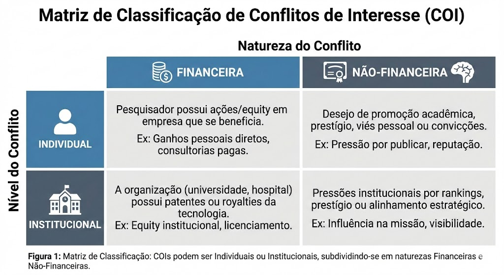
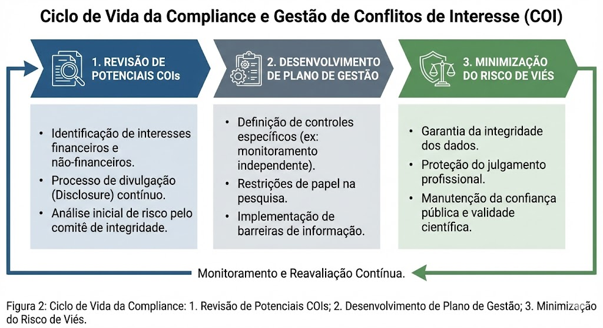

# Conflitos de Interesse na Pesquisa (COI)

**_Governança de Integridade, Transparência e Mitigação de Viés no CardioIA_**

Este documento estabelece a política de integridade do projeto CardioIA. Em um cenário onde a pesquisa acadêmica frequentemente se cruza com a inovação industrial (Start-ups, Patentes de IA), é imperativo gerenciar conflitos de interesse (COI) para evitar que considerações secundárias (ganho financeiro, prestígio) comprometam o julgamento profissional primário (segurança do paciente, validade dos dados).

---

## Taxonomia de Conflitos

O termo "Conflito de Interesse" refere-se a situações onde considerações financeiras ou pessoais podem comprometer, ou aparentar comprometer, a objetividade do pesquisador. Para fins de compliance, categorizamos os riscos em quatro quadrantes.

### Estrutura de Classificação
Não lidamos apenas com dinheiro. O viés pode surgir de pressões institucionais ou desejos de promoção acadêmica.

* **COI Individual:** Quando um pesquisador possui ações em uma empresa que se beneficiaria dos resultados do algoritmo.
* **COI Institucional (ICOI):** Quando a própria organização (ex: o laboratório ou hospital parceiro) possui patentes ou *equity* na tecnologia avaliada.

---

## Estratégia de Gestão e Mitigação

A existência de um COI não é intrinsecamente "má" (frequentemente é um subproduto da expertise), mas a falta de gestão é inaceitável. O CardioIA adota um pipeline proativo de governança.

### O Pipeline de Gestão
Para qualquer potencial conflito identificado (ex: um desenvolvedor do time está criando uma *spin-off* baseada no código), seguimos um fluxo rigoroso de três etapas.

### Controles de Gestão (`Management Plan`)
Se um COI for identificado, implementamos "controles" específicos para blindar a pesquisa:
* **Divulgação (Disclosure):** Informar explicitamente no Termo de Consentimento e nas publicações científicas sobre os interesses financeiros.
* **Monitoramento Independente:** Designar um revisor de dados externo para validar a integridade dos resultados brutos, garantindo que não houve manipulação para favorecer o algoritmo.
* **Restrição de Papéis:** Impedir que pesquisadores com conflitos financeiros participem do recrutamento ou consentimento de pacientes (evitando coerção).

---

## Marcos Regulatórios Federais (EUA)

Como o CardioIA visa padrões globais e utiliza dados americanos (MIMIC-IV), alinhamos nossa política com as regulações federais de transparência.

### Regulação PHS e NSF
Adotamos o conceito de **Interesse Financeiro Significativo (SFI)**.
* **Definição de SFI:** Remuneração ou *equity* que excede $5.000 (PHS) ou $10.000 (NSF) em entidades relacionadas à pesquisa nos 12 meses anteriores.
* **Obrigação:** Qualquer membro da equipe com SFI deve reportar à governança do projeto antes da submissão de propostas ou análise de dados.

### Regulação FDA
Para estudos que visam aprovação de dispositivos médicos (Software as a Medical Device - SaMD), a FDA exige certificação de ausência de interesses financeiros ou divulgação completa para garantir a integridade dos dados de marketing.

---

## Cenários Específicos do CardioIA

### Propriedade Intelectual e Start-ups
O desenvolvimento de algoritmos proprietários cria um terreno fértil para COIs.
* **Cenário:** Se um pesquisador do CardioIA fundar uma *start-up* para comercializar o modelo preditivo.
* **Ação:** Devemos implementar um plano de gestão que separe as atividades acadêmicas das atividades empresariais, prevenindo o uso de recursos do projeto (dados, alunos) para ganho privado exclusivo sem a devida licença.

### Conflito de Consciência
Reconhecemos também COIs não-financeiros, como convicções morais que podem impedir a análise objetiva de certos dados demográficos ou genéticos. A transparência é a chave para a alocação adequada de tarefas na equipe.

---

## Conclusão

A confiança pública na Inteligência Artificial em saúde é frágil. O CardioIA compromete-se a operar sob total transparência. Ao declararmos e gerenciarmos nossos conflitos, transformamos potenciais vulnerabilidades éticas em provas de robustez metodológica e integridade profissional.

---
*Documentação técnica baseada no módulo "Conflicts of Interest in Human Subjects Research" do CITI Program (Julie Moore, JD, MS, PA, CIP & Cristy McGoff, MA, CIP).*