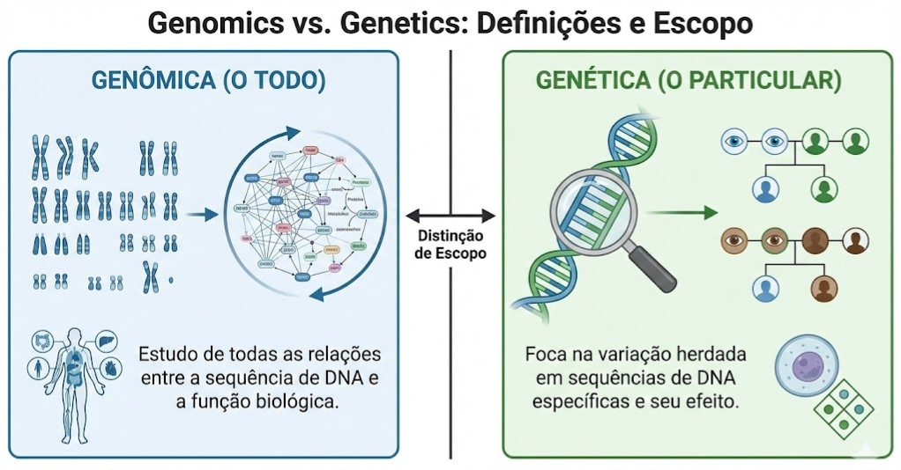
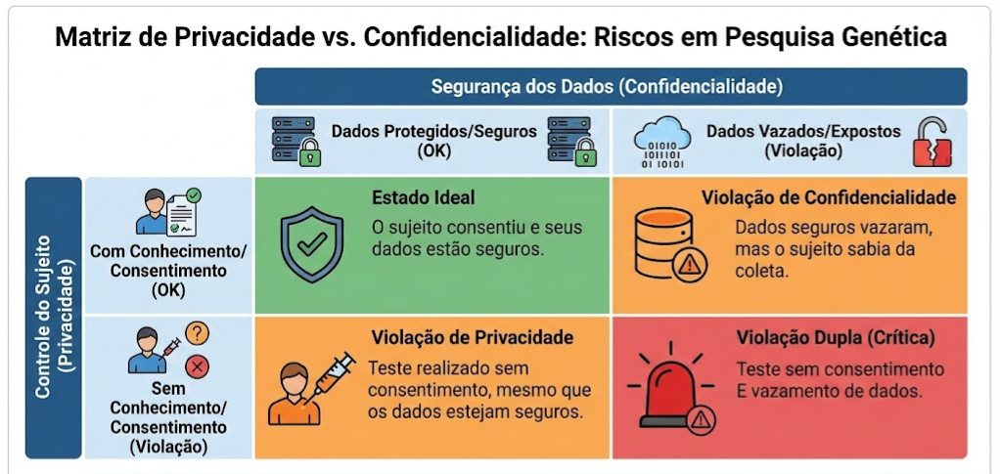
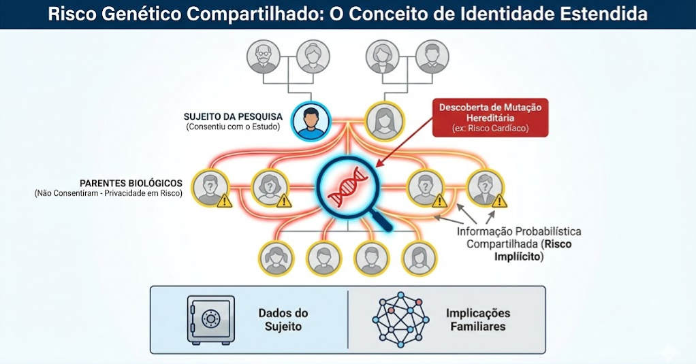
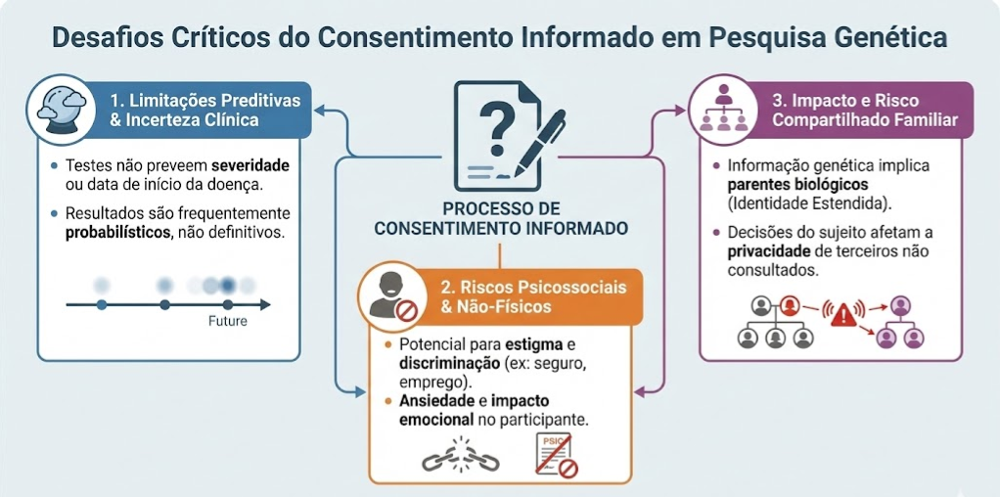
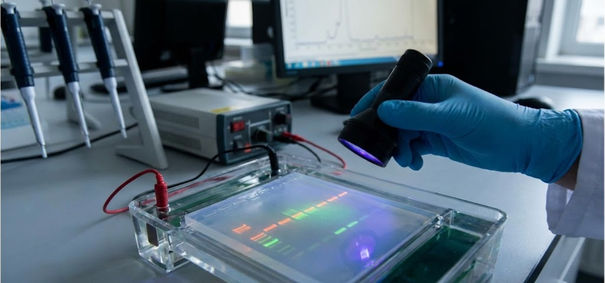
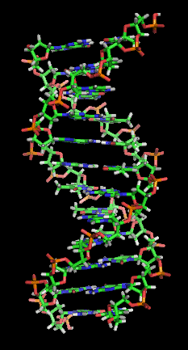
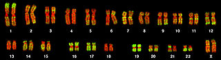

# Pesquisa Genética em Populações Humanas

**_Protocolos para Dados Genômicos e Privacidade Estendida no CardioIA_**

Este documento detalha os desafios éticos e regulatórios específicos da pesquisa genética. Embora o foco inicial do CardioIA seja em sinais vitais (MIMIC-IV), a integração futura de dados de biobancos ou marcadores genéticos exige uma governança especializada, dado que a informação genética é inerentemente identificável e familiar.

---

## Definições Fundamentais: Genômica vs. Genética

Para estruturar nossos dados corretamente, distinguimos dois campos que frequentemente são confundidos, mas possuem escopos diferentes.

### O Escopo da Análise
* **Genômica:** Refere-se ao estudo de todas as relações entre a sequência de DNA e a função biológica (o "todo").
* **Genética:** Foca na variação herdada em sequências de DNA específicas e seu efeito (o "particular").

*Figura 1: A distinção técnica entre Genômica (termo abrangente) e Genética (foco na hereditariedade e variação individual).*

**Relevância para CardioIA:** Modelos de *Pharmacogenomics* (como genes afetam a resposta a drogas cardíacas) exigem a análise de todo o genoma, aumentando exponencialmente a complexidade dos dados.

---

## Privacidade e Confidencialidade em Genética

A pesquisa genética desafia as noções tradicionais de privacidade. Diferente de um exame de sangue comum, o DNA carrega informações sobre terceiros não envolvidos na pesquisa.

### A Diferença Conceitual
Não usamos os termos de forma intercambiável.
* **Confidencialidade:** Proteção dos dados já coletados (segurança do banco de dados).
* **Privacidade:** Controle do indivíduo sobre o acesso ao seu corpo e informações.

*Figura 2: Uma violação de confidencialidade ocorre se dados seguros vazam. Uma violação de privacidade ocorre se testamos um paciente sem seu conhecimento.*

### O Risco Compartilhado ("Shared Risk")
A informação genética é única porque se aplica a mais de uma pessoa. Se descobrimos uma mutação cardíaca hereditária em um sujeito, sabemos probabilisticamente sobre seus pais, irmãos e filhos.

*Figura 3: O conceito de "Identidade Estendida": A informação genética coloca em risco a privacidade de parentes biológicos que nunca consentiram em participar da pesquisa.*

---

## Desafios do Consentimento Informado

Obter consentimento válido para pesquisa genética é notoriamente difícil devido à complexidade dos dados e às implicações futuras desconhecidas.

### Limitações e Incertezas
O processo de consentimento deve ser transparente sobre o que a pesquisa **não** pode garantir.
* **Incerteza Clínica:** Testes genéticos muitas vezes não podem prever a severidade ou a data de início de uma doença.
* **Riscos Psicossociais:** O maior risco geralmente não é físico, mas sim estigma, discriminação (seguro/emprego) e ansiedade familiar.

*Figura 4: Elementos críticos do consentimento genético: Explicar limitações preditivas, riscos não-físicos e impacto em familiares.*

**Estratégia CardioIA:** Se utilizarmos dados do *dbGaP* (NIH), seguiremos a política de "Broad Consent" (Consentimento Amplo) para uso secundário, garantindo que os sujeitos originais concordaram com o compartilhamento de dados genômicos.

---

## A Natureza dos Dados Biológicos

A transição de amostras biológicas físicas para dados digitais é o cerne da bioinformática moderna.

### Do Laboratório ao Servidor
O que começa como uma amostra física em um gel de eletroforese (Figura 5) é digitalizado em sequências de bases (A, C, T, G).

*Figura 5: A materialidade da pesquisa genética: Amostras físicas que geram os dados digitais processados pelos nossos algoritmos.*

### Estruturas Moleculares
A compreensão da estrutura básica (Cromossomos e DNA) é vital para a engenharia de *features* em modelos de ML.

| Nível | Imagem | Descrição |
| :--- | :---: | :--- |
| **Micro** |  | **Dupla Hélice:** A base do código. Variações aqui (SNPs) são o foco de estudos de associação (GWAS). |
| **Macro** | | **Cariótipo:** Visualização cromossômica. Anomalias estruturais grandes podem ser detectadas por visão computacional. |

---

## Conclusão e Governança GINA

O CardioIA reconhece a **Genetic Information Nondiscrimination Act (GINA)** de 2008 como a lei suprema de proteção contra discriminação genética nos EUA. Nossos protocolos de segurança são desenhados para impedir a re-identificação que poderia expor sujeitos a riscos de empregabilidade ou securitários, mantendo a integridade ética da pesquisa genômica populacional.

---
*Documentação técnica baseada no módulo "Genetic Research in Human Populations" do CITI Program (Jeffrey R. Botkin, MD, MPH).*