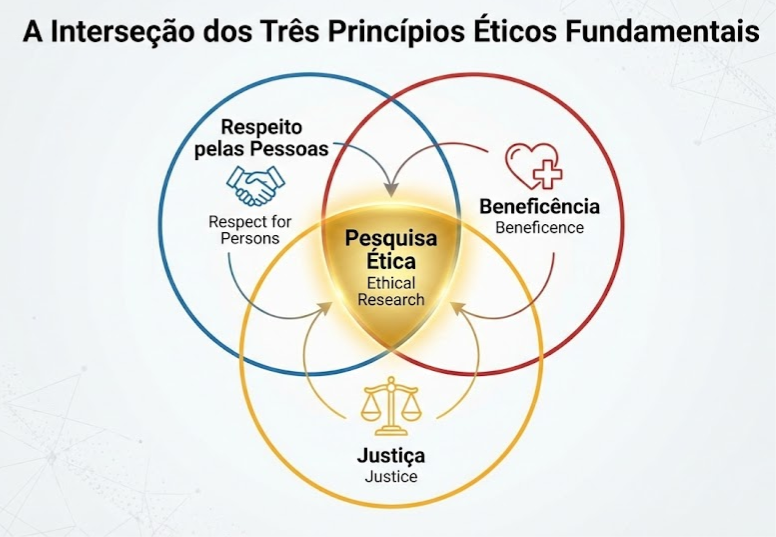
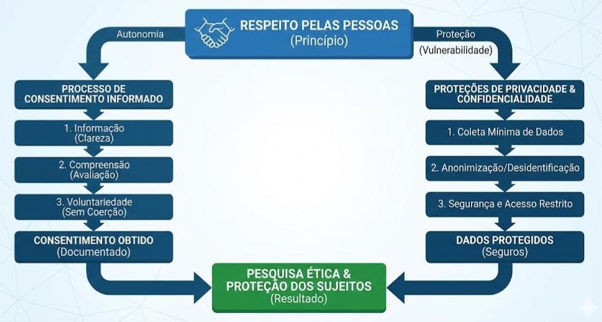
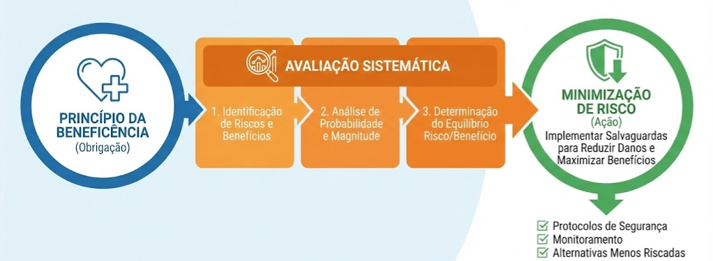
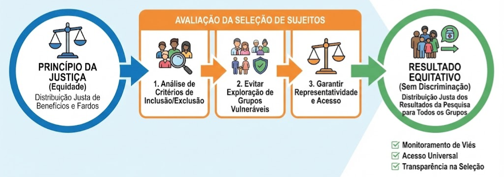

# História e Ética na Pesquisa com Seres Humanos

**_Fundamentos Regulatórios e Lições Históricas para o Projeto CardioIA_**

Este documento detalha o contexto histórico e a evolução das regulamentações que governam a pesquisa envolvendo seres humanos. Ele complementa os princípios do Relatório Belmont, fornecendo a base legal e moral necessária para justificar a governança de dados e as escolhas de design no projeto CardioIA.

---

## A Evolução da Preocupação Ética

A ética na pesquisa moderna não surgiu no vácuo; ela é uma resposta direta a tragédias onde a busca pelo conhecimento científico atropelou os direitos humanos. Para um Cientista de Dados Sênior, conhecer essa história é vital para evitar a repetição de erros do passado, mesmo que em um contexto digital.

### Marcos Históricos de Abuso
* **Nuremberg (1947):** Médicos nazistas realizaram experimentos brutais em prisioneiros sem consentimento. O julgamento resultou no **Código de Nuremberg**, que estabeleceu o **consentimento voluntário** como requisito absoluto.
* **Estudo de Sífilis de Tuskegee (1932-1972):** O Serviço de Saúde Pública dos EUA (PHS) estudou a evolução da sífilis não tratada em 600 homens negros rurais, ocultando deles o diagnóstico e negando tratamento (penicilina) mesmo após sua descoberta. Este caso é o exemplo clássico de violação de **Justiça** e **Respeito**.
* **Willowbrook & Jewish Chronic Disease Hospital:** Casos onde crianças com deficiência e idosos debilitados foram deliberadamente infectados com doenças (hepatite, células cancerígenas) para estudo, explorando sua vulnerabilidade.

### A Resposta Regulatória
Em resposta a esses abusos, o Congresso dos EUA aprovou o **National Research Act (1974)**, que criou a Comissão Nacional responsável pelo Relatório Belmont e exigiu a criação de **IRBs (Institutional Review Boards)**.

---

## O Framework Ético Central

O Relatório Belmont identificou três princípios básicos relevantes para a conduta ética na pesquisa envolvendo seres humanos. Esses princípios fornecem a estrutura analítica para resolver problemas éticos decorrentes da pesquisa.

*Figura 1: A interseção dos três princípios éticos fundamentais: Respeito pelas Pessoas, Beneficência e Justiça.*

### Respeito pelas Pessoas (`Respect for Persons`)
Este princípio incorpora duas convicções éticas: que os indivíduos devem ser tratados como agentes autônomos e que as pessoas com autonomia diminuída têm direito à proteção.

**Aplicação: Consentimento Informado & Privacidade**
O respeito pelas pessoas exige que os sujeitos tenham a oportunidade de escolher o que acontecerá ou não com eles. Esse processo envolve informação, compreensão e voluntariedade. Além disso, estende-se ao respeito pela privacidade dos indivíduos e à confidencialidade de seus dados.

*Figura 2: O fluxo operacional do Respeito pelas Pessoas, levando ao Consentimento Informado e proteções de Privacidade.*

### Beneficência (`Beneficence`)
A beneficência é entendida aqui como uma obrigação. Duas regras gerais foram formuladas como expressões complementares de ações beneficentes: (1) não causar danos e (2) maximizar possíveis benefícios e minimizar possíveis danos.

**Aplicação: Avaliação de Riscos/Benefícios**
Para garantir a beneficência, os pesquisadores devem avaliar sistematicamente os riscos e benefícios. Isso envolve um levantamento cuidadoso de dados para determinar se os riscos são razoáveis em relação aos benefícios previstos.

*Figura 3: O pipeline da Beneficência: Do princípio para a Avaliação Sistemática e, finalmente, a Minimização de Risco.*

### Justiça (`Justice`)
A justiça aborda a questão de quem deve receber os benefícios da pesquisa e suportar seus fardos. Uma injustiça ocorre quando algum benefício a que uma pessoa tem direito é negado sem um bom motivo ou quando algum fardo é imposto indevidamente.

**Aplicação: Seleção de Sujeitos**
A justiça exige que a seleção dos sujeitos seja examinada para determinar se algumas classes (por exemplo, pacientes assistidos pelo bem-estar social, minorias raciais e étnicas específicas ou pessoas confinadas em instituições) estão sendo selecionadas sistematicamente apenas por causa de sua fácil disponibilidade, sua posição comprometida ou sua manipulabilidade.

*Figura 4: O pipeline da Justiça: Garantindo a Seleção equitativa de Sujeitos com base em quem recebe os benefícios e fardos da pesquisa.*

---

## Estrutura Regulatória Atual (EUA e Internacional)

O projeto CardioIA, ao utilizar dados internacionais (MIMIC-IV, PhysioNet), deve estar em conformidade com as seguintes normas:

### O "Common Rule" (45 CFR 46)
A **Política Federal para a Proteção de Sujeitos Humanos** (1991, rev. 2018) é a base legal para quase toda pesquisa financiada federalmente nos EUA.
* **Subpartes Relevantes:**
    * **Subparte B:** Proteção para mulheres grávidas e fetos (relevante se usarmos dados obstétricos do MIMIC).
    * **Subparte D:** Proteção para crianças (relevante para análise de cardiopatias congênitas).

### Padrões Internacionais
* **Declaração de Helsinki (WMA):** Padrão ético global para pesquisa biomédica, enfatizando que o bem-estar do sujeito deve prevalecer sobre os interesses da ciência e da sociedade.
* **Diretrizes ICH-GCP (E6):** Padrão de "Boas Práticas Clínicas" harmonizado entre EUA, Europa e Japão. Define responsabilidades claras para garantir a qualidade dos dados e a proteção dos sujeitos.

---

## Aplicação no CardioIA: Do Passado ao Futuro

Como aplicamos essas lições de 1947 ou 1972 em um projeto de IA de 2026?

### O Consentimento na Era do Big Data
O Código de Nuremberg exigia consentimento para experimentos físicos. Hoje, o desafio é o **consentimento para o uso secundário de dados**.
* **Estratégia CardioIA:** Utilizamos apenas datasets (MIMIC-IV, PPG-DaLiA) onde o consentimento original permitia o compartilhamento de dados anonimizados para pesquisa futura, ou onde o requisito de consentimento foi dispensado por um IRB devido ao risco mínimo e à desidentificação robusta.

### Justiça Algorítmica (Evitando um "Tuskegee Digital")
O estudo de Tuskegee explorou uma população vulnerável (homens negros pobres). Um modelo de IA mal treinado pode perpetuar essa injustiça se:
* For treinado apenas com dados de populações majoritárias (viés de representação).
* Tiver performance pior em grupos minoritários, levando a diagnósticos errados desproporcionais.
* **Ação:** Monitoraremos a distribuição demográfica dos nossos dados de treino para garantir equidade, honrando o princípio da Justiça (Figura 4).

### HRPP (Human Research Protections Program)
Entendemos que a conformidade ética não é apenas uma "assinatura em um papel", mas um sistema. O desenvolvimento do CardioIA segue a lógica de um HRPP, integrando:
* Revisão ética contínua.
* Educação da equipe (Certificação CITI).
* Transparência nos métodos de coleta e processamento.

---

## Conclusão

A coleta de dados que estamos realizando não é apenas um exercício técnico de "download", mas um ato de responsabilidade. Ao escolhermos fontes como o **PhysioNet** (que exige credenciamento CITI), demonstramos que nosso projeto prioriza a **integridade ética** acima da conveniência. Estamos construindo não apenas um modelo preditivo, mas uma ferramenta de saúde confiável e alinhada com os mais altos padrões históricos de proteção humana.

---
*Documento elaborado com base no módulo "History and Ethics of Human Subjects Research" do CITI Program (Jeffrey M. Cohen, PhD).*
