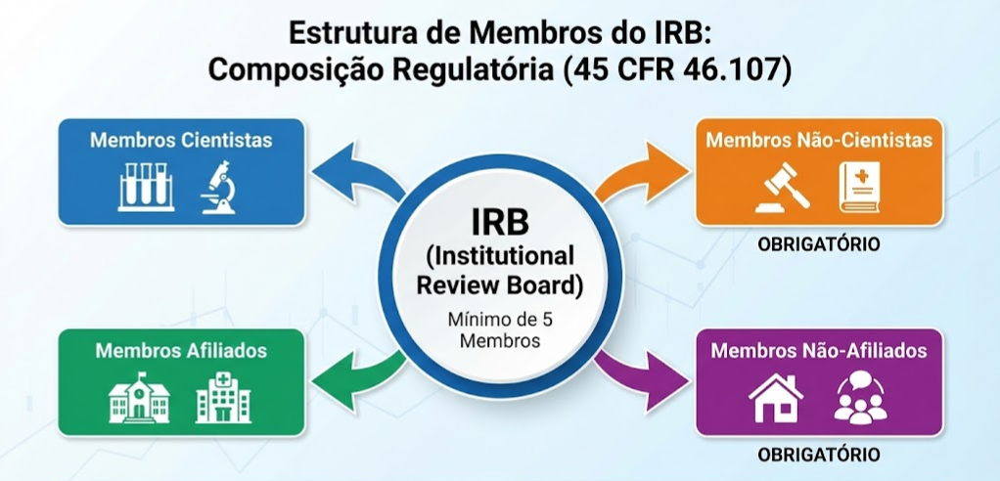
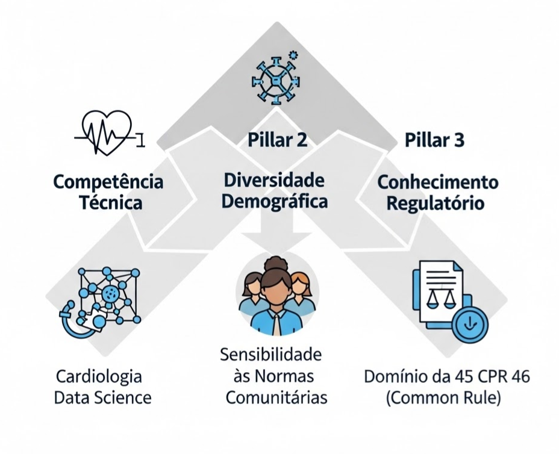
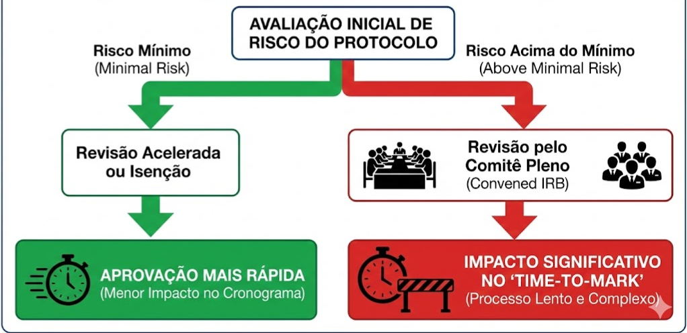
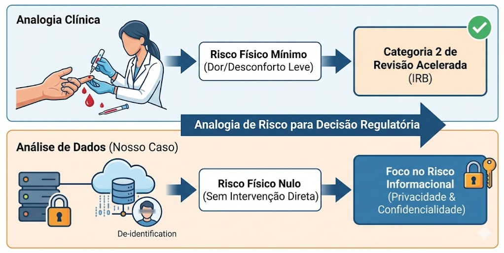
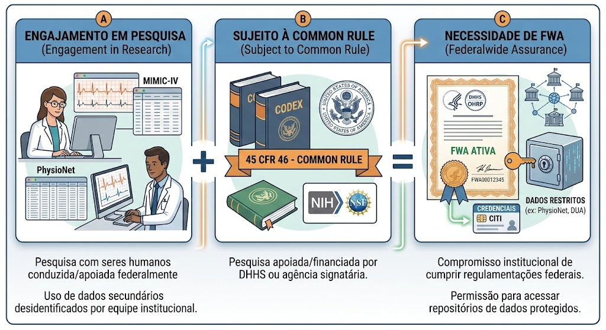
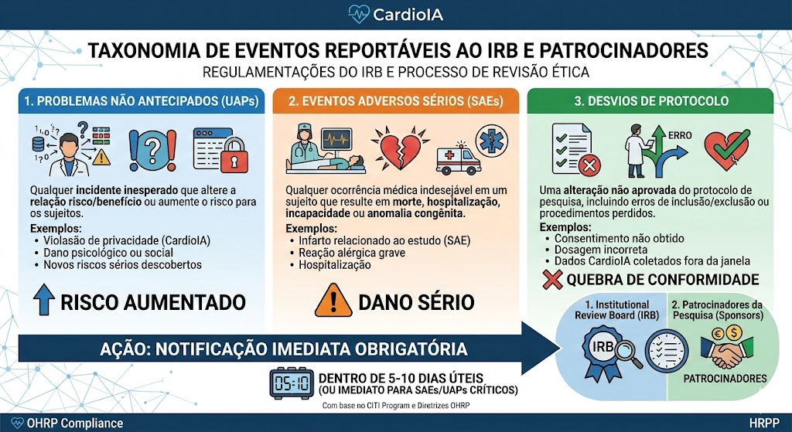
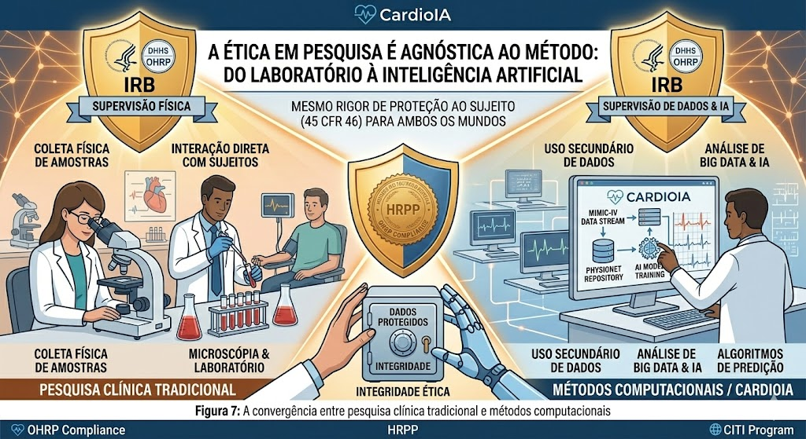

# Regulamentações do IRB e Processo de Revisão Ética

**_Estrutura de Governança, Classificação de Risco e Estratégias de Conformidade para o Projeto CardioIA_**

Este documento técnico formaliza o entendimento da equipe de pesquisa sobre o papel do **Institutional Review Board (IRB)** e as regulamentações federais (45 CFR 46 - Common Rule) que regem o desenvolvimento de algoritmos de Inteligência Artificial em saúde. O objetivo é definir a estratégia de conformidade para a utilização de dados secundários (MIMIC-IV, PhysioNet) e mitigar riscos regulatórios.

---

## Arquitetura e Competência do IRB

O IRB atua como a autoridade deliberativa primária para a aprovação, monitoramento e revisão de pesquisas biomédicas e comportamentais envolvendo seres humanos. Sua função transcende a burocracia, servindo como um *gatekeeper* ético mandatório para qualquer estudo financiado ou regulado federalmente.

### Composição Multidisciplinar
Para garantir uma avaliação técnica e ética robusta, a regulação exige que o comitê não seja composto apenas por pares científicos. A diversidade de perspectivas é um requisito legal para evitar vieses institucionais.

*Figura 1: Requisitos regulatórios de composição (45 CFR 46.107): A presença de membros não-cientistas e não-afiliados é obrigatória para garantir a imparcialidade do processo.*

### Qualificação e Expertise
A validação de um protocolo de pesquisa exige que os revisores possuam competência específica na área de estudo (neste caso, Cardiologia e Ciência de Dados), além de sensibilidade às normas comunitárias.

*Figura 2: Matriz de qualificação para aprovação de protocolos: Competência Técnica, Diversidade Demográfica e Conhecimento Regulatório.*

---

## Estratégia de Classificação de Protocolo

A determinação do caminho regulatório (Review Pathway) é crítica para o cronograma do projeto. A classificação depende estritamente do nível de risco imposto aos titulares dos dados.

### O Limiar de Risco Mínimo (`Minimal Risk`)
O conceito de "Risco Mínimo" é o divisor de águas. Ve a probabilidade e a magnitude do dano antecipado não forem maiores do que aqueles encontrados na vida cotidiana ou em exames físicos de rotina, o estudo pode qualificar-se para revisão acelerada ou isenção.

*Figura 3: Fluxo de decisão: Protocolos que excedem o risco mínimo exigem revisão pelo comitê pleno (Convened IRB), o que impacta significativamente o *time-to-market* da pesquisa.*

### Precedentes para Isenção/Aceleração
No contexto do CardioIA, a utilização de dados secundários anonimizados ou procedimentos não invasivos (como coleta de sinais vitais) estabelece um perfil de baixo risco.

*Figura 4: Analogia clínica: A coleta de sangue capilar é classificada como risco mínimo (Categoria 2 de Revisão Acelerada). A análise de dados secundários desidentificados (nosso caso) possui risco físico nulo, focando apenas no risco informacional.*

**Determinação do Projeto:**
O CardioIA opera sob a premissa de **Pesquisa Isenta (Exempt Research - Categoria 4)**, dado o uso de dados secundários existentes e publicamente disponíveis ou desidentificados, onde a identidade dos sujeitos não pode ser prontamente verificada.

---

## Engajamento Institucional e FWA

Para conduzir pesquisa de nível federal, a instituição executora deve possuir uma *Federalwide Assurance* (FWA) ativa. Isso formaliza o compromisso da entidade em cumprir os termos da Common Rule.

*Figura 5: Lógica de Engajamento Regulatório: "Engajamento em Pesquisa" + "Sujeito à Common Rule" = "Necessidade de FWA".*

**Status de Conformidade:**
Ao acessarmos repositórios como o PhysioNet (MIT Laboratory for Computational Physiology), operamos sob a extensão da FWA do MIT através de *Data Use Agreements* (DUAs). A violação desses termos constitui não apenas quebra de contrato, mas infração federal.

---

## Protocolos de Vigilância e Reporte de Eventos

A aprovação ou isenção inicial do IRB não encerra a responsabilidade do Investigador Principal (PI). A vigilância contínua é mandatória para identificar desvios.

### Eventos Reportáveis (`Reportable Events`)
Qualquer ocorrência que altere o perfil de risco do estudo deve ser comunicada imediatamente. No contexto de Data Science, isso inclui re-identificação acidental de sujeitos ou vazamento de datasets restritos.

*Figura 6: Taxonomia de eventos críticos: Problemas Não Antecipados (UAPs), Eventos Adversos Sérios (SAEs) e Desvios de Protocolo exigem notificação imediata ao IRB e aos patrocinadores.*

---

## Conclusão: Da Bancada ao Algoritmo

A ética em pesquisa é agnóstica ao método. Seja na análise microscópica de tecidos ou no processamento massivo de vetores de dados, os princípios de proteção ao sujeito permanecem inalterados.

*Figura 7: A convergência entre pesquisa clínica tradicional e métodos computacionais exige o mesmo rigor de supervisão ética.*

A estratégia regulatória do CardioIA prioriza a **minimização de riscos** através do uso estrito de dados desidentificados e conformidade com os padrões de interoperabilidade e segurança, garantindo a viabilidade ética e legal da solução desenvolvida.

---
*Documentação técnica baseada nas diretrizes do Office for Human Research Protections (OHRP) e módulos de treinamento CITI Program.*