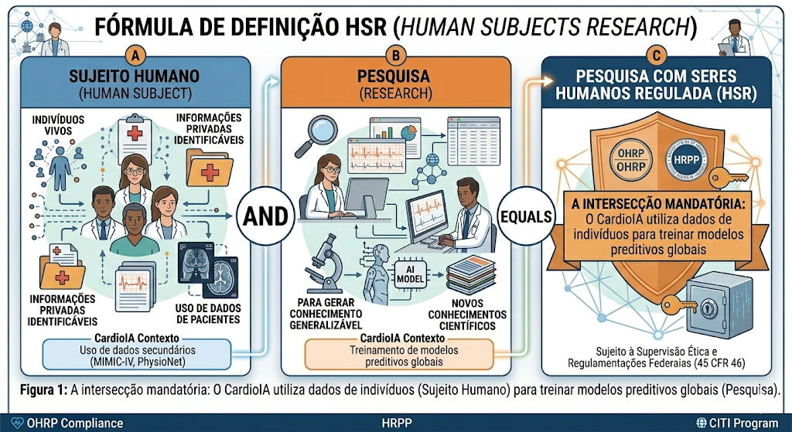
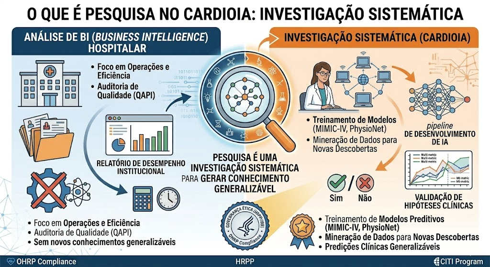
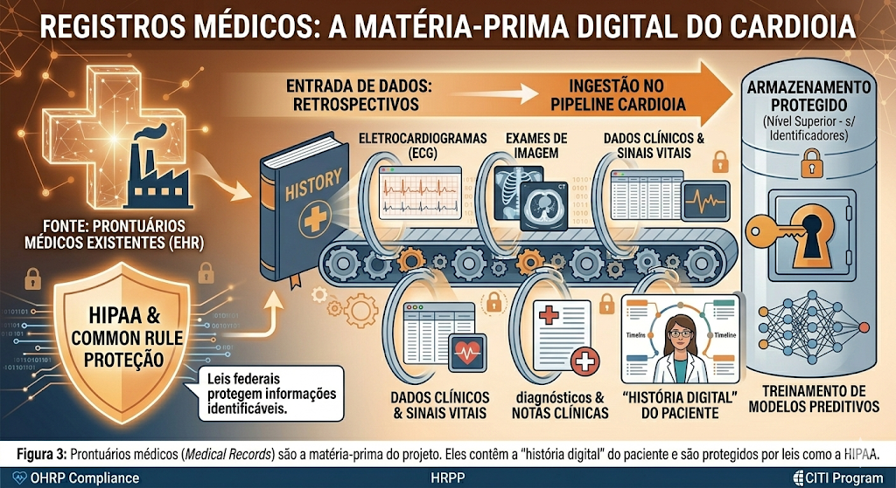
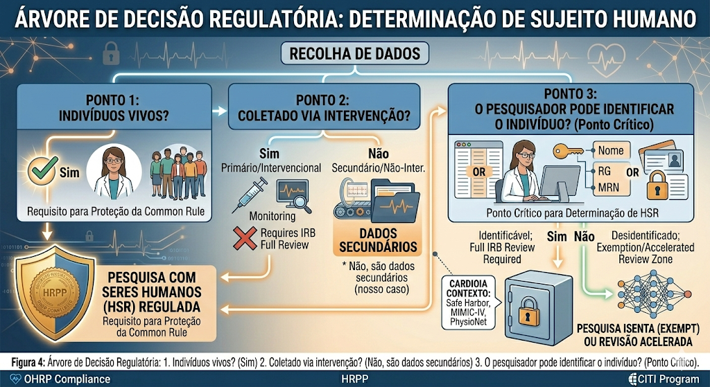
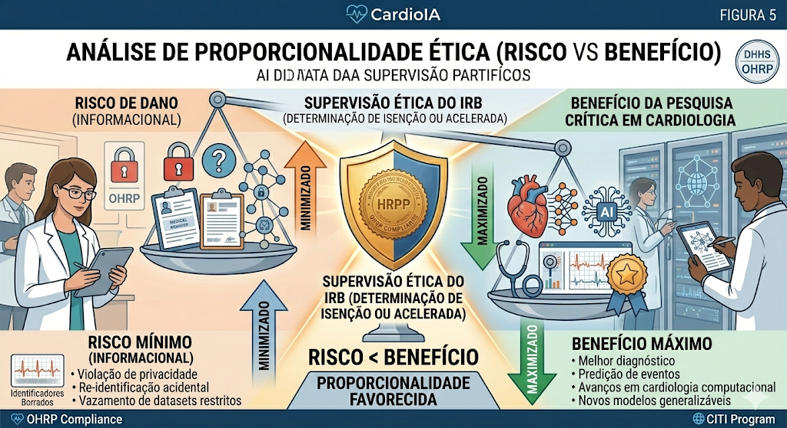
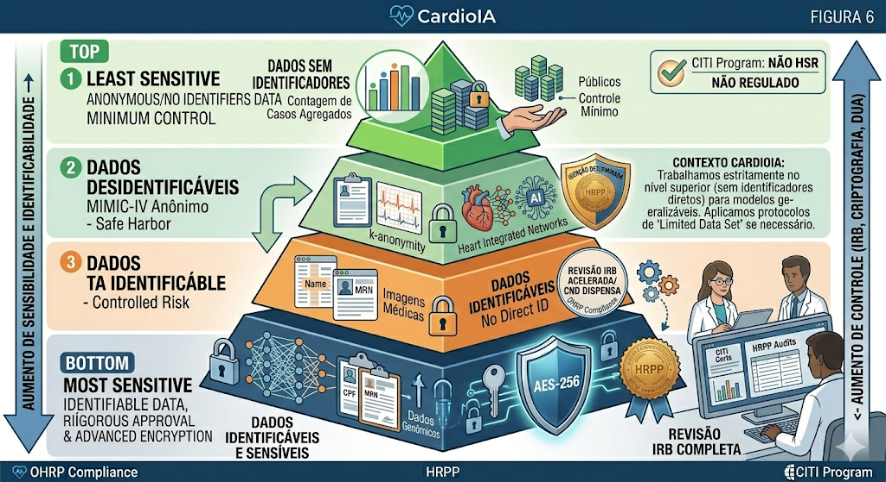
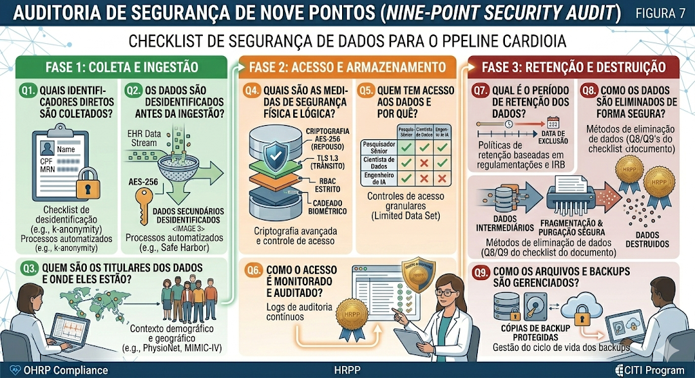
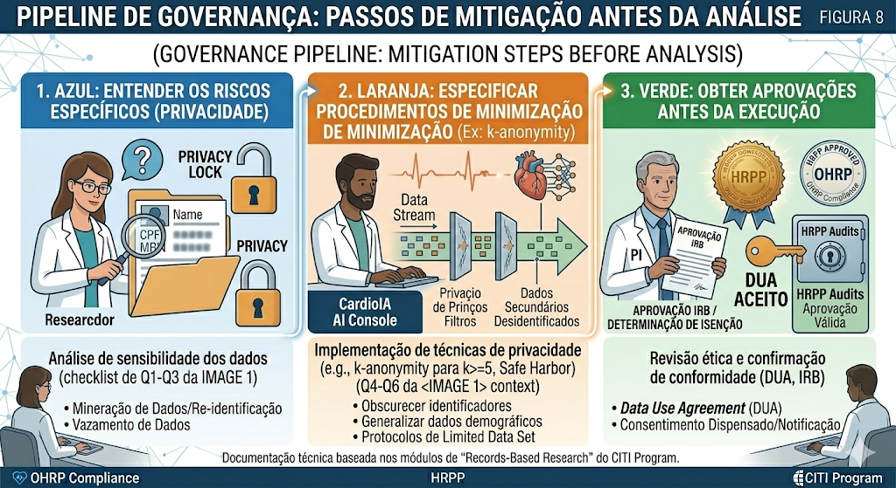

# Pesquisa Baseada em Registros (Records-Based Research)

**_Protocolos de Governança para Manipulação de Dados Secundários em Saúde_**

Este documento define a estratégia de conformidade do projeto CardioIA para a utilização de "Registros Existentes" (*Existing Records*). Diferente de ensaios clínicos intervencionais, nossa abordagem foca na análise computacional de dados retrospectivos. Aqui, estabelecemos os critérios para determinar o status dos dados e os controles de segurança necessários.

---

## Definição e Escopo Regulatório

Para enquadrar o CardioIA corretamente perante os órgãos reguladores (OHRP/FDA), devemos primeiro validar se nossa atividade constitui "Pesquisa com Seres Humanos".

### A Equação Regulatória
A regulação federal define uma fórmula simples para essa classificação. Se o projeto combina intervenção/interação com indivíduos vivos OU o uso de informações privadas identificáveis para gerar conhecimento generalizável, ele é regulado.

*Figura 1: A intersecção mandatória: O CardioIA utiliza dados de indivíduos (Sujeito Humano) para treinar modelos preditivos globais (Pesquisa).*

### O Foco na "Pesquisa"
Não estamos apenas fazendo uma auditoria de qualidade; estamos buscando novos conhecimentos científicos.

*Figura 2: A investigação sistemática para provar hipóteses é o que diferencia o CardioIA de uma simples análise de BI (Business Intelligence) hospitalar.*

---

## Natureza dos Dados e Determinação de Sujeito

O CardioIA utiliza bases de dados massivas como o MIMIC-IV. A natureza desses registros dita o nível de proteção exigido.

### A Fonte da Verdade (Source Data)
Nossos dados provêm de prontuários eletrônicos (EHRs), contendo histórico clínico, sinais vitais e exames de imagem.

*Figura 3: Prontuários médicos (Medical Records) são a matéria-prima do projeto. Eles contêm a "história digital" do paciente e são protegidos por leis como a HIPAA.*

### O Teste de Três Pontos
Para determinar se a proteção de sujeito humano se aplica integralmente, submetemos nossos datasets ao seguinte crivo lógico:

*Figura 4: Árvore de Decisão Regulatória: 1. Indivíduos vivos? (Sim) 2. Coletado via intervenção? (Não, são dados secundários) 3. O pesquisador pode identificar o indivíduo? (Ponto Crítico).*

**Determinação do Projeto:** Como utilizamos dados do PhysioNet onde a identidade **não** pode ser prontamente verificada pelo pesquisador (devido à desidentificação prévia e *Safe Harbor*), operamos em uma zona de risco controlado, muitas vezes elegível para isenção.

---

## Matriz de Risco vs. Benefício

Em *Records-Based Research*, o risco não é físico (o paciente não vai sofrer um efeito colateral de remédio), mas sim informacional (violação de privacidade).

### A Balança Ética
O IRB avalia se o valor científico do algoritmo supera o risco potencial de vazamento de dados.

*Figura 5: Análise de Proporcionalidade: O risco de dano (informacional) deve ser mínimo comparado ao benefício de responder questões de pesquisa críticas sobre cardiologia.*

### Níveis de Sensibilidade
A classificação da informação dita os controles de segurança.

*Figura 6: Hierarquia de Dados: Dados sem identificadores (topo) exigem menos controle. Dados identificáveis E sensíveis (fundo) exigem aprovação rigorosa do IRB e criptografia avançada.*

**Estratégia CardioIA:** Trabalhamos estritamente no nível superior (sem identificadores diretos). Caso seja necessário cruzar dados que potencializem re-identificação, aplicaremos protocolos de *Limited Data Set*.

---

## Arquitetura de Segurança e Privacidade

Para garantir a integridade da pesquisa baseada em registros, implementamos um ciclo de vida de segurança de dados robusto.

### Checklist de Segurança de Dados
Adotamos um questionário de 9 pontos para cada dataset ingerido no pipeline.

*Figura 7: O "Nine-Point Security Audit": Cobre desde a coleta (quais identificadores?), passando pelo acesso (quem vê?), até a destruição (como apagar?).*

**Implementação Técnica:**
* **Criptografia (Q4/Q8):** Dados em repouso (AES-256) e em trânsito (TLS 1.3).
* **Controle de Acesso (Q2/Q5):** RBAC (Role-Based Access Control) estrito. Apenas pesquisadores com certificado CITI têm acesso às chaves de descriptografia.
* **Retenção (Q7/Q9):** Dados intermediários são purgados após a validação do modelo.

### Fluxo de Mitigação
Antes de iniciar qualquer análise, seguimos três passos mandatórios:

*Figura 8: Pipeline de Governança: 1. Entender os riscos específicos (Privacidade); 2. Especificar procedimentos de minimização (Ex: k-anonymity); 3. Obter aprovações antes da execução.*

---

## Conclusão

A pesquisa baseada em registros oferece um potencial imenso para a Cardiologia Computacional sem expor pacientes a riscos físicos. No entanto, ela transfere a responsabilidade ética para a **gestão de dados**. O CardioIA demonstra maturidade sênior ao tratar cada linha de registro médico não como um simples *data point*, mas como uma extensão digital de um ser humano, protegida por camadas rigorosas de criptografia, governança e ética.

---
*Documentação técnica baseada nos módulos de "Records-Based Research" do CITI Program.*