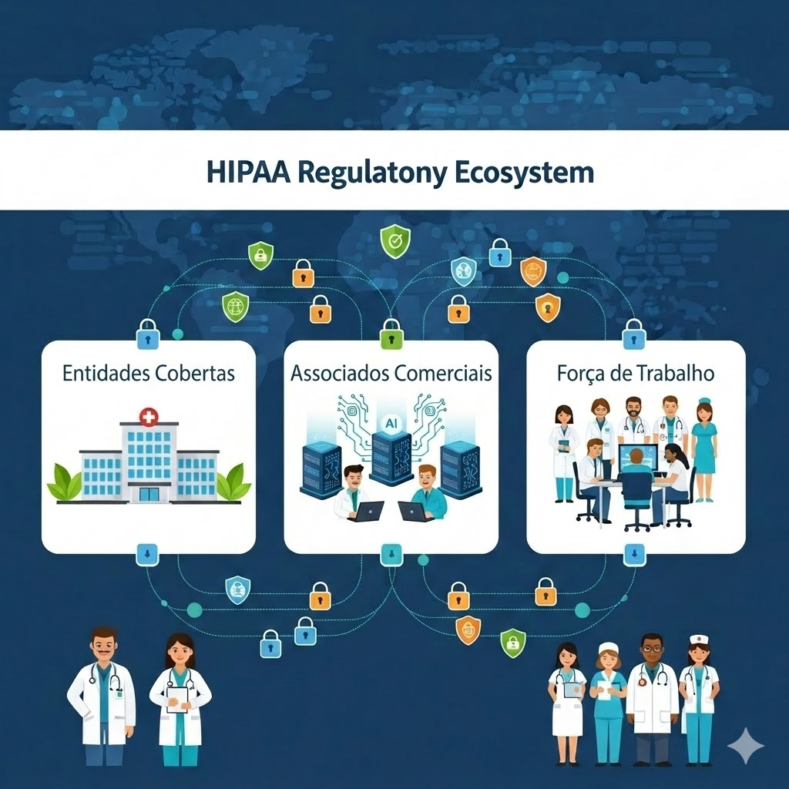
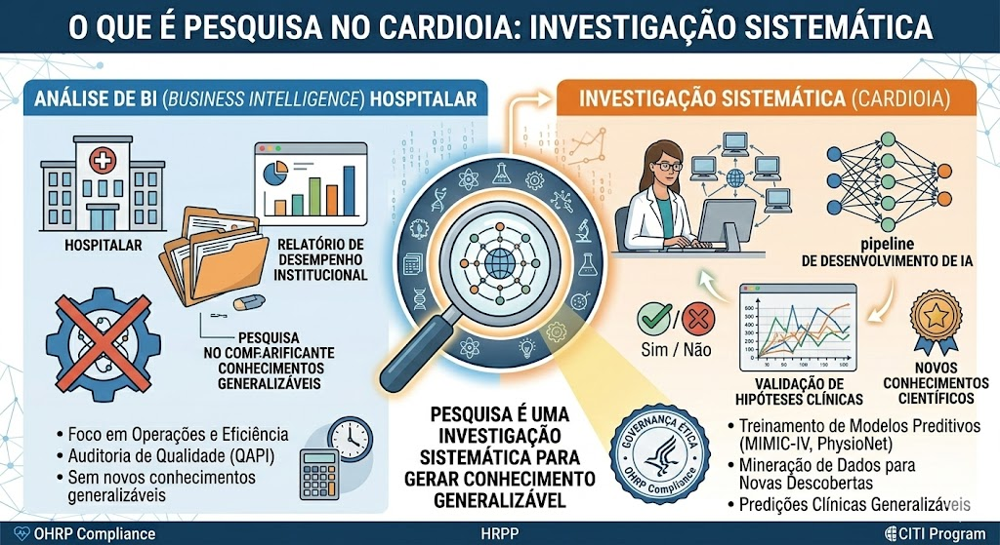
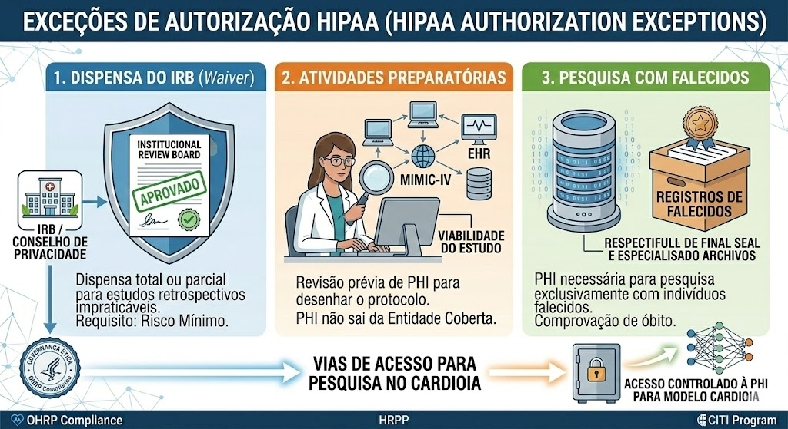
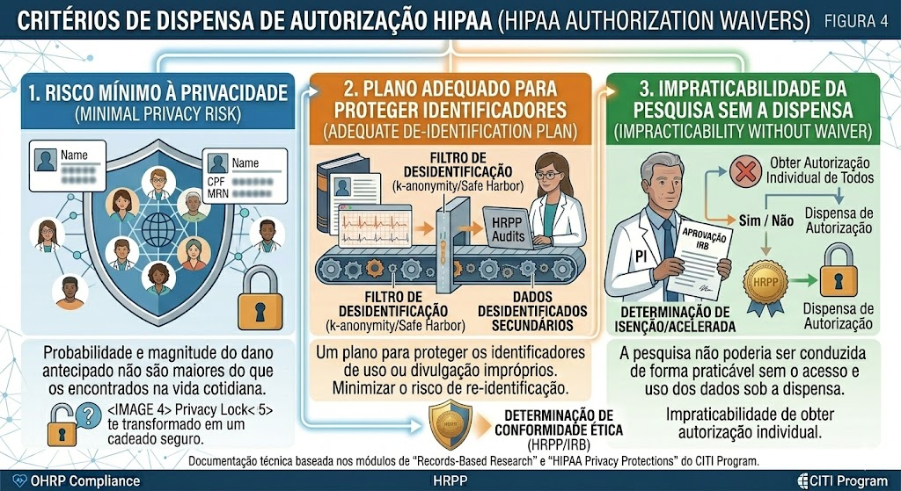
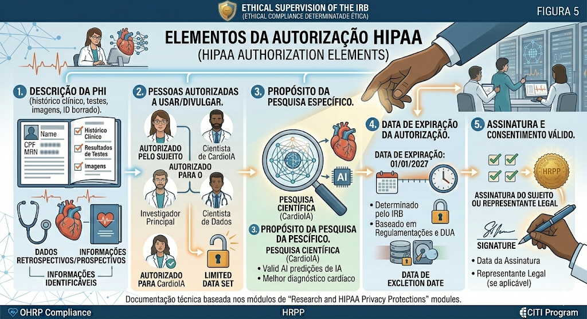
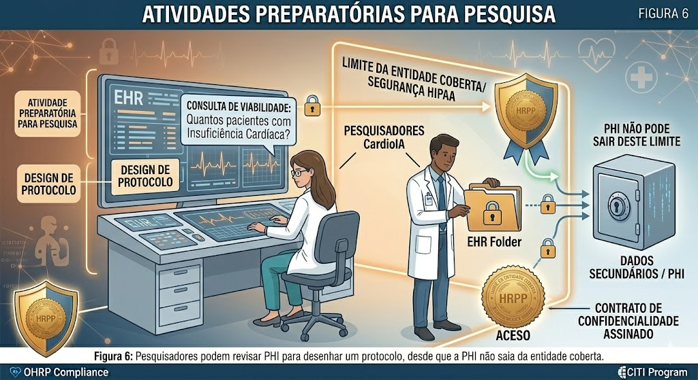
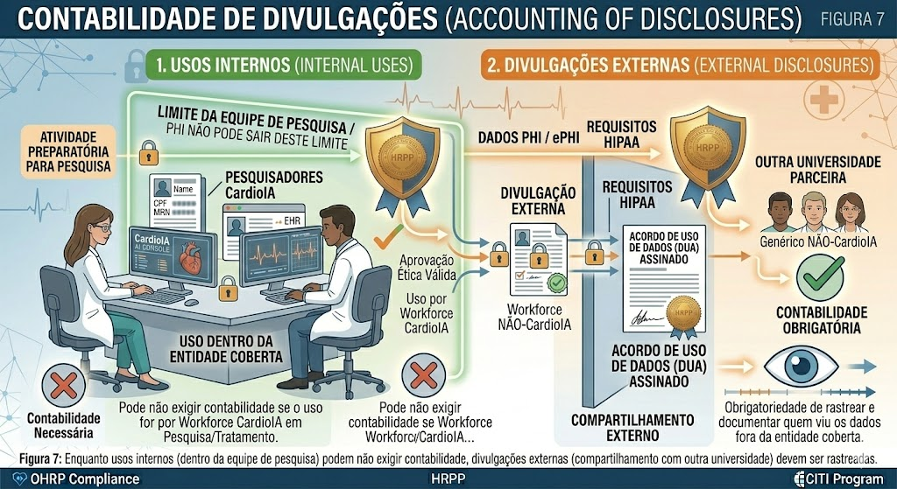
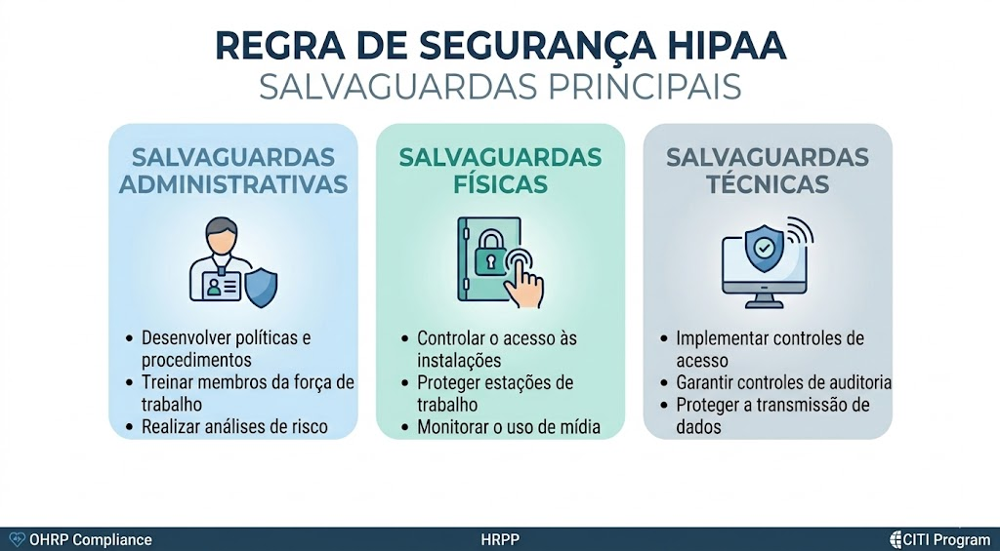

# Pesquisa e Proteções de Privacidade HIPAA

**_Padrões de Proteção de Dados e Estratégia de Conformidade para o CardioIA_**

Este documento define a estratégia de conformidade do projeto CardioIA em relação ao **Health Insurance Portability and Accountability Act (HIPAA)**. Como nosso projeto processa dados de saúde que podem se originar de "Entidades Cobertas" (hospitais, provedores), devemos aderir rigorosamente à *Privacy Rule* (Regra de Privacidade) e à *Security Rule* (Regra de Segurança) para garantir a confidencialidade e integridade das Informações de Saúde Protegidas (PHI).

---

## Escopo Regulatório e Aplicabilidade

As proteções da HIPAA não se aplicam a todos os dados de saúde, mas especificamente às **Informações de Saúde Protegidas (PHI)** criadas ou mantidas por **Entidades Cobertas**.

### O Ecossistema de Cobertura
A regulação impacta a interseção de entidades específicas e tipos de dados específicos.
* **Entidades Cobertas (*Covered Entities*):** Provedores de saúde, planos de saúde e *clearinghouses*.
* **PHI:** Informação de saúde individualmente identificável transmitida ou mantida em qualquer forma.

*Figura 1: O ecossistema de conformidade envolvendo Entidades Cobertas, Associados Comerciais (Business Associates) e membros da Força de Trabalho.*

**Relevância para o CardioIA:** Embora o CardioIA seja um projeto acadêmico/pesquisa, ao utilizarmos dados de um hospital parceiro ou plataforma como o PhysioNet (que atua sob a égide de Entidades Cobertas), atuamos como um **Business Associate** ou recebemos dados sob um Acordo de Uso de Dados, acionando obrigações da HIPAA.

### Definindo "Pesquisa" sob a HIPAA
A HIPAA adota a definição de pesquisa da *Common Rule*: uma investigação sistemática desenhada para contribuir para o conhecimento generalizável.

*Figura 2: Atividades como Melhoria de Qualidade (QI) podem ser excluídas, mas o objetivo do CardioIA de desenvolver algoritmos preditivos classifica-se estritamente como **Pesquisa**.*

---

## Vias de Acesso aos Dados

A HIPAA geralmente exige autorização individual para acessar PHI. No entanto, para ciência de dados e análise retrospectiva em larga escala, dependemos de exceções específicas.

### Exceções de Autorização
Não precisamos obter consentimento por escrito de cada paciente no banco de dados MIMIC-IV se atendermos a critérios específicos.

*Figura 3: As três vias principais para contornar a autorização individual: 1. Dispensa do IRB (Waiver); 2. Atividades Preparatórias; 3. Pesquisa com Falecidos.*

### Dispensa de Autorização (`Waiver`)
Para estudos retrospectivos onde obter consentimento é impraticável, um IRB ou Conselho de Privacidade pode dispensar a exigência.

*Figura 4: Critérios para Dispensa: Risco mínimo à privacidade, plano adequado para proteger identificadores e impraticabilidade da pesquisa sem a dispensa.*

**Estratégia CardioIA:** Utilizamos principalmente **Dados Desidentificados** (Método *Safe Harbor*) ou **Conjuntos de Dados Limitados (LDS)** sob um Acordo de Uso de Dados, que são distintos de Dispensas totais, mas atingem o objetivo de minimizar o risco à privacidade.

---

## Autorização e Atividades Preparatórias

Quando a autorização é exigida (ex: para coleta futura de dados prospectivos), ela deve atender a padrões estritos de validade.

### Elementos da Autorização
Uma autorização HIPAA válida difere de um Consentimento Informado da *Common Rule*. Ela foca em *quem* pode usar os dados e *por quê*.

*Figura 5: Componentes centrais: Descrição da PHI, Pessoas Autorizadas, Propósito, Expiração e Assinatura.*

### Atividades Preparatórias para Pesquisa
Antes do início formal do estudo, pesquisadores podem acessar PHI para avaliar a viabilidade (ex: "Temos pacientes suficientes com insuficiência cardíaca?").

*Figura 6: Pesquisadores podem revisar PHI para desenhar um protocolo, desde que a PHI não saia da entidade coberta.*

---

## Segurança e Responsabilidade (`Accountability`)

A HIPAA não é apenas sobre papelada; é sobre segurança física e digital.

### Contabilidade de Divulgações (`Accounting of Disclosures`)
Pacientes têm o direito de saber quem viu seus dados.

*Figura 7: Enquanto usos internos (dentro da equipe de pesquisa) podem não exigir contabilidade, divulgações externas (compartilhamento com outra universidade) devem ser rastreadas.*

### A Regra de Segurança (`Security Rule`)
Complementando a Regra de Privacidade, a Regra de Segurança exige salvaguardas técnicas.

*Figura 8: Salvaguardas Administrativas, Físicas e Técnicas são exigidas para proteger a PHI eletrônica (ePHI) contra violações.*

**Implementação no CardioIA:**
* **Criptografia:** Todos os datasets são criptografados em repouso (AES-256).
* **Controle de Acesso:** Princípio do Menor Privilégio aplicado ao acesso aos dados.
* **Logs de Auditoria:** Mantemos logs de quem acessa as pastas de dados processados (`/data/processed`).

---

## Conclusão

O projeto CardioIA opera na interseção entre inovação e regulação. Ao aderirmos aos padrões de **Desidentificação** da HIPAA e mantermos salvaguardas robustas da **Regra de Segurança**, garantimos que nossa busca por IA cardíaca avançada não comprometa os direitos fundamentais de privacidade dos pacientes.

---
*Documentação técnica baseada no módulo "Research and HIPAA Privacy Protections" do CITI Program (Reid Cushman, PhD).*