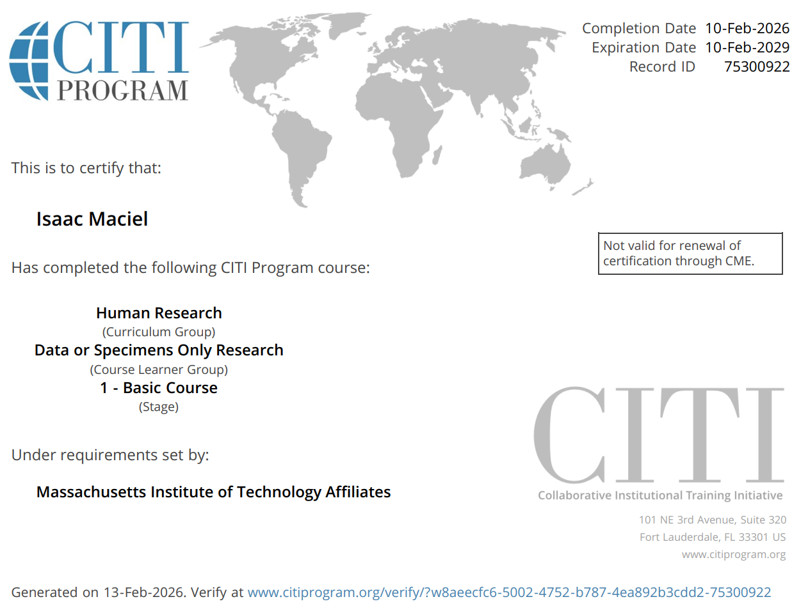
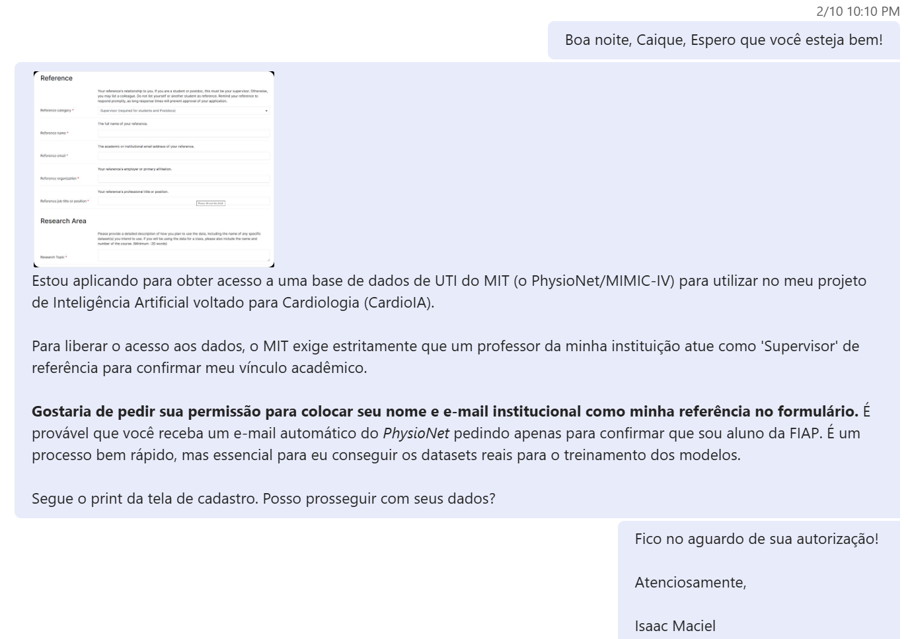
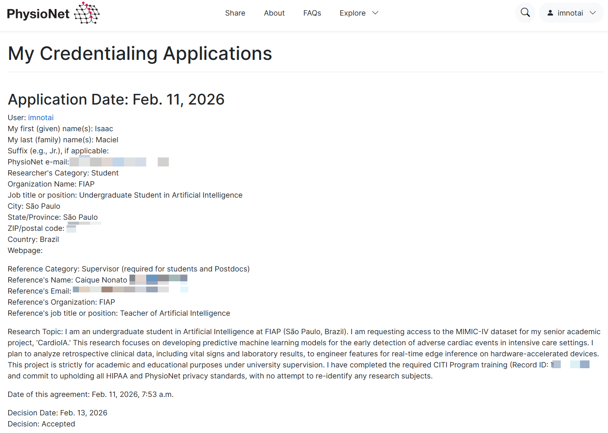
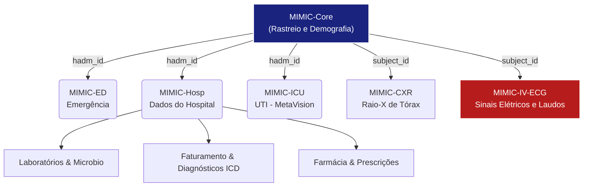
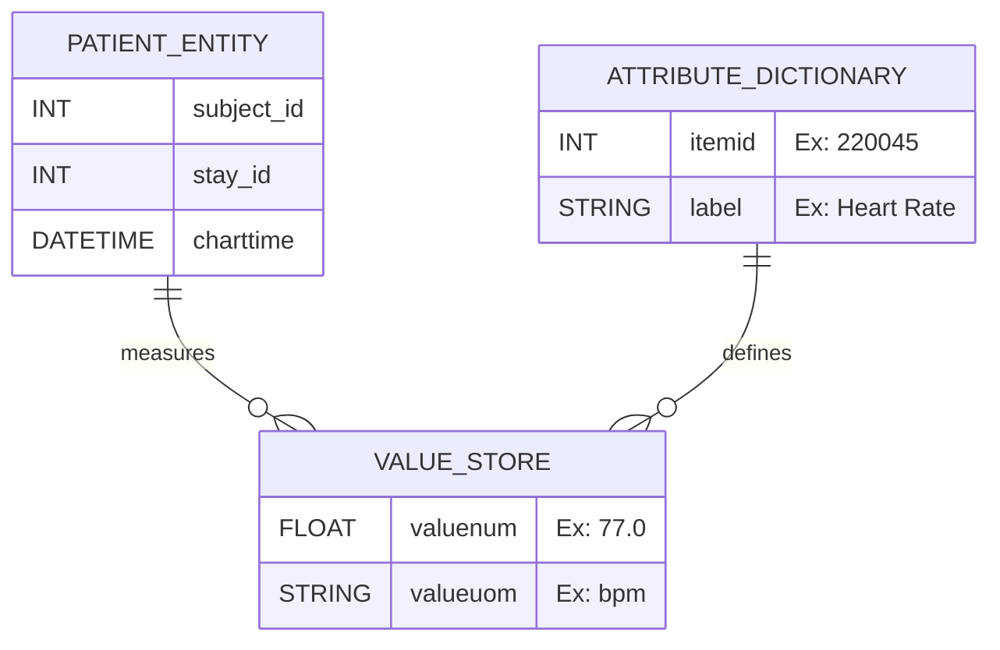
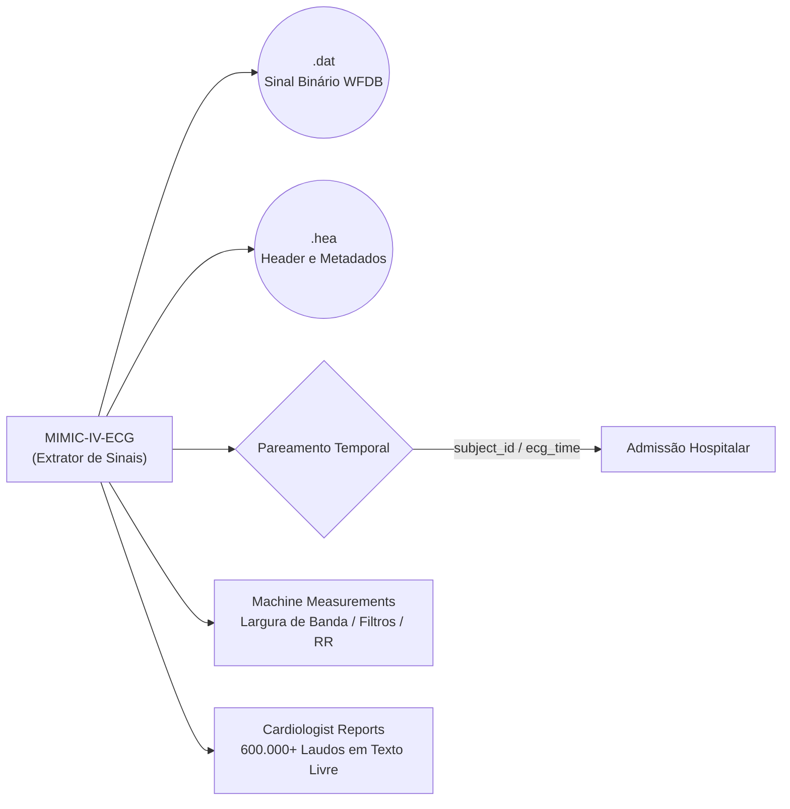

<strong>📙 6º MIMIC-IV-ECG: O Ecossistema de Terapia Intensiva e Governança de Dados do MIT</strong>

 

<strong>A "Verdade Burocrática": Governança, Compliance HIPAA e Credenciamento</strong>

 

Bancos de dados de saúde não são meros repositórios numéricos; eles representam a vida, a vulnerabilidade e o desfecho de seres humanos reais. O acesso ao <strong>MIMIC-IV</strong> (<em>Medical Information Mart for Intensive Care</em>) e ao seu subconjunto eletrofisiológico (<strong>MIMIC-IV-ECG</strong>) é severamente restrito e governado pelo <em>Laboratory for Computational Physiology</em> do MIT e pelo PhysioNet.

Para minimizar riscos e obedecer aos requisitos da lei HIPAA (<em>Health Insurance Portability and Accountability Act</em>) - especificamente a legislação de <em>Safe Harbor</em> -, o MIT aplica uma engenharia de desidentificação brutal:

<ul>
  <li><strong>Obliteração de PHI (Personal Health Information):</strong> Os 18 identificadores diretos exigidos pela HIPAA (nomes, endereços, números de telefone, IPs, números de segurança social) foram totalmente expurgados.</li>
  <li><strong>Distorção Temporal (Date Shifting):</strong> Datas e horários reais foram transpostos estocasticamente para o futuro (ex: o ano de internação de um paciente pode aparecer como 2175, embora tenha ocorrido entre 2014 e 2016). Isso preserva a distância relativa entre os eventos (cronologia) sem expor o dia exato da internação.</li>
  <li><strong>Censura Demográfica Extrema:</strong> Pacientes com mais de 89 anos são sumariamente agrupados na idade estática de <strong>91 anos</strong> (nas versões anteriores, eram fixados em 300 anos), impedindo a reidentificação de pacientes centenários na base pública.</li>
</ul>

<strong>Provas de Autenticidade e Acesso (Compliance do Projeto CardioIA):</strong> 
A utilização destes dados para o escopo deste projeto acadêmico exigiu a superação de barreiras burocráticas e éticas. Eu, <strong>Isaac Maciel</strong>, apliquei técnicas de Engenharia de Dados e fui o pesquisador responsável, cumprindo os seguintes marcos de conformidade, atestados pelas matrizes de documentação visual abaixo:

   
  <em>Certificação internacional CITI Program concluída: "Human Research - Data or Specimens Only Research", afiliada ao MIT.</em>

   
  <em>Delegação formal de autoridade: Aprovação do Professor Caique Nonato (FIAP) atuando como Supervisor Acadêmico para a liberação de dados do MIT.</em>

   
  <em>Chancela governamental: Acesso irrestrito concedido pela plataforma PhysioNet ao ecossistema MIMIC-IV em 13 de fevereiro de 2026.</em>

<strong>Nota de Privacidade:</strong> As imagens acima sofreram tratamento de <em>Data Masking</em> prévio. Todos os e-mails, códigos postais e frações de hashes de credenciamento foram ocultados em respeito às normativas de segurança digital, comprovando o domínio do pesquisador sobre o ciclo de vida seguro do dado (<em>Data Governance</em>).

 

<strong>O Paradigma da UTI e a Falência dos Estudos Randomizados (Por que Critical Care?)</strong>

 

Por que o MIT focou a maior base de dados do mundo estritamente em pacientes de UTI (Unidade de Terapia Intensiva)? A resposta reside na densidade de telemetria e no vácuo de conhecimento médico. Pacientes críticos recebem infusões contínuas, suporte de órgãos (ventilação mecânica) e avaliação humana intermitente. 
  
A medicina tradicional confia em <em>Randomized Controlled Trials</em> (RCTs - Ensaios Clínicos Randomizados) para gerar evidências. Contudo, na UTI, <strong>75% dos RCTs falham em demonstrar qualquer melhora na mortalidade</strong>, e 10% chegam a piorar o quadro clínico. Estima-se que 40% das práticas médicas outrora consideradas "padrão-ouro" sejam revertidas quando devidamente testadas com grandes volumes de dados. 
  
O MIMIC-IV nasceu para suprir esse vácuo. Ao invés de testes controlados irreais, ele fornece observações do <strong>Mundo Real</strong>. Um exemplo clássico documentado pelo MIT foi a descoberta, via mineração de dados retrospectiva do MIMIC, de que o uso prévio de inibidores seletivos de recaptação de serotonina (antidepressivos SSRIs) estava associado a uma maior mortalidade hospitalar na UTIm, algo que um RCT jamais poderia testar eticamente.

 

<strong>Topologia e Arquitetura Modular do MIMIC-IV</strong>

 

A transição do papel (MIMIC-I com 90 pacientes) para o formato massivo atual (MIMIC-IV com dados de 2008 a 2019) exigiu uma arquitetura fragmentada. O ecossistema não é um monolito; ele é dividido em módulos operacionais independentes que rastreiam a jornada do paciente (<em>Patient Journey</em>) desde a porta do hospital até a alta, modelados através de chaves primárias relacionais (<code>subject_id</code>, <code>hadm_id</code>, <code>stay_id</code>).

Abaixo detalhamos a composição e a engenharia por trás de cada engrenagem deste sistema:

<ul>
  <li><strong>MIMIC-Core:</strong> O coração do rastreamento. As tabelas <code>patients</code>, <code>admissions</code> e <code>transfers</code> controlam a demografia. O <code>subject_id</code> é o CPF interno do paciente; o <code>hadm_id</code> representa uma única internação (uma pessoa pode ter múltiplas internações ao longo da vida).</li>
  <li><strong>MIMIC-ED (Emergência):</strong> O primeiro contato. Estruturado em <em>Star Schema</em>, mapeia queixas iniciais, sinais vitais a cada 30 minutos e o inventário de medicações que o paciente toma em casa. É aqui que decidem se o paciente vai de alta ou sobe para a UTI.</li>
  <li><strong>MIMIC-Hosp (O Registro Eletrônico do Hospital):</strong> Uma vasta coleção de faturamento (DRG e as exaustivas classificações ICD-10, que possuem códigos até para "acidentes envolvendo cavalos" ou "mordidas de aves"), microbiologia (tempo de incubação vs. tempo de detecção de vírus) e, o mais importante, o <strong>eMAR</strong> (<em>Electronic Medicine Administration Record</em>). O eMAR é alimentado por leitores de código de barras bipados na beira do leito a cada dose de medicação, fornecendo hipergranularidade sobre horários de dosagem.</li>
  <li><strong>MIMIC-CXR:</strong> Banco de dados pareado de imagens DICOM de raios-X de tórax, acompanhados de laudos emitidos e validados por duplas de radiologistas, contendo anotações ricas sobre hipertrofia, opacidade e edema pulmonar.</li>
</ul>

 

<strong>Engenharia EAV (Entity-Attribute-Value) no MIMIC-ICU</strong>

 

O Módulo de UTI (<strong>MIMIC-ICU</strong>) precisa mapear uma insanidade de variáveis diferentes (desde fluxo da bomba extracorpórea até o volume de urina na sonda). Se os engenheiros do MIT criassem uma coluna de banco de dados para cada item médico possível, a tabela teria centenas de milhares de colunas e seria inoperável.
  
A solução computacional implementada foi o modelo <strong>Entity-Attribute-Value (EAV)</strong>.

Ao invés de colunas engessadas, o sistema empilha os dados. A entidade (quem e quando), o atributo mapeado na tabela <code>d_items</code> (o quê) e o valor (quanto). Tabelas como <code>chartevents</code> (textos e números estáticos), <code>outputevents</code> (volumes urinários) e <code>inputevents</code> (drogas intravenosas contínuas com taxa de infusão e dosagem total) permitem que o banco de dados cresça infinitamente sem quebrar a modelagem original.

 

<strong>MIMIC-IV-ECG: A Ground Truth Eletrofisiológica do CardioIA</strong>

 

Onde a visão computacional do projeto <strong>CardioIA</strong> ganha vida. O submódulo <strong>MIMIC-IV-ECG</strong> extraiu da infraestrutura global cerca de <strong>800.000 eletrocardiogramas diagnósticos</strong> cobrindo cerca de 160.000 pacientes. Diferente da telemetria de beira de leito, o ECG diagnóstico utiliza as 12 derivações padrão e amadurece um período estrito de 10 segundos com altíssima captação espacial (500 Hz).

<strong>O Diferencial da Modelagem de Dados:</strong>  
A verdadeira genialidade arquitetural é como os sinais brutos foram expostos e catalogados.  
<strong>1. O Formato WFDB:</strong> A equipe do MIT expurgou os formatos de arquivo proprietários das dezenas de fabricantes de aparelhos e transmutou tudo em Formato Aberto WFDB (<em>WaveForm DataBase</em>).  
<strong>2. Anotações "Máquina vs Humano":</strong> O banco entrega a tabela <code>machine_measurements.csv</code> contendo a medição nativa da máquina. Contudo, a IA moderna não pode aprender o viés algorítmico defasado das máquinas antigas. Por isso, a tabela <code>waveform_note_links.csv</code> cria a ponte para os relatórios em texto livre escritos e revisados por Cardiologistas Clínicos humanos reais.  
<strong>3. O Pareamento Espaço-Tempo:</strong> O desafio da engenharia de dados é provar que a arritmia vista no ECG pertence àquele surto de Hipoxemia visto na UTI. Ao cruzar o <code>ecg_time</code> extraído do cabeçalho do sinal com o <code>admittime</code> da tabela de admissão do MIMIC-Core, o pipeline consolida o contexto completo do paciente. O algoritmo do CardioIA aprenderá não apenas a ler "Infarto" num tensor, mas compreenderá todo o arcabouço medicamentoso e laboratorial que o causou.

<strong>Material Teórico e Referência Acadêmica:</strong>  
A arquitetura detalhada acima é fundamentada e respaldada pelo PDF oficial de referências ("MIMIC-IV: Do Papel à Inferência Preditiva - A Evolução da Fisiologia Computacional e Geração de Conhecimento em UTI"), garantindo a solidez acadêmica perante bancas de avaliação.

<strong>Citação Oficial:</strong>  
Gow, B., Pollard, T., Nathanson, L. A., Johnson, A., Moody, B., Fernandes, C., Greenbaum, N., Waks, J. W., Eslami, P., Carbonati, T., Chaudhari, A., Herbst, E., Moukheiber, D., Berkowitz, S., Mark, R., & Horng, S. (2023). <em>MIMIC-IV-ECG: Diagnostic Electrocardiogram Matched Subset (version 1.0)</em>. PhysioNet. <a href="https://doi.org/10.13026/4nqg-sb35">https://doi.org/10.13026/4nqg-sb35</a>.

