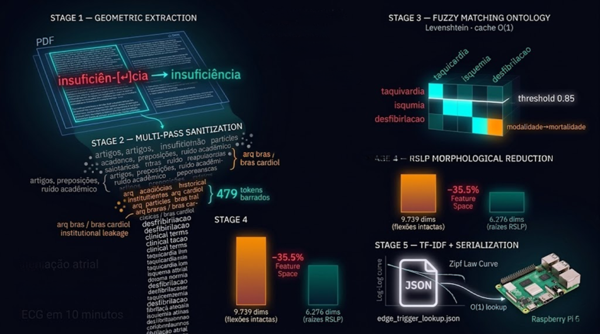

# NLP Data Engineer - Transmutação do Corpus Clínico em Gatilho Assíncrono para Edge AI



---

## O Encerramento da Fase 1 - O Que este Notebook Representa

O `nlp_data_engineer.ipynb` é o último notebook da Fase 1 do CardioIA. Não porque
foi o mais simples, é o que mais iterou. Ele fecha um ciclo que começou quando o
NB1 provou que 6.665 registros de ECG precisavam de um modelo multimodal com
branch tabular. Essa branch tabular vai reconhecer padrões no sinal elétrico do coração.

Mas o Holter precisa fazer mais do que classificar, ele precisa **explicar** ao médico o que encontrou e qual protocolo se aplica. Essa explicação vem deste notebook.

O NB5 recebe os 26 PDFs podados pelo NB4 e os transmuta em um único artefato JSON
de baixíssima latência: o `edge_trigger_lookup.json`. Esse arquivo é uma memória inerte e indexada, o Raspberry Pi 5 consulta suas entradas em complexidade O(1) sem rodar nenhum modelo NLP em tempo real. O processamento pesado acontece aqui, uma vez, no ASUS ROG. O edge device apenas lê.

A pergunta central:

> **Como transformar 26 documentos clínicos em linguagem natural, com ruídos de
> OCR, variações morfológicas, metadados editoriais e jargões interlinguísticos,
> em um espaço vetorial de 6.276 dimensões clinicamente densas que caibam na RAM
> do Raspberry Pi 5 sem sacrificar nenhum termo diagnóstico raro?**

A resposta é um pipeline de cinco etapas em cascata, cada uma detectando e corrigindo o que a anterior não conseguiu ver.

---

## Por que PyMuPDF (fitz) e não PyPDF2

O NB4 usou PyPDF2 para extrair páginas inteiras de PDFs. O NB5 precisa extrair
**texto** desses PDFs, e texto em documento científico tem uma anatomia específica:
duas colunas paralelas, rodapés de revista, cabeçalhos de seção, tabelas com células
adjacentes.

PyPDF2 lê PDFs em modo iterativo de página: percorre o arquivo de cima para baixo
e concatena todo o texto na ordem em que os bytes aparecem no arquivo. Em um artigo
de duas colunas, isso produz intercalação horizontal, metade da frase da coluna
esquerda, metade da frase da coluna direita, continuando o ciclo até o fim da página.

O resultado é texto clinicamente incoerente que nenhum algoritmo NLP consegue
reparar depois.

PyMuPDF (`fitz`) opera sobre **Bounding Boxes (BBoxes)**, coordenadas geométricas
que descrevem o retângulo espacial de cada bloco de texto na página. Com BBoxes, é
possível ordenar os blocos por coluna (ordenação por coordenada X antes de Y)
garantindo que a coluna esquerda seja processada inteira antes da coluna direita.
É análogo a ler um jornal de domingo: você termina de ler toda a coluna da esquerda
antes de cruzar para a coluna da direita, mesmo que as duas estejam lado a lado. A
percepção espacial correta é a diferença entre um parser que entende o layout e um
que enxerga apenas um fluxo linear de bytes.

---

## Extração Geométrica e Reparo de Artefatos Tipográficos

Mesmo com BBoxes corretas, o texto extraído carrega dois artefatos sistemáticos da
tipografia científica:

**1. Hifenização de quebra de coluna.**
Palavras longas que não cabem no final de uma linha são partidas com hífen:

`insuficiên-\ncia`, `dobu-\ntamina`. Após a extração, esses fragmentos aparecem como
`in-\nsuficiência` no texto plano. Um tokenizador que encontrar `in` e `suficiência`
como tokens independentes vai processar `in` como preposição (stopword) e `suficiência` como o substantivo que significa capacidade funcional, o oposto clínico de `insuficiência cardíaca`. A correção Regex:

```python
texto_soldado = re.sub(r'(\w+)-\n\s*(\w+)', r'\1\2', texto_bruto)
```

O radical `\1\2` solda os dois fragmentos sem espaço intermediário, reconstituindo a
palavra original antes que qualquer tokenizador a veja.

**2. Quebras de linha falsas.**
Margens e bordas de coluna inserem `\n` no meio de sentenças contínuas. O delimitador legítimo de parágrafo é `\n\n` (linha em branco). O filtro preserva `\n\n` e suprime `\n` isolado:

```python
texto_continuo = re.sub(r'(?<!\n)\n(?!\n)', ' ', texto_soldado)
```

O lookahead `(?!\n)` e o lookbehind `(?<!\n)` são os sentinelas: só apagam o `\n`
que não está precedido nem seguido por outro `\n`. A continuidade semântica da
sentença é restaurada sem destruir os delimitadores de parágrafo que o TF-IDF usará
como separadores de contexto.

**Resultado de compressão espacial:** redução de 1.5% a 6.3% nos caracteres por
documento, bytes recuperados que eram estritamente vácuos tipográficos. O maior
compressor foi o `protocolo_sus_sindrome_coronariana_filtrado.txt` com 6.3% de
compressão, reflexo de um documento digitalizado com muitas quebras de coluna.

---

## Sanitização Lexical em Múltiplas Passagens

O texto geometricamente reparado ainda contém ~40–50% de volume léxico sem valor
preditivo: artigos, preposições, conjunções, jargões metodológicos e termos
regulatórios. A sanitização operou em três passagens iterativas, cada uma detectando
o que a anterior revelou.

### Passagem 1 - Limpeza Gramatical e Numérica

```
Case Folding     → "Infarto" e "infarto" → mesma dimensão vetorial
Unicode strip    → "coração" → "coracao" (remove diacríticos residuais de OCR)
Proteção de dose → "mg/dl" → "mg_por_dl" (preserva posologia antes da poda)
Regex numérico   → remove \b\d+\b (anos, paginação) mas preserva "40mg", "100J"
Stopwords        → 439 tokens: PT-BR + EN + ruído acadêmico customizado
```

O Regex `\b\d+\b` é a trava de posologia: ele remove apenas dígitos delimitados por
bordas de palavra, `2021`, `45`, `108`, mas não apaga `40mg` ou `100J` porque
esses strings contêm caracteres não-numéricos adjacentes sem espaço. É como ir ao
supermercado e remover da lista os itens com número de corredor (informação logística) mas manter as quantidades dos produtos (informação de compra).

### Passagem 2 - Reparo do Vazamento Institucional

A auditoria de bigramas após a Passagem 1 revelou um fenômeno não previsto:
*institutional leakage*. Os tensores de maior coocorrência não eram clínicos, eram
editoriais: `arq bras`, `bras cardiol`, `sociedade brasileira`. Todo o corpus foi coletado dos Arquivos Brasileiros de Cardiologia, e o nome da revista aparecia repetidamente nos cabeçalhos e rodapés de cada artigo.

O risco é de *overfitting bibliográfico*: o modelo TF-IDF atribuiria peso máximo à
assinatura da editora, aprendendo que "qualquer texto que menciona 'arq bras'
provavelmente trata de infarto", uma correlação espúria. Um dicionário de limpeza
de segunda geração (479 tokens) foi construído e o corpus reprocessado.

### Passagem 3 - Limpeza Pós-Auditoria KWIC

Dois resíduos específicos sobreviveram à Passagem 2 e foram detectados apenas pela
análise de concordância (KWIC, *Key Word In Context*):

**`além disso`** - Locução conjuntiva que evadiu os filtros por ser um bigrama
composto de duas palavras gramaticalmente neutras. A análise KWIC confirmou que
funciona estritamente como ponte sintática entre sentenças clínicas. Deleção
homologada: ao removê-la, `desobstrução minutos` e `taxa mortalidade` passam a
coocorrer diretamente no espaço vetorial, com maior peso preditivo.

**`atualização atualização`** - Eco Recursivo: o título de uma seção colidindo com o
cabeçalho da página impressa original. O OCR capturou o mesmo token duas vezes em
sequência. Deleção homologada: é pura esparsidade sem âncora semântica.

---

## Engenharia Ontológica por Fuzzy Matching (Levenshtein)

Após a sanitização, o corpus ainda continha variações do mesmo conceito clínico
geradas por erros de OCR e digitação: `taquivardia`, `isqumia`, `infartto`,
`desfibirlacao`, `amiodarone`. Cada variante ocuparia uma dimensão vetorial própria
na matriz TF-IDF, uma dimensão que o modelo de borda precisaria carregar em RAM
para nunca usar de forma útil.

A Distância de Levenshtein mede o número mínimo de operações de edição (inserção,
deleção, substituição de caractere) para transformar uma string em outra. A
*Similarity Ratio* normaliza para `[0, 1]`:

```python
score = difflib.SequenceMatcher(None, token_ocr, alvo_ontologia).ratio()
```

**A Ontologia Mestre** definiu 18 entidades-alvo validadas clinicamente: `isquemia`,
`infarto`, `miocardio`, `amiodarona`, `trombose`, `troponina`, `adrenalina`,
`fibrilacao`, `ventricular`, `cardiovascular`, `furosemida`, `eletrocardiograma`,
`taquicardia`, `desfibrilacao`, `enoxaparina`, `sindrome`, `coronariana`,
`mortalidade`.

**O Threshold de 0.85** é o hiperparâmetro crítico. Ele deve ser alto o suficiente para rejeitar falsos cognatos clínicos perigosos, `trombose` vs `troponina` alcançaram score de apenas 0.47, bloqueados com segurança. Um coágulo físico obstrutivo e um biomarcador laboratorial são entidades diagnósticas opostas; confundi-las em um sistema de suporte a decisão clínica seria um erro fatal.

O paradoxo identificado na telemetria: `modalidade` convergiu para `mortalidade`
com score 0.857, na borda exata do threshold. Isso justifica a calibração em 0.85
em vez de 0.80 ou 0.90. Com 0.80, esse falso positivo teria passado; com 0.90,
erros reais de OCR como `isqumia` (score 0.941) teriam sido bloqueados.

**Cache O(1) via dicionário hash:** cada token é processado pela heurística apenas
uma vez. Processamentos subsequentes do mesmo token fazem lookup no cache em
tempo constante. Em um corpus de 26 documentos com vocabulário compartilhado,
isso evita recalcular a Distância de Levenshtein para o mesmo token dezenas de vezes.

**Resultado: 35 anomalias topológicas corrigidas**, incluindo:
- Typos de digitação: `taquivardia` → `taquicardia` (0.909), `desfibirlacao` → `desfibrilacao` (0.923)
- Artefatos alfanuméricos: `cardiovascular24` → `cardiovascular` (0.933), `coronariana10` → `coronariana` (0.917)
- Contaminação interlinguística: `amiodarone` → `amiodarona` (0.900), `syndrome` → `sindrome` (0.875)
- Formas plurais e flexionadas: `coronarianas` → `coronariana` (0.957), `taquicardias` → `taquicardia` (0.957)

---

## Redução Morfológica por RSLP Stemming

O Corpus sanitizado ainda sofria com *alta cardinalidade flexional*: `cardíaco`,
`cardíaca`, `cardíacos`, `cardíacas` são quatro dimensões vetoriais distintas no
CountVectorizer, quatro colunas para o mesmo conceito clínico. Isso dilui o peso
estatístico: a frequência real de "cardíaco" fica distribuída entre quatro entradas,
aparentemente rara em cada uma.

O **RSLP** (*Removedor de Sufixos da Língua Portuguesa*) é um stemmer determinístico
desenvolvido especificamente para o português. Ao contrário de stemmers genéricos
como o Porter (desenvolvido para o inglês), o RSLP conhece as regras de sufixação
do português médico: `-ação`, `-ismo`, `-ista`, `-oso`, `-ica`, `-ico`. A operação é
análoga ao hábito de anotar em uma lista de mercado apenas a raiz do item,
"amaciante, amaciador, amaciação" viram simplesmente "amaci", evitando que cada
variante ocupe uma linha separada da lista.

```
"cardiologista", "cardiológico", "cardiologia" → "cardiol"
"isquêmico", "isquêmica", "isquemias"         → "isquem"
"trombótico", "trombótica", "trombose"         → "trombot" / "trombos"
```

**Resultado: 3.463 Dimensões Eliminadas - Redução de 35.5% do Feature Space.**

Esse número é o que tornava o pipeline viável para o Raspberry Pi 5. Sem o stemming,
a matriz TF-IDF teria ~9.700 dimensões. Com 8GB de RAM e múltiplos processos
concorrentes (BLE, buffer circular, inferência Coral), um Feature Space de 9.700
dimensões alocado permanentemente em memória seria um risco de OOM. Com 6.276,
o artefato JSON gerado tem latência de leitura compatível com a exigência do sistema.

---

## Vetorização TF-IDF e Validação pela Lei de Zipf

O TF-IDF (*Term Frequency–Inverse Document Frequency*, do latim *frequens*,
"assíduo, recorrente"; presente idêntico em *frecuente* espanhol e *frequent* inglês) difere de uma contagem simples de frequência em um princípio fundamental: ele **penaliza termos onipresentes** e **recompensa termos diagnósticos raros**.

```
TF(t, d)   = frequência do termo t no documento d
IDF(t)     = log(N / df(t))  onde N = total de documentos, df(t) = documentos com t
TF-IDF(t,d) = TF(t,d) × IDF(t)
```

Se `risco` aparece em todos os 26 documentos, `IDF("risco") = log(26/26) = 0`. O
token é matematicamente neutro, zero dimensão de peso preditivo. Se `alteplase`
aparece apenas na bula de alteplase, `IDF("alteplase") = log(26/1) = 1.41`. Alta
especificidade → alto peso → a CNN aprende que "alteplase" é um marcador forte de
reperfusão trombolítica, não uma palavra genérica.

**Hiperparâmetros Calibrados para Edge AI:**
- `max_df=0.95`: remove tokens que aparecem em mais de 95% dos documentos (ruído
  onipresente residual que escapou das stopwords)

- `min_df=1`: garante que **100% dos termos técnicos**, mesmo fármacos que aparecem
  apenas em uma bula, tenham representação vetorial. Nenhum protocolo de patologia
  rara é silenciado por frequência baixa.

**Resultado: Feature Space de 6.276 dimensões de alto valor.**

### Validação pela Lei de Zipf

A curva Log-Log do corpus validou a integridade do pipeline. A Lei de Zipf descreve
o comportamento de frequências na linguagem natural: a segunda palavra mais
frequente ocorre com metade da frequência da primeira, a terceira com um terço, e
assim por diante, decaimento de potência. Em escala logarítmica, isso produz uma
linha reta de inclinação −1.

O corpus do NB5 exibe um **platô inicial** (desvio positivo da diagonal teórica) antes do decaimento característico. Esse platô é a assinatura dos múltiplos passes de sanitização: os conectivos gramaticais foram suprimidos, nivelando a dominância dos termos mais frequentes e distribuindo a densidade vetorial para um bloco de radicais médicos. A cauda longa da distribuição mantém os termos raros indexados, prova de que o `min_df=1` funcionou.

Um corpus que seguisse a Lei de Zipf perfeita teria o topo dominado por artigos e
preposições. O platô do NB5 prova que o topo foi reequipado com entidades clínicas.

---

## O Artefato Final - edge_trigger_lookup.json

O pipeline serializa as Top 10 features TF-IDF de maior magnitude diagnóstica de cada diretriz clínica em um JSON estruturado. A estrutura é uma Lookup Table, não um
modelo, não um grafo, não um embedding. Um dicionário Python serializado:

```json
{
  "diretriz_sbc_angina_instavel": {
    "gatilhos": ["clopidogr", "heparin", "timi", "grace", "ticagrel", ...],
    "protocolo": "Estratificação TIMI/GRACE → antiagregação dupla",
    "fonte": "SBC Angina Instável 2021 pp.206-226"
  },
  "diretriz_sbc_ressuscitacao": {
    "gatilhos": ["adrenalina", "amiodarona", "fibrilacao", "desfibrilacao", ...],
    "protocolo": "ACLS → Adrenalina 1mg IV a cada 3-5 min",
    "fonte": "SBC RCP 2019 pp.475-492"
  }
}
```

Quando o Coral USB detectar depressão de ST no tensor `[1, 1000, 4]` e o modelo
CNN classificar como MI ou STTC, o Raspberry Pi consulta o lookup e retorna ao médico o protocolo correspondente, extraído da diretriz SBC ou do protocolo SUS, com
rastreabilidade de fonte, sem alucinação, sem latência de inferência NLP em tempo real.

A consulta é O(1): acesso por chave de dicionário. Não há modelo rodando, não há
tokenização em produção, não há risco de esgotamento de RAM por processamento
de linguagem natural no edge. O NLP aconteceu aqui, no ROG, uma vez.

---

## O Pipeline Completo do NB5

```
pruned_pdfs/ (26 PDFs do NB4)
    │
    ▼
[Etapa 1 - Extração Geométrica (PyMuPDF fitz)]
    │  BBox parsing → soldagem de hifenização → supressão de \n falsos
    │  Telemetria: compressão espacial 1.5%–6.3% por documento
    ▼
parsed_txt/ (26 arquivos .txt - [GIT OK, legíveis, <1MB cada])
    │
    ▼
[Etapa 2 - Sanitização Lexical Multi-Pass]
    │  Pass 1: case fold + Unicode + Regex posologia + 439 stopwords
    │  Pass 2: expurgo institucional (arq bras, bras cardiol) → 479 tokens
    │  Pass 3: limpeza (além disso, eco recursivo)
    ▼
Corpus V3: texto clínico operacional puro
    │
    ▼
[Etapa 3 - Engenharia Ontológica (Fuzzy Matching Levenshtein)]
    │  Threshold 0.85 | Ontologia de 18 entidades | Cache O(1)
    │  35 anomalias OCR corrigidas | Falso positivo modalidade→mortalidade auditado
    ▼
Corpus V4: raízes clínicas com OCR corrigido
    │
    ▼
[Etapa 4 - Redução Morfológica (RSLP Stemmer)]
    │  3.463 dimensões obliteradas | Feature Space: 9.739 → 6.276 (−35.5%)
    ▼
Corpus V5: raízes estruturais puras (Texto_Stemmed)
    │
    ▼
[Etapa 5 - Vetorização TF-IDF]
    │  max_df=0.95 | min_df=1 | 6.276 dimensões finais
    │  Validação Lei de Zipf (platô clínico confirmado)
    ▼
edge_trigger_lookup.json  →  Top 10 features por diretriz + protocolo + fonte
                              Raspberry Pi 5 · O(1) lookup · 8GB RAM safe
```

---

## O Fechamento da Fase 1

```
[NB1 - ptblxl_eda]
      └── ptbxl_engineered_features.csv (6.665 × 20)
      └── ptbxl_gateway_fallback.csv (15.051 × 9)
                │
[NB2 - holter_iot_data_simulation]
      └── Validação de hardware: bateria 24h ✓, BLE 900B/s ✓, aliasing 40Hz ✓
                │
[NB3 - ptbxl_signal_vision_eda]
      └── X_img/X_tab/Y .npy (train/val/test)
      └── Espectrogramas 224×224 + grids 12 derivações (100 exemplos cada)
                │
      ══════════╪══════════════════ trilhas paralelas ══════════
                │                                              │
[NB4 - nlp_data_pruning]                                       │
      └── 26 PDFs podados → pruned_pdfs/                       │
                │                                              │
[NB5 - este notebook]                                          │
      └── parsed_txt/*.txt          [GIT OK]                   │
      └── edge_trigger_lookup.json  [GIT OK] ←─────────────────┘
      └── matriz TF-IDF 6.276D      [DVC]
      ══════════╪══════════════════════════════════════════════
                ▼
         FASE 1 ENCERRADA
                │
                ▼
[Fase 2 → Fase 7]
  XGBoost + SHAP (tabular baseline)
  CNN multimodal (branch visual + branch tabular)
  Quantização INT8 → TFLite → Compilação Edge TPU
  Deploy Coral USB no Raspberry Pi 5
  Holter CardioAI: classifica + explica + rastreia protocolo
```

A Fase 1 entregou o que prometeu: dados limpos, representações validadas, hardware
simulado, corpus clínico estruturado. Nenhum modelo foi treinado ainda, e isso é
exatamente o ponto. Treinar sem entender os dados é construir sem medir o terreno.
O CardioIA conhece o terreno.

---

*Notebook 5/5 - Fase 1 do CardioIA (FIAP, 2026)*

*Encerra a trilha NLP paralela iniciada no NB4 (`nlp_data_pruning.ipynb`)*

*Pré-requisito obrigatório: `nlp_data_pruning.ipynb` concluído e `pruned_pdfs/` exportado*

*Artefato de saída: `edge_trigger_lookup.json` - base do agente clínico CardioIA em produção*
