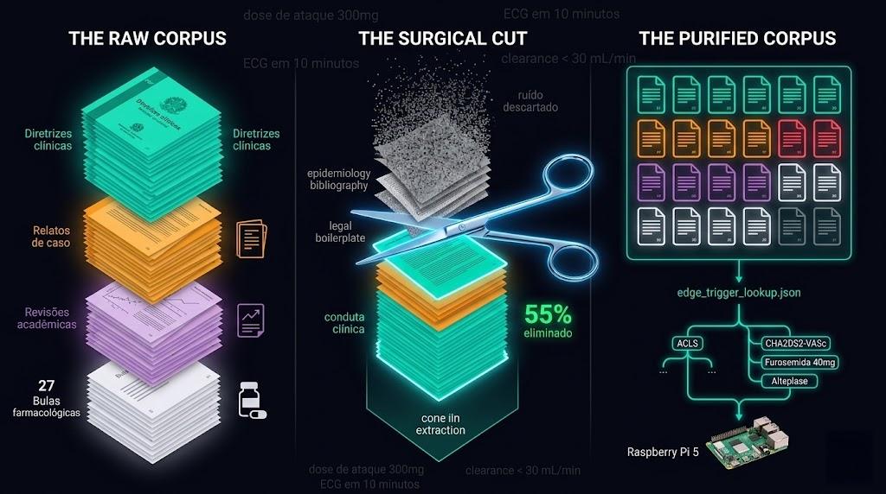

# NLP Data Pruning — Destilação Determinística do Corpus Clínico para Edge Computing




## Por que este notebook existe em uma trilha paralela ao pipeline de ECG

O `nlp_data_pruning.ipynb` não tem dependência de dados com os três notebooks anteriores, ele não consome `ptbxl_engineered_features.csv`, não lê tensores `.npy`, não acessa sinais WFDB. 

Mas existe uma dependência arquitetural implícita: o corpus textual que este
notebook purifica alimentará o agente clínico do CardioIA, que por sua vez envolverá os diagnósticos produzidos pelo modelo ECG treinado nos NB1–NB3. A trilha NLP e a trilha de sinal convergen no produto final, o Holter que não apenas classifica, mas explica.

A pergunta que o NB4 responde é:

> **Como transformar 27 documentos clínicos heterogêneos, diretrizes ministeriais,
> relatos de prontuário, revisões moleculares e bulas farmacológicas, em um corpus
> denso o suficiente para o modelo NLP aprender regras de conduta clínica, e leve o
> suficiente para ser vetorizado sem saturar a memória do Raspberry Pi?**

A resposta não é um algoritmo. É curadoria: saber o que cortar antes de
começar a processar.

---

## A Estratégia de Curadoria - Ler o Sumário Antes de Comprar

Existe um hábito antigo de quem frequenta feiras e mercados públicos: antes de percorrer cada barraca, você lê o quadro de avisos na entrada, hoje tem peixe fresco, a promoção de frutas é no fundo, o açougue está sem cordeiro. Quem vai direto às barracas sem essa leitura inicial percorre o mesmo caminho duas vezes.

O equivalente textual desse hábito é **ler o sumário antes de processar o documento**.

Em qualquer livro técnico, qualquer diretriz clínica, qualquer bula, o sumário é o mapa que revela quais capítulos contêm regras operacionais e quais contêm justificativas acadêmicas. A curadoria do corpus CardioIA seguiu esse princípio: antes de qualquer extração de PDF, o sumário de cada documento foi inspecionado para mapear as seções de interesse com precisão de página.

Para documentos onde o sumário era insuficiente, artigos de periódico sem indexação
interna clara, a curadoria foi complementada com **Gemini Deep Research** como agente de busca de fontes. O Gemini operou como um bibliotecário especializado: recebeu o escopo temático (cardiologia brasileira, foco em conduta de emergência, fontes SBC/SUS/SciELO) e retornou candidatos que foram auditados manualmente antes de entrar no corpus. A decisão final de inclusão foi sempre humana, o agente acelerou a descoberta, não substituiu o julgamento clínico.

---

## O Problema Fundamental: TF-IDF não distingue "Epidemiologia" de "Emergência"

Antes de entender o que o notebook faz, é necessário entender o que ele impede.

Um vetor TF-IDF (do inglês *Term Frequency–Inverse Document Frequency*, frequência do termo ponderada pela raridade no corpus; em espanhol, *frecuencia inversa de documento*; o radical latino *frequens* aparece idêntico em português "frequente", espanhol "frecuente" e inglês "frequent") transforma texto em coordenadas numéricas. Cada token único vira uma dimensão do espaço vetorial. O problema: esse mecanismo é **clinicamente neutro**, ele não sabe que "Furosemida 40mg EV" é mais importante para um sistema de decisão de UTI do que "Método: revisão sistemática nas bases PubMed e MEDLINE".

Se uma diretriz clínica de 108 páginas for ingerida integralmente:

- Tokens de epidemiologia ("incidência", "prevalência", "follow-up", "IC95%", "viés deseleção") competem por dimensões TF-IDF com tokens de conduta clínica ("bolus",
 "cardioversão", "desfibrilação")

- Tokens de burocracia regulatória ("CNPJ", "CRF", "Farmacêutico Responsável", "SAC") diluem o peso de tokens farmacológicos críticos ("dose de ataque", "clearance < 30mL/min", "contraindicado")

- Tokens bibliográficos ("apud", "et al.", "JAMA", "Lancet", anos de publicação) criam dimensões ruidosas que o modelo aprende a associar incorretamente com patologias

O resultado seria um modelo que "aprendeu sobre cardiologia" no sentido mais superficial:

sabe que infarto e "IC95%" aparecem juntos em textos, mas não sabe que "dor torácica +ECG em 10 minutos" é uma regra imperativa do SUS.

A poda resolve isso na fonte: antes da vetorização, apenas as páginas que contêm
**regras operacionais, fluxogramas, escores clínicos e dosagens** entram no pipeline.

---

## Os Quatro Arquétipos e a Lógica de Corte de Cada Um

O corpus foi organizado em quatro arquétipos com estratégias de poda distintas, porque cada tipo de documento tem uma anatomia textual diferente:

### 1º Arquétipo - Diretrizes e Protocolos (5 documentos)

Documentos longos (46–215 páginas) com estrutura previsível: introdução → epidemiologia <strong>→ fisiopatologia → **condutas** → metodologia → referências.</strong> O ouro clínico está no miolo, não nas extremidades.


| Documento | Páginas originais | Páginas mantidas | Redução |
|---|---|---|---|
| `diretriz_sbc_angina_instavel.pdf` | 84 | 20 | 76.2% |
| `diretriz_sbc_fibrilacao_atrial.pdf` | 107 | 25 | 76.6% |
| `diretriz_sbc_ressuscitacao_cardiopulmonar.pdf` | 215 | 36 | **83.3%** |
| `protocolo_sus_sindrome_coronariana.pdf` | 46 | 42 | 8.7% |
| `diretriz_sus_insuficiencia_cardiaca.pdf` | 108 | 11 | **89.8%** |


A diretriz de insuficiência cardíaca merecia atenção especial: 108 páginas, mas as tabelas de Sumário de Evidências GRADE (análise estatística de risco relativo, intervalos de confiança, metodologia) ocupam a maior parte do documento. Essas tabelas são cientificamente válidas mas clinicamente inúteis para o modelo de decisão, o sistema não precisa saber que uma evidência tem Nível A vs. Nível B, precisa saber *qual* a conduta recomendada. Apenas 11 páginas de algoritmos de tratamento foram mantidas.

O protocolo SUS de síndrome coronariana perdeu apenas as primeiras 4 páginas (siglas, introdução, metodologia), o restante é quase inteiramente fluxogramas e critérios diagnósticos, que são exatamente o que o modelo de triagem precisa.

### 2º Arquétipo - Relatos Clínicos (8 documentos)

Documentos curtos (3–7 páginas) com estrutura narrativa: <strong>anamnese → achados → discussão → revisão de literatura → referências.</strong> A poda aqui é de granularidade máxima, 2 a 3 páginas por documento, mantendo apenas a seção de apresentação do caso e os achados laboratoriais/eletrocardiográficos.


A decisão de manter apenas as páginas iniciais de cada relato (anamnese + achados) e
descartar a revisão de literatura decorre de uma análise de valor por token: um relato de caso de 7 páginas tem ~2 páginas de conteúdo narrativo único e ~5 páginas que citam os mesmos artigos que já estão no corpus como revisões acadêmicas. 

Incluir as referências dos relatos seria incluir a mesma informação duas vezes, com tokens bibliográficos poluindo as duas entradas.

Um arquivo foi movido durante a auditoria de qualidade: o relato de dissecção aórtica de Stanford foi reclassificado de *Relatos* para *Revisões Acadêmicas*, a estrutura do documento era mais próxima de uma revisão com caso ilustrativo do que de um prontuário narrativo puro.

### 3º Arquétipo - Revisões Acadêmicas (8 documentos)

Artigos de periódico (7–14 páginas) com o desafio específico da **cauda bibliográfica**: as últimas 2–4 páginas de qualquer artigo são referências. O modelo NLP não pode aprender nomes de autores, anos de publicação ou títulos de periódico, esses tokens criam dimensões que não têm significado clínico.

A estratégia foi manter apenas os resumos, tabelas de estratificação de risco e conclusões clínicas. O artigo sobre GDF-15 como biomarcador  (`revisao_gdf15_biomarcador.pdf`) teve 0% de redução, suas 7 páginas são inteiramente tabelas de pontos de corte e correlações com desfechos cardiovasculares, sem nenhum trecho descartável.

### 4º Arquétipo - Farmacologia e Bulas (5 documentos)

Bulas profissionais têm formato rígido imposto pela ANVISA (Agência Nacional de Vigilância Sanitária - *vigilância* do latim *vigilantia*, "estado de alerta", raiz idêntica ao inglês *vigilance* e ao espanhol *vigilancia*). Esse formato é paradoxalmente útil: as primeiras páginas sempre contêm indicações, contraindicações e posologia, o núcleo clínico. As últimas páginas sempre contêm registros regulatórios, dados de fabricação,
SAC e instruções de descarte de embalagem.

A estratégia foi um corte uniforme: manter as primeiras 8–12 páginas de cada bula,
garantindo que indicações + contraindicações + posologia + interações medicamentosas
entrem integralmente no corpus, e que dados de CRF, CNPJ e reciclagem de seringa
permaneçam no lixo digital.

---

## A Classe OrquestradorPodaPDF - Por que Orientação a Objetos aqui

O notebook poderia ter sido implementado como quatro scripts lineares independentes, um por arquétipo. A escolha de encapsular a lógica em uma classe `OrquestradorPodaPDF` com método `processar_documento()` e `executar_pipeline()` não foi estética.

A motivação é pragmática: a mesma técnica de poda (abrir PDF, calcular offset de índice, extrair páginas, salvar) funciona para todos os 26 documentos. A variabilidade está apenas nas **regras de corte**, os dicionários de `ranges` e `offset` por arquivo. Ao separar o modelo da configuração, é possível:

1. Adicionar um novo documento ao corpus sem tocar no código, apenas adicionar uma
   entrada ao dicionário de regras

2. Auditar as regras de corte de cada documento sem entender o código de I/O

3. Substituir PyPDF2 por outra biblioteca (pdfplumber, PyMuPDF) sem reescrever a lógica de domínio

O parâmetro `offset` merece explicação. PDFs de periódicos científicos têm numeração de página que não coincide com o índice de página do arquivo. Um artigo publicado nas páginas 738–741 dos Arquivos Brasileiros de Cardiologia está no arquivo PDF nas posições 1–4 (porque o PDF foi baixado apenas com aquele artigo). O `offset` é a diferença:

`offset = -(738 - 1) = -737`. Sem esse parâmetro, o sistema tentaria ler as páginas 738–741 de um arquivo de 4 páginas e falharia silenciosamente. A matemática de deslocamento é implementada dentro do método com `max(0, ...)` e `min(total_paginas, ...)` como guardas de borda, análogo a verificar se o item ainda está na prateleira antes de colocar no carrinho do supermercado.

---

## O Output e o que ele representa

```
data/processed/nlp/
  └── pruned_pdfs/
      ├── diretriz_sbc_angina_instavel.pdf        (20 pgs / 84 originais)
      ├── diretriz_sbc_fibrilacao_atrial.pdf      (25 pgs / 107 originais)
      ├── diretriz_sbc_ressuscitacao_cardiopulmonar.pdf  (36 pgs / 215 originais)
      ├── protocolo_sus_sindrome_coronariana.pdf  (42 pgs / 46 originais)
      ├── diretriz_sus_insuficiencia_cardiaca.pdf (11 pgs / 108 originais)
      ├── relato_caso_assistencia_circulatoria_chagas.pdf        (2 pgs)
      ├── relato_caso_disfuncao_cardiaca_quimioterapia.pdf       (2 pgs)
      ├── relato_caso_fibrilacao_ventricular_cardiotoxicidade.pdf (2 pgs)
      ├── relato_caso_iamcsst_ruptura_parede_livre.pdf           (2 pgs)
      ├── relato_caso_ic_descompensada_arbovirose.pdf            (2 pgs)
      ├── relato_caso_miocardite_coinfeccao_arboviroses.pdf      (2 pgs)
      ├── relato_caso_miocardite_covid19.pdf                     (3 pgs)
      ├── relato_caso_takotsubo.pdf                              (2 pgs)
      ├── revisao_ceramidas_plasmaticas_risco_cardiovascular.pdf (4 pgs)
      ├── revisao_estrogenio_obesidade_insuficiencia_cardiaca.pdf (4 pgs)
      ├── revisao_fibrilacao_atrial_pacientes_cancer.pdf         (4 pgs)
      ├── revisao_fibrilacao_atrial.pdf                          (3 pgs)
      ├── revisao_gdf15_biomarcador_doencas_cardiovasculares.pdf (7 pgs - 0% redução)
      ├── revisao_indices_hematologicos_inflamatorios_mortalidade.pdf (4 pgs)
      ├── revisao_mirnas_fisiopatologia_cardiovascular.pdf       (4 pgs)
      ├── revisao_sindrome_cardiorrenal_criterios_prognostico.pdf (4 pgs)
      ├── relato_caso_disseccao_aortica_stanford.pdf             (3 pgs)
      ├── bula_profissional_alteplase.pdf                        (10 pgs)
      ├── bula_profissional_amiodarona.pdf                       (10 pgs)
      ├── bula_profissional_clopidogrel.pdf                      (12 pgs)
      ├── bula_profissional_enoxaparina.pdf                      (8 pgs)
      └── bula_profissional_noradrenalina.pdf                    (8 pgs)

Total: 26 documentos purificados
Redução dimensional média: ~55% do ruído eliminado
```

Esses PDFs podados são a entrada do NB5 (`nlp_data_engineer.ipynb`). Eles não são dados de treinamento - são o corpus pré-processado que o engenheiro de dados converterá em vetores, extrairá gatilhos clínicos e serializará como o `edge_trigger_lookup.json` que o agente CardioIA usará em produção no Raspberry Pi.

---

## O que o próximo notebook precisa fazer com esses dados

O NB5 receberá 26 PDFs contendo apenas conteúdo clínico operacional. A pipeline de
processamento textual que se segue:

```
Poda (este notebook)
    │
    ▼
[NB5 - nlp_data_engineer]
    │
    ├── Extração de texto raw (PyMuPDF ou pdfplumber - leitura linha a linha)
    │
    ├── Limpeza OCR
    │   └── Normalização UTF-8, remoção de hifenização de final de linha,
    │       correção de quebras de palavra do OCR de PDF escaneado
    │
    ├── Tokenização BPE (Byte-Pair Encoding)
    │   └── Fragmentação de termos compostos em subwords:
    │       "cardiomiopatia" → ["cardio", "mio", "patia"]
    │       Permite ao modelo generalizar para termos não vistos no treino
    │
    ├── Stemming RSLP (Removedor de Sufixos da Língua Portuguesa)
    │   └── "anticoagulação", "anticoagulante", "anticoagular" → raiz "anticoagul"
    │       Comprime o vocabulário sem perder significado clínico
    │
    ├── Detecção de Negação (NegEx)
    │   └── "não revelou qualquer estenose" → token ESTENOSE marcado como NEGADO
    │       Impede a IA de associar "estenose" como positivo em contexto de negação
    │
    ├── Vetorização TF-IDF
    │   └── 6.276 dimensões únicas após stemming e remoção de stopwords
    │       Cada documento vira um vetor esparso no espaço clínico
    │
    └── Serialização
        ├── parsed_txt/*.txt  → texto puro por documento (Git, legível)
        └── edge_trigger_lookup.json → mapeamento gatilho clínico → protocolo
                                        (base do agente CardioIA em produção)
```

O `edge_trigger_lookup.json` é o produto final da trilha NLP. Quando o Coral USB detectar uma depressão de ST no ECG, o agente consultará esse lookup para retornar ao médico o protocolo de conduta correspondente - extraído diretamente da diretriz SBC ou do protocolo SUS, sem alucinação, sem invenção, com rastreabilidade de fonte.

---

## Governança, LGPD e Named Entity Scrubbing

Os relatos de caso - mesmo sendo publicações científicas com dados já anonimizados pelos autores - passarão por uma etapa adicional de *Named Entity Scrubbing* no NB5 antes de qualquer vetorização. O motivo é preventivo: algumas publicações preservam fragmentos identificáveis (hospitais específicos, combinações de data + patologia + procedimento que permitem re-identificação indireta).


O NER (*Named Entity Recognition* - em espanhol *reconocimiento de entidades nombradas*, do latim *nomen*, "nome", raiz de "nominação" em português, "nominar" em espanhol e "to nominate" em inglês) identifica entidades do tipo PESSOA, ORGANIZAÇÃO, DATA e LOCALIZAÇÃO. 

O scrubbing substitui essas entidades por tokens genéricos antes que o texto entre no pipeline de vetorização - garantindo que o modelo aprenda "paciente de 77 anos" sem aprender "Dona Maria do Hospital das Clínicas de São Paulo em março de 2019".

Essa decisão foi tomada antes de qualquer dado ser processado. É **Privacy by Design** na trilha NLP, paralelo ao que o NB2 implementou na trilha de simulação de hardware.

---

## Posição no Pipeline CardioIA

```
[NB1 - ptblxl_eda]  [NB2 - holter_iot_data_simulation]  [NB3 - ptbxl_signal_vision_eda]
       │                          │                                      │
       └──────────────────────────┴──────────────────────────────────────┘
                                  │
                    Trilha ECG/Sinal → tensores .npy → CNN multimodal
                                  │
                    ╔═════════════╧═════════════╗  ← trilhas paralelas
                    ║                           ║
[NB4 - este notebook]                   [NB5 - nlp_data_engineer]
      │                                         │
      ├── 26 PDFs → pruned_pdfs/                ├── parsed_txt/*.txt
      ├── 4 arquétipos curados                  ├── TF-IDF 6.276 dims
      ├── ~55% ruído eliminado                  └── edge_trigger_lookup.json
      └── corpus clínico operacional 
```
---

*Notebook 4/5 - Fase 1 do CardioIA (FIAP, 2026)*

*Este notebook opera em trilha paralela à pipeline ECG - sem dependência de dados dos NB1–NB3*

*Output obrigatório para: `nlp_data_engineer.ipynb` (NB5)*
