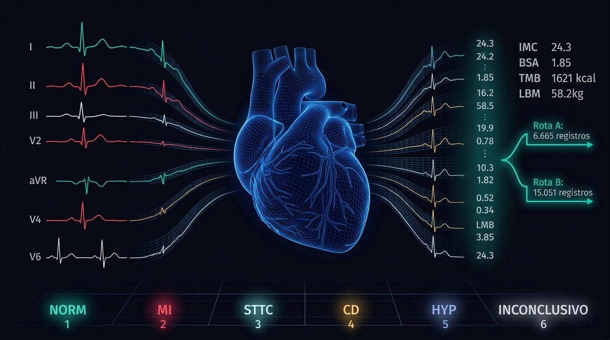

# PTB-XL EDA - Gêmeo Digital e Arquitetura Dual para Edge AI Cardíaco



---

## O Que este Notebook faz e Por Que?

O `ptblxl_eda.ipynb` é o primeiro notebook do projeto CardioIA. Ele não treina nenhum modelo. O que ele faz é mais fundamental: define **o que os dados podem e não podem sustentar**, e a partir dessa resposta, estabelece a arquitetura de todo o pipeline subsequente.

O dataset PTB-XL (PhysioNet, v1.0.3) contém 21.799 registros de ECG de 12 derivações, coletados entre 1989 e 1996 na Alemanha, com dupla validação cardiológica e anotação via padrão SCP-ECG em 71 diagnósticos estruturados. É o benchmark público mais rigoroso de eletrocardiografia computacional disponível. A escolha por ele, em vez do MIMIC-IV ECG, foi direta: 

- O MIMIC exigia aprovação institucional com prazo incerto;

- O PTB-XL estava disponível imediatamente e dentro do escopo da Fase 1.

Mas ter o dataset não resolve nada. O que o notebook resolve é a pergunta que precede qualquer modelagem:

> **Com estes dados, qual é a arquitetura de features mais densa que posso construir
> sem inventar informação - e como traduzo 71 diagnósticos em um problema de
> classificação utilizável em um dispositivo de borda?**

---

## As Decisões e o Que os Dados Disseram

### Quantidade vs. Densidade - A Divisão que Estruturou o Workflow do Projeto

A primeira análise real foi verificar o preenchimento das colunas `height` e `weight`. O resultado: apenas **6.974 registros** têm altura, e **9.421** têm peso. Dos 21.799, apenas **6.748** têm ambos simultaneamente - menos de 31%.

A escolha não foi arbitrária: imputar média nesses campos seria inventar o metabolismo de pacientes com infarto. IMC, BSA, LBM e TMB calculados sobre altura e peso imputados gerariam features numericamente coerentes, mas clinicamente vazias. A opção foi separar em dois caminhos:

- **Rota A - Dataset de Alta Densidade** (`ptbxl_engineered_features.csv`): 6.665
  registros com biometria completa. Base para o modelo principal multimodal.

- **Rota B - Gateway de Fallback** (`ptbxl_gateway_fallback.csv`): 15.051 registros
  sem biometria. Base para o modelo de triagem quando o paciente não tem dados completos.

O produto final (o Holter CardioAI) precisará funcionar com e sem biometria do paciente. A arquitetura dual não é limitação, é o design do sistema.

### Os Filtros Morfológicos Vieram dos Dados, NÃO de Critérios Arbitrários

Ao plotar a dispersão altura × peso no dataset reduzido (6.748 registros), apareceram anomalias: um adulto de 77 anos com peso de 5kg, pacientes com alturas de 85cm e 104cm em idades adultas, registros pediátricos (2 anos, 100Hz, contexto cardiovascular adulto).

A investigação tabular confirmou: erros de digitação sistêmicos da época de coleta
(1989–1996), não valores reais.

A "guilhotina biológica" aplicada - `age >= 18`, `height` entre 140–200cm, `weight`
entre 40–200kg - eliminou 83 registros. O resultado foram **6.665 exames clinicamente puros**.

### O Threshold de 50% e a Criação da Classe INCONCLUSIVO

O PTB-XL codifica diagnósticos como dicionários com probabilidade: `{'IMI': 35.0,
'ISCLA': 100.0}`. O limiar de 50% para "diagnóstico confirmado" não foi escolhido
por conveniência, foi o limiar que os próprios autores do dataset estabelecem como
separador entre suspeita e confirmação cardiológica.

O efeito direto: 437 exames ficaram com classes duvidosas (`_SUSPEITO`) ou sem
superclasse (`Desconhecido`). 

A validação cruzada com o campo `report` (laudo em texto livre dos cardiologistas) confirmou: esses eram laudos reais de hesitação, `"trace only requested"`, `"infarction cannot be excluded"`, `"possible old inferior myocardial infarction"`. A hesitação médica estava nos dados. Suprimi-la seria mentira clínica.

A solução: exames com pelo menos uma classe confirmada têm os rótulos fracos podados
(mantém o Ground Truth). Exames estritamente dúbios viram `INCONCLUSIVO` - a **6ª
superclasse**, que representa a abstenção preditiva do sistema. Um modelo que não sabe que não sabe é um modelo perigoso.

Instâncias descartadas cegamente: **zero**.

### As Features Metabólicas e a Prevenção de Data Leakage

Com os 6.665 registros limpos, a expansão horizontal foi possível:


| Feature | Fórmula | Justificativa clínica |
|---|---|---|
| **IMC** | `peso / (altura/100)²` | Tecido adiposo atenua amplitude do ECG |
| **BSA** (Mosteller) | `√((altura × peso) / 3600)` | Superfície corporal afeta voltagem captada pelos eletrodos |
| **LBM** (Boer) | Equação por sexo | Massa magra separa composição de risco cardiovascular |
| **TMB** (Mifflin-St Jeor) | Equação por sexo | Metabolismo basal como proxy de carga cardíaca de repouso |
| **Desvio IMC do grupo** | `(IMC_paciente - média_coorte) / std_coorte` | Risco relativo dentro do grupo demográfico exato |


O desvio de IMC é a feature mais sensível à contaminação. A média da coorte demográfica foi calculada **exclusivamente nos folds 1–8** (treino). Os folds 9 e 10 (validação e teste) nunca participaram do cálculo - os dados de teste não influenciaram nenhuma transformação de treino.

### O Que foi Descartado e Por quê?

Variáveis removidas do modelo principal:

- `nurse`, `site`, `device`, `recording_date` - viés de hardware e localidade: o modelo não pode aprender que "hospital A" = "infarto". Ele precisa aprender eletrofisiologia.

- `pacemaker` - shortcut learning: a bateria do marcapasso gera picos de voltagem
  regulares que uma CNN aprende antes de aprender a morfologia cardíaca real.

- `baseline_drift`, `static_noise`, `burst_noise` - variáveis de qualidade de sinal
  com menos de 8% de preenchimento. Insuficientes para features, relevantes como
  contexto de auditoria.

- `filename_hr` (500Hz) - descartado em favor do `filename_lr` (100Hz). O ADS1293
  e o Coral USB operam melhor nessa faixa; usar 500Hz no treino e 100Hz na inferência criaria um gap de domínio entre laboratório e borda.


- `imc_categoria`, `faixa_etaria`, `coorte_demografica` - andaimes utilizados para
  calcular o desvio de grupo. Removidos após servirem ao propósito; a rede abstrai
  esses cruzamentos nativamente.

### O Output Final e o que Ele Habilita

```
ptbxl_engineered_features.csv  →  (6.665, 20)   146.630 pontos de dados hiper-densos
ptbxl_gateway_fallback.csv     →  (15.051, 9)   Gateway de triagem para dados incompletos
```

20 dimensões: `ecg_id`, `patient_id`, `age`, `sex`, `height`, `weight`, `strat_fold`,`filename_lr`, `idade_anonimizada_hipaa`, `imc`, `bsa`, `lbm`, `tmb`,
`desvio_imc_grupo`, `risco_base`, + 5 labels multi-hot (`label_CD`, `label_HYP`,
`label_INCONCLUSIVO`, `label_MI`, `label_NORM`, `label_STTC`).


O `filename_lr` mapeia cada registro para seu sinal WFDB em `data/raw/ptbxl/records100/`. Essa coluna é o elo entre o dataset tabulado (NB1) e o pipeline de visão computacional (NB3), onde os sinais serão carregados, filtrados e transformados em espectrogramas 224×224 para entrada em CNNs.

---

## Posição no Pipeline CardioIA

```
[NB1 - este notebook]
      ↓
ptbxl_engineered_features.csv ──────────────────┐
ptbxl_gateway_fallback.csv ─────────────────────┤
      ↓                                         │
[NB3 - ptbxl_signal_vision_eda]                 │
      ↓                                         ▼
Espectrogramas 224×224                   [Fase 2 - ML]
Tensores .npy (train/val/test)           XGBoost + SHAP
                                          MLP tabular
                                         Gateway model
```

*Notebook 1/5 - Fase 1 do CardioIA (FIAP, 2026)*
