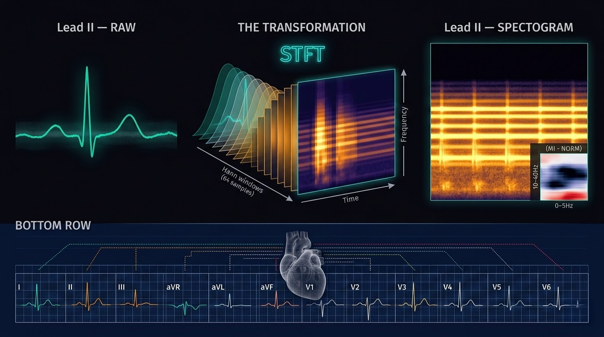

# PTB-XL Signal Vision EDA - Da Onda Invisível à Imagem que a Rede Neural Enxerga




## Por que este notebook só podia existir depois do NB1 e do NB2

O `ptbxl_signal_vision_eda.ipynb` é o terceiro notebook do pipeline CardioIA. A posição não é
organização, é dependência técnica bilateral. Ele precisa de dois predecessores completamente
encerrados antes de executar a primeira célula.

**O que veio do NB1:**
O `ptbxl_engineered_features.csv` contém a coluna `filename_lr`, o endereço WFDB de cada
exame a 100Hz. Sem essa coluna, o NB3 não sabe *qual* sinal carregar. Mais que isso: o NB1
estabeleceu que a janela temporal é de 10 segundos (1.000 amostras a 100Hz) e que o tensor
de entrada do Coral é `[1, 1000, 4]`. Isso significa que o NB3 deve produzir representações
visuais de sinais de exatamente 1.000 amostras, não 500, não 2.000. O NB1 é o contrato de
formato.

**O que veio do NB2:**
O NB2 documentou que a frequência de rede elétrica brasileira (60Hz) reba na amostragem de
100Hz e produz aliasing em 40Hz. O filtro Notch do NB3 foi calibrado para 50Hz (padrão europeu,
coerente com o PTB-XL alemão). Para o hardware brasileiro, ele precisará ser ajustado para 40Hz.
Essa nota existia no NB2 antes de qualquer filtro ser escrito aqui. Sem o NB2, o NB3 aplicaria
um filtro geograficamente errado em produção sem saber.

A pergunta que o NB3 responde é:

> **Como transformar 6.665 registros de 12 sinais temporais unidimensionais, cada um com
> 1.000 amostras, em representações visuais e vetores tabulares que uma rede neural
> multimodal consiga aprender, sem perder a informação que diferencia um coração saudável
> de um em isquemia?**

---

## A Matemática da Transformação - Por que 1D → 2D NÃO PERDE INFORMAÇÃO

Existe uma objeção razoável à abordagem de espectrograma: "você está comprimindo um sinal
temporal em uma imagem, não está jogando informação fora?"

A resposta curta é não. A resposta longa exige entender o que o sinal carrega e o que a
transformação preserva.

### O sinal como Portador de Informação - Analogia da Feira

Pense em uma feira de domingo. Cada barraca vende algo em uma faixa de horário: a de frutas
fica das 6h às 9h, a de queijos das 8h às 11h, a de pão-de-queijo das 10h ao meio-dia.
Se você fotografar a feira às 9h, vê frutas e queijos mas não o pão-de-queijo. Mas se você
fotografar a feira em intervalos sobrepostos, das 6h às 8h, das 7h às 9h, das 8h às 10h,
e empilhar essas fotos, terá uma representação completa de tudo que aconteceu *e* quando
aconteceu.

Esse empilhamento de janelas sobrepostas é literalmente o que a STFT faz com o sinal ECG.

### A STFT como decomposição local-temporal

A **Short-Time Fourier Transform** (STFT), em inglês, *short* = curto, em espanhol *corto*,
do latim *curtus*, "encurtado", não transforma o sinal todo de uma vez. Ela desliza uma
janela sobre o tempo e aplica a DFT dentro de cada janela:

```
X(τ, f) = ∫ x(t) · w(t − τ) · e^{−j2πft} dt
```

Onde:
- `x(t)` é o sinal ECG unidimensional
- `w(t − τ)` é a janela centrada no instante `τ` (aqui: Hann, 64 amostras)
- `X(τ, f)` é a amplitude no tempo `τ` e frequência `f`

No NB3, os parâmetros foram:

```python
nperseg  = 64    # tamanho da janela temporal
noverlap = 56    # sobreposição de 87.5%  →  passo de 8 amostras
nfft     = 256   # zero-padding para resolução espectral fina
```

Resultado: matriz `(129, 118)` - 129 frequências × 118 instantes temporais.

**Por que 87.5% de sobreposição?** Porque o ECG tem eventos de duração ~80–120ms (complexo
QRS). Com passo de 8 amostras a 100Hz, o passo é 80ms, garantindo que nenhum evento caia
*entre* duas janelas sem ser capturado por nenhuma delas. É como ir ao supermercado e passar
pelo corredor de laticínios com passos curtos: se você anda muito rápido, pode passar pela
promoção do iogurte sem ver.

### O Teorema de Parseval e a Preservação da Energia

A garantia matemática fundamental é o **Teorema de Parseval**:

```
∫ |x(t)|² dt  =  (1/2π) ∫ |X(f)|² df
```

A energia total do sinal no domínio do tempo é exatamente igual à energia total no domínio
da frequência. Não é aproximação, é igualdade. Transformar o sinal ECG em espectrograma
via STFT não destrói energia: **redistribui** sua representação de um eixo (tempo) para dois
eixos (tempo × frequência).

O que a STFT perde é apenas a fase absoluta de cada componente de frequência (usamos o
módulo `|X(τ,f)|²`). Mas para classificação cardíaca, a fase absoluta é irrelevante, o que
importa é *quando* e *em qual banda de frequência* existe energia. Um complexo QRS sempre
gera energia na banda 5–40Hz. Uma fibrilação atrial gera "ruído" difuso acima de 300Hz.
Uma onda T invertida muda o perfil de energia abaixo de 10Hz. Essas assinaturas são
preservadas integralmente no espectrograma.

### O Resize para 224×224 e a Bilinear Interpolation

A matriz `(129, 118)` foi redimensionada para `(224, 224)` por interpolação bilinear, a
mesma operação que o seu aplicativo de foto usa quando você amplia uma imagem sem pixelar.
A interpolação bilinear é uma média ponderada dos 4 pixels vizinhos:

```
P(x,y) = (1-α)(1-β)·P₀₀ + α(1-β)·P₁₀ + (1-α)β·P₀₁ + αβ·P₁₁
```

Onde `α` e `β` são as distâncias fracionárias do ponto interpolado aos pixels reais.
O resultado é suave, sem bordas artificiais, e mantém os gradientes de energia que
a CNN aprenderá a reconhecer. O 224×224 não é arbitrário: é o tamanho de entrada padrão
do ImageNet, compatível com VGG16, ResNet50, EfficientNet, todas arquiteturas candidatas
para a branch visual do modelo multimodal.

### A normalização min-max e o que ela resolve

Após o resize, cada espectrograma foi normalizado para `[0, 1]`:

```python
spec_norm = (spec - spec.min()) / (spec.max() - spec.min() + ε)
```

Isso é análogo a comparar preços em uma prateleira de supermercado: você não precisa saber
se o produto custa R$3,50 ou R$35,00 em termos absolutos, você precisa saber qual está
*mais barato* e *quanto mais barato* em relação aos outros. A normalização remove a
variabilidade de amplitude entre pacientes (um obeso tem sinal ECG de menor voltagem que
um magro, o NB1 já quantificou isso com r = −0.0992, p = 4.87×10⁻¹⁶) e mantém o
**padrão relativo** de distribuição de energia, que é a assinatura diagnóstica real.

---

## As 12 Derivações - o Mapa Anatômico do Coração em Perspectivas

O coração não é uma esfera. Tem quatro câmaras, está inclinado no mediastino, e sua ativação
elétrica percorre um caminho específico: <strong>Nó sinusal → feixe de Bachmann → nó AV → feixe de
His → ramos → fibras de Purkinje.</strong> Cada derivação é um *observador posicionado em um ângulo
diferente* dessa ativação. O tensor `(6.665, 1.000, 12)` do NB3 contém as 12 perspectivas
simultâneas de cada exame.

```
Tensor de entrada:  (6.665, 1.000, 12)
                      │      │     └── 12 derivações (canais)
                      │      └──────── 1.000 amostras = 10 segundos a 100Hz
                      └─────────────── 6.665 pacientes
```

### Derivações dos Membros - o plano frontal

As primeiras 6 derivações observam o coração no **plano frontal** (como se você olhasse o
paciente de frente):


| Derivação | Ângulo | O que observa | Analogia de posição |
|---|---|---|---|
| **I** | 0° | Atividade lateral esquerda (VE) | Observador à direita do paciente |
| **II** | +60° | Atividade ínfero-lateral | Observador no ombro esquerdo inferior |
| **III** | +120° | Atividade inferior esquerda | Observador no pé esquerdo |
| **aVR** | −150° | Cavidade interna (endocárdio) | Único observador "de dentro" |
| **aVL** | −30° | Lateral alta esquerda | Observador no ombro esquerdo |
| **aVF** | +90° | Parede inferior do VE | Observador diretamente abaixo |


**aVR** merece atenção especial. É a única derivação invertida em relação às demais, o
vetor de atividade elétrica sempre se afasta dela. Em ritmo sinusal normal, aVR tem ondas
predominantemente negativas. Quando aVR mostra elevação de ST, indica obstrução do tronco
da coronária esquerda, uma emergência. Morfologicamente, *aVR* vem do inglês *augmented
Vector Right*, onde *augmented* compartilha raiz com o latim *augere* ("aumentar",
também presente no português "inaugurar" e no espanhol "augurar"): é a derivação amplificada
do vetor direito.

### Derivações Precordiais - O Plano Horizontal

As derivações V1–V6 observam o coração no **plano horizontal** (como se você olhasse o
paciente de cima):


| Derivação | Posição anatômica | O que predomina |
|---|---|---|
| **V1** | 4° espaço intercostal, margem direita do esterno | Septo interventricular (VD) |
| **V2** | 4° espaço intercostal, margem esquerda do esterno | Septo + parede anterior VE |
| **V3** | Entre V2 e V4 | Zona de transição |
| **V4** | 5° espaço intercostal, linha hemiclavicular esquerda | Ápex cardíaco |
| **V5** | Linha axilar anterior, mesmo nível de V4 | Lateral anterior VE |
| **V6** | Linha axilar média, mesmo nível de V4 | Lateral VE |


A **progressão de R**, o aumento gradual da onda R de V1 para V4/V5, é um marcador de
integridade da parede anterior do ventrículo esquerdo. É análoga à progressão de barracas
em uma feira: se você caminha de um extremo ao outro e o movimento vai crescendo
gradualmente até o centro e depois diminui, a feira está normal. Se o movimento cai
abruptamente no meio do percurso, há algo errado naquele trecho.

### O que o Grid de 12 Derivações Representa como Imagem

O `grid_12_leads_paciente_XXXX.png` exportado pelo NB3 é a reprodução visual do layout
clínico padrão: 3 colunas × 4 linhas, 25mm/s, 10mm/mV. É exatamente o que um cardiologista
vê em papel impresso na UTI. Cada uma das 12 perspectivas está posicionada no grid segundo
a convenção internacional:

```
┌─────────────┬─────────────┬─────────────┬─────────────┐
│     I       │     aVR     │     V1      │     V4      │
├─────────────┼─────────────┼─────────────┼─────────────┤
│     II      │     aVL     │     V2      │     V5      │
├─────────────┼─────────────┼─────────────┼─────────────┤
│     III     │     aVF     │     V3      │     V6      │
└─────────────┴─────────────┴─────────────┴─────────────┘
          + faixa de ritmo (derivação II completa abaixo)
```

Esses grids não são o input do modelo CNN, os espectrogramas são. Os grids existem para
**auditoria humana**: os 100 exemplos exportados permitem ao engenheiro confirmar visualmente
que o pipeline de filtragem DSP não introduziu distorções morfológicas antes de quantizar
para INT8.

---

## Os Espectrogramas - Qual Derivação, o que Mostram e por que Diferem

### Qual derivação

Os espectrogramas do NB3 usam **exclusivamente a Derivação II**.

A escolha não é arbitrária. Derivação II é a derivação de ritmo clínico por excelência: seu
ângulo de +60° alinha com o eixo elétrico médio do coração humano adulto, maximizando a
amplitude do complexo QRS e tornando as ondas P e T consistentemente visíveis. É a derivação
que monitores de UTI usam como default. É a derivação de onde vêm as batidas do Holter
que o paciente carregará. Escolher qualquer outra derivação para gerar o espectrograma
de entrada da CNN seria usar uma perspectiva subótima do sinal principal.

### O que o eixo Y representa

O eixo vertical do espectrograma é frequência (Hz). Após a STFT com `nfft=256` e `fs=100Hz`,
a resolução espectral é:

```
Δf = fs / nfft = 100 / 256 ≈ 0.39 Hz por bin
Faixa útil: 0 Hz (DC) até 50 Hz (Nyquist de 100Hz)
Bins: 129 frequências
```

As bandas de interesse clínico estão mapeadas:

| Banda | Conteúdo cardíaco |
|---|---|
| 0.05 – 0.5 Hz | Baseline wander (respiração, movimento de eletrodos) |
| 0.5 – 5 Hz | Ondas P e T (despolarização/repolarização atrial e ventricular lenta) |
| 5 – 40 Hz | Complexo QRS (despolarização ventricular rápida, o pico do sinal) |
| > 40 Hz | Ruído de alta frequência (EMG muscular, interferência eletrônica) |

### Como é um Espectrograma "Normal"

Um espectrograma de Derivação II de paciente NORM (classe `label_NORM = 1`) tem uma
assinatura visual reconhecível:

1. **Faixas Horizontais Periódicas** nas bandas 5–40Hz, repetindo-se em intervalos regulares
   de ~0.6–1.0 segundos (correspondendo à frequência cardíaca de 60–100bpm). Cada faixa
   é o complexo QRS.

2. **Região Inferior Esparsa** (0–5Hz) com energia difusa e baixa, as ondas P e T.

3. **Região Superior Escura** (acima de 40Hz) com energia mínima, ausência de ruído EMG.

4. **Simetria Temporal**: os intervalos RR (distância entre QRS consecutivos) são regulares,
   produzindo faixas espaçadas uniformemente no eixo temporal.

A analogia: imagine a prateleira de um supermercado com produtos organizados. As seções
mais utilizadas (pão, leite) estão no centro em posições regulares, você sabe onde estão
porque o espaçamento é previsível. Em um ECG normal, o QRS é esse produto de prateleira
central: aparece com regularidade, na mesma posição de frequência, com a mesma intensidade.

### Por que Alguns Espectrogramas Parecem Drasticamente Diferentes

A variabilidade visual entre espectrogramas reflete patologia real e/ou condições fisiológicas
distintas. Os principais padrões:

**MI (Infarto do Miocárdio):**
A necrose do tecido miocárdico altera a ativação ventricular. O resultado no espectrograma:
- Energia reduzida na banda 10–40Hz (o QRS perdeu amplitude, menos tecido conduzindo)
- Energia aumentada na banda 0–5Hz (ondas T invertidas, elevação ou depressão de ST)
- O delta entre o archetype MI e o archetype NORM calculado no NB3 confirmou esse padrão:
  `delta[MI - NORM] = déficit em 10–40Hz, excesso em 0–5Hz`

**HYP (Hipertrofia):**
Um ventrículo hipertrofiado gera QRS de maior amplitude e duração. No espectrograma:
- Faixas QRS mais largas e mais intensas na banda 5–40Hz
- Pode aparecer energia em bandas ligeiramente mais altas (40–50Hz) pela velocidade
  aumentada de ativação

**CD (Distúrbio de Condução - Bloqueios de Ramo):**
O bloqueio de ramo esquerdo (BRE) ou direito (BRD) alarga o QRS para >120ms. No espectrograma:
- Faixas QRS mais largas temporalmente (o QRS dura mais → ocupa mais colunas do eixo X)
- Energia deslocada para baixo no eixo Y (QRS mais lento → mais conteúdo de baixa frequência)

**STTC (Alterações ST/T):**
Isquemia sem necrose completa. No espectrograma:
- Anomalias sutis na banda 0.5–5Hz (onde vive a onda T)
- As faixas QRS podem parecer normais, por isso é a classe mais difícil de classificar
  visualmente, e por isso a branch tabular (IMC, BSA, idade) é essencial

**Ruído - O que NÃO é morfologia cardíaca:**
- **Baseline wander** (derive de linha de base): faixa de energia contínua na banda 0–0.5Hz,
  produzindo um "gradiente de fundo" no espectrograma. Origem: respiração, eletrodo solto.

- **EMG muscular** (contração): energia difusa acima de 40Hz, aparece como "névoa" no topo
  do espectrograma. Origem: tensão muscular, Valsalva (defecação, documentado no NB2).

- **Ruído de 50/60Hz**: linha pontilhada horizontal em exatamente 50Hz (PTB-XL, rede
  alemã), ou 40Hz no hardware brasileiro pós-aliasing. O filtro Notch do NB3 (50Hz, Q=30)
  remove essa linha; o coeficiente Q = *quality* (do latim *qualitas*, presente idêntico no
  espanhol *calidad* e no português *qualidade*) controla a largura de banda removida:
  Q alto = remoção cirúrgica, sem dano às bandas vizinhas.

---

## O Pipeline DSP e o Que ele fez aos Dados

O NB3 aplicou dois filtros em série antes de gerar qualquer imagem:

```
Sinal bruto
    │
    ▼
[Butterworth high-pass, fc=0.5Hz, ordem 3]
    │  Remove baseline wander (respiração, deriva de eletrodo)
    │  Preserva intacto tudo acima de 0.5Hz
    ▼
[Notch (IIR), f0=50Hz, Q=30]
    │  Remove interferência da rede elétrica europeia
    │  Largura de banda removida: ±50/30 ≈ ±1.67Hz ao redor de 50Hz
    ▼
[filtfilt - aplicação de fase zero (forward + backward)]
    │  Elimina distorção de fase: o pico do QRS não se desloca no tempo
    ▼
Sinal filtrado
```

O `filtfilt` merece destaque. Filtros causais introduzem atraso de grupo, o sinal de saída
está atrasado em relação ao sinal de entrada. Para ECG diagnóstico, isso é inaceitável: o
intervalo QT (distância do início do Q ao fim do T) é a medida de risco de arritmia fatal.
Atrasar o QRS sem atrasar a onda T falsificaria o QT. O `filtfilt` aplica o filtro para
frente e para trás, cancelando o atraso matematicamente, como verificar a conta do
supermercado duas vezes, de trás para frente, para garantir que o total está certo.

**Resultado Quantificado:**
```
Variância do ruído antes do filtro:  0.0620  (medida da bagunça)
Variância do ruído após o filtro:    0.0436
Redução:  (0.0620 − 0.0436) / 0.0620 = 29.7%
```

Uma redução de ~30% na variância do ruído com zero distorção de fase e zero perda de
componente diagnóstica. O sinal ficou mais limpo; a morfologia, intacta.

---

## A Hipótese de Pearson e o que ela Validou

Antes de confiar no IMC como feature tabular para o modelo, o NB3 testou a hipótese de que
existe correlação entre o IMC do paciente e a amplitude do pico R na derivação II.

```
H₀: ρ(IMC, amplitude_R) = 0  (correlação é zero, IMC não afeta o ECG)
H₁: ρ(IMC, amplitude_R) ≠ 0  (correlação é real)

Resultado: r = −0.0992,  p = 4.87 × 10⁻¹⁶
```

Com p < 0.001, H₀ é rejeitada com margem astronômica. O IMC *estatisticamente* afeta a
amplitude R. O sinal negativo confirma o mecanismo fisiológico: tecido adiposo aumenta a
resistência entre o coração e os eletrodos, mais gordura, menos voltagem captada. A
correlação é fraca (r ≈ −0.1) mas presente e sistemática. Isso justifica incluir o IMC
como feature tabular na branch FCNN do modelo multimodal: não para compensar o sinal, mas
para dar ao modelo contexto de interpretação, o IMC é a "legenda" que ajuda a CNN a
entender se um QRS pequeno é patológico ou simplesmente atenuado pela constituição corporal.

---

## A Prova de Separabilidade - Delta MI vs NORM

A validação mais crítica do NB3 foi demonstrar que os espectrogramas são informativos para
o problema de classificação antes de treinar um único modelo.

O método:
1. Calcular o espectrograma médio de todos os pacientes NORM → `archetype_NORM`
2. Calcular o espectrograma médio de todos os pacientes MI → `archetype_MI`
3. Computar a diferença pixel a pixel: `delta = archetype_MI − archetype_NORM`

Se os dois grupos fossem indistinguíveis, o delta seria uniforme em torno de zero.
O resultado foi o oposto: um padrão estruturado de déficits e excessos de energia em
bandas específicas. A separabilidade existe no espaço de representação antes do treinamento.

Isso não é garantia de que o modelo vai aprender. É garantia de que há **informação
disponível,** que a estratégia de representação não desperdiçou o sinal diagnóstico.

---

## O que ainda NÃO está RESOLVIDO - os Próximos Passos

### 1. O filtro Notch está Calibrado para a Europa

O Notch em 50Hz foi correto para o PTB-XL (gravado na Alemanha). Em produção no Brasil,
o aliasing da rede de 60Hz rebate em 40Hz (documentado no NB2). O pipeline DSP do NB4
precisará de um Notch adicional em 40Hz, ou uma substituição condicional baseada na
geolocalização do dispositivo.

### 2. Auditoria dos 100 Exemplos Exportados

Os 100 espectrogramas e 100 grids de 12 derivações exportados para PNG não foram analisados
individualmente. São uma amostra estratificada por classe diagnóstica. A inspeção visual
sistemática desses 200 imagens é o próximo passo manual: procurar artefatos de normalização
anômalos, sinais com ruído persistente após filtragem, registros onde o resize bilinear
introduziu artifícios de aliasing visual (padrões de Moiré) que possam confundir a CNN.

### 3. A Branch Tabular Precisa de Validação de Distribuição

O tensor `X_tab` contém: `age`, `sex`, `imc`, `bsa`, `idade_anonimizada_hipaa`. Antes do
treinamento, é necessário verificar que as distribuições dessas features nos splits de
treino/validação/teste são homogêneas (Kolmogorov-Smirnov ou simples histogramas por fold).
O NB1 usou `strat_fold` do PTB-XL para garantir estratificação por diagnóstico, mas não
por distribuição de IMC.

### 4. A Fase Absoluta Descartada pode ser Relevante para CD

Para distúrbios de condução (BRD, BRE), o timing relativo das ativações tem valor diagnóstico.
A STFT descarta fase absoluta. Se o modelo tiver dificuldade em classificar CD com o
espectrograma isolado, uma abordagem complementar de CWT (Continuous Wavelet Transform),
que preserva a fase, pode ser necessária como experimento de ablação.

### 5. Quantização INT8 e degradação de representação

Os espectrogramas foram normalizados para `[0, 1]` em float32. No Coral USB, os tensores
são quantizados para INT8 (`[−128, 127]`). A degradação de precisão da quantização
(`float32 → int8 = 256 níveis`) pode apagar diferenças sutis no espectrograma STTC, a
classe mais sensível à resolução. Testar com quantização aware training (QAT) antes do
export TFLite é mandatório.

---

## O Output e o que ele Representa

```
data/processed/ptbxl/
  ├── tensors/
  │   ├── X_img_train.npy   (5.314, 224, 224, 1)  - espectrogramas de treino
  │   ├── X_img_val.npy     (  683, 224, 224, 1)  - espectrogramas de validação
  │   ├── X_img_test.npy    (  668, 224, 224, 1)  - espectrogramas de teste
  │   ├── X_tab_train.npy   (5.314, 5)             - features tabulares de treino
  │   ├── X_tab_val.npy     (  683, 5)             - features tabulares de validação
  │   ├── X_tab_test.npy    (  668, 5)             - features tabulares de teste
  │   ├── Y_train.npy       (5.314, 6)             - labels multi-hot de treino
  │   ├── Y_val.npy         (  683, 6)             - labels multi-hot de validação
  │   └── Y_test.npy        (  668, 6)             - labels multi-hot de teste
  └── images/
      ├── spectrograms/
      │   └── espectrograma_paciente_XXXX.png  (100 exemplos para auditoria)
      └── ecg_12_lead_grids/
          └── grid_12_leads_paciente_XXXX.png  (100 exemplos para auditoria)
```

O split segue os folds originais do PTB-XL:
- **Treino**: folds 1–8 → 5.314 pacientes
- **Validação**: fold 9 → 683 pacientes
- **Teste**: fold 10 → 668 pacientes

Esses tensores são os únicos inputs que o modelo CNN multimodal receberá. Os sinais WFDB
brutos não entram em inferência, eles existem apenas para regenerar os tensores se o
pipeline for modificado.

---

## A Arquitetura Multimodal que este Notebook Habilita

O NB3 não treina o modelo, ele cria os dados no formato que o modelo exige. A arquitetura
definida conceitualmente:

```
X_img [batch, 224, 224, 1]           X_tab [batch, 5]
        │                                    │
        ▼                                    ▼
[CNN Branch]                          [FCNN Branch]
Conv2D → BatchNorm → ReLU             Dense(64) → ReLU
MaxPool → Conv2D → ...                Dense(32) → ReLU
GlobalAvgPool → Dense(128)                  │
        │                                    │
        └──────────── Concatenate ───────────┘
                           │
                      Dense(64) → ReLU
                      Dropout(0.3)
                      Dense(6) → Sigmoid
                           │
              [CD, HYP, INCONCLUSIVO, MI, NORM, STTC]
```

A branch CNN aprende as assinaturas espectrais de cada patologia. A branch FCNN aprende
como IMC, BSA e idade modulam a intensidade esperada dessas assinaturas. A concatenação
é onde as duas fontes de conhecimento se encontram, como ir à feira com uma lista de
compras (tabular) e ter olhos treinados para reconhecer a qualidade da fruta (visual).

Após treinamento, o modelo será exportado como TFLite com quantização INT8 e compilado para
o Google Coral USB Accelerator, fechando o loop entre o sinal que o ADS1293 captura no
pulso do paciente e a classificação que aparece no display do Gateway.

---

## Posição no Pipeline CardioIA

```
[NB1 - ptblxl_eda]
      │
      ├── ptbxl_engineered_features.csv  ───────────────────────────────┐
      │   (filename_lr, imc, bsa, lbm, tmb, labels)                     │
      │                                                                 │
[NB2 - holter_iot_data_simulation]                                      │
      │                                                                 │
      └── Alerta: aliasing 60Hz→40Hz no Brasil                          │
          Valida: formato [1, 1000, 4] no Coral                         │
                    │                                                   │
                    ▼                                                   ▼
[NB3 - este notebook]                                                   │
      │                                                                 │
      ├── DSP: Butterworth 0.5Hz + Notch 50Hz + filtfilt (zero-phase)   │
      ├── Pearson: r=−0.0992, p=4.87×10⁻¹⁶ → IMC afeta amplitude R      │
      ├── STFT: (129,118) → bilinear → (224,224) → norm [0,1]           │
      ├── Delta MI−NORM: déficit 10–40Hz confirmado (separabilidade)    │
      ├── PNG: 100 espectrogramas + 100 grids para auditoria            │
      └── .npy: X_img, X_tab, Y  (train/val/test)  ←────────────────────┘
                    │
                    ▼
[NB4 - nlp_data_engineer]      [NB5 - nlp_data_pruning]
      └── edge_trigger_lookup.json  ←─  corpus clínico filtrado
                    │
                    ▼
[Fase 2 → Fase 7] → Treinamento CNN multimodal → TFLite INT8 → Coral → Holter físico
```

---

*Notebook 3/5 - Fase 1 do CardioIA (FIAP, 2026)*

*Pré-requisitos obrigatórios: `ptblxl_eda.ipynb` e `holter_iot_data_simulation.ipynb` concluídos e outputs exportados*
