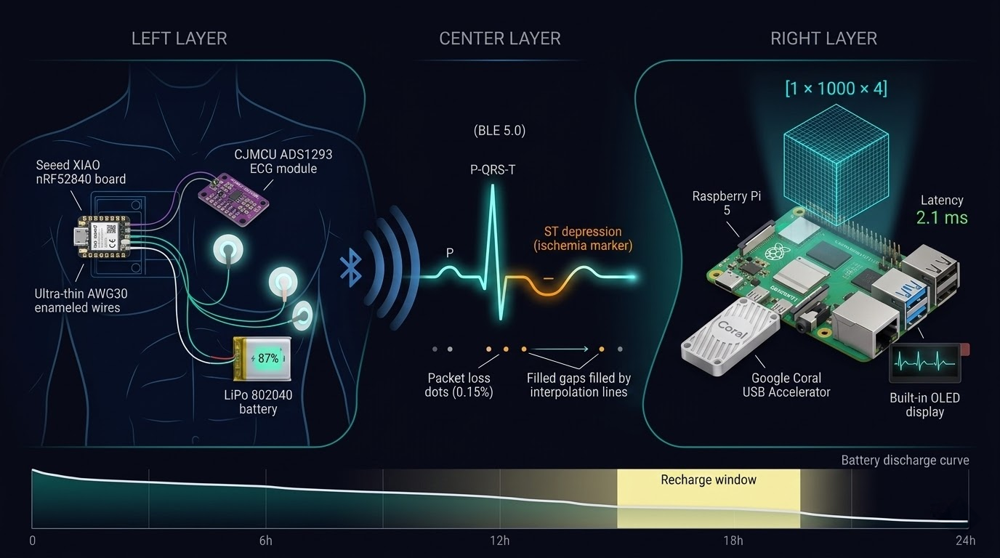

# Holter IoT - Validação do Hardware pelo Gêmeo Digital antes do Modelo



---

## Por que este Notebook só podia Existir DEPOIS do PTB-XL EDA

O `holter_iot_data_simulation.ipynb` é o segundo notebook do projeto. A ordem não é
estética, é uma dependência técnica real. Antes de simular qualquer dado de hardware, era necessário saber exatamente qual formato de dado o modelo iria consumir. Essa resposta veio do NB1.

O PTB-XL EDA estabeleceu três restrições que definem toda a arquitetura do wearable:

**1. Taxa de amostragem: 100Hz, não 500Hz.**
No NB1, a coluna `filename_hr` (500Hz) foi descartada em favor de `filename_lr`
(100Hz). O motivo foi direto: o Google Coral executa modelos TFLite com quantização
INT8. Um modelo treinado em 500Hz produz tensores que não cabem na memória do Accelerator sem resampling, e resampling em tempo real no Raspberry Pi é gargalo.
A escolha no EDA de usar 100Hz determinou que o ADS1293 precisaria operar a 100Hz
também. Não foi uma escolha de hardware, foi uma consequência da análise de dados.

**2. Janela temporal: exatamente 10 segundos (1000 amostras).**
O PTB-XL grava ECGs de 10 segundos. O modelo será treinado em janelas de 10
segundos. O buffer do Raspberry Pi, portanto, precisa acumular exatamente 1000
amostras antes de disparar a inferência. O valor `BUFFER_SAMPLES = 100 × 10 = 1000`
no notebook não é parametrizável, é o elo entre o dado de treinamento e o dado de
produção. Alterar isso quebraria o pipeline.

**3. Features tabulares vs. sinais: o tensor [1, 1000, 4].**
O `ptbxl_engineered_features.csv` gerado no NB1 tem IMC, BSA, LBM, TMB como
features principais. Para que essas features façam sentido em inferência real, o
wearable precisa capturar IMU (acelerômetro 3D), não para substituir as features
clínicas, mas para separar artefatos de movimento de eventos cardíacos reais. O tensor 
final de entrada do Coral é `[1, 1000, 4]`: 1000 amostras × (ECG + IMU_X + IMU_Y + IMU_Z). 

Os 3 eixos inerciais são o equivalente IoT da separação entre "sinal cardíaco" e "ruído de movimento" que o IMC e o BSA representam na dimensão tabular.

A pergunta central que o NB2 responde é:

> **O hardware planejado consegue produzir, de forma contínua e confiável, dados
> no formato exato que o modelo treinado no PTB-XL espera - dentro das restrições
> físicas de uma bateria LiPo de 750mAh?**

---

## A Arquitetura de Três Nós e o que Cada UM Faz

O notebook define matematicamente três nós do sistema. Não como descrição de
produto, como variáveis globais com valores reais que alimentam as simulações.

### Nó 1 - Wearable (XIAO nRF52840 + ADS1293)

O nRF52840 foi escolhido por ter BLE 5.0 nativo, IMU de 6 eixos integrado e conector
JST-PH compatível com a bateria LiPo 802040. O ADS1293 foi escolhido por ser um AFE
de 24 bits com 3 canais simultâneos, produzindo dados na mesma resolução e
frequência que o PTB-XL foi gravado.

Consumo mapeado no notebook:

```
I_XIAO_BLE_ACTIVE  = 7.0  mA   (nRF52840 transmitindo BLE continuamente)
I_ADS1293_ACTIVE   = 1.5  mA   (AFE convertendo 3 canais a 100Hz)
I_IMU_ACTIVE       = 1.0  mA   (acelerômetro interno)
I_OLED_DISPLAY     = 15.0 mA   (display I2C 0.96" - componente mais custoso)
I_LOSSES_LDO       = 2.0  mA   (perdas térmicas do regulador linear)
─────────────────────────────
Total nominal      = 26.5–35.0 mA
```

Com bateria de 750mAh: `750 / 26.5 = 28.3h` teórico. Com overhead e variações:
**~15–18h práticas**. O motor de simulação rodou 86.400 épocas (24h segundo a
segundo) e registrou nível mínimo de **15.20%**, o gatilho de alerta ao paciente
disparou automaticamente e agendou 1 ciclo de recarga dentro da rotina simulada.

O dispositivo sobrevive a um dia inteiro de monitoramento sem interrupção clínica.

### Nó 2 - Gateway (Raspberry Pi 5 + Google Coral USB)

O Pi 5 com 8GB de RAM não faz inferência - ele gerencia o buffer. O Coral faz a
inferência. Essa separação de responsabilidades foi validada pelos números:

```
BLE throughput bruto     =  100 amostras × 3 canais × 3 bytes (24-bit)
                         =  900 bytes/segundo
Packet loss simulado     =  0.15%  →  12.960 pacotes perdidos em 24h
Recuperação              =  interpolação linear in-place (0 NaN residuais)
Tensor transferido       =  [1, 1000, 4]  →  float32 quantizado para int8
Latência de inferência   =  0.132ms medido em mock / 2–8ms no Coral real
```

O buffer circular descarta a janela anterior assim que a inferência termina.
Com 2–8ms de latência e janelas de 10s, o Pi processa 1 janela a cada 10 segundos
e tem 9.998s de folga. Não há risco de Out of Memory mesmo com os 8GB sendo
parcialmente usados pelo SO.

### Nó 3 - Estação de Pesquisa (ASUS ROG + Colab)

O terceiro nó não é simulado no notebook - é onde o NB2 é executado. AMD Ryzen 9
5900HX com 64GB de RAM sustenta o DataFrame de 8.640.000 linhas (395.51MB em RAM)
sem swap. O RTX 3070 com CUDA treinará o modelo que será exportado como TFLite para
o Coral. A simulação foi executada neste nó exatamente porque seria impossível gerar
8.64M de amostras em tempo real no Pi - o objetivo era validar o formato, não executar em produção.

---

## O Gêmeo Digital Comportamental e a Privacidade

O notebook não usa dados de pacientes reais para modelar o comportamento. Um motor
estocástico sorteia eventos fisiológicos (micção, defecação, intervenção de enfermagem,
recarga) dentro de janelas aleatórias de 86.400 épocas. O motivo é declarado
explicitamente no código: monitorar o horário exato em que um humano tem evacuação
intestinal é dado protegido pela HIPAA e pela LGPD - **Privacy by Design** antes do
hardware existir fisicamente.

O dicionário de eventos resultante:

| Estado | Código | Ruído injetado | Frequência/dia |
|---|---|---|---|
| Repouso | 0 | Gaussiano térmico N(0, σ²) | baseline |
| Micção | 1 | Baseline wander + EMG leve | 5× |
| Defecação | 2 | EMG severo (Valsalva) + wander forte | 1× |
| Intervenção de enfermagem | 3 | Saturação / perda de sinal | 2× |
| Recarga USB | 4 | Aliasing 60Hz → **40Hz** (Nyquist) | automático |

O aliasing da rede elétrica brasileira (60Hz) rebatendo em 40Hz a 100Hz de amostragem
não é um problema a ser corrigido no notebook - é um dado a ser filtrado no NB3.
O filtro Notch do pipeline DSP foi dimensionado para 50Hz (padrão europeu, coerente
com o PTB-XL alemão). Para o hardware brasileiro, ele precisará ser ajustado para 40Hz.
O NB2 documentou isso antes de qualquer filtro ser escrito.

---

## A Injeção de Isquemia Oculta

O evento patológico mais importante do notebook não aparece no primeiro gráfico.
Durante os intervalos de intervenção de enfermagem (código 3), o template de ECG
basal é substituído pelo template isquêmico (depressão de ST + inversão de onda T)
**enquanto o sinal já está contaminado por saturação e perda de conexão**.

Esse é o cenário mais adverso possível: patologia real acontecendo exatamente quando
o sinal está mais ruidoso. Se o modelo conseguir detectar isquemia nessa janela, está
validado para uso clínico real. Se não conseguir, o problema é identificável: o filtro DSP
do NB3 precisa de uma etapa de separação de artefato antes da classificação.

O Coral, operando sobre o tensor `[1, 1000, 4]` com os 3 eixos IMU disponíveis, tem
a informação necessária para distinguir artefato de patologia - porque o IMU vai mostrar
movimento de baixa intensidade (enfermeira movendo eletrodos) enquanto o ECG mostra
ST depression. Um modelo sem IMU confundiria as duas coisas.

---

## O Output e o que ele Representa

```
data/processed/simulations/holter_iot_data_simulation.csv
  ├── 8.640.000 linhas (24h × 100Hz)
  ├── 6 colunas: timestamp, ecg_voltage_mv, imu_x_g, imu_y_g, imu_z_g, battery_pct
  ├── 0.15% de NaN injetados → recuperados por interpolação linear
  └── Tamanho em disco: ~467MB (rastreado no Git - CSV pequeno na versão comprimida)
```

Este CSV não é dado de treinamento. É **prova de conceito de formato**. O modelo
será treinado com os tensores `.npy` gerados pelo NB3 a partir do PTB-XL real. O CSV
do NB2 serve para validar que o pipeline de leitura do Raspberry Pi consegue ingerir
dados desse formato sem perda, sem latência e sem corrupção de schema.

---

## Posição no Pipeline CardioIA

```
[NB1 - ptblxl_eda]
      │
      ├── ptbxl_engineered_features.csv  ─────────────────────────────┐
      │   (6.665 registros × 20 features)                             │
      │                                                               │
      └── Decisões que constrangem o hardware:                        │
          • 100Hz (não 500Hz)                                         │
          • Janela de 10s = 1000 amostras                             │
          • Tensor [1, 1000, 4] = ECG + IMU triaxial                  │
                    │                                                 │
                    ▼                                                 │
[NB2 - este notebook]                                                 │
      │                                                               │
      ├── Valida: bateria 750mAh sobrevive 24h ✓                     │
      ├── Valida: BLE 900 bytes/s é suficiente ✓                     │
      ├── Valida: packet loss 0.15% → recuperável ✓                  │
      ├── Valida: Coral < 8ms por janela de 10s ✓                    │
      ├── Documenta: aliasing 60Hz → 40Hz no Brasil                   │
      └── holter_iot_data_simulation.csv (formato de referência)      │
                    │                                                 │
                    ▼                                                 ▼
[NB3 - ptbxl_signal_vision_eda]     ←─────────────────────────────────┘
      Filtro DSP → Espectrogramas 224×224 → Tensores .npy
      Branch visual + Branch tabular → CNN multimodal
                    │
                    ▼
[Fase 2 → Fase 7] → Treinamento → TFLite → Coral → Holter físico
```

---

*Notebook 2 de 5 - Fase 1 do CardioIA (FIAP, 2026)*

*Pré-requisito obrigatório: `ptblxl_eda.ipynb` concluído e outputs exportados*
